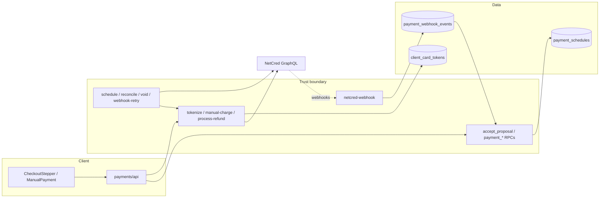

# Checkout & Payments — Fix-Ready Security Remediation Pack

**Audit date:** 2026-07-19  
**Scope:** Orbit marketplace checkout → RPC → Edge → Postgres/RLS → NetCred → webhooks/crons → refunds  
**Method:** Orchestrated hostile audit (S1–S12). No code changes in this pass.  
**Subagents:** S1 Client Trust · S2 AuthZ/RLS · S3 PCI · S4 Money · S5 Webhooks · S6 Fraud · S7 Refunds · S8 Secrets · S9 Architecture · S10 Performance · S11 Observability · S12 DocsDrift

---

## 0. Executive verdict

Overall posture is **mixed**: money amounts at accept/charge are largely **server-authoritative** (proposal row + installment HMAC + SQL fee recompute; client cannot underpay `base_amount` or forge HMAC without the vault secret). That said, **production checkout confidence is NO-GO** until three Critical classes are fixed: (1) **unsigned NetCred webhooks that land as `FAILED` / `INVALID_SIGNATURE` are later claimed by retry cron and processed without re-checking HMAC** — forgeable PAID/CONFIRMED; (2) **manual charge rotates `gateway_reference_code` after ambiguous gateway success**, enabling double charge; (3) **`reconcile-inanalysis-auto-cancel-voids` is missing from `orbit_invoke_edge_function` allowlist**, so IN_ANALYSIS void compensation (and mixed auto-cancel ticks) fail. Antifraud (ClearSale) is presence-checked only; PCI scope includes Orbit Edge for PAN/CVV transit.

### Top 5 exploit paths

1. **Forge webhook money state** — POST unsigned CAPTURE → persist → `INVALID_SIGNATURE` FAILED → cron retry → `payment_process_webhook_event` applies PAID/CONFIRMED without HMAC (CHK-S5-001).
2. **Double charge via manual retry** — timeout after NetCred capture → orphan → FAILED → manual rotates reference → second `chargeCreate` (CHK-S4-001 / CHK-S10-001).
3. **Poison webhook event id** — unsigned ingest occupies dedup key → real NetCred event dropped as DUPLICATE (CHK-S5-002).
4. **ClearSale / antifraud null** — accept/manual with random UUID; cron charges with null session and omits `orderInput` (CHK-S6-001/002/003 / CHK-S1-001).
5. **Stuck / false-success refund** — gateway refund fails after DB `REFUND_REQUESTED` + service CANCELLED → retry returns `already_submitted` success without calling NetCred (CHK-S7-001).

### Go / no-go

| Decision | Rationale |
|----------|-----------|
| **NO-GO** for production checkout confidence | Critical webhook auth bypass + manual double-charge + broken void compensator |
| Soft GO for **money tampering at accept** | HMAC + server base_amount + RLS hold (see §6) |

---

## 1. System map (brief)



### Authoritative server computations vs client inputs

| Concern | Authoritative | Client may send (must not trust) |
|---------|---------------|----------------------------------|
| `base_amount` / provider payout | Proposal `proposed_amount` / `final_amount` at accept | Display totals in ConfirmationStep |
| Installment selection | HMAC over options + `payment_assert_installment_hmac_context` | `installment_number`, echoed HMAC payload |
| Charge amount at T-2 | `payment_calculate_charge_amount` / claim CTE | Nothing (manual body = schedule_id + ClearSale session) |
| Refund amount | `payment_calculate_refund_amount` | UI estimate / disclosure only |
| ClearSale session / IP | **Currently client-asserted** (gap) | UUID + IP |
| Webhook authenticity | **HMAC intended; broken on retry** (gap) | Raw body + headers |
| Card PAN/CVV | Forwarded by Edge to NetCred (PCI CDE) | Form fields |

---

## 2. Consolidated findings

### Summary table

| id | severity | category | title | primary files | reporters |
|----|----------|----------|-------|---------------|-----------|
| CHK-001 | Critical | Webhook | Unsigned webhook FAILED→retry applies money without HMAC re-check | `netcred-webhook/handleRequest.ts`, `payment_claim_webhook_retry_batch`, `payment_process_webhook_event` | S5 |
| CHK-002 | Critical | Money | Manual charge rotates reference without reconciling prior capture | `payment_begin_manual_attempt`, `manual-charge-payment/handleRequest.ts` | S4, S10 |
| CHK-003 | Critical | Architecture | `reconcile-inanalysis-auto-cancel-voids` missing from invoke allowlist | `orbit_invoke_edge_function`, `20260801760000_*` | S2, S9 |
| CHK-004 | High | Webhook | Dedup-before-HMAC poisons `gateway_event_id` | `payment_ingest_webhook_event`, webhook EF | S5 |
| CHK-005 | High | Money | Reconcile PAID without `paidAmount` commits `0.00` | `processSchedule.ts`, `payment_commit_charge_outcome` | S4 |
| CHK-006 | High | Money | Commit recompute vs claimed amount race on fee change | claim batch + commit RPC | S4 |
| CHK-007 | High | Money | Automatic claim lacks T-12h upper bound (manual has it) | `payment_claim_charge_batch` | S4 |
| CHK-008 | High | Refund | Gateway refund fail + `already_submitted` false success | `process-refund/handleRequest.ts`, `payment_begin_refund_request` | S7 |
| CHK-009 | High | Refund | Post-PAID reschedule rebinds refund tiers (arbitrage) | `payment_reschedule_charge_date`, `payment_calculate_refund_amount` | S7 |
| CHK-010 | High | Refund | `TRANSACTION_REFUND` ignored unless `REFUND_REQUESTED` | `payment_webhook_handle_refund` | S7 |
| CHK-011 | High | Fraud | ClearSale session client-asserted; SDK failure does not block | accept_proposal, ClearSale utils, CardStep | S1, S6 |
| CHK-012 | High | Fraud | T-2 cron charges without ClearSale `sessionId` | `schedule-netcred-charges/processSchedule.ts` | S6 |
| CHK-013 | High | Fraud | Manual charge accepts any non-empty session (no freshness) | `payment_begin_manual_attempt`, manual EF | S6 |
| CHK-014 | High | Fraud | Profile tokenize is card-testing endpoint with error oracle | `tokenize-payment-card` | S6 |
| CHK-015 | High | PCI | PAN/CVV transit through Orbit Edge expands PCI CDE | tokenize EF, `cards.api.ts`, `netcred-adapter.ts` | S3 |
| CHK-016 | High | PCI | ClearSale `fp.js` without SRI/integrity pinning | `injectClearSaleSdk.ts` | S3 |
| CHK-017 | High | PCI | Stored tokens unbound from NetCred `companyId` | `client_card_tokens`, tokenize/charge mapping | S3, S1 |
| CHK-018 | High | Secrets | Root `.env` not gitignored | `.gitignore`, vault runbook | S8 |
| CHK-019 | High | Secrets | Deterministic example HMAC/cron secrets committed | `.env.example`, fixtures, runbooks | S8 |
| CHK-020 | High | Secrets | `ENVIRONMENT=development` in Edge example disables sandbox guard | `supabase/functions/.env.example`, `netcred-auth.ts` | S8 |
| CHK-021 | High | Architecture | Charge claim→gateway→commit non-atomic; delayed compensate only | `schedule-netcred-charges` | S9 |
| CHK-022 | High | Performance | Claim batch wall-clock vs 55s pg_net timeout → backlog | cron invoke + sequential processSchedule | S10 |
| CHK-023 | High | Performance | Webhook persist-before-auth + fail-open rate limit | `netcred-webhook/handleRequest.ts` | S5, S10 |
| CHK-024 | High | Money | Capture/reconcile prefer gateway `paid_amount` over server expected | webhook capture + reconcile RPCs | S5 |
| CHK-025 | High | Observability | Charge logs omit `gateway_charge_id` / `gateway_reference_code` | charge logging helpers, commit `payment_raise_log` | S11 |
| CHK-026 | High | Observability | No spike alerts for webhook auth fail / FAILED_PERMANENT waves | payment-sentry-matrix, monitoring docs | S11 |
| CHK-027 | High | DocsDrift | Webhook algo / Vault / installment EF docs contradict code | requirements, design, netcred-payments-flow | S12 |
| CHK-028 | Medium | Tampering | CPF/phone steps UI-only; accept does not enforce profile | accept_proposal, checkout requirements RPC | S1 |
| CHK-029 | Medium | Money | Fee drift at charge vs checkout HMAC (intentional; disclose/freeze) | design + charge path | S1, S4 |
| CHK-030 | Medium | AuthZ | History views `security_invoker=false` — tenancy only in WHERE | payment history views | S2 |
| CHK-031 | Medium | PCI | Client/Edge log scrubbers miss CHD/PII nesting | `sentryPiiScrubbing`, `payment-logger` | S3, S11 |
| CHK-032 | Medium | PCI | `gateway_payment_profile_id` exposed via safe_v / grants | `client_card_tokens_safe_v` | S3 |
| CHK-033 | Medium | Money | `buildPayoutRule` accepts zero/oversize FIXED_AMOUNT | `buildPayoutRule.ts`, processSchedule | S4 |
| CHK-034 | Medium | Webhook | No timestamp/nonce; reference OR `contracted_service_id` widens forge surface | validateSignature, webhook handlers | S5 |
| CHK-035 | Medium | Fraud | Missing RPC rate limits on accept / update_method / KYC submit | migrations | S6 |
| CHK-036 | Medium | Fraud | Fine-grained gateway error codes aid carding | tokenize/manual Edge responses | S6 |
| CHK-037 | Medium | Refund | Dispute notify incomplete; settlement UI lies during REFUND_REQUESTED | dispute handler, ProviderSettlementStatus | S7 |
| CHK-038 | Medium | Refund | Cancel disclosure TZ ≠ America/Sao_Paulo; EXECUTED UI/API mismatch | contractedServiceCancellation.ts | S7, S9 |
| CHK-039 | Medium | Secrets | Rollout checklist / tunnel / cron dual-auth / snippets risks | checklists, package.json, orbit-cron-auth | S8 |
| CHK-040 | Medium | Architecture | Dual fee TS mirror; feature-boundary leaks; job_runs ≠ EF success | fee-calculator, proposals/view-services, cron wrappers | S9 |
| CHK-041 | Medium | Observability | Row audit no actor; multiple-edges Sentry dead; monitoring doc drift | audit trigger, detect-netcred-onboarding | S11 |
| CHK-042 | Low/Info | Various | HMAC computed_at omission, tokenize profile context, token list clientId, caps, docs inventory | multiple | S1–S12 |

---

### Full Finding Schema bodies (Critical → High; Medium summarized with schema; Low/Info abbreviated)

```yaml
id: CHK-001
title: Unsigned webhook FAILED→retry applies money transitions without HMAC re-check
severity: Critical
category: Webhook
cwe_or_owasp: CWE-345
assets: [payment_webhook_events, payment_schedules, contracted_services, payment_cron_process_webhook_retry]
attack_path: |
  1. Attacker POSTs to netcred-webhook (verify_jwt=false) with invalid/missing signature.
  2. EF persists event then markFailed INVALID_SIGNATURE → state=FAILED.
  3. Cron process-webhook-retry claims FAILED rows; no exclusion of INVALID_SIGNATURE.
  4. payment_process_webhook_event accepts FAILED and runs handlers without re-validating HMAC.
  5. CAPTURE/UPDATE(PAID) with referenceCode=contracted_service_id → PAID + CONFIRMED.
preconditions: Public webhook URL; schedule in IN_ANALYSIS|PROCESSING; known contracted_service_id; cron active
evidence:
  - path: supabase/functions/netcred-webhook/handleRequest.ts
    detail: persist then HMAC; invalid → markFailed only
  - path: supabase/migrations/20260801350000_payment_claim_webhook_retry_batch.sql
    detail: claims FAILED without INVALID_SIGNATURE filter
  - path: supabase/migrations/20260801330000_payment_process_webhook_event.sql
    detail: processable states include FAILED; no signature_validated gate
impact: financial | integrity
likelihood: High
blast_radius: platform-wide
root_cause: Auth failure treated as transient processing failure; retry trusts stored raw_payload.
fix_brief: |
  INVALID_SIGNATURE → DEAD_LETTER (non-retryable). Require signature_validated before handlers.
  Prefer HMAC before processable insert (or quarantine table). pgTAP: unsigned CAPTURE never PAID.
verification: pgTAP forge + cron/process leaves schedule unchanged; Deno markFailed not retryable
non_goals: Do not remove audit persist of raw events; keep legitimate FAILED retries for handler errors
reported_by: [S5]
aliases: [CHK-S5-001]
```

```yaml
id: CHK-002
title: Manual charge rotates NetCred reference without reconciling prior capture
severity: Critical
category: Money
cwe_or_owasp: CWE-841
assets: [payment_schedules.gateway_reference_code, manual-charge-payment, NetCred chargeCreate]
attack_path: |
  1. createCharge succeeds; Edge times out / commit fails → PROCESSING then orphan → FAILED
     (manual_attempt_count > 0 routes uncertain timeout to FAILED, not IN_ANALYSIS).
  2. payment_begin_manual_attempt sets gateway_reference_code = gen_random_uuid().
  3. manual EF never getTransaction(old ref); createCharge(new ref) → second capture.
  4. Webhook for old ref cannot bind (schedule now has new ref).
preconditions: Ambiguous gateway success; schedule FAILED|FAILED_PERMANENT; client can re-manual
evidence:
  - path: supabase/migrations/20260801910000_payment_claim_charge_batch_service_request_title.sql
    detail: payment_begin_manual_attempt unconditional reference rotation
  - path: supabase/functions/manual-charge-payment/handleRequest.ts
    detail: no getTransaction before createCharge
  - path: supabase/functions/_shared/providerHttp.ts
    detail: 25s timeout
impact: financial | integrity
likelihood: Medium
blast_radius: one user per schedule | platform liability
root_cause: Reference rotation assumes prior ref never captured; orphan treats manual timeout as safe retry.
fix_brief: |
  Uncertain manual timeout → IN_ANALYSIS until getTransaction(old ref).
  Rotate UUID only after confirmed REJECTED/absent. Mirror cron executeCharge reconcile on manual retry.
verification: Deno — PAID under old ref + FAILED → manual commits without second createCharge
non_goals: Keep rotation for true REJECTED retries
reported_by: [S4, S10]
aliases: [CHK-S4-001, CHK-S10-001]
```

```yaml
id: CHK-003
title: IN_ANALYSIS void cron cannot invoke EF — allowlist omits slug; auto-cancel ticks may rollback
severity: Critical
category: Architecture
cwe_or_owasp: CWE-670
assets: [reconcile-inanalysis-auto-cancel-voids, orbit_invoke_edge_function, payment_cron_auto_cancel_unpaid_services]
attack_path: |
  1. Wrappers invoke reconcile-inanalysis-auto-cancel-voids.
  2. orbit_invoke_edge_function allowlist lacks slug → INVALID_EDGE_FUNCTION_SLUG.
  3. Dedicated void cron always fails; auto-cancel tick that needs void may abort entire transaction.
  4. Gateway voids never run; IN_ANALYSIS / cancel policy stuck; possible capture after intended cancel.
preconditions: pg_cron payment jobs enabled; IN_ANALYSIS near T-12h or void cron alone
evidence:
  - path: supabase/migrations/20260801690000_orbit_internal_edge_function_auth.sql
    detail: v_allowed omits reconcile-inanalysis-auto-cancel-voids
  - path: supabase/migrations/20260801760000_payment_inanalysis_auto_cancel_void.sql
    detail: cron + auto-cancel invoke that slug
impact: financial | integrity | availability
likelihood: High
blast_radius: platform-wide
root_cause: New EF registered in cron without updating invoke allowlist.
fix_brief: |
  Add slug to allowlist (additive migration if prod-locked). Decouple CANCELLED commit from void invoke errors.
  pgTAP allowlist membership + cron wrapper does not raise INVALID_EDGE_FUNCTION_SLUG.
verification: SELECT payment_cron_reconcile_inanalysis_auto_cancel_voids(); job_runs not fatal on allowlist
non_goals: Do not open EXECUTE of orbit_invoke to authenticated
reported_by: [S2, S9]
aliases: [CHK-S2-001, CHK-S9-001]
```

```yaml
id: CHK-004
title: Dedup-before-HMAC lets attacker poison gateway_event_id and drop real NetCred events
severity: High
category: Webhook
assets: [payment_webhook_events, payment_webhook_events_dedup_unique]
attack_path: |
  Unsigned POST with target gateway_event_id inserts then FAILED INVALID_SIGNATURE;
  UNIQUE occupied; real NetCred ON CONFLICT → DUPLICATE without replacing payload.
preconditions: Ability to POST webhook; learn/guess/spray event ids
evidence:
  - path: supabase/migrations/20260801310000_payment_ingest_webhook_event.sql
    detail: persist RECEIVED before HMAC; ON CONFLICT no payload replace
impact: integrity | availability
likelihood: Medium
blast_radius: per poisoned event
root_cause: Dedup key claimed by unauthenticated ingress.
fix_brief: |
  Quarantine unsigned; do not occupy production UNIQUE until signature_validated;
  or allow signed event to supersede INVALID_SIGNATURE row. Alert INVALID_SIGNATURE→DUPLICATE pairs.
verification: pgTAP poison then signed same id still processes
non_goals: Keep 200 ack for true PROCESSED duplicates
reported_by: [S5]
aliases: [CHK-S5-002]
```

```yaml
id: CHK-005
title: Reconciled PAID without paidAmount commits charge_amount 0.00
severity: High
category: Money
assets: [payment_commit_charge_outcome, processSchedule.commitFromExistingTransaction]
attack_path: |
  getTransaction PAID without paidAmount → chargeAmount "0.00" → CHARGE_AMOUNT_MISMATCH or wrong paid;
  gateway PAID, DB stuck PROCESSING/IN_ANALYSIS.
evidence:
  - path: supabase/functions/schedule-netcred-charges/processSchedule.ts
    detail: existing.paidAmount ?? "0.00"
  - path: processSchedule_flows_test.ts
    detail: asserts committedAmount === "0.00"
impact: financial | integrity
likelihood: Medium
blast_radius: one user | ops load if API omits field often
root_cause: Reconcile falls back to zero instead of RPC expected amount.
fix_brief: |
  Use payment_calculate_charge_amount / claimed amount when paidAmount missing;
  fail closed to IN_ANALYSIS + alert if |gateway-expected| > 0.01. Never default "0.00".
verification: Deno — PAID without paidAmount commits expected RPC amount
non_goals: Do not loosen mismatch tolerance without product sign-off
reported_by: [S4]
aliases: [CHK-S4-002]
```

```yaml
id: CHK-006
title: Commit recompute vs claimed charge_amount race on fee-table change
severity: High
category: Money
assets: [platform_constants, payment_claim_charge_batch, payment_commit_charge_outcome]
attack_path: |
  Claim freezes amount A → NetCred captures A → constants change → commit recomputes B → CHARGE_AMOUNT_MISMATCH;
  client charged, schedule not PAID.
impact: financial | integrity
likelihood: Low
blast_radius: all in-flight charges during rate change
root_cause: Commit re-derives from live constants instead of amount frozen at claim.
fix_brief: |
  Commit validates against claim/lease frozen amount; log drift vs live recompute. Ops: no hot-edit fees mid-window.
verification: pgTAP claim A, mutate rate, commit(A) succeeds
non_goals: Do not remove intentional checkout→T-2 fee drift product rule without decision
reported_by: [S4]
aliases: [CHK-S4-003]
```

```yaml
id: CHK-007
title: Automatic claim has no T-12h upper bound (manual does)
severity: High
category: Money
assets: [payment_claim_charge_batch, payment_begin_manual_attempt]
attack_path: |
  Manual blocks when exec_at - now() <= auto_cancel hours; claim only requires charge_scheduled_at <= now().
  Cron can charge inside/after cancel window while PROCESSING skips auto-cancel.
impact: financial | integrity
likelihood: Medium
blast_radius: emergency bookings / late unpaid queues
root_cause: T-12h gate only on manual begin.
fix_brief: |
  Add exec_at - now() > auto_cancel_hours to claim eligible CTE. pgTAP inside T-12h not claimed.
verification: pgTAP SCHEDULED inside T-12h → empty claim batch
non_goals: Do not change ToS refund tiers here
reported_by: [S4]
aliases: [CHK-S4-004]
```

```yaml
id: CHK-008
title: Gateway refund failure + already_submitted skips retry and returns success
severity: High
category: Refund
assets: [process-refund, payment_begin_refund_request, contracted_services]
attack_path: |
  begin_refund commits REFUND_REQUESTED + CANCELLED → gateway fails → retry already_submitted=true →
  Edge skips refundTransaction → HTTP 200 / UI success; funds never returned.
impact: financial | integrity
likelihood: Medium
blast_radius: one user | ops-wide on NetCred outage
root_cause: Idempotency equates DB REFUND_REQUESTED with gateway ACK.
fix_brief: |
  Persist refund_submit_status PENDING_GATEWAY|SUBMITTED|CONFIRMED|FAILED.
  already_submitted only after gateway ACK. Retry must call refundTransaction when FAILED.
verification: Deno fail once then retry must invoke gateway; UI must not toast success on FAILED
non_goals: Do not allow unrestricted double refunds
reported_by: [S7]
aliases: [CHK-S7-001]
```

```yaml
id: CHK-009
title: Post-PAID reschedule rebinds ToS refund tiers to new execution_at
severity: High
category: Refund
assets: [payment_reschedule_charge_date, payment_calculate_refund_amount]
attack_path: |
  PAID with <12h to service → reschedule >48h out → cancel → FULL_REFUND escapes late penalty.
impact: financial
likelihood: Medium
blast_radius: one booking (scalable)
root_cause: Refund clock mutable after capture; paid_no_charge_update has no penalty freeze.
fix_brief: |
  Freeze refund_anchor_execution_at at first PAID OR use min(original, current) for client penalties
  **Product decision (2026-07-21):** rejected freeze for ToS tiers — refund windows use updated `payment_service_execution_at` after post-PAID reschedule (matches requirements). `refund_anchor_execution_at` remains audit-only.
  OR block client reschedule that increases hours-to-service after PAID without ops approval.
verification: pgTAP PAID + reschedule +72h still PENALTY_* vs pre-capture anchor
non_goals: Do not invent second charge on reschedule unless product changes T-2 model
reported_by: [S7]
aliases: [CHK-S7-002]
```

```yaml
id: CHK-010
title: TRANSACTION_REFUND webhook ignored unless state is REFUND_REQUESTED
severity: High
category: Refund
assets: [payment_webhook_handle_refund]
attack_path: |
  Gateway refund/chargeback while schedule still PAID → handler skipped → DB stays PAID; provider receivables wrong.
impact: financial | integrity
likelihood: Medium
blast_radius: one schedule
root_cause: Refund confirmation FSM is cancel-flow-only.
fix_brief: |
  Allow PAID|REFUND_REQUESTED + gateway REFUNDED → apply amounts. pgTAP PAID + TRANSACTION_REFUND.
verification: pgTAP + Deno webhook fixture from PAID
non_goals: Do not auto-cancel COMPLETED on chargeback without product decision
reported_by: [S7]
aliases: [CHK-S7-003]
```

```yaml
id: CHK-011
title: ClearSale session is client-asserted UUID; SDK failure does not block checkout
severity: High
category: Fraud
assets: [payment_schedules.clearsale_session_id, accept_proposal, ClearSale fp.js]
attack_path: |
  Accept/manual with any non-empty UUID; never load fp.js / missing VITE_CLEARSALE_APP_KEY;
  parent state already has session; server only checks non-empty text.
impact: integrity | antifraud null while payment proceeds
likelihood: High
blast_radius: platform-wide
root_cause: Antifraud session treated as opaque client metadata.
fix_brief: |
  Server-issue session with TTL bound to user+proposal; fail-closed in prod on SDK load failure;
  derive IP from Edge headers only (not accept body). pgTAP orphan UUID rejected.
verification: Blocked fp.js cannot accept in prod mode; forged session rejected
non_goals: Do not remove ClearSale from chargeCreate; keep T-2 reuse of validated accept session
reported_by: [S1, S6]
aliases: [CHK-S1-001, CHK-S6-001]
```

```yaml
id: CHK-012
title: T-2 cron charges without ClearSale sessionId (orderInput omitted)
severity: High
category: Fraud
assets: [schedule-netcred-charges, netcred-charge-mapping]
attack_path: |
  clearsale_session_id NULL → WARN/Sentry → createCharge without sessionId → orderInput omitted;
  Deno test asserts PAID without session.
impact: integrity | financial
likelihood: Medium
blast_radius: platform-wide for null-session schedules
root_cause: Product degrade-not-block contradicts “mandatory in production”.
fix_brief: |
  Production fail-closed MISSING_CLEARSALE_SESSION_ID. Update Deno test. Align Req 31.
verification: isProduction=true + null session → no createCharge
non_goals: Do not mint new ClearSale session at cron (no device context)
reported_by: [S6]
aliases: [CHK-S6-002]
```

```yaml
id: CHK-013
title: Manual charge accepts any non-empty clearsale_session_id (no freshness)
severity: High
category: Fraud
assets: [manual-charge-payment, payment_begin_manual_attempt]
attack_path: |
  POST clearsale_session_id="x" or reuse accept UUID; server only checks non-empty trim.
impact: integrity
likelihood: High
blast_radius: own schedules
root_cause: Fresh session enforced only in UI CardStep remount.
fix_brief: |
  UUID format + DISTINCT FROM prior session; prefer server-issued one-time session (with CHK-011).
verification: pgTAP same session → CLEARSALE_SESSION_STALE
non_goals: Do not require new session on T-2 cron
reported_by: [S6]
aliases: [CHK-S6-003]
```

```yaml
id: CHK-014
title: Profile tokenize is a card-testing endpoint (10/min) with gateway error oracle
severity: High
category: Fraud
assets: [tokenize-payment-card profile context]
attack_path: |
  Authenticated account cycles PANs via tokenizeContext=profile; 422 returns gateway errors[].code;
  ~14k tests/day/account under 10/min.
impact: financial | integrity (issuer abuse)
likelihood: High
blast_radius: platform-wide
root_cause: Save-card UX without carding controls / opaque errors.
fix_brief: |
  Lower limits + daily cap + CAPTCHA after N declines; opaque CARD_REJECTED to clients;
  max ACTIVE tokens; alert decline spikes. Keep fine codes in logs only.
verification: Deno rate/daily caps; client body never exposes RISK_ANALYSIS_* matrix
non_goals: Do not remove profile tokenize; do not log PAN/CVV
reported_by: [S6]
aliases: [CHK-S6-004]
```

```yaml
id: CHK-015
title: PAN/CVV transit through Orbit Edge expands PCI CDE (docs understate)
severity: High
category: PCI
assets: [tokenize-payment-card, CardForm, NetCredAdapter.tokenizeCard]
attack_path: |
  Browser → Edge with cardNumber+cvv → NetCred GraphQL; compromise of Edge/logs/memory = CHD.
impact: compliance | data
likelihood: Medium
blast_radius: platform-wide
root_cause: Hosted fields + server forwarder instead of gateway-hosted / client-only tokenize.
fix_brief: |
  Treat EF as CDE (SAQ/ROC) OR migrate to NetCred hosted fields so PAN never hits Orbit.
  Correct docs/disclosure. Deno: never stringify cardData into logs.
verification: Architecture/QSA; hosted-fields removes cardData from EF contract
non_goals: Do not claim out of PCI scope while EF receives CHD
reported_by: [S3]
aliases: [CHK-S3-001]
```

```yaml
id: CHK-016
title: ClearSale fp.js injected on card step without SRI / integrity pinning
severity: High
category: PCI
assets: [injectClearSaleSdk, CardStep]
attack_path: |
  Compromised CDN/MITM delivers malicious JS on card page → skim PAN/CVV from DOM.
impact: data
likelihood: Low
blast_radius: all users on card step
root_cause: Third-party script trust-on-first-use on CHD page.
fix_brief: |
  SRI integrity + CSP hash/nonce; pin hash in CI. Document supply-chain ownership.
verification: Bad integrity hash fails load; CSP violation test
non_goals: Do not remove ClearSale without Fraud replacement
reported_by: [S3]
aliases: [CHK-S3-002]
```

```yaml
id: CHK-017
title: Stored gateway tokens unbound from NetCred companyId
severity: High
category: PCI
assets: [client_card_tokens, tokenize-payment-card, netcred-charge-mapping]
attack_path: |
  Profile tokenize under platform company; charge under provider company (or A→B);
  no company_id on token row → fail / mis-attribute / cross-merchant use.
impact: integrity | availability
likelihood: High
blast_radius: all saved cards reused across providers
root_cause: Token row does not record issuing company; charge assumes profile valid under charging company.
fix_brief: |
  Persist netcred_company_id; enforce match at accept/charge OR always tokenize under stable merchant scope.
verification: Profile→provider charge mismatch error; A→B blocked
non_goals: Do not expose company ids to UI; do not change fee math
reported_by: [S3, S1]
aliases: [CHK-S3-003, CHK-S1-005]
```

```yaml
id: CHK-018
title: Root .env is not gitignored — payment HMAC/cron secrets can be committed
severity: High
category: Secrets
assets: [INSTALLMENT_SIGNING_SECRET, ORBIT_CRON_SECRET, OAuth]
attack_path: |
  git add .env commits secrets; forge installment HMAC / invoke verify_jwt=false crons.
impact: financial | integrity
likelihood: Medium
blast_radius: platform-wide
root_cause: Root secrets required by runbook but not gitignored.
fix_brief: |
  Add .env to root .gitignore; CI secret scan; history audit + rotate if ever committed.
verification: git check-ignore -v .env
non_goals: Do not change Vault secret names
reported_by: [S8]
aliases: [CHK-S8-001]
```

```yaml
id: CHK-019
title: Deterministic local HMAC and cron secrets committed and reusable
severity: High
category: Secrets
assets: [installment_signing_secret, ORBIT_CRON_SECRET]
attack_path: |
  Staging/prod copies .env.example literals → forge HMAC / call money crons with known secret.
impact: financial | integrity
likelihood: Medium
blast_radius: platform-wide
root_cause: Examples ship usable secret strings; rollout checklist lacks uniqueness gate.
fix_brief: |
  Placeholders CHANGE_ME_*; checklist assert secrets ≠ example literals; require openssl rand.
verification: Forged HMAC with example secret fails in staging/prod
non_goals: Isolated test fixture secrets OK if never used in hosted envs
reported_by: [S8]
aliases: [CHK-S8-002]
```

```yaml
id: CHK-020
title: ENVIRONMENT=development in Edge .env.example disables NetCred sandbox guard if copied to prod
severity: High
category: Secrets
assets: [NetCredAdapter, resolveIsProduction]
attack_path: |
  Paste ENVIRONMENT=development into prod Edge secrets → sandbox credential CRITICAL checks skipped.
impact: financial | integrity
likelihood: Medium
blast_radius: platform-wide
root_cause: Local convenience default copy-pasteable into production.
fix_brief: |
  Leave ENVIRONMENT unset in example (defaults production); checklist ENVIRONMENT≠development;
  smoke sandbox tokenAuth aborts in prod.
verification: ENVIRONMENT unset → resolveIsProduction true; sandbox creds abort
non_goals: Keep intentional local development override
reported_by: [S8]
aliases: [CHK-S8-003]
```

```yaml
id: CHK-021
title: Charge claim → NetCred → commit is a non-atomic saga with delayed compensation only
severity: High
category: Architecture
assets: [schedule-netcred-charges, payment_recover_orphaned_schedules]
attack_path: |
  createCharge succeeds → commit/crash/notification throw → PROCESSING until lease+orphan → IN_ANALYSIS;
  first attempt skips getTransaction (automatic_attempt_count > 1 only).
impact: financial | integrity
likelihood: Medium
blast_radius: one schedule | platform under Edge outage
root_cause: Saga without immediate post-gateway compensate / sync reconcile on first attempt.
fix_brief: |
  On commit fail after success: getTransaction + retry commit; CRITICAL Sentry.
  Never fail money path on MMD enqueue. Deno test gateway PAID + commit throw → reconcile.
verification: Deno + chaos lease expiry → orphan → reconcile → PAID
non_goals: Do not wrap NetCred HTTP inside Postgres transaction
reported_by: [S9]
aliases: [CHK-S9-002]
```

```yaml
id: CHK-022
title: Claim batch wall-clock exceeds pg_net 55s invoke timeout → charge backlog outage
severity: High
category: Performance
assets: [schedule-netcred-charges, payment_cron_invoke_edge_function]
attack_path: |
  batch_size 10 × 25s gateway → EF aborts mid-batch; leases PROCESSING until orphan */30 → T-12h unpaid wave.
impact: availability | payment outage
likelihood: Medium
blast_radius: platform-wide under NetCred latency
root_cause: Sequential process vs 55s timeout; orphan not co-scheduled with claim.
fix_brief: |
  Shrink batch / hard deadline / smaller loops; raise timeout or claim+process chunks;
  orphan recovery immediately before claim in same EF tick.
verification: Mock 20s gateway delay; assert no leftover PROCESSING past policy
non_goals: Do not remove SKIP LOCKED
reported_by: [S10]
aliases: [CHK-S10-002]
```

```yaml
id: CHK-023
title: Webhook persist-before-auth + fail-open IP rate limit enables ingress DoS / amplify Critical
severity: High
category: Performance
assets: [netcred-webhook, payment_webhook_events]
attack_path: |
  Flood unique unsigned events → unbounded inserts; failClosed:false amplifies limiter faults;
  delays legitimate CAPTURE (also amplifies CHK-001/004).
impact: availability | integrity
likelihood: Medium
blast_radius: platform-wide
root_cause: Durable write before authenticity; availability preferred over fail-closed perimeter.
fix_brief: |
  HMAC before processable persist (or capped quarantine); failClosed:true; growth alerts.
verification: Deno failClosed; load test unsigned flood bounded
non_goals: Do not block legitimate NetCred burst beyond SLA
reported_by: [S5, S10]
aliases: [CHK-S5-006, CHK-S10-003]
```

```yaml
id: CHK-024
title: Capture/reconcile trust paid_amount from gateway payload without schedule amount check
severity: High
category: Money
assets: [payment_webhook_handle_capture, payment_process_reconciliation_outcome]
attack_path: |
  With CHK-001 forged payload sets arbitrary paid_amount; even signed path prefers payload over calculated.
impact: financial | integrity
likelihood: Medium (High chained with CHK-001)
blast_radius: per schedule
root_cause: Settlement amount not bound to server-computed charge.
fix_brief: |
  On PAID set paid_amount = server expected (or frozen claim); gateway amount in metadata; alert on epsilon miss.
verification: pgTAP mismatched paid_amount stores expected
non_goals: Multi-currency
reported_by: [S5]
aliases: [CHK-S5-003]
```

```yaml
id: CHK-025
title: Charge logs omit gateway_charge_id and gateway_reference_code
severity: High
category: Observability
assets: [payment logs, Sentry, payment_raise_log]
attack_path: |
  Incident has NetCred charge id; hot logs only service_id/schedule_id → slow forensics.
impact: integrity | availability (MTTR)
likelihood: High
blast_radius: platform-wide ops
root_cause: Correlation model is service_id-centric.
fix_brief: |
  Always log gateway_reference_code + gateway_charge_id when known (success too).
  Add to payment_raise_log on commit. Deno log fixtures.
verification: yarn test:deno logging fixtures contain both IDs
non_goals: Do not change money state machines
reported_by: [S11]
aliases: [CHK-S11-001]
```

```yaml
id: CHK-026
title: No spike/rate alerts for webhook auth failures or FAILED_PERMANENT waves
severity: High
category: Observability
assets: [payment-emit-sentry-alerts, payment-sentry-matrix, monitoring docs]
attack_path: |
  Spray forged webhooks or mass declines → per-event WARNING buried; no 15m spike evaluator.
impact: fraud detection latency | integrity
likelihood: Medium
blast_radius: platform-wide
root_cause: Per-event Sentry without rate-based escalation.
fix_brief: |
  SQL spike views + cron alert kinds; extend payment-job-runs-monitoring.md. pgTAP thresholds.
verification: Synthetic invalid signature burst → spike alert
non_goals: Do not change HMAC validation (CHK-001)
reported_by: [S11]
aliases: [CHK-S11-002]
```

```yaml
id: CHK-027
title: Normative docs contradict webhook HMAC, secret storage, installment EF location; void EF missing from inventories
severity: High
category: DocsDrift
assets: [docs/payment-system/*, reconcile-inanalysis-auto-cancel-voids]
attack_path: |
  Doc-driven “fixes” break HMAC; Vault-only NetCred secrets leave Edge empty; miss void cron at rollout;
  revive removed calculate-installment-options EF.
impact: integrity | availability | process false confidence
likelihood: High
blast_radius: platform-wide
root_cause: Requirements/design/ops inventories lagged implementation.
fix_brief: |
  SSOT: HMAC-SHA256(secret, rawBody); NetCred=Edge env; installment HMAC=RPC+Vault;
  inventory 9th EF/cron void reconciler; rewrite Req7; fix traceability COVERED rows.
verification: Grep docs; checklist matches cron.job after db:reset
non_goals: Docs-only must not paper over CHK-001
reported_by: [S12, S8]
aliases: [CHK-S12-001, CHK-S12-002, CHK-S12-003, CHK-S12-004, CHK-S8-010]
```

#### Medium (schema abbreviated — full detail in subagent reports)

```yaml
id: CHK-028
title: CPF/phone checkout steps are UI-only
severity: Medium
category: Tampering
fix_brief: Enforce CPF/phone in accept_proposal (and optionally update_method) with PROFILE_INCOMPLETE.
reported_by: [S1]
aliases: [CHK-S1-002]
---
id: CHK-029
title: Charge amount ignores checkout HMAC; live fee drift intentional
severity: Medium
category: Money
fix_brief: Product decide freeze charge_amount/fee snapshot vs disclose + alert on material drift.
reported_by: [S1, S4]
aliases: [CHK-S1-003, CHK-S4-007]
---
id: CHK-030
title: Payment history views security_invoker=false
severity: Medium
category: AuthZ
fix_brief: pgTAP stranger/owner/admin matrix; document invariant.
reported_by: [S2]
aliases: [CHK-S2-002]
---
id: CHK-031
title: CHD/PII scrubbers shallow / incomplete
severity: Medium
category: PCI
fix_brief: Deep scrub cardData/securityCode/cpf/phone/email; extend client+Edge denylists + tests.
reported_by: [S3, S11]
aliases: [CHK-S3-004, CHK-S3-005, CHK-S11-005]
---
id: CHK-032
title: gateway_payment_profile_id exposed to clients via safe_v
severity: Medium
category: PCI
fix_brief: Remove from safe_v + authenticated GRANT; pgTAP column deny.
reported_by: [S3]
aliases: [CHK-S3-006]
---
id: CHK-033
title: buildPayoutRule accepts zero/oversize FIXED_AMOUNT
severity: Medium
category: Money
fix_brief: Require payout>0, charge>0, payout<=charge; fix null provider_payout → base_amount before toFixed.
reported_by: [S4]
aliases: [CHK-S4-005]
---
id: CHK-034
title: Webhook freshness + contracted_service_id forge amplifier
severity: Medium
category: Webhook
fix_brief: After CHK-001, require gateway_charge_id correlation when present; reject body-hash ids for money events; optional ts skew.
reported_by: [S5]
aliases: [CHK-S5-004, CHK-S5-005]
---
id: CHK-035
title: Missing rate limits on accept_proposal / payment_update_method / payment_submit_provider_kyc
severity: Medium
category: Fraud
fix_brief: platform_check_rate_limit on those RPCs; pgTAP RATE_LIMITED.
reported_by: [S6]
aliases: [CHK-S6-005]
---
id: CHK-036
title: Differentiated gateway error codes aid carding
severity: Medium
category: Fraud
fix_brief: Coarse client buckets RETRYABLE|TERMINAL|RISK_REJECTED; fine codes in DB/logs only.
reported_by: [S6]
aliases: [CHK-S6-006]
---
id: CHK-037
title: Dispute notify incomplete; settlement UI lies during REFUND_REQUESTED/dispute
severity: Medium
category: Refund
fix_brief: Dual MMD client+provider; CRITICAL Sentry; reword ProviderSettlement for refund/dispute states.
reported_by: [S7]
aliases: [CHK-S7-004, CHK-S7-005]
---
id: CHK-038
title: Cancel disclosure TZ drift; EXECUTED UI blocks while API allows
severity: Medium
category: Refund
fix_brief: Server preview RPC for disclosure; align EXECUTED cancel policy UI↔RPC↔docs.
reported_by: [S7, S9]
aliases: [CHK-S7-006, CHK-S7-007, CHK-S9-006]
---
id: CHK-039
title: Secrets/ops hardening (checklist, tunnel, cron dual-auth, snippets)
severity: Medium
category: Secrets
fix_brief: Merge vault checklist into rollout; random localtunnel subdomain; consider cron-secret-only in prod; gitignore snippets/Untitled*.
reported_by: [S8]
aliases: [CHK-S8-004, CHK-S8-005, CHK-S8-006, CHK-S8-008]
---
id: CHK-040
title: Structural drift — dual fee mirror, feature boundaries, job_runs fire-and-forget
severity: Medium
category: Architecture
fix_brief: Mark fee-calculator TEST-ONLY + parity CI; payments public API for accept/confirm; correlate EF outcome to job_runs.
reported_by: [S9]
aliases: [CHK-S9-003, CHK-S9-004, CHK-S9-005]
---
id: CHK-041
title: Observability gaps — row audit actor, multiple-edges Sentry dead, monitoring doc
severity: Medium
category: Observability
fix_brief: audited_by on schedules_audit; fix multiple-edges wiring with document_suffix; correct monitoring.md.
reported_by: [S11]
aliases: [CHK-S11-003, CHK-S11-004, CHK-S11-006]
```

#### Low / Info (backlog)

| id | severity | title | aliases |
|----|----------|-------|---------|
| CHK-042a | Low | HMAC canonical omits computed_at; no jti | CHK-S1-004 |
| CHK-042b | Low | listActivePaymentTokens accepts caller clientId | CHK-S2-003 |
| CHK-042c | Low | UI autocomplete vs “not saved on device” copy | CHK-S3-007, CHK-S3-008 |
| CHK-042d | Low | fee-calculator TS lacking base>0 (not charge-authoritative today) | CHK-S4-006 |
| CHK-042e | Low | Expired/dispute handler FSM drift | CHK-S5-008, CHK-S5-010 |
| CHK-042f | Low | ACTIVE without bank_account_id invariant incomplete; no ACTIVE token cap | CHK-S6-007, CHK-S6-008 |
| CHK-042g | Low | Refund calculator clamp / sticky is_disputed | CHK-S7-008, CHK-S7-009 |
| CHK-042h | Low | NETCRED_API_BASE_URL host allowlist; Firebase ids in example | CHK-S8-009, CHK-S8-011 |
| CHK-042i | Info | Confirmation UI amounts client state only | CHK-S1-006 |
| CHK-042j | Info | In-place migration cutover risk post-prod | CHK-S9-008 |
| CHK-042k | Info | Docs: JWT encryption, payment_providers FK, constant-time SQL, local runbook banners | CHK-S12-006..013 |

---

## 3. Remediation backlog (for executor agents)

Group packages for **parallel** executors without file conflicts.

```yaml
package_id: FIX-001
depends_on: []
severity: Critical
title: Terminalize INVALID_SIGNATURE; require signature_validated before webhook processing
objective: Close forgeable PAID/CONFIRMED via unsigned webhook → FAILED → retry path (CHK-001, CHK-004, CHK-023, CHK-024 partial).
scope_paths:
  - supabase/functions/netcred-webhook/
  - supabase/migrations/ (payment_ingest_webhook_event, payment_update_webhook_event_state, payment_claim_webhook_retry_batch, payment_process_webhook_event)
  - supabase/tests/payments/
implementation_steps:
  - On INVALID_SIGNATURE transition to DEAD_LETTER (non-retryable); never leave retryable FAILED.
  - Add signature_validated (or equivalent) set only after HMAC OK; process/retry refuse without it.
  - Quarantine or do not occupy production UNIQUE until validated; signed supersedes poison row.
  - failClosed:true on webhook IP rate limit; prefer HMAC before processable persist.
  - On PAID handlers bind paid_amount to server expected (CHK-024).
acceptance_tests:
  - pgTAP unsigned CAPTURE never changes schedule; claim retry batch empty for INVALID_SIGNATURE.
  - pgTAP poison then signed same gateway_event_id still processes.
  - Deno markFailed auth path not retryable; failClosed rate limit test.
out_of_scope: NetCred algorithm change; JWT on webhook
suggested_executor_prompt: |
  You are a fix agent. Implement FIX-001 only.
  Context: CHK-001, CHK-004, CHK-023, CHK-024. Fix briefs in checkout-security-remediation-pack.md.
  Constraints: Orbit api-layer, RLS, no client trust, add/adjust Deno + pgTAP.
  Do not expand scope. Report files changed + how verified.
```

```yaml
package_id: FIX-002
depends_on: []
severity: Critical
title: Manual charge timeout-safe reconcile; stop unsafe reference rotation
objective: Prevent double charge on ambiguous manual gateway success (CHK-002; related orphan routing).
scope_paths:
  - supabase/functions/manual-charge-payment/
  - supabase/migrations/ (payment_begin_manual_attempt, payment_recover_orphaned_schedules)
  - supabase/functions/schedule-netcred-charges/executeCharge.ts (pattern reference only)
implementation_steps:
  - Before rotate/createCharge getTransaction(previous reference + companyId).
  - PAID/IN_ANALYSIS → commit that charge; do not createCharge.
  - Rotate UUID only when prior REJECTED/VOIDED/absent.
  - Uncertain timeout with manual_attempt_count > 0 → IN_ANALYSIS (not FAILED) until reconciled.
acceptance_tests:
  - Deno PAID under old ref + FAILED_PERMANENT → manual returns PAID without second createCharge.
  - pgTAP orphan routing for manual timeout → IN_ANALYSIS.
out_of_scope: Webhook auth; fee formula
suggested_executor_prompt: |
  You are a fix agent. Implement FIX-002 only (CHK-002 / CHK-S4-001 / CHK-S10-001).
  Mirror cron executeCharge reconcile semantics on manual path.
  Constraints: Orbit patterns; Deno tests. Do not expand scope.
```

```yaml
package_id: FIX-003
depends_on: []
severity: Critical
title: Allowlist reconcile-inanalysis-auto-cancel-voids; harden auto-cancel invoke
objective: Restore IN_ANALYSIS void compensation and stop auto-cancel tick poison (CHK-003).
scope_paths:
  - supabase/migrations/ (orbit_invoke_edge_function allowlist — additive if needed)
  - supabase/migrations/20260801760000_payment_inanalysis_auto_cancel_void.sql (wrapper error handling)
  - supabase/tests/payments/payment_inanalysis_auto_cancel_void_test.sql
implementation_steps:
  - Add 'reconcile-inanalysis-auto-cancel-voids' to orbit_invoke allowlist.
  - Catch invoke errors after CANCELLED commit so void failure does not roll back cancels.
  - pgTAP allowlist membership.
acceptance_tests:
  - orbit_invoke slug does not raise INVALID_EDGE_FUNCTION_SLUG.
  - Auto-cancel persists CANCELLED if void EF down.
out_of_scope: Void EF business logic rewrite
suggested_executor_prompt: |
  You are a fix agent. Implement FIX-003 only (CHK-003 / CHK-S2-001 / CHK-S9-001).
  Additive migration if prod forbids rewriting 20260801690000.
```

```yaml
package_id: FIX-004
depends_on: [FIX-002]
severity: High
title: Charge amount integrity — reconcile 0.00, claim freeze, T-12h on claim, payout guards
objective: CHK-005, CHK-006, CHK-007, CHK-033.
scope_paths:
  - supabase/functions/schedule-netcred-charges/
  - supabase/functions/_shared/payment/buildPayoutRule.ts
  - supabase/migrations/ (claim, commit)
implementation_steps:
  - Never commit charge_amount 0.00; use RPC expected.
  - Commit validates frozen claim amount.
  - Claim eligible CTE adds T-12h gate matching manual.
  - buildPayoutRule invariants + null payout fallback order.
acceptance_tests:
  - Deno + pgTAP as in finding verification fields.
out_of_scope: Intentional checkout→T-2 fee drift product decision (CHK-029 separate)
suggested_executor_prompt: |
  Fix agent FIX-004 only. Context CHK-005..007, CHK-033.
```

```yaml
package_id: FIX-005
depends_on: []
severity: High
title: Refund submit status machine + external refund webhook from PAID + refund-tier freeze
objective: CHK-008, CHK-009, CHK-010.
scope_paths:
  - supabase/functions/process-refund/
  - supabase/migrations/ (payment_begin_refund_request, webhook refund handler, reschedule)
  - src/features/payments/api/refund.api.ts
implementation_steps:
  - refund_submit_status; retry calls gateway when not ACK'd; UI not success on FAILED.
  - Webhook/reconcile PAID→REFUNDED path.
  - Freeze refund_anchor_execution_at (or product-approved alternative) for post-PAID reschedule.
  - **Done (product-approved):** ToS tiers use live `payment_service_execution_at`; anchor column is audit snapshot only.
acceptance_tests:
  - Deno failure→retry invokes gateway; pgTAP PAID+TRANSACTION_REFUND; pgTAP arbitrage scenario.
out_of_scope: Full chargeback case management
suggested_executor_prompt: |
  Fix agent FIX-005 only. CHK-008, CHK-009, CHK-010.
```

```yaml
package_id: FIX-006
depends_on: []
severity: High
title: Server-bound ClearSale session + production fail-closed + manual freshness
objective: CHK-011, CHK-012, CHK-013.
scope_paths:
  - src/features/payments/ (ClearSale utils, CardStep, checkout.api)
  - supabase/migrations/ (accept_proposal, payment_begin_manual_attempt)
  - supabase/functions/schedule-netcred-charges/processSchedule.ts
  - supabase/functions/manual-charge-payment/
implementation_steps:
  - Server mint/TTL session bound to user+proposal; reject orphan UUIDs.
  - Prod fail-closed charge without session; update Deno test that asserts PAID without session.
  - Manual requires fresh UUID ≠ prior.
acceptance_tests:
  - pgTAP/Deno/Vitest per finding verification.
out_of_scope: NetCred ClearSale product replacement
suggested_executor_prompt: |
  Fix agent FIX-006 only. CHK-011..013 / S1+S6 ClearSale findings.
```

```yaml
package_id: FIX-007
depends_on: []
severity: High
title: Carding controls on profile tokenize + opaque client errors + RPC rate limits
objective: CHK-014, CHK-035, CHK-036, token cap Low.
scope_paths:
  - supabase/functions/tokenize-payment-card/
  - supabase/functions/manual-charge-payment/ (response shaping)
  - supabase/migrations/ (rate limits, payment_persist_client_card_token)
implementation_steps:
  - Lower profile tokenize limits + daily cap; opaque errors; ACTIVE token cap.
  - platform_check_rate_limit on accept / update_method / KYC submit.
  - Coarse Edge error buckets for clients.
acceptance_tests:
  - Deno rate/daily; pgTAP RATE_LIMITED; assert no fine RISK_* codes to client.
out_of_scope: Remove profile tokenize
suggested_executor_prompt: |
  Fix agent FIX-007 only. CHK-014, CHK-035, CHK-036.
```

```yaml
package_id: FIX-008
depends_on: []
severity: High
title: Bind tokens to NetCred companyId; shrink safe_v; ClearSale SRI; CHD scrubbing
objective: CHK-015 (docs/CDE acknowledgment + log hygiene), CHK-016, CHK-017, CHK-031, CHK-032.
scope_paths:
  - client_card_tokens schema + persist/charge paths
  - injectClearSaleSdk.ts
  - payment-logger + sentryPiiScrubbing
  - docs/payment-system + PaymentTrustDisclosure
implementation_steps:
  - Persist netcred_company_id; enforce at charge.
  - Remove gateway_payment_profile_id from client-visible surface.
  - SRI for ClearSale; deep CHD/PII scrub.
  - Document PCI CDE posture OR plan hosted-fields migration (product).
acceptance_tests:
  - pgTAP company mismatch; column grants; Vitest/Deno scrub tests; SRI presence.
out_of_scope: Full hosted-fields migration unless product prioritizes (track as follow-on)
suggested_executor_prompt: |
  Fix agent FIX-008 only. PCI token binding + scrubbing + SRI. CHK-015..017, CHK-031..032.
```

```yaml
package_id: FIX-009
depends_on: []
severity: High
title: Secrets hygiene — gitignore .env, neutralize examples, ENVIRONMENT, rollout checklist
objective: CHK-018, CHK-019, CHK-020, CHK-039, CHK-027 (docs inventory part).
scope_paths:
  - .gitignore, .env.example, supabase/functions/.env.example
  - docs/payment-system/production-rollout-checklist.md, vault-secrets-runbook.md, design.md, requirements
  - package.json enable-webhook
implementation_steps:
  - gitignore .env; placeholder secrets; ENVIRONMENT unset in example; checklist gates; random tunnel subdomain; document void EF.
acceptance_tests:
  - git check-ignore; grep examples for known literals fails; checklist lists void cron.
out_of_scope: Runtime Edge auth redesign (optional cron-secret-only can be follow-on)
suggested_executor_prompt: |
  Fix agent FIX-009 only. Secrets + docs inventory. No money RPC logic changes.
```

```yaml
package_id: FIX-010
depends_on: [FIX-002]
severity: High
title: Charge saga reliability + claim batch vs 55s timeout
objective: CHK-021, CHK-022.
scope_paths:
  - supabase/functions/schedule-netcred-charges/
  - payment_cron_invoke timeout / batch_size constants
implementation_steps:
  - Commit-fail-after-success → getTransaction + retry; MMD enqueue non-fatal.
  - Reduce per-invoke work and/or raise timeout; orphan before claim in EF tick.
acceptance_tests:
  - Deno commit-fail path; load/chaos leftover PROCESSING policy.
out_of_scope: FIX-001 webhook
suggested_executor_prompt: |
  Fix agent FIX-010 only. CHK-021, CHK-022.
```

```yaml
package_id: FIX-011
depends_on: []
severity: High
title: Observability — gateway id logs + spike alerts
objective: CHK-025, CHK-026, CHK-041.
scope_paths:
  - payment logging helpers, payment_commit_charge_outcome raise_log
  - payment-emit-sentry-alerts, SQL spike views, monitoring.md
  - detect-netcred-onboarding Sentry wiring, payment_schedules_audit
implementation_steps:
  - Log gateway ids on success; spike views/alerts; fix multiple-edges; audited_by; doc fix.
acceptance_tests:
  - Deno log fixtures; spike view pgTAP; multiple-edges Sentry called with suffix.
out_of_scope: Money FSM
suggested_executor_prompt: |
  Fix agent FIX-011 only. CHK-025, CHK-026, CHK-041.
```

```yaml
package_id: FIX-012
depends_on: []
severity: Medium
title: Profile completeness, dispute/settlement UX, history view tests, architecture boundaries
objective: CHK-028, CHK-030, CHK-037, CHK-038, CHK-040, fee drift product (CHK-029).
scope_paths:
  - accept_proposal, history views tests, refund disclosure UI, payments public API exports
implementation_steps:
  - Enforce CPF/phone server-side; stranger history pgTAP; settlement/dispute UX; TZ server preview;
    single accept API owner; decide freeze vs disclose fee drift.
acceptance_tests:
  - pgTAP/Vitest per findings.
out_of_scope: Critical money/webhook packages
suggested_executor_prompt: |
  Fix agent FIX-012 only. Medium integrity/UX/architecture items listed above.
```

### Parallelism map

| Wave | Packages | Conflict notes |
|------|----------|----------------|
| Wave A (immediate) | FIX-001, FIX-002, FIX-003, FIX-009 | Distinct: webhook vs manual vs allowlist vs docs/gitignore |
| Wave B | FIX-004, FIX-005, FIX-006, FIX-007, FIX-008, FIX-011 | Prefer after FIX-002 for charge paths; FIX-004 depends_on FIX-002 |
| Wave C | FIX-010, FIX-012 | After Wave A/B |

---

## 4. Regression test matrix

| Finding | Missing test that must fail on regression |
|---------|-------------------------------------------|
| CHK-001 | pgTAP: insert FAILED INVALID_SIGNATURE → claim retry empty; process does not PAID |
| CHK-002 | Deno: gateway PAID under ref A + timeout → manual does not createCharge(B) |
| CHK-003 | pgTAP: allowlist contains void slug; cron wrapper no INVALID_EDGE_FUNCTION_SLUG |
| CHK-004 | pgTAP: unsigned then signed same gateway_event_id processes |
| CHK-005 | Deno: PAID without paidAmount commits expected ≠ "0.00" |
| CHK-006 | pgTAP: claim A, mutate fees, commit(A) succeeds |
| CHK-007 | pgTAP: SCHEDULED inside T-12h not claimed |
| CHK-008 | Deno: refundTransaction fail then retry invokes gateway again |
| CHK-009 | pgTAP: post-PAID reschedule + cancel uses **current** slot for ToS tier (anchor audit-only) |
| CHK-010 | pgTAP: PAID + TRANSACTION_REFUND applies refund |
| CHK-011–013 | pgTAP/Deno: forged/stale/null ClearSale rejected in prod |
| CHK-014 | Deno: daily cap / opaque errors |
| CHK-017 | Deno/pgTAP: company_id mismatch blocks charge |
| CHK-018–020 | CI: .env ignored; example secrets not literals; ENVIRONMENT check |
| CHK-023 | Deno: webhook failClosed |
| CHK-024 | pgTAP: mismatched payload paid_amount stores expected |
| CHK-025–026 | Deno log fixtures + spike alert tests |

---

## 5. Residual risk & monitoring

**After Critical/High fixes, residual risk includes:**

- PCI CDE while PAN still transits Orbit Edge (until hosted fields).
- Intentional fee drift if product keeps live recompute (disclose + ops freeze windows).
- ClearSale efficacy depends on NetCred treating session as hard signal.
- Dedup/replay relies on unique NetCred event ids without timestamp freshness.
- Saga window until orphan/reconcile still exists (bounded, not eliminated).
- Dispute lifecycle sticky / no escrow (MVP).
- Insider service_role break-glass.

**Alerts/metrics to add:**

- INVALID_SIGNATURE rate / spike (15m)
- FAILED_PERMANENT wave spike
- Manual createCharge count >1 per schedule_id
- claim batch incomplete drain (PROCESSING age)
- void cron abort rate
- tokenize decline rate per user/IP
- CHARGE_AMOUNT_MISMATCH / orphan → IN_ANALYSIS rate
- Unsigned webhook insert volume / table growth

---

## 6. Explicit non-issues

Attack ideas checked and **refuted** (do not rework):

| Attack idea | Evidence |
|-------------|----------|
| Forge lower `base_amount` / fees via client HMAC | `payment_assert_installment_hmac_context` binds proposal, brand from token, live fee recompute; tamper pgTAP |
| Client supplies `charge_amount` / provider_payout at charge | Claim/manual compute from schedule + SQL RPC |
| Bind another user’s card/schedule | Ownership on accept/update/manual/refund RPCs + RLS |
| Skip payment / legacy accept without card | Credentialing + PAYMENT_REQUIRED; legacy wrapper dropped |
| Brand spoof (calculate VISA, pay other) | Assert uses token `card_brand` |
| Cross-tenant `payment_schedules` amounts via table SELECT | Column REVOKE + RLS + stranger tests |
| `gateway_card_token` client-readable | Column deny + safe_v exclude |
| PAN in Postgres / localStorage | No PAN columns; no payments localStorage |
| Unauthenticated refund / money RPCs from browser | service_role only; Edge JWT |
| Client self-activates provider KYC → ACTIVE | authenticated cannot UPDATE accounts; activate service_role |
| Double PAID on duplicate signed webhook | already_paid + PROCESSED short-circuit |
| Cron charge double-charge on same reference (happy path) | getTransaction on attempt>1; REFERENCE_CODE_CONFLICT; orphan→IN_ANALYSIS |
| Open CORS / anon service_role in client | allowlist CORS; anon key only in browser client |
| Settlement gated incorrectly by COMPLETED for D+30 | By design from `paid_at` |

---

**End of pack.** Executors should implement Wave A (FIX-001..003, FIX-009) before any production checkout confidence claim.
