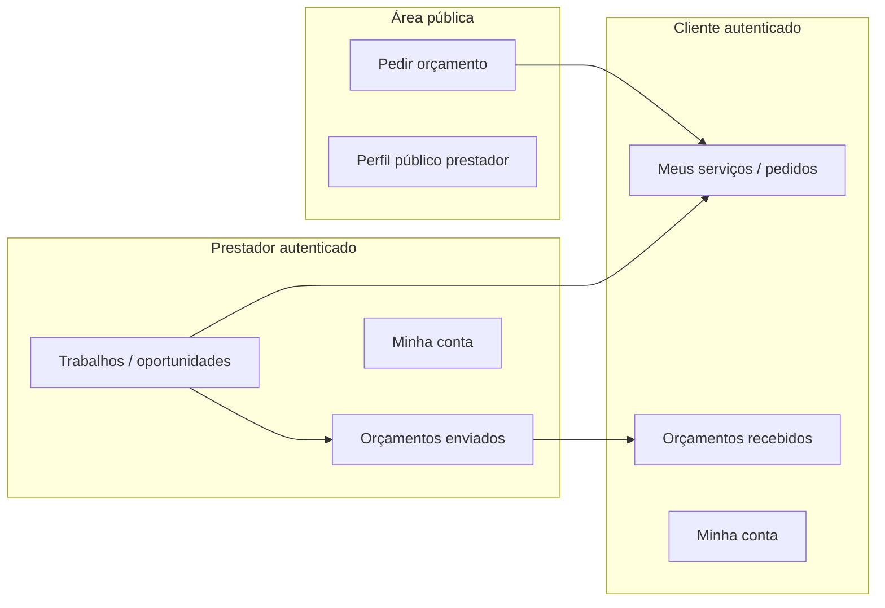

# Visão geral da Renovi

## Propósito da plataforma (evidência no código)

A Renovi, neste repositório, é uma aplicação web que conecta **clientes** que **pedem orçamentos** para serviços cadastrados na plataforma com **prestadores** que **visualizam oportunidades compatíveis** (localização, serviços ofertados), **trocam perguntas** com o cliente e **enviam propostas** com valores e condições. O **cliente** acompanha pedidos, responde perguntas e **aceita ou rejeita** propostas via fluxos dedicados no painel.

Não há neste worktree implementação completa de **pagamentos** ou **webhooks de gateway**; há documentos de planejamento em `docs/payment-system-*.md` que **não** foram tratados como fonte de comportamento em produção.

## Visão macro

## Módulos existentes

Os módulos de produto mapeiam diretamente às pastas em `src/features/`:

- **request-quote** — Wizard “Pedir orçamento” (serviço, formulário dinâmico, descrição/fotos, endereço, identidade/convidado).
- **dynamic-form** — Motor de formulários por schema (etapas, visibilidade, validação).
- **addresses** — Endereços do cliente, geografia da plataforma (estados, cidades, bairros), CEP.
- **auth** — Login, cadastro, recuperação de senha, sessão, guards de rota.
- **client-my-services** — Lista e detalhe de **pedidos** (`service_requests`) do cliente.
- **client-budgets** — Orçamentos recebidos, perguntas e respostas no contexto de propostas.
- **provider-jobs** — Descoberta de pedidos compatíveis, detalhe, perguntas e envio de proposta.
- **provider-budgets** — Orçamentos já enviados e fila de perguntas do prestador.
- **provider-profile** — Página pública do prestador por slug (`/perfil/:slug`).
- **my-account** — Configurações de conta (diferentes para cliente e prestador: dados, portfólio, área de atuação, etc.).

## Entidades centrais (modelo de dados)

| Entidade (tabela principal) | Papel de negócio |
|----------------------------|------------------|
| `profiles` | Usuário da aplicação ligado ao auth; papel `client`, `provider` ou `admin`. |
| `service_requests` | Pedido de orçamento do cliente (status, serviço, formulário, fotos, localização). |
| `provider_proposals` | Proposta/orçamento do prestador sobre um pedido (valores, prazo, slots, status). |
| `provider_service_request_questions` | Perguntas do prestador e respostas do cliente sobre um pedido. |
| `platform_services` | Catálogo de tipos de serviço (com formulário e prompt de IA opcionais). |
| `platform_forms` | Definição versionada do formulário dinâmico. |
| `client_addresses` | Endereços do cliente com referência geográfica. |
| `provider_profiles_public` / `provider_profiles_private` | Perfil público (slug, visibilidade) e dados legais do prestador. |
| `provider_offered_services` | Serviços que o prestador declara oferecer. |
| `provider_service_area_neighborhoods` | Bairros em que o prestador atua. |
| `provider_portfolio_items` | Itens de portfólio com imagens. |

## Perfis envolvidos

| Papel | Uso típico na aplicação |
|-------|-------------------------|
| **Cliente** | Pedir orçamento; gerenciar pedidos e orçamentos; endereços; conta. |
| **Prestador** | Ver oportunidades; perguntar; enviar propostas; gerenciar perfil público e área de atuação. |
| **Admin** | Existe no banco e em políticas RLS/RPC; **painel `/admin` não está definido no `router.tsx`** — ver pendências. |

## Principais jornadas

1. **Cliente pede orçamento** — `/pedir-orcamento` → escolha de serviço → formulário dinâmico → descrição/fotos (opcional IA) → endereço → identidade (logado ou cadastro convidado) → criação via Edge Function `create-request-quote-order`.
2. **Prestador encontra trabalho** — `/dashboard/jobs` → filtros/geo → detalhe → perguntas/proposta.
3. **Cliente acompanha** — `/dashboard/requests` (lista) e `/dashboard/orcamentos` (propostas e threads).
4. **Prestador acompanha envios** — `/dashboard/budgets`.
5. **Perfil público** — `/perfil/:slug` para captação/link compartilhável.

## Evidências principais

- `src/router.tsx` — Rotas e guards.
- `src/layouts/DashboardLayout/dashboardMenu.ts` — Menus por papel.
- `supabase/migrations/*.sql` — Regras persistidas, RLS, RPCs.
- `src/lib/supabase/database.types.ts` — Contrato tipado das tabelas e funções.
