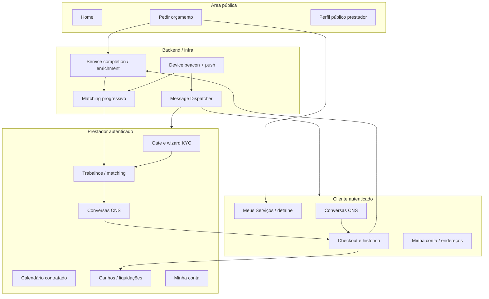

# Visão geral da Prestway

Documento macro da plataforma Orbit (Prestway). Inventário operacional (rotas, pastas, status): [Mapa de módulos e features](./02-mapa-de-modulos-e-features.md). Detalhe por área: [índice de módulos](./modulos/README.md).

## Propósito da plataforma (evidência no código)

A Prestway conecta **clientes** que pedem orçamentos para serviços do catálogo a **prestadores** que recebem oportunidades compatíveis (serviço, geografia, matching progressivo **após enrichment READY**), negociam in-app (**CNS** — conversas e propostas), aceitam/recusam orçamentos e, após aceite, seguem para **pagamento** (checkout NetCred), execução agendada, **conclusão com checklist/evidências** (`service-completion`), eventual **reagendamento**, **liquidação** (ganhos do prestador) e notificações (**MMD** — e-mail/push).

Plataformas: **Web/PWA** + **Android** (Capacitor); iOS previsto. Bootstrap: sessão, beacons de dispositivo e permissão de push no root da app.

## Visão macro

## Módulos principais

Espelham `src/features/` (e shells/backends documentados). Links apontam para o README do módulo.

| Área | Módulo | O que entrega (negócio) |
|------|--------|-------------------------|
| Entrada / pedido | [request-quote](./modulos/request-quote/README.md), [dynamic-form](./modulos/dynamic-form/README.md), [addresses](./modulos/addresses/README.md) | Wizard pedir orçamento; formulário dinâmico; endereços (embutidos no wizard e em Minha conta) |
| Identidade | [auth](./modulos/auth/README.md), [my-account](./modulos/my-account/README.md), [provider-profile](./modulos/provider-profile/README.md) | Login/cadastro/sessão; conta; perfil público `/perfil/:slug` |
| Pedidos e serviços | [my-services](./modulos/my-services/README.md), [view-services](./modulos/view-services/README.md) | Lista Meus Serviços; detalhe unificado `/dashboard/services/:id` |
| Oportunidades | [provider-jobs](./modulos/provider-jobs/README.md), [matching-dispatch](./modulos/matching-dispatch/README.md), [service-completion](./modulos/service-completion/README.md) (enrichment) | Feed Trabalhos; dispatch após READY; checklist pré-matching |
| Negociação (CNS) | [chats](./modulos/chats/README.md) (+ `negotiation-proposals`) | Conversas, propostas, aceite → checkout; sheet comparar orçamentos |
| Pós-contrato | [service-completion](./modulos/service-completion/README.md), [service-reschedule](./modulos/service-reschedule/README.md), [provider-calendar](./modulos/provider-calendar/README.md) | Conclusão (EXECUTED/confirm/auto-complete); reagendar; agenda **somente leitura** |
| Dinheiro | [payments](./modulos/payments/README.md), [provider-earnings](./modulos/provider-earnings/README.md) | Checkout, cobrança T-2, histórico/reembolso; Ganhos (`/dashboard/earnings`) |
| Credenciamento | [provider-kyc](./modulos/provider-kyc/README.md) | Gate do shell até KYC `ACTIVE`; chrome de nav oculto; wizard; lembretes MMD de incompleto |
| Notificações | [message-dispatcher](./modulos/message-dispatcher/README.md) (MMD), [push-permission](./modulos/push-permission/README.md), [notifications](./modulos/notifications/README.md), [device-beacon](./modulos/device-beacon/README.md) | Fila e-mail/push; soft prompt de permissão; clique em push; beacon FCM + geo operacional do prestador |
| Shell | [dashboard-shell](./modulos/dashboard-shell/README.md), [app-home](./modulos/app-home/README.md) | Layout/menu/placeholders; home |

## Entidades centrais (modelo de dados)

| Entidade (tabela / domínio) | Papel de negócio |
|----------------------------|------------------|
| `profiles` | Usuário ligado ao auth; papel `client`, `provider` ou `admin`. |
| `service_requests` | Pedido de orçamento (status, serviço, formulário, fotos, localização). |
| `provider_proposals` / CNS | Propostas e thread de negociação por pedido. |
| `contracted_services` | Serviço contratado pós-aceite (agenda, status, pagamento). |
| `platform_services` / `platform_forms` | Catálogo e formulários versionados. |
| `client_addresses` | Endereços do cliente + geografia. |
| `provider_profiles_*` / área / portfólio | Perfil público/privado, serviços ofertados, bairros, portfólio. |
| Dispatch / matching | `service_request_dispatches` e lotes (bootstrap só após enrichment READY). |
| Enrichment / conclusão | `service_request_enrichments`, evidência congelada, ratings; RPCs `service_completion_*`. |
| Pagamentos / settlements | Schedules, cobranças NetCred, liquidações exibidas em Ganhos. |
| `user_device_beacons` | Device + FCM (+ localização operacional do prestador). |
| Schema `message_dispatcher` | Intenções, fila, entregas e engagements (MMD). |

## Perfis envolvidos

| Papel | Uso típico na aplicação |
|-------|-------------------------|
| **Cliente** | Pedir orçamento; Meus Serviços; Conversas; checkout/histórico; Minha conta (endereços reais aqui). |
| **Prestador** | KYC → Trabalhos; Conversas; Meus Serviços / calendário; Ganhos; Minha conta. Sem KYC `ACTIVE` (ou conta carregando): conteúdo operacional bloqueado pelo gate; menus ocultos; header/logo permanece. |
| **Admin** | Existe no banco e em parte das políticas RLS/RPC; **não há painel `/admin` no `router.tsx`**. Redirecionamento pós-login aponta para `/admin/dashboard` (rota inexistente neste tree). |

Matriz detalhada: [Perfis e permissões](./perfis-e-permissoes.md).

## Principais jornadas

### Cliente

1. **Pedir orçamento** — `/pedir-orcamento` → serviço → formulário dinâmico → descrição/fotos (IA opcional) → endereço → identidade (logado ou cadastro convidado) → Edge `create-request-quote-order`.
2. **Acompanhar e negociar** — `/dashboard/services` (+ detalhe) e `/dashboard/chats` (CNS: perguntas implícitas na thread, propostas, aceite).
3. **Pagar, executar e concluir** — checkout pós-aceite; histórico em Minha conta; prestador marca EXECUTED com checklist (ou auto-mark sem checklist se não marcar a tempo); cliente confirma+avalia (ou auto-complete ~24h após EXECUTED); reagendamento embutido quando elegível.
4. **Conta** — `/dashboard/conta` (dados e endereços).

### Prestador

1. **Credenciar (KYC)** — gate no dashboard até onboarding NetCred `ACTIVE` (conteúdo + chrome de nav oculto); wizard / telas de status; allowlist `/dashboard/conta*`.
2. **Receber oportunidades** — matching progressivo + beacon de localização; feed `/dashboard/jobs` (`list-provider-opportunities`).
3. **Negociar e propor** — detalhe do job → CNS (`/dashboard/chats`); envio de proposta; aceite pelo cliente dispara pagamento.
4. **Executar e concluir** — Meus Serviços + calendário; checklist/EXECUTED (`service-completion`); reagendamento quando aplicável.
5. **Receber** — `/dashboard/earnings` (previsto / liquidado / estorno).
6. **Perfil público** — `/perfil/:slug` para captação.

### Transversal (infra de produto)

- **MMD** — produtores (CNS, matching, pagamentos, KYC, reagendamento, etc.) ingerem intenções; worker envia e-mail (Resend) e push (FCM), com quiet hours e quotas.
- **Push / beacon** — soft prompt de permissão; sync de device; geo operacional alimenta elegibilidade de lote no matching.

## O que a plataforma ainda **não** faz (evidência)

| Lacuna | Evidência |
|--------|-----------|
| **Painel admin** | Sem rotas `/admin/*` no `router.tsx`; papel `admin` redireciona para destino inexistente neste tree. Resolve de **Disputa de serviço** é via RPC privilegiada (`service_completion_admin_resolve_dispute` / `service_role`), não UI. |
| **Placeholders do dashboard** | `/dashboard` (Visão geral), `/dashboard/addresses` (menu Endereços), `/dashboard/settings`, `/dashboard/help` → `DashboardFakePage`. Gestão real de endereços fica em Minha conta / wizard. |
| **Calendário editável / disponibilidade** | Calendário do prestador é **só consulta** de serviços já contratados — não agenda livre nem CRUD de disponibilidade. |
| **Onboarding de papel desconhecido** | Redirect para `/onboarding` sem rota correspondente no router. |

Demais incertezas e conflitos: [Pendências e incertezas](./pendencias-e-incertezas.md).

## Evidências principais

- `src/router.tsx` — Rotas e guards.
- `src/layouts/DashboardLayout/dashboardMenu.ts` — Menus por papel.
- `src/features/*` — Features de produto (ver [mapa](./02-mapa-de-modulos-e-features.md)).
- `supabase/migrations/*.sql` — Regras persistidas, RLS, RPCs, matching, CNS, MMD, pagamentos.
- `supabase/functions/*` — Edge (pedido, oportunidades, NetCred, MMD, chat media, etc.).
- `src/lib/supabase/database.types.ts` — Contrato tipado.
