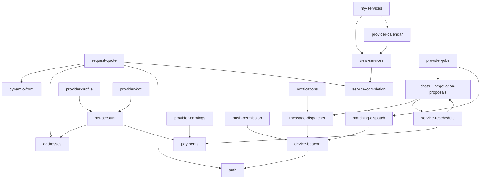

# Mapa de módulos e features

Inventário alinhado ao código em `src/features/`. “Localização no código” indica a pasta raiz do módulo. “Rotas” referem-se a `src/router.tsx` e shells internos. Menu: `src/layouts/DashboardLayout/dashboardMenu.ts`.

**Índice consolidado com cobertura:** [modulos/README.md](./modulos/README.md).

## Superfícies fora de `src/features`

| Área | Documento | Rotas / código |
|------|-----------|----------------|
| Shell do dashboard e placeholders | [dashboard-shell](./modulos/dashboard-shell/README.md) | `DashboardLayout`, `DashboardFakePage`, `dashboardMenu.ts` (Conversas + Ganhos no menu; calendário **fora**); gate KYC + `useProviderKycBlocksNav` via `provider-kyc` |
| Página inicial | [app-home](./modulos/app-home/README.md) | `/` → `src/App.tsx` |

## Tabela mestra

| Módulo (`src/features` ou backend) | Feature documentada | Rotas / telas principais | Dependências de outros módulos |
|------------------------------------|---------------------|--------------------------|--------------------------------|
| **addresses** | [gestao-de-enderecos](./modulos/addresses/features/gestao-de-enderecos.md) | Embarcado em `request-quote` e `my-account`; rota `/dashboard/addresses` é **placeholder** (`DashboardFakePage`) | `auth` (usuário), Supabase `client_addresses`, geografia |
| **auth** | [autenticacao-e-sessao](./modulos/auth/features/autenticacao-e-sessao.md) | `/login`, `/cadastro/cliente`, `/cadastro/profissional`, `/esqueceu-senha`, `/recuperar-senha` | Supabase Auth, `profiles` |
| **my-services** | [solicitacoes-do-cliente](./modulos/my-services/features/solicitacoes-do-cliente.md) | `/dashboard/services`; banner prestador → calendário | `view-services` (lista/detalhe); sheet de orçamentos via `negotiation-proposals`; `provider-calendar` (entrada) |
| **view-services** | [visualizacao-de-servicos](./modulos/view-services/features/visualizacao-de-servicos.md) | `/dashboard/services/:id` → **`ServiceDetailShell`** (página ou `null` se sheet); sheet no `DashboardLayout` | RPCs `get_service`, `list_services`; `contracted_services`; consumido por `my-services`, `provider-jobs`, `provider-calendar`; conclusão via **service-completion** |
| **dynamic-form** | [motor-de-formularios](./modulos/dynamic-form/features/motor-de-formularios.md) | `/dev/demo/form` (somente DEV) | Consumido por `request-quote` |
| **my-account** | [minha-conta](./modulos/my-account/features/minha-conta.md) | `/dashboard/conta` | `addresses`, storage, perfis público/privado; histórico de captura via `payments` |
| **provider-jobs** | [trabalhos-e-propostas](./modulos/provider-jobs/features/trabalhos-e-propostas.md) | `/dashboard/jobs` (lista); detalhe `/dashboard/services/:id` (`ServiceDetailShell` / sheet) | Edge **viva** `list-provider-opportunities`; propostas / CNS; backend [matching-dispatch](./modulos/matching-dispatch/README.md); GPS feed via `device-beacon` |
| **matching-dispatch** *(backend)* | [dispatch-e-visibilidade](./modulos/matching-dispatch/features/dispatch-e-visibilidade.md) | *Sem rota de UI* | Migrations `202607110*`, cron matching, visibilidade; bootstrap via READY-handoff ([service-completion](./modulos/service-completion/README.md)); consumido por **provider-jobs**; beacon → `provider_latest_locations` (**device-beacon**). Legado: Edge `match-provider-jobs` **morta** (pasta vazia); RPC `match_provider_jobs` **órfã** no schema |
| **service-completion** | [conclusao-e-enrichment](./modulos/service-completion/features/conclusao-e-enrichment.md) | Embutido em detalhe/lista (`view-services`); *sem rota própria* | Enrichment pré-matching; RPCs `service_completion_*` / `get_service_completion_context`; Edges checklist + upload URL; janitor SQL de órfãos; host UI só Public API |
| **provider-profile** | [pagina-publica](./modulos/provider-profile/features/pagina-publica.md) | `/perfil/:slug` | RPC `get_public_provider_by_slug`, storage |
| **request-quote** | [pedir-orcamento](./modulos/request-quote/features/pedir-orcamento.md) | `/pedir-orcamento` | `dynamic-form`, `addresses`, `auth`, Edge Functions; enqueue enrichment (matching após READY) |
| **chats** + **negotiation-proposals** | [conversas-e-negociacao](./modulos/chats/features/conversas-e-negociacao.md), [propostas-negociacao](./modulos/chats/features/propostas-negociacao.md), [comparar-orcamentos-meus-servicos](./modulos/chats/features/comparar-orcamentos-meus-servicos.md) | `/dashboard/chats`, `/dashboard/chats/:chatId` (item **Conversas** no menu cliente e prestador) | `auth`, `provider-jobs`, `message-dispatcher`, `my-services` / `view-services` (sheet compare/history), `payments` (aceite→checkout), `service-reschedule`, RPCs CNS |
| **service-reschedule** | [ciclo-estados-reagendamento](./modulos/service-reschedule/features/ciclo-estados-reagendamento.md), [propor-nova-data](./modulos/service-reschedule/features/propor-nova-data.md), [integracao-pagamento-pos-aceite](./modulos/service-reschedule/features/integracao-pagamento-pos-aceite.md) | Embutido em chat e detalhe do serviço contratado (dialogs/cards) | `chats`, `view-services`, `payments` (retarget / far-recapture), `negotiation-proposals` (duração), `message-dispatcher`, RPCs `cns_*_service_reschedule*`, migrations `20260802*` |
| **message-dispatcher** *(backend)* | [pipeline-e-fsm](./modulos/message-dispatcher/features/pipeline-e-fsm.md), [quotas-e-canais](./modulos/message-dispatcher/features/quotas-e-canais.md), [horario-silencioso](./modulos/message-dispatcher/features/horario-silencioso.md), [engagement-push-click](./modulos/message-dispatcher/features/engagement-push-click.md) | *Sem rota de UI* | Schema `message_dispatcher`; Edge `message-dispatcher-worker` / `webhook-resend` / `ingest`; clique app via **notifications** (`recordPushClick`); beacons em `user_device_beacons` |
| **notifications** | [engagement-push](./modulos/notifications/features/engagement-push.md) | *Sem rota de UI* — API `recordPushClick` | RPC `message_dispatcher_record_push_click`; caller `src/lib/push.ts` (nativo) |
| **payments** | [checkout-e-cobranca](./modulos/payments/features/checkout-e-cobranca.md), [historico-e-reembolso](./modulos/payments/features/historico-e-reembolso.md), [reconciliacao-e-voids](./modulos/payments/features/reconciliacao-e-voids.md) | Checkout pós-aceite; histórico em `/dashboard/conta`; ops/reconcile sem UI | `negotiation-proposals`, `my-account`, `provider-kyc`, `provider-earnings`, `service-reschedule`, NetCred EFs, RPCs `payment_*` |
| **provider-earnings** | [ganhos-e-liquidacoes](./modulos/provider-earnings/features/ganhos-e-liquidacoes.md) | `/dashboard/earnings` — item **Ganhos** no menu prestador | `payments` (settlements); `dashboard-shell` (menu) |
| **provider-kyc** | [gate-e-acesso-operacional](./modulos/provider-kyc/features/gate-e-acesso-operacional.md), [formulario-credenciamento-wizard](./modulos/provider-kyc/features/formulario-credenciamento-wizard.md) | Bloqueia **conteúdo** até `ACTIVE`; **oculta chrome de nav** (`useProviderKycBlocksNav`); exceção `/dashboard/conta*`; wizard entity→identity→bank→documents→review | `dashboard-shell`, `my-account`, `payments` (NetCred / cobrança) |
| **provider-calendar** | [calendario-do-prestador](./modulos/provider-calendar/features/calendario-do-prestador.md) | `/dashboard/services/calendar` (guard provider); **sem** item no menu; entrada via banner em Meus Serviços | RPC `list_provider_scheduled_services`; `my-services` (banner); `view-services` (detalhe) |
| **device-beacon** | [rastreamento-dispositivo](./modulos/device-beacon/features/rastreamento-dispositivo.md) | *Sem rota* — `DeviceBeaconProvider` no `RootLayout` | `auth` (logout); FCM via `@/lib/push`; geo operacional → matching; sequência com **push-permission** |
| **push-permission** | [prompt-e-cooldown](./modulos/push-permission/features/prompt-e-cooldown.md) | *Sem rota* — `PushPermissionPromptHost` no `RootLayout` | `auth`; `@/lib/push`; cooldown Preferences; espera localização do prestador (**device-beacon**) |

## Telas placeholder (evidência)

| Rota | Comportamento no código |
|------|-------------------------|
| `/dashboard` | `DashboardFakePage` “Visão geral” |
| `/dashboard/addresses` | `DashboardFakePage` “Endereços” — **não** renderiza o módulo `addresses` |
| `/dashboard/settings` | Placeholder “Configurações” (rota existe; **não** está no menu) |
| `/dashboard/help` | Placeholder “Ajuda” |

> **Não é placeholder:** `/dashboard/services/:id` → `ServiceDetailShell` (`src/features/view-services/components/ServiceDetailShell.tsx`).

## Menu do dashboard (evidência: `dashboardMenu.ts`)

| Papel | Itens (`allItems`) |
|-------|--------------------|
| **Cliente** | Visão geral, Meus Serviços, Conversas, Endereços, Minha conta, Ajuda |
| **Prestador** | Visão geral, Meus Serviços, Trabalhos, Conversas, Ganhos, Minha conta, Ajuda |

**Fora do menu (rotas reais):** `/dashboard/services/calendar`, `/dashboard/services/:id`, `/dashboard/settings`.

## Edge Functions (Supabase)

| Função | Relação com módulos |
|--------|---------------------|
| `generate-completion-checklist` | `service-completion` — LLM/worker de enrichment do checklist |
| `create-request-quote-order` | `request-quote` |
| `generate-smart-description` | `request-quote` |
| `verify-recaptcha` | `auth`, `request-quote` |
| `list-provider-opportunities` | `provider-jobs` / `matching-dispatch` — feed progressivo (caminho **vivo**) |
| `match-provider-jobs` | **Morta** — código removido; pasta vazia residual; **sem** entrada em `config.toml`. RPC SQL `match_provider_jobs` permanece **órfã** (sem caller em `src/`). Substituída por `list-provider-opportunities` |
| `message-dispatcher-worker` | `message-dispatcher` — consome fila, renderiza templates, envia via Resend/FCM |
| `message-dispatcher-webhook-resend` | `message-dispatcher` — webhooks Resend (delivered, bounce, opened) |
| `message-dispatcher-ingest` | `message-dispatcher` — ingest HTTP autenticado |
| `chat-upload-media` | `chats` — upload de mídia na conversa |
| `schedule-netcred-charges` | `payments` — cobrança automática T-2 (cron) |
| `tokenize-payment-card` | `payments` — tokenização checkout |
| `manual-charge-payment` | `payments` — cobrança manual cliente |
| `netcred-webhook` | `payments` — webhooks gateway (PAYOUT_* → settlements; enrich GraphQL pós-CAPTURE/REFUND) |
| `process-refund` | `payments` — estornos |
| `detect-netcred-onboarding` | `payments` / `provider-kyc` — status KYC |
| `reconcile-netcred-payments` | `payments` — reconciliação de cobranças |
| `reconcile-inanalysis-auto-cancel-voids` | `payments` — voids / auto-cancel (ops) |
| `sync-netcred-settlements` | `payments` / `provider-earnings` — movements de liquidação |
| `process-far-reschedule-recapture` | `service-reschedule` / `payments` — recaptura longe pós-aceite |
| `dispatch-kyc-email` | `provider-kyc` / `message-dispatcher` — e-mails de KYC |

## Status da documentação

| Área | Status |
|------|--------|
| Módulos em `src/features` + shell + home + backends documentados | **23** com README + ≥1 feature (critério do índice); ver [modulos/README.md](./modulos/README.md) |
| Admin UI | **Não localizada** no router — evidência parcial |
| Pagamentos | **Implementado** — `payments` (+ reconciliacao-e-voids) + backend; runbooks em `docs/payment-system/` |
| Message Dispatcher | Critério doc **OK** (pipeline, quotas, quiet hours, engagement); pendências de **produto** P-08 (janela hardcoded) e P-09 (fuso único BRT) |
| service-reschedule | Critério doc **OK** (ciclo de estados + propor + pagamento pós-aceite); pendências P-SR-* (UX erros, templates MMD, consumo de `is_last_minute`) |
| service-completion | Critério doc **OK** (enrichment READY-handoff + conclusão + stub disputa + endurecimento SQL 2026-08-05); design técnico em `docs/service-completion/` |
| PWA / Sentry / analytics | Mencionados na rastreabilidade; não detalhados como módulos de produto |
| App nativo (Capacitor) | Infra cliente documentada em **device-beacon**, **push-permission**, **notifications** (+ libs `src/lib/push`, Preferences) |
| Matching legado | Edge morta + RPC órfã documentados em matching-dispatch / provider-jobs |

## Diagrama de dependências entre módulos (simplificado)

