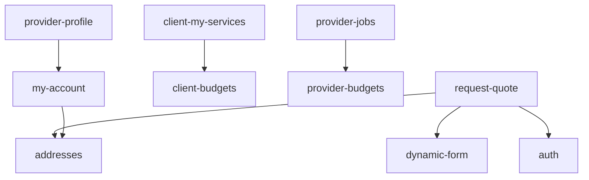

# Mapa de módulos e features

Inventário alinhado ao código em `src/features/`. “Localização no código” indica a pasta raiz do módulo. “Rotas” referem-se a `src/router.tsx` e shells internos.

**Índice consolidado com cobertura:** [modulos/README.md](./modulos/README.md).

## Superfícies fora de `src/features`

| Área | Documento | Rotas / código |
|------|-----------|----------------|
| Shell do dashboard e placeholders | [dashboard-shell](./modulos/dashboard-shell/README.md) | `DashboardLayout`, `DashboardFakePage`, `dashboardMenu.ts` |
| Página inicial | [app-home](./modulos/app-home/README.md) | `/` → `src/App.tsx` |

## Tabela mestra

| Módulo (`src/features`) | Feature documentada | Rotas / telas principais | Dependências de outros módulos |
|-------------------------|---------------------|--------------------------|--------------------------------|
| **addresses** | [gestao-de-enderecos](./modulos/addresses/features/gestao-de-enderecos.md) | Embarcado em `request-quote` e `my-account`; rota `/dashboard/addresses` é **placeholder** (`DashboardFakePage`) | `auth` (usuário), Supabase `client_addresses`, geografia |
| **auth** | [autenticacao-e-sessao](./modulos/auth/features/autenticacao-e-sessao.md) | `/login`, `/cadastro/cliente`, `/cadastro/profissional`, `/esqueceu-senha`, `/recuperar-senha` | Supabase Auth, `profiles` |
| **client-budgets** | [orcamentos-recebidos](./modulos/client-budgets/features/orcamentos-recebidos.md) | `/dashboard/orcamentos` | RPCs cliente, `client-my-services` (links/foco) |
| **client-my-services** | [solicitacoes-do-cliente](./modulos/client-my-services/features/solicitacoes-do-cliente.md) | `/dashboard/requests`, `/dashboard/services/:id` | `service_requests`, integração com sheets de orçamentos |
| **dynamic-form** | [motor-de-formularios](./modulos/dynamic-form/features/motor-de-formularios.md) | `/demo/form` (somente DEV) | Consumido por `request-quote` |
| **my-account** | [minha-conta](./modulos/my-account/features/minha-conta.md) | `/dashboard/conta` | `addresses`, storage, perfis público/privado |
| **provider-budgets** | [orcamentos-enviados](./modulos/provider-budgets/features/orcamentos-enviados.md) | `/dashboard/budgets`, `/dashboard/budgets/pedido/:serviceRequestId` | RPCs prestador |
| **provider-jobs** | [trabalhos-e-propostas](./modulos/provider-jobs/features/trabalhos-e-propostas.md) | `/dashboard/jobs`, `/dashboard/jobs/:jobId` | Edge `match-provider-jobs`, propostas, perguntas |
| **provider-profile** | [pagina-publica](./modulos/provider-profile/features/pagina-publica.md) | `/perfil/:slug` | RPC `get_public_provider_by_slug`, storage |
| **request-quote** | [pedir-orcamento](./modulos/request-quote/features/pedir-orcamento.md) | `/pedir-orcamento` | `dynamic-form`, `addresses`, `auth`, Edge Functions |

## Telas placeholder (evidência)

| Rota | Comportamento no código |
|------|-------------------------|
| `/dashboard` | `DashboardFakePage` “Visão geral” |
| `/dashboard/addresses` | `DashboardFakePage` “Endereços” — **não** renderiza o módulo `addresses` |
| `/dashboard/settings` | Placeholder “Configurações” |
| `/dashboard/help` | Placeholder “Ajuda” |
| `/dashboard/earnings` | Placeholder “Ganhos” |

## Edge Functions (Supabase)

| Função | Relação com módulos |
|--------|---------------------|
| `create-request-quote-order` | `request-quote` |
| `generate-smart-description` | `request-quote` |
| `verify-recaptcha` | `auth`, `request-quote` |
| `match-provider-jobs` | `provider-jobs` |

## Status da documentação

| Área | Status |
|------|--------|
| Módulos em `src/features` | Documentados (README + ≥1 feature) |
| Admin UI | **Não localizada** no router — evidência parcial |
| Pagamentos | Planejamento em `docs/` apenas — fora do escopo comportamental |
| PWA / Sentry / analytics | Mencionados na rastreabilidade; não detalhados por feature |
| App nativo (Capacitor / Android) | Shell + **persistência cliente** (Preferences) em [rastreabilidade](./rastreabilidade.md) e [matriz](./matriz-cobertura-documental.md); `device-beacon` e `push-permission` em `src/features/` sem pasta em `modulos/` |

## Diagrama de dependências entre módulos (simplificado)

