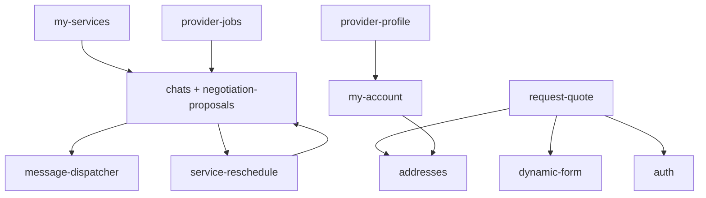

# Mapa de módulos e features

Inventário alinhado ao código em `src/features/`. “Localização no código” indica a pasta raiz do módulo. “Rotas” referem-se a `src/router.tsx` e shells internos.

**Índice consolidado com cobertura:** [modulos/README.md](./modulos/README.md).

## Superfícies fora de `src/features`

| Área | Documento | Rotas / código |
|------|-----------|----------------|
| Shell do dashboard e placeholders | [dashboard-shell](./modulos/dashboard-shell/README.md) | `DashboardLayout`, `DashboardFakePage`, `dashboardMenu.ts` |
| Página inicial | [app-home](./modulos/app-home/README.md) | `/` → `src/App.tsx` |

## Tabela mestra

| Módulo (`src/features`) | Feature documentada | Rotas / telas principais | Dependências de outros módulos |
|-------------------------|---------------------|--------------------------|--------------------------------|
| **addresses** | [gestao-de-enderecos](./modulos/addresses/features/gestao-de-enderecos.md) | Embarcado em `request-quote` e `my-account`; rota `/dashboard/addresses` é **placeholder** (`DashboardFakePage`) | `auth` (usuário), Supabase `client_addresses`, geografia |
| **auth** | [autenticacao-e-sessao](./modulos/auth/features/autenticacao-e-sessao.md) | `/login`, `/cadastro/cliente`, `/cadastro/profissional`, `/esqueceu-senha`, `/recuperar-senha` | Supabase Auth, `profiles` |
| **my-services** | [solicitacoes-do-cliente](./modulos/my-services/features/solicitacoes-do-cliente.md) | `/dashboard/services` | `view-services` (lista); sheet de orçamentos via `negotiation-proposals` |
| **view-services** | [visualizacao-de-servicos](./modulos/view-services/features/visualizacao-de-servicos.md) | `/dashboard/services/:id` | RPCs `get_service`, `list_services`; `contracted_services`; consumido por `my-services` |
| **dynamic-form** | [motor-de-formularios](./modulos/dynamic-form/features/motor-de-formularios.md) | `/demo/form` (somente DEV) | Consumido por `request-quote` |
| **my-account** | [minha-conta](./modulos/my-account/features/minha-conta.md) | `/dashboard/conta` | `addresses`, storage, perfis público/privado |
| **provider-jobs** | [trabalhos-e-propostas](./modulos/provider-jobs/features/trabalhos-e-propostas.md) | `/dashboard/jobs`, `/dashboard/jobs/:jobId` | Edge `list-provider-opportunities`, propostas, negociação CNS; backend [matching-dispatch](./modulos/matching-dispatch/README.md) |
| **matching-dispatch** *(backend)* | [dispatch-e-visibilidade](./modulos/matching-dispatch/features/dispatch-e-visibilidade.md) | *Sem rota de UI* | Migrations `202607110*`, cron `matching_open_batch`, visibilidade; consumido por **provider-jobs** |
| **provider-profile** | [pagina-publica](./modulos/provider-profile/features/pagina-publica.md) | `/perfil/:slug` | RPC `get_public_provider_by_slug`, storage |
| **request-quote** | [pedir-orcamento](./modulos/request-quote/features/pedir-orcamento.md) | `/pedir-orcamento` | `dynamic-form`, `addresses`, `auth`, Edge Functions |
| **chats** + **negotiation-proposals** | [conversas-e-negociacao](./modulos/chats/features/conversas-e-negociacao.md), [comparar-orcamentos-meus-servicos](./modulos/chats/features/comparar-orcamentos-meus-servicos.md) | `/dashboard/chats`, `/dashboard/chats/:chatId` | `auth`, `provider-jobs`, `message-dispatcher`, `my-services` (sheet compare/history), RPCs CNS em `supabase/migrations/202607*` |
| **service-reschedule** | [propor-nova-data](./modulos/service-reschedule/features/propor-nova-data.md) | Embutido em chat e detalhe do serviço contratado (dialogs/cards) | `chats`, `view-services`, `negotiation-proposals` (regra de duração), RPCs `cns_*_service_reschedule*`, migrations `20260802*` |
| **message-dispatcher** *(backend)* | [horario-silencioso](./modulos/message-dispatcher/features/horario-silencioso.md) | *Sem rota de UI* | Supabase schema `message_dispatcher`, Edge Functions `message-dispatcher-worker` / `message-dispatcher-webhook-resend` |
| **payments** | [checkout-e-cobranca](./modulos/payments/features/checkout-e-cobranca.md), [historico-e-reembolso](./modulos/payments/features/historico-e-reembolso.md) | Checkout pós-aceite (`charge_amount` = gross-up NetCred); cobrança manual com erros amigáveis; rejeição ClearSale “Análise de Risco” → `RISK_ANALYSIS_*` em `failure_code`; histórico em Minha conta (cliente: breakdown de reembolso; prestador: líquido após clawback confirmado) | `negotiation-proposals`, `my-account`, NetCred EFs, RPCs `payment_*` / `payment_total_with_card_fees`, views de histórico, MMD |

## Telas placeholder (evidência)

| Rota | Comportamento no código |
|------|-------------------------|
| `/dashboard` | `DashboardFakePage` “Visão geral” |
| `/dashboard/addresses` | `DashboardFakePage` “Endereços” — **não** renderiza o módulo `addresses` |
| `/dashboard/settings` | Placeholder “Configurações” |
| `/dashboard/help` | Placeholder “Ajuda” |
| `/dashboard/earnings` | Placeholder “Ganhos” |

## Edge Functions (Supabase)

| Função | Relação com módulos |
|--------|---------------------|
| `create-request-quote-order` | `request-quote` |
| `generate-smart-description` | `request-quote` |
| `verify-recaptcha` | `auth`, `request-quote` |
| `list-provider-opportunities` | `provider-jobs` — feed progressivo (cursor, sort, visibilidade batch/fallback) |
| `match-provider-jobs` | **Removido** — substituído por `list-provider-opportunities` + RPC `list_provider_opportunities` |
| `message-dispatcher-worker` | `message-dispatcher` — consome fila, renderiza templates, envia via Resend/FCM |
| `message-dispatcher-webhook-resend` | `message-dispatcher` — recebe webhooks Resend (delivered, bounce, opened) |
| `chat-upload-media` | `chats` — upload de mídia na conversa (sessão + storage) |
| `schedule-netcred-charges` | `payments` — cobrança automática T-2 (cron) |
| `tokenize-payment-card` | `payments` — tokenização checkout |
| `manual-charge-payment` | `payments` — cobrança manual cliente |
| `netcred-webhook` | `payments` — webhooks gateway |
| `process-refund` | `payments` — estornos |
| `detect-netcred-onboarding` | `payments` — KYC prestador |
| `reconcile-netcred-payments` | `payments` — reconciliação |

## Status da documentação

| Área | Status |
|------|--------|
| Módulos em `src/features` | Documentados (README + ≥1 feature); CNS em `chats/` + `negotiation-proposals/` |
| Admin UI | **Não localizada** no router — evidência parcial |
| Pagamentos | **Implementado** — módulo `src/features/payments/` + backend `docs/payment-system/`; runbooks operacionais para rollout |
| PWA / Sentry / analytics | Mencionados na rastreabilidade; não detalhados por feature |
| App nativo (Capacitor / Android) | Shell + **persistência cliente** (Preferences) em [rastreabilidade](./rastreabilidade.md) e [matriz](./matriz-cobertura-documental.md); `device-beacon` e `push-permission` em `src/features/` sem pasta em `modulos/` |
| Message Dispatcher (backend) | **Parcial** — módulo em `modulos/message-dispatcher/`; feature documentada: horário silencioso. Demais features (quotas, FSM, checkout, reconciliação) cobrem visão geral no README mas sem feature doc dedicada |

## Diagrama de dependências entre módulos (simplificado)

