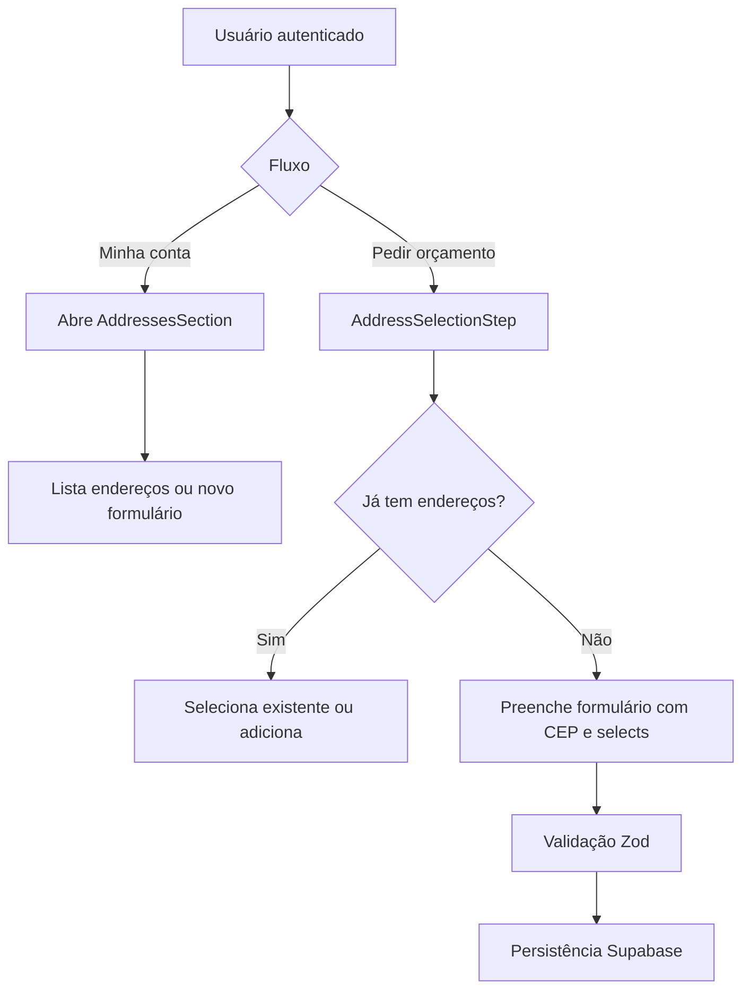

# Gestão e seleção de endereços

## 1. Resumo executivo

- **O que é:** conjunto de componentes e APIs para **cadastrar, listar, editar e excluir** endereços do cliente, além de **selecionar** endereço em fluxos (pedido de orçamento) com validação de CEP e vínculo a estado/cidade/bairro da plataforma.
- **Problema que resolve:** padronizar endereços para **georreferenciamento** e matching sem texto livre inconsistente.
- **Quem usa:** **cliente** (conta e wizard de pedido).
- **Resultado esperado:** registros em `client_addresses` utilizáveis em `service_requests`.

## 2. Objetivo de negócio

- **Finalidade:** garantir localização confiável do serviço.
- **Valor operacional:** menos retrabalho de cadastro e melhor qualidade de lead para prestadores.
- **Impacto:** alimenta campos de localização em pedidos (triggers/migrations relacionadas).
- **Contexto:** peça transversal entre **Minha conta** e **Pedir orçamento**.

## 3. Localização na plataforma

| Aspecto | Detalhe |
|---------|---------|
| Módulo | `addresses` |
| Menu | Sem item Endereços no `dashboardMenu`; acesso via Minha conta |
| Uso real | `/dashboard/account/addresses` → `AddressesSection`; `RequestQuote` → `AddressSelectionStep` |
| Rotas públicas | Indireto via `/pedir-orcamento` |
| Dependências | `auth` (usuário), Supabase |

## 4. Perfis envolvidos

| Papel | Acesso / operação |
|-------|-------------------|
| Cliente | CRUD e seleção |
| Prestador | Sem UI deste módulo |
| Visitante | Endereço só no fluxo de pedido após identificação conforme `request-quote` |

**Visibilidade:** listagens filtradas por `client_id` do usuário autenticado (RLS).

## 5. Fluxo funcional principal

## 6. Fluxos alternativos e exceções

- **Novo endereço com lista existente:** alternar para formulário completo e voltar à lista.
- **Erro de API:** feedback via UI (toasts/dialogs nos componentes).
- **CEP:** resolução parcial ou falha — **comportamento detalhado:** ver hooks `resolveFormDataFromCep` / APIs (evidência parcial neste documento).

## 7. Regras de negócio

1. Estado, cidade e bairro devem ser **selecionados por ID** das tabelas de plataforma (comentário no schema Zod).
2. CEP deve obedecer regex `^\d{5}-?\d{3}$`.
3. Apelido obrigatório, máximo 50 caracteres.
4. Rua mínimo 3 caracteres; número não vazio.
5. Endereço associado ao perfil do cliente dono.

## 8. Campos e dados da feature

### Formulário de novo endereço (validação Zod)

| Nome do campo | Label típica | Tipo | Obrigatório | Editável | Origem | Regra / validação | Padrão | Exemplo | Observações |
|---------------|--------------|------|-------------|----------|--------|-------------------|--------|---------|-------------|
| address_label | Apelido | string | Sim | Sim | usuário | min 1, max 50 | "Casa" | Casa | — |
| address_zip | CEP | string | Sim | Sim | usuário / CEP | formato BR | vazio | 01310-100 | Hífen opcional no regex |
| address_street | Rua | string | Sim | Sim | usuário | min 3 | — | Av. Paulista | — |
| address_number | Número | string | Sim | Sim | usuário | min 1 | — | 1000 | — |
| address_complement | Complemento | string | Não | Sim | usuário | opcional | — | Apto 12 | — |
| address_neighborhood_id | (interno) | UUID | Sim | Sim | select plataforma | UUID válido | — | — | Deve bater com bairro da cidade |
| address_neighborhood | Bairro | string | Sim | Sim | derivado/select | min 2 | — | Bela Vista | — |
| address_state_id | (interno) | UUID | Sim | Sim | select | UUID | — | — | — |
| address_state | UF | string | Sim | Sim | derivado | length 2 | — | SP | — |
| address_city_id | (interno) | UUID | Sim | Sim | select | UUID | — | — | — |
| address_city | Cidade | string | Sim | Sim | derivado | min 2 | — | São Paulo | — |

## 9. Validações de front-end

- Schema **`addressFormSchema`** (`zod`) com mensagens em português listadas na tabela acima.
- Seleção de bairro/cidade/estado: validação de UUID e consistência.

## 10. Validações de back-end

- **Constraints** em `client_addresses` (FKs para `profiles`, `platform_states`, `platform_cities`) — ver migration.
- **RLS:** apenas dono (e políticas admin) — evidência nas migrations de cliente.

## 11. Status, estados e transições

- Endereço pode ter conceito de **padrão** (hook `useSetDefaultAddress`) — **comportamento inferido:** um marcado como default entre vários.

## 12. Persistência e ciclo de vida

- **Tabela:** `client_addresses`.
- **Criação/edição/exclusão:** via APIs em `addresses.api.ts`.
- **Exclusão:** dialog dedicado (`DeleteAddressDialog`).

## 13. Integrações e efeitos externos

- Consultas a **estados/cidades/bairros** da plataforma (`statesAndCities.api.ts`).
- Sem Edge Function própria.

## 14. Listagens, buscas e filtros

- Lista de endereços do cliente na conta e no passo de seleção do pedido.
- **Evidência parcial:** filtros adicionais se existirem apenas em hooks.

## 15. Ações disponíveis

| Ação | Quem | Pré-condição | Resultado | Efeitos |
|------|------|--------------|-----------|---------|
| Criar endereço | Cliente logado | Form válido | Novo registro | Aparece em listas |
| Editar | Cliente | Endereço próprio | Atualização | — |
| Excluir | Cliente | Endereço próprio | Remoção | Pode afetar pedidos futuros |
| Definir padrão | Cliente | >1 endereço | Atualização de flags | Pré-seleção em fluxos |

## 16. Dependências

- Consome: tabelas geográficas, sessão auth.
- Alimenta: `request-quote`, pedidos com `address_id`.

## 17. Regras implícitas

- Prefixo `address_` nos campos do form para isolamento de estado no wizard (`addressForm.validation.ts`).

## 18. Riscos e pontos de atenção

- ~~**Menu “Endereços” leva a página fake**~~ — item/rota removidos; acesso via hub Minha conta.
- Dependência de qualidade do cadastro de bairros/cidades na plataforma.

## 19. Evidências no código

- `src/features/addresses/types/addressForm.validation.ts`
- `src/features/addresses/api/addresses.api.ts`, `api/statesAndCities.api.ts`
- `src/features/addresses/components/AddressSelectionStep/`, `AddressesSection`, `AddressFormDialog`
- `src/features/my-account/components/sections/ClientAddressesPage.tsx`
- `supabase/migrations/20260226100200_create_client_addresses.sql`

## 20. Pendências para validação com negócio/produto

- ~~Corrigir ou remover rota `/dashboard/addresses` placeholder.~~ **Feito:** rota e item de menu removidos; hub `/dashboard/account/addresses`.
- Confirmar política de **endereço obrigatório** vs opcional em pedidos (código permite `address_id` opcional em migrations — validar regra comercial).

## 21. Atualização de auditoria (2026-04-27)

- **Exclusão é soft delete:** `deleteAddress` apenas seta `is_active = false`; a listagem padrão (`listAddresses`) sempre filtra `is_active = true`.
- **Endereço padrão é único por cliente:** ao criar/editar com `is_default = true`, o sistema limpa `is_default` dos demais endereços do mesmo `client_id`.
- **Ordenação da lista:** endereços vêm com `is_default` primeiro e, em seguida, por `created_at` ascendente.
- **CEP só autopreenche quando há correspondência completa na base da plataforma:** UF + cidade + bairro precisam existir; caso contrário o retorno é `notAvailable`.
- **Geodados persistidos no endereço:** quando latitude/longitude existem, o app grava `location` (EWKT SRID 4326) e `h3_index`.

## 22. Atualização de auditoria (2026-08-02)

- Revalidado sem drift.
