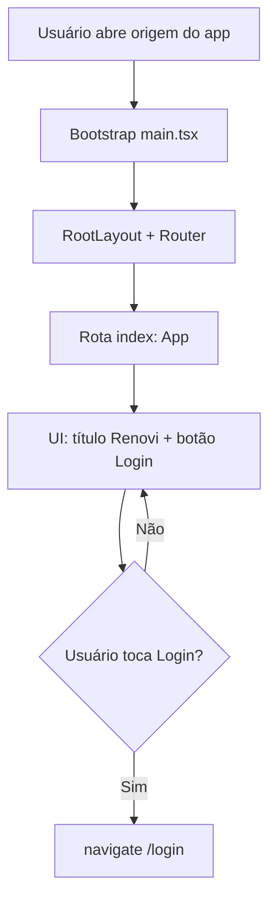

# Página inicial (`/`)

## 1. Resumo executivo

- **O que é:** rota **index** da SPA (`/`), renderizada pelo componente `App` — tela **mínima** com título “Renovi” e um botão que navega para `/login`.
- **Quem usa:** qualquer visitante (rota **pública**, sem `ProtectedRoute` / `GuestOnlyRoute`).
- **O que não é:** landing de marketing, catálogo de serviços, dashboard autenticado nem redirect automático por sessão.
- **Pasta de feature:** **não existe** `src/features/app-home/`; o módulo documental cobre `src/App.tsx` + registro em `src/router.tsx`.

## 2. Objetivo de negócio

Oferecer um **ponto de entrada HTTP** identificável (marca + caminho para login) após o bootstrap do app. O valor atual é operacional/técnico (origem da SPA, destino pós-logout, “voltar ao início” em error boundaries), **não** conversão de marketing nem onboarding de produto.

**Impacto se indisponível:** quem abre a origem do site, o WebView Capacitor sem deep link, ou recupera de erro via “Voltar ao início”, não vê a tela mínima; demais fluxos autenticados (`/dashboard`, etc.) não dependem desta UI.

## 3. Localização na plataforma

### 3.1 Rota

| Superfície | Path | Guard | Elemento |
|------------|------|-------|----------|
| Página inicial | `/` (child `index: true` de `path: '/'`) | Nenhum | `lazy(() => import('./App'))` → `<App />` |

**Layout pai:** `RootLayout` (`AuthProvider`, splash Capacitor, offline banner, toaster, hosts de push/beacon, etc.) — a home **não** importa essas peças; só é filha do `Outlet`.

**Error boundary da árvore:** `errorElement: <RouterErrorBoundary />` no nó `path: '/'`.

### 3.2 Entry points que levam a `/`

| Origem | Como | Evidência |
|--------|------|-----------|
| URL / bookmark / abertura do host | Navegação direta para origem | `router.tsx` index |
| Capacitor WebView (sem deep link de push/navegação) | SPA sobe no host configurado; rota default do browser/WebView é tipicamente `/` | `capacitor.config.ts` (`webDir: 'dist'`; `server.url` em dev); `main.tsx` → `RouterProvider` |
| Logout bem-sucedido | `navigate("/", { replace: true })` | `AuthProvider.signOut` (domínio auth; efeito observável na home) |
| Error boundary React | Botão “Voltar ao início” → `window.location.href = "/"` | `ErrorBoundary.tsx` |
| Error boundary do router | Botão “Voltar ao início” → `window.location.replace("/")` | `RouterErrorBoundary.tsx` |
| Telas auth (logo) | `<Link to="/">` | Login, ClientSignup, ProviderSignup, ForgotPassword, ResetPassword |
| Pedir orçamento (logo) | `<Link to="/">` | `RequestQuote.tsx` |
| Perfil público do prestador | `navigate("/")` / `<Link to="/">` | `ProviderProfilePage.tsx` |

### 3.3 Query params / deep links / path params

- **Nenhum** query param lido ou escrito por `App`.
- **Nenhum** path param na index.
- Deep links de push (`deep_link_path`) e navegação pós-auth **não** apontam para a UI da home como destino de produto; pós-login usa `getRedirectPath` → `/dashboard` (client/provider) — ver auth. A home só recebe o usuário no **logout** explícito (e nos links/erros acima).

### 3.4 Mobile / Capacitor

- A home **não** tem chrome de dashboard nem regras mobile próprias.
- Bootstrap nativo: `main.tsx` → `initCapacitorPlugins()` → `hydratePersistSessionPreference()` → `renderApp()`; splash escondido por `CapacitorSplashHider` no `RootLayout` (vale para qualquer rota, inclusive `/`).
- `capacitor.config.ts`: `appId: br.com.renovi.orbit`, `appName: Orbit`, `webDir: dist`; bloco `server.url` + `cleartext: true` marcado no arquivo como temporário até produção.

## 4. Perfis envolvidos

| Perfil | Acesso a `/` | Observação |
|--------|--------------|------------|
| Anônimo | Sim | Sem distinção na UI |
| `client` / `provider` autenticados | Sim | **Não** há redirect para dashboard ao abrir `/`; sessão pode existir via `AuthProvider` no layout, mas `App` **não consulta** auth |
| `admin` / outros | Sim (mesma UI pública) | Destinos pós-login de admin (`/admin/dashboard`) não passam por esta tela |

**Quem “não usa” como produto:** fluxos autenticados de operação (jobs, chats, orçamentos) — usam `/dashboard/*` e outras rotas; a home não participa desses fluxos além de ser destino de logout / link de logo / recovery de erro.

## 5. Fluxo funcional principal

Passos:

1. App sobe (`bootstrap` em `main.tsx`).
2. Router resolve `index` → chunk lazy de `App`.
3. Usuário vê “Renovi” e o botão `Login`.
4. Clique → `navigate('/login')` (sem `replace`, sem state, sem query).

## 6. Fluxos alternativos e exceções

| Cenário | Comportamento evidenciado |
|---------|---------------------------|
| Usuário já autenticado abre `/` | Home renderiza normalmente; **sem** `GuestOnlyRoute` / redirect |
| Logout com sucesso | Toast de sucesso (auth) + navegação `replace` para `/` → home mínima |
| Logout com falha | Toast de erro; **não** navega para `/` (permanece onde estava) |
| Clique em “Voltar ao início” após erro | Full reload / replace para `/` (perde estado React da sessão de erro) |
| Logo em telas auth / pedir orçamento / perfil público | Navegação client-side para `/` |
| Cancelamento / abandono | N/A — sem wizard nem draft |
| Double-submit / retry | N/A — única ação é navigate síncrono de UI |
| Duas abas | Cada aba independente; sem lógica de concorrência na home |
| Offline | Banner offline do `RootLayout` pode aparecer; `App` não trata rede |

## 7. Regras de negócio

1. **RN-HOME-01** — A rota index `/` é **pública** (sem guard de autenticação ou papel). Evidência: `router.tsx`.
2. **RN-HOME-02** — A única ação de navegação declarada na home é ir para **`/login`**. Evidência: `App.tsx`.
3. **RN-HOME-03** — A home **não** redireciona automaticamente com base em sessão ou papel. Evidência: ausência de `useAuth` / effects em `App.tsx`.
4. **RN-HOME-04** — Pós-logout bem-sucedido, o destino canônico da navegação é **`/`** (esta tela). Evidência: `AuthProvider.signOut` (efeito sobre a home; regras de auth documentadas no módulo auth).
5. **RN-HOME-05** — Em `ProtectedRoute`, se o path corrente a preservar fosse exatamente `/`, o login construído seria `/login` **sem** `?redirect=` (`buildLoginRedirect`). A index **não** usa `ProtectedRoute`; a regra só importa se outro fluxo reutilizar o helper com path `/`.

## 8. Campos e dados (inputs / shape)

Nenhum campo de formulário, nenhum estado local além do hook `useNavigate`, nenhum payload de API.

| Elemento UI | Tipo | Conteúdo |
|-------------|------|----------|
| Título | `h1` estático | `Renovi` |
| CTA | `button` | Texto `Login`; `onClick` → `navigate('/login')` |

Container: `div` com classes Tailwind `max-w-[1280px] mx-auto px-8 py-8 text-center`.

## 9. Validações de front-end

Nenhuma (sem inputs, Zod, disabled states ou pré-condições no clique).

## 10. Validações de back-end (RPC, RLS, Edge, constraints)

Nenhuma. Sem chamadas a Supabase, Edge Functions ou storage a partir de `App`.

## 11. Status, estados e transições (FSM)

Não há FSM de domínio. Estados implícitos de UI:

| Estado | O que mostra |
|--------|----------------|
| Montado | Título + botão |
| Loading do chunk lazy | Suspense do `main.tsx` com `fallback={null}` (tela vazia até o chunk) |
| Erro de rota sob `/` | `RouterErrorBoundary` (não a UI de `App`) |

## 12. Persistência (servidor + cliente)

| Camada | Presente? |
|--------|-----------|
| Tabelas / RPC | Não |
| Preferences / localStorage pela home | Não |
| Draft / React Query keys da home | Não |
| Cache global do app | Bootstrap em `main.tsx` (QueryClient) envolve o router; **não** é lógica da home |

## 13. Integrações (Edge, gateways, e-mail, push, IA, etc.)

| Integração | Relação com a home |
|------------|-------------------|
| Auth (layout) | `AuthProvider` envolve a árvore; home não consome |
| Capacitor splash / system bars | Via `RootLayout` ao montar qualquer rota |
| Push / device beacon / PWA badge | Hosts no `RootLayout`; home não configura |
| Analytics / Sentry na home | **Não** há `trackEvent` / breadcrumb em `App.tsx` |
| `index.html` | Meta SEO/PWA do shell HTML (`noindex`, theme-color, título Renovi); não é render React da home |

## 14. Listagens, buscas, filtros, paginação, ordenação

Não aplicável.

## 15. Ações disponíveis

| Ação | Quem | Pré-condição | Resultado | Erro |
|------|------|--------------|-----------|------|
| Ir para login | Qualquer um | UI montada | Rota `/login` | Nenhum tratamento na home |
| (Indireto) Aterrissar em `/` após logout | Usuário autenticado que conclui logout | `signOut` sem erro | `replace` para `/` | Se logout falha, não aterra |

Não há criar/editar/excluir/aprovar.

## 16. Dependências (módulos, features, libs)

| Dependência | Tipo | Uso |
|-------------|------|-----|
| `react-router` (`useNavigate`) | Lib | Única importação de comportamento em `App` |
| `./App.css` | Estilo | Importado; classes do arquivo são majoritariamente **legado Vite** (`.logo`, etc.) — o JSX atual usa Tailwind, não essas classes |
| `RootLayout` / `router` | Shell app | Hospeda a rota |
| Auth (logout → `/`) | Upstream de navegação | Destino pós-logout |
| Telas que linkam para `/` | Downstream de navegação | Logos / recovery |

**Não depende de:** dashboard-shell, request-quote (além do logo linkar de volta), payments, matching, etc.

## 17. Regras implícitas (comportamento só visível no código)

1. **Autenticado pode ver a home** — contraste com rotas `GuestOnlyRoute` (`/login`, cadastros, esqueceu-senha), que expulsam usuário logado para dashboard/`?redirect=`.
2. **Sem `replace` no botão Login** — histórico mantém `/` atrás de `/login` (back do browser volta à home).
3. **Lazy load** — `App` não entra no bundle síncrono inicial do router; first paint da index depende do chunk.
4. **Comentário em `App.css`** — “Layout constraints only for the home page; #root stays full width for routes like /login” — intenção de não restringir `#root` globalmente; o layout atual da home está nas classes Tailwind do JSX.
5. **Nome do app nativo ≠ título da home** — Capacitor `appName: 'Orbit'`; UI da home mostra `Renovi`.
6. **Shell HTML promete marketplace** (`index.html` title/description) enquanto a rota `/` React **não** entrega esse conteúdo — desalinhamento documentado como lacuna de produto, não como regra implementada.

## 18. Riscos

| Risco | Severidade | Notas |
|-------|------------|-------|
| Expectativa de landing / marketing em `/` | Alta (produto) | Código entrega só título + Login |
| Usuário logado abre `/` e fica “fora” do dashboard | Média (UX) | Sem auto-redirect |
| `server.url` hard-coded no Capacitor (LAN) | Ops / build | Comentário “Remove this when production is ready” |
| CSS legado não usado | Baixa | Ruído de manutenção |
| Ausência de testes unitários de `App.tsx` | Baixa | Rota coberta indiretamente em `router.test.tsx` (existência de `/`) |

## 19. Evidências (paths concretos)

- `src/App.tsx`
- `src/App.css`
- `src/router.tsx` (`path: '/'`, `index: true`, `element: <App />`, `lazy` de `./App`)
- `src/main.tsx` (bootstrap Capacitor + `RouterProvider`)
- `src/layouts/RootLayout.tsx`
- `capacitor.config.ts`
- `index.html`
- `src/features/auth/AuthProvider.tsx` (`navigate("/", { replace: true })` no logout)
- `src/features/auth/components/routeGuards.tsx` (`buildLoginRedirect` caso `/`)
- `src/components/ErrorBoundary.tsx` / `src/components/RouterErrorBoundary.tsx`
- `src/__tests__/router.test.tsx` (path `/` na árvore)
- Links para `/`: `Login.tsx`, `ClientSignup.tsx`, `ProviderSignup.tsx`, `ForgotPassword.tsx`, `ResetPassword.tsx`, `RequestQuote.tsx`, `ProviderProfilePage.tsx`

## 20. Pendências

| ID | Item | Status |
|----|------|--------|
| P-HOME-01 | Produto final pretendido para `/` (landing, redirect por sessão, onboarding) | **Não localizado** no código — implementação deliberadamente mínima |
| P-HOME-02 | Auto-redirect de autenticado em `/` → `/dashboard` | **Ausente** |
| P-HOME-03 | Feature folder `src/features/app-home` / Public API | **Não existe** — doc espelha `App.tsx` |
| P-HOME-04 | Tracking GA / breadcrumb Sentry na home | **Ausente** |
| P-HOME-05 | Remoção do `server.url` de desenvolvimento no Capacitor | Pendência explícita no config |
| P-HOME-06 | Alinhamento meta `index.html` vs conteúdo React de `/` | Desalinhamento observado |

---

## Anexo A — Checklist QA (cenários derivados só do código)

| # | Cenário | Esperado |
|---|---------|----------|
| QA-01 | Abrir `/` deslogado | Vê “Renovi” + botão Login |
| QA-02 | Clicar Login | Vai para `/login` |
| QA-03 | Back após Login | Pode voltar para `/` |
| QA-04 | Abrir `/` logado (client/provider) | Continua na home mínima (sem ir ao dashboard sozinho) |
| QA-05 | Logout com sucesso | Aterra em `/` |
| QA-06 | “Voltar ao início” em error UI | Carrega `/` |
| QA-07 | Logo em `/login` | Navega para `/` |
| QA-08 | App Capacitor sem deep link | Após splash, rota default típica `/` com mesma UI |

## Anexo B — Matriz de erros / mensagens

| Origem | Mensagem na home |
|--------|------------------|
| — | Nenhuma toast/validação emitida por `App` |

Mensagens de logout (sucesso/erro) são do módulo **auth**, exibidas via toaster do `RootLayout` quando o usuário aterra ou falha ao sair.
