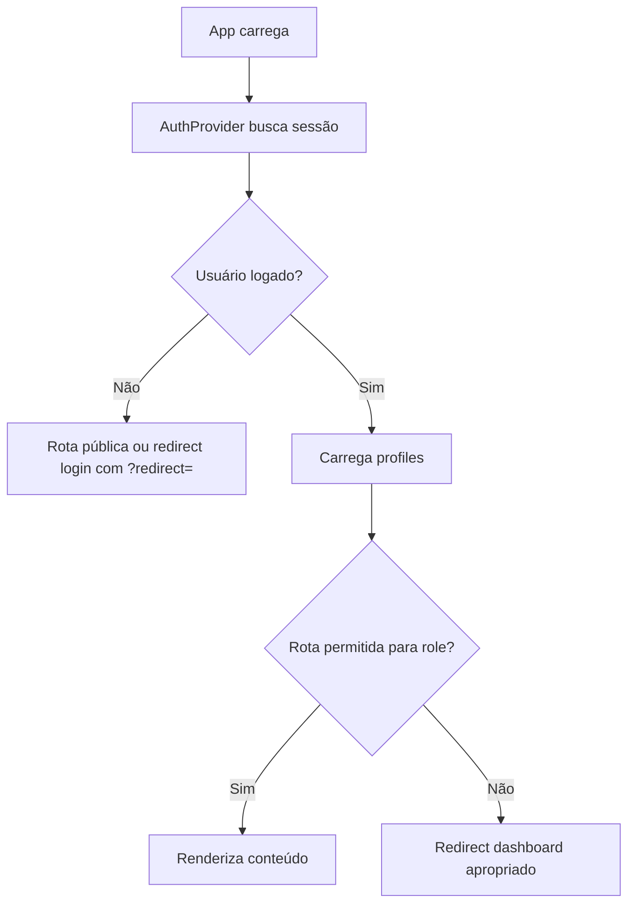

# Autenticação, sessão e guards de rota

## 1. Resumo executivo

- **O que é:** módulo responsável por **login**, **cadastro** (cliente e profissional), **recuperação/redefinição de senha**, **estado de sessão** (`AuthProvider`) e **proteção de rotas** (`ProtectedRoute`, `GuestOnlyRoute`).
- **Problema que resolve:** saber **quem é o usuário**, qual o **papel** e **bloquear ou redirecionar** acessos indevidos.
- **Quem usa:** todos; visitantes em fluxos de entrada.
- **Resultado esperado:** sessão Supabase válida + linha em `profiles` para usuários completos.

## 2. Objetivo de negócio

- **Finalidade:** porta de entrada segura e base para autorização no banco (RLS).
- **Valor:** reduz fraude e acesso cruzado entre papéis.
- **Impacto:** sem auth, dashboard e operações de pedido/proposta não funcionam.
- **Contexto:** transversal a toda a Renovi.

## 3. Localização na plataforma

| Rota | Tela |
|------|------|
| `/login` | Login |
| `/cadastro/cliente` | Cadastro cliente |
| `/cadastro/profissional` | Cadastro prestador |
| `/esqueceu-senha` | Esqueci senha |
| `/recuperar-senha` | Redefinir senha (token) |
| `/dashboard/*` | Requer auth + papéis conforme aninhamento |

Arquivos: `src/features/auth/components/*`, `routeGuards.tsx`, `useAuth.tsx`.

## 4. Perfis envolvidos

| Papel | Acesso |
|-------|--------|
| Visitante | Telas `GuestOnlyRoute` até logar |
| Cliente / Prestador | Dashboard conforme matriz em `perfis-e-permissoes.md` |
| Admin | Redirecionamento previsto no código, **sem rotas admin mapeadas** |

**Ações bloqueadas:** papel errado em rota aninhada → redirect para `getRedirectPath(profile)` ou `forbiddenRedirect`.

## 5. Fluxo funcional principal

## 6. Fluxos alternativos e exceções

- **Sessão expirada:** handler dedicado (`useSessionExpiredHandler` — evidência em estrutura do `useAuth`).
- **Redirect aberto:** `GuestOnlyRoute` só aceita paths relativos seguros (`isSafeRedirect`).
- **Cadastro:** reCAPTCHA antes de submit (`useSignupForm`).

## 7. Regras de negócio

1. `ProtectedRoute`: sem user/profile → login com retorno à URL atual.
2. `allowedRoles` definido → perfil deve estar na lista.
3. `GuestOnlyRoute`: se logado com `isAllowedRole`, redireciona para `redirect` seguro ou `getRedirectPath`.
4. `updateRole` na API de perfil **rejeita** papel `admin`.
5. Triggers no banco impedem escalação indevida a `admin` e certas trocas de papel.

## 8. Campos e dados (cadastro / identidade — visão resumida)

**Evidência parcial:** campos exatos variam entre `ClientSignup`, `ProviderSignup` e `InlineClientSignupFields`. Para detalhamento campo a campo, auditoria dedicada em `components/` de signup.

| Área | Dados típicos | Onde |
|------|---------------|------|
| Login | e-mail, senha | `Login` |
| Cadastro | e-mail, senha (política), nome, telefone, papel | Signup components |
| Reset | e-mail ou nova senha conforme fluxo Supabase | Forgot/Reset |

## 9. Validações de front-end

- `validatePasswordStrength` e regras associadas (`passwordPolicy`).
- Schemas Zod em signup (`clientSignupIdentitySchema` usado também no pedido de orçamento).

## 10. Validações de back-end

- Supabase Auth (políticas de senha, confirmação de e-mail).
- Triggers em `profiles` na criação/atualização.

## 11. Status, estados e transições

| Estado | Significado |
|--------|-------------|
| loading | `AuthProvider` ainda buscando sessão/perfil |
| autenticado | `user` + `profile` presentes |
| não autenticado | `user` nulo |

Transição: eventos `onAuthStateChange` do Supabase.

## 12. Persistência

- `auth.users` + `profiles` (1:1 por id).
- Metadados de signup podem alimentar trigger `handle_new_user` (migrations).

## 13. Integrações

- **reCAPTCHA** (`verify-recaptcha` Edge) no cadastro.
- **E-mail** Auth (reset/confirmação).

## 14. Listagens, buscas e filtros

- N/A para este módulo central.

## 15. Ações disponíveis

| Ação | Quem | Resultado |
|------|------|-----------|
| signIn | Visitante | Sessão |
| signUp | Visitante | Usuário + fluxo confirmação |
| signOut | Logado | Fim de sessão |
| reset password | Visitante | E-mail de recuperação |
| refreshProfile | Logado | Atualiza cache local do perfil |

## 16. Dependências

- Supabase client; Sentry breadcrumbs em redirects.

## 17. Regras implícitas

- `getRedirectPathForProfile` centraliza destino pós-login — deve estar alinhado ao `router.tsx` (hoje há lacunas — ver pendências).

## 18. Riscos

- Destinos `/admin/dashboard`, `/onboarding`, `/dashboard/client` inconsistentes com rotas.
- Admin no banco sem UI pode gerar incidentes de suporte.

## 19. Evidências

- `src/features/auth/components/routeGuards.tsx`
- `src/features/auth/hooks/useAuth.tsx`
- `src/features/auth/api/auth.api.ts`, `profile.api.ts`
- `src/features/auth/utils/passwordPolicy.ts`
- `src/router.tsx`
- `supabase/migrations/20260224140000_restrict_role_admin_security.sql`

## 20. Pendências

- Implementar ou remover rotas de redirect órfãs.
- Documento separado de **campos por tela** de signup se produto exigir nível formulário detalhado.
