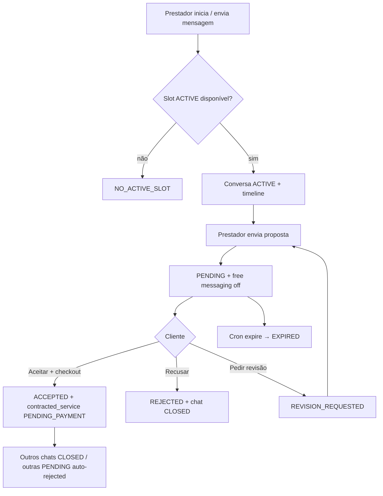

# Conversas e negociação (CNS — `chats` + `negotiation-proposals`)

Documentação de negócio baseada em `src/features/chats/`, `src/features/negotiation-proposals/`, Edge `chat-upload-media`, RPCs CNS e migrations `202607*` / `202608*`. Idioma: português (Brasil).

---

## 1. Leitura para negócio

- **Para que serve:** canal **in-app** de negociação entre **cliente** e **prestador** por pedido (`service_request`), com timeline de mensagens tipadas, **propostas** versionadas, aceite com **data/turno + checkout de pagamento**, e notificações via Message Dispatcher.
- **Quem usa:** cliente e prestador autenticados **participantes** da conversa (ou do pedido, no sheet de orçamentos).
- **Quem não usa:** visitante; admin sem mutação de produto via RPCs autenticadas (RLS de leitura operacional em algumas tabelas).
- **Valor:** thread única auditável por par cliente–prestador; limita **slots** de conversas ativas por pedido; bloqueia mensagem livre enquanto há proposta `PENDING`; contrata via aceite + agenda de cobrança.
- **Riscos de suporte:** composer bloqueado com proposta pendente; conversa `INACTIVE` por reciprocidade; aceite encerra conversas de **outros** prestadores e marca o pedido como `COMPLETED` com serviço `PENDING_PAYMENT`.

---

## 2. Visão geral funcional

| Aspecto | Detalhe |
|---------|---------|
| Rotas | `/dashboard/chats`, `/dashboard/chats/:chatId` — `ProtectedRoute` `client` + `provider` |
| Lista / thread | Feature `chats`: `ChatListPage`, `ChatScreen`, RPCs `list_conversations`, `list_chat_messages`, `cns_send_message`, etc. |
| Embutida no detalhe do serviço | `ServiceRequestConversationList` (+ `ServiceRequestConversationRow`) — content-only; shell/título na `ServiceDetailSection` de `view-services` (cliente, negociação sem contrato) |
| Propostas | Feature `negotiation-proposals`: composer, aceite/recusa/revisão, sheet comparar orçamentos |
| Aceite | Dialog slot → checkout (`payments`) → RPC `accept_proposal` (payload de pagamento obrigatório) |
| Mídia | Edge `chat-upload-media` + sessão `cns_create_media_upload_session` / bucket `chat-media` |
| Async | Crons de reciprocidade e `expire_pending_proposals`; MMD para push/e-mail |
| Constantes (servidor) | `chats.max_active_slots_per_service_request` (padrão **4**), `chats.proposal_response_sla_hours` (padrão **24**), `chats.reciprocity_window_hours` (padrão **24**), `chats.message_rate_limit_per_minute` (padrão **30**) |

---

## 3. Features do módulo

| Documento | Conteúdo |
|-----------|----------|
| [features/conversas-e-negociacao.md](./features/conversas-e-negociacao.md) | Inbox, thread, composer, mídia, slots, free messaging, realtime, banners, matriz de ações |
| [features/propostas-negociacao.md](./features/propostas-negociacao.md) | Composer, FSM de proposta, aceite→pagamento/CNS, recusa, revisão, countdown SLA |
| [features/comparar-orcamentos-meus-servicos.md](./features/comparar-orcamentos-meus-servicos.md) | Sheet `ReceivedBudgetDetailsSheet` (compare/history) em Meus Serviços / view-services |

**Fora deste módulo (só cross-link):** reagendamento pós-contrato em [service-reschedule](../service-reschedule/README.md) — cards/dialogs no chat; não reescritos aqui.

---

## 4. Perfis envolvidos

| Papel | Pode |
|-------|------|
| **Cliente** do pedido | Ler/escrever na conversa (se free messaging); aceitar / recusar / pedir revisão; fechar conversa; sheet comparar orçamentos |
| **Prestador** da conversa | Ler/escrever; iniciar conversa (quando aplicável); enviar/revisar proposta; fechar conversa; propor reagendamento (pós-contrato) |
| **Outros prestadores** no mesmo pedido | Conversas separadas (cada uma consome slot na admissão) |
| **Sistema** | Expirar propostas `PENDING`; inativar por reciprocidade; fechar chats de concorrentes no aceite |

---

## 5. Principais fluxos

1. **Negociar no chat** — lista → thread → mensagens / mídia / banners.
2. **Propor** — composer (`create_provider_proposal`) espelha mensagem `PROPOSAL`.
3. **Aceitar** — slot → checkout → `accept_proposal` → serviço + `payment_schedules` `SCHEDULED`.
4. **Comparar orçamentos** — sheet no pedido sem precisar abrir cada chat.

---

## 6. Regras transversais

- **Slot de admissão:** até `chats.max_active_slots_per_service_request` conversas ACTIVE por pedido (`service_request_negotiation_stats.active_chat_count`).
- **Free messaging:** bloqueado se existe proposta `PENDING` na conversa (`cns_chat_free_messaging_allowed`).
- **SLA de resposta do cliente:** `chats.proposal_response_sla_hours` (padrão 24h) — servidor; UI usa `expires_at` das RPCs de detalhe (fallback local 24h só para exibição).
- **Reciprocidade:** janela `chats.reciprocity_window_hours`; sem bilateral → `INACTIVE` / `NO_RECIPROCITY` (libera slot).
- **Idempotência:** mutations críticas usam `rpc_idempotency_records` (ex.: `chats.accept_proposal`, `chats.submit_proposal`).
- **Pagamento no aceite:** cartão, parcelas HMAC, ClearSale session e pricing signature obrigatórios.

---

## 7. Entidades

| Entidade | Papel |
|----------|-------|
| `chats` | Conversa 1:1 por `(service_request, client, provider)` — status `ACTIVE` / `INACTIVE` / `CLOSED` |
| `chat_messages` | Timeline tipada (`TEXT`, `IMAGE`, `AUDIO`, `SYSTEM`, `PROPOSAL`, `WORKFLOW_ACTION`) |
| `chat_media_upload_sessions` | Sessão de upload antes da Edge |
| `provider_proposals` | Proposta versionada + FSM |
| `service_request_negotiation_stats` | Contador de slots ACTIVE |
| `contracted_services` | Criado no aceite (`PENDING_PAYMENT`) |
| `payment_schedules` | Agenda de cobrança (`SCHEDULED`) no aceite |

---

## 8. Integrações

| Módulo / sistema | Relação |
|------------------|---------|
| [negotiation-proposals](./features/propostas-negociacao.md) | Composer, dialogs, sheet, mutations |
| [payments](../payments/README.md) | Checkout no aceite; dono de `acceptProposalWithPayment` em `checkout.api.ts` |
| [message-dispatcher](../message-dispatcher/README.md) | Entrega push/e-mail de eventos CNS |
| [my-services](../my-services/README.md) / [view-services](../view-services/README.md) | Entry points do sheet e composer no detalhe; detalhe hospeda lista embutida `ServiceRequestConversationList` |
| [service-reschedule](../service-reschedule/README.md) | Pós-contrato: cards/`WORKFLOW_ACTION` no chat |
| [matching-dispatch](../matching-dispatch/README.md) | Aceite → `DISPATCH_MATCHED`, revoga visibility, cancela MMD pending |
| Edge `chat-upload-media` | Upload imagem/áudio |

---

## 9. Riscos e lacunas

- Contador de slots é **porta de admissão**, não inventário estrito após reativações (design §3.3.1 / evidência em migrations de stats).
- Reciprocidade bilateral na probe SQL usa `TEXT` / `IMAGE` / `PROPOSAL` — **AUDIO sozinho pode não contar** (evidência parcial: `cns_has_bilateral_reciprocity`).
- `decline_revision_request` existe na API/RPC; **UI de consumidor não encontrada** em `src/`.
- Navigate pós-aceite: toast + invalidação + fecha dialog — **sem redirect explícito** no `AcceptProposalDialog`.
- Typing indicator: evolução em `docs/chats/tasks.md` (não documentado como produto completo aqui).

---

## 10. Evidências

| Área | Paths |
|------|-------|
| UI conversas | `src/features/chats/components/` (incl. `ServiceRequestConversationList/`), `hooks/`, `api/chats.api.ts`, `api/chats.rpc.ts` |
| UI propostas | `src/features/negotiation-proposals/` |
| Router / menu | `src/router.tsx`, `dashboardMenu.ts`, `mobileNavigation.config.ts` |
| Edge mídia | `supabase/functions/chat-upload-media/` |
| Aceite + pagamento | `supabase/migrations/20260801880000_cns_slot_minimum_start_date_tomorrow.sql` (`accept_proposal`) |
| Constantes | `supabase/migrations/20260701100900_cns_platform_constants_seeds.sql` |
| Design técnico | `docs/chats/design.md`, `docs/chats/requirements.md` |
| Testes | `supabase/tests/chats/`, `e2e/tests/chats.spec.ts`, Vitest em ambas features |
