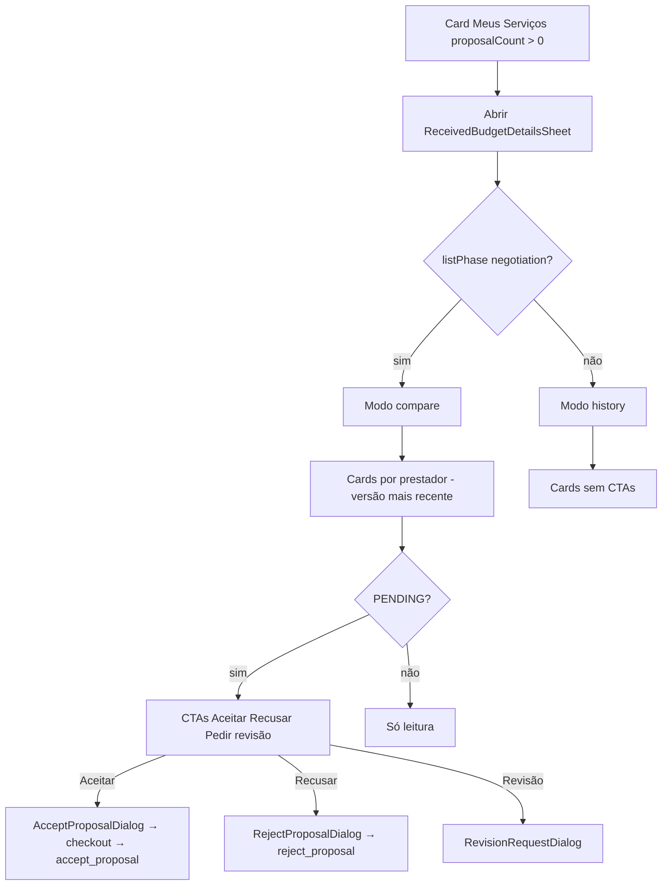

# Comparar orçamentos / histórico (sheet em Meus Serviços)

Documentação baseada em `ReceivedBudgetDetailsSheet` e API de compare em `src/features/negotiation-proposals/`, consumidos por **`my-services`** e **`view-services`** via Public API. Aceite/recusa/revisão canônicos: [propostas-negociacao.md](./propostas-negociacao.md).

---

## 1. Resumo executivo

Sheet lateral que lista propostas recebidas de um pedido para o **cliente** comparar (`listPhase === negotiation`) ou consultar histórico (demais fases). Em modo compare, CTAs **Aceitar / Recusar / Pedir revisão** abrem os mesmos dialogs do CNS (incluindo checkout no aceite).

## 2. Objetivo de negócio

Permitir decisão entre prestadores **sem abrir cada conversa**, mantendo as mesmas regras de negócio do aceite/recusa/revisão da feature de propostas.

## 3. Localização na plataforma

| Item | Detalhe |
|------|---------|
| Componente | `ReceivedBudgetDetailsSheet` |
| Onde abre | Card em Meus Serviços (`ClientMyServicesPage` / card) quando há propostas; também superfícies `view-services` que importam o sheet |
| Rota dedicada | **Não** — substitui listagem antiga `client-budgets` |
| Query / deep link próprio | Nenhum documentado no sheet |
| Modo | Derivado de `listPhase` (`getServiceRequestBudgetSheetMode` em `view-services/utils/serviceRequestBudgetAction.ts`) |

## 4. Perfis envolvidos

| Papel | Pode |
|-------|------|
| Cliente dono do pedido | Abrir sheet; em `compare` + PENDING: aceitar/recusar/revisão |
| Prestador | Não é usuário deste sheet |
| Visitante / outros | Sem acesso |

## 5. Fluxo funcional principal

## 6. Fluxos alternativos e exceções

| Cenário | Comportamento |
|---------|---------------|
| Loading | Skeletons no corpo do sheet |
| Erro de carga | Alert + “Tentar novamente” |
| Sem propostas | Empty copy distinta compare vs history |
| History | Sem `onProposalAction` — somente visualização |
| Fechar dialog aceitar/recusar/revisão | Invalida query do compare |
| Aceite com `chatId=null` | Mutation ainda roda; toast de sucesso do aceite **condicionado a chatId** (ver propostas) |
| Versões antigas | Agrupamento “latest per provider”; histórico de versões no bloco de versão quando aplicável |

## 7. Regras de negócio

1. **RN-S01** `listPhase === "negotiation"` → modo `compare`; senão → `history` (`getServiceRequestBudgetSheetMode`). **Não** usar status legado `open` do pedido.
2. **RN-S02** Título/label do botão: “Comparar orçamentos” vs “Histórico de orçamentos”.
3. **RN-S03** CTAs só em `compare` **e** status da proposta PENDING (`isPendingProposalStatus`).
4. **RN-S04** CTAs = `resolveClientProposalCtas` (Aceitar, Recusar, Pedir revisão com disable no limite).
5. **RN-S05** Aceite/recusa/revisão usam dialogs canônicos CNS — mesmas RPCs e regras de [propostas-negociacao.md](./propostas-negociacao.md).
6. **RN-S06** `rejectServiceRequestBudgetProposal` **delega** a `rejectProposal` (não há RPC `reject_client_budget_proposal` ativa).
7. **RN-S07** Countdown em PENDING: banner; se RPC de compare não envia `expires_at`, fallback display 24h — expiração real no servidor.
8. **RN-S08** Sheet não cria rota `/dashboard/orcamentos`.

## 8. Campos e dados

### Detalhe carregado (`ServiceRequestBudgetCompareDetail`)

| Bloco | Campos típicos |
|-------|----------------|
| `service_request` | id, title, description, status/fase, created_at, service_title |
| `budgets[]` | id, provider_id, amounts, revision_count, status, submitted_at, description, slots, photos, nome/slug/imagem prestador |

### Labels de status no badge

| Status | Label |
|--------|-------|
| PENDING | Aguardando avaliação |
| ACCEPTED | Aceito |
| REJECTED / REJECTED_AUTOMATICALLY | Recusado |
| REVISION_REQUESTED | Revisão solicitada |
| REVISED | Orçamento revisado |
| EXPIRED | Expirado |

## 9. Validações de front-end

- Modo derivado só de `listPhase` no card (não revalida no sheet além do que a API retorna).
- CTAs condicionados a `sheetMode === "compare"` + PENDING + handler.
- Dialogs: mesmas validações de slot/checkout/revisão da feature propostas.
- Empty/error states explícitos na UI.

## 10. Validações de back-end

| Operação | Backend |
|----------|---------|
| Carregar detalhe | Select/propostas + `getServiceById` (view-services) — ver `serviceRequestBudgetCompare.api.ts` |
| Aceitar | `accept_proposal` (via payments) |
| Recusar | `reject_proposal` |
| Revisar | `request_proposal_revision` |
| RLS | Cliente só vê propostas do próprio pedido (evidência: queries autenticadas + policies de `provider_proposals`) |

**Evidência parcial:** detalhe fino de RLS deve ser confirmado em migrations de proposals se auditoria SQL for necessária.

## 11. Status, estados e transições

- **Modo sheet:** `compare` | `history` — não é FSM; função de `listPhase` (`negotiation` → compare).
- **Proposta:** mesma FSM de [propostas-negociacao.md](./propostas-negociacao.md) §11.
- Após aceite bem-sucedido, SR → `COMPLETED` e `listPhase` deixa `negotiation` → próximo open do sheet tende a cair em **history**.

## 12. Persistência

| Camada | O quê |
|--------|-------|
| Servidor | Lê `provider_proposals` (+ profiles); mutações escrevem via RPCs CNS/payments |
| Cliente | Query key `SERVICE_REQUEST_BUDGET_COMPARE_DETAIL_QUERY_KEY` |
| Local Preferences | Nenhum draft do sheet |

## 13. Integrações

| Feature | Papel |
|---------|-------|
| `my-services` | Abre sheet no card do cliente |
| `view-services` | Pode montar sheet / compartilhar tipos de detalhe |
| `negotiation-proposals` | Dono do sheet e dialogs |
| `payments` | Checkout no AcceptProposalDialog |
| `chats` | Indireto (invalidate chats se mutation tiver chatId; sheet passa `null`) |
| `provider-profile` | Preview inline de prestador nos cards |

## 14. Listagens, buscas, filtros, paginação

| Aspecto | Comportamento |
|---------|---------------|
| Escopo | Todas as propostas do `serviceRequestId` retornadas pela API de compare |
| Agrupamento UI | Uma card por prestador = **versão mais recente** (`getLatestBudgetPerProvider` pela ordem da lista) |
| Paginação | Não — conjunto do pedido |
| Busca textual | Não |
| Ordenação | Evidência: ordem retornada pela query; latest-by-provider no cliente |

## 15. Ações disponíveis (matriz)

| Ação | Quem | Pré-condição | Resultado |
|------|------|--------------|-----------|
| Abrir sheet | Cliente | `proposalCount > 0` (card) | Sheet open |
| Fechar sheet | Cliente | — | `onOpenChange(false)` |
| Aceitar | Cliente | compare + PENDING | AcceptProposalDialog |
| Recusar | Cliente | compare + PENDING | RejectProposalDialog |
| Pedir revisão | Cliente | compare + PENDING; revision &lt; 2 | RevisionRequestDialog |
| Retry carga | Cliente | erro | refetch |
| Ações em history | — | — | Nenhuma CTA |

## 16. Dependências

- `@/features/negotiation-proposals` Public API
- `my-services` / `view-services` para entry
- Dialogs/mutations da própria feature
- UI: Sheet Radix, Alert, Skeleton

## 17. Regras implícitas

- **Não** existe botão “Aprovar orçamento” desabilitado no código atual — o CTA é **Aceitar** ativo em PENDING/compare (doc antiga estava desatualizada).
- `ServiceRequestBudgetRejectDialog` existe no código/testes mas o sheet atual usa `RejectProposalDialog`.
- Painéis `BudgetCompareGuidancePanel` / `BudgetCompareTrustPanel` só em compare (guidance) / com providers (trust).
- Ao pedir revisão a partir do Accept (datas indisponíveis), pode pré-preencher `DATE_NOT_AVAILABLE` (`buildDateUnavailableRevisionInitialValues`).

## 18. Riscos

- Cliente aceita pelo sheet sem contexto da conversa (`chatId=null`) — invalidate de chat limitado.
- Toast de sucesso do aceite pode não aparecer sem `chatId` (comportamento do hook).
- Confundir status do pedido `COMPLETED` pós-aceite com conclusão da execução do serviço.

## 19. Evidências

| Artefato | Path |
|----------|------|
| Sheet | `components/ReceivedBudgetDetailsSheet.tsx` |
| Card prestador / CTAs | `BudgetCompareProviderCard.tsx` |
| Modos | `constants/serviceRequestBudgetSheet.ts` |
| API | `api/serviceRequestBudgetCompare.api.ts` |
| Dialogs bridge | `hooks/useServiceRequestBudgetProposalDialogs.ts` |
| Hook detalhe | `hooks/useServiceRequestBudgetCompareDetail.ts` |
| Consumer | `src/features/my-services/...`, imports em `view-services` |
| Public API | `index.ts` (exports ReceivedBudget* / fetch / reject) |
| Testes | `BudgetCompareComponents.test.tsx`, API tests |

## 20. Pendências

- Confirmar todos os entry points `view-services` vs só my-services (há imports; lista completa de telas = evidência parcial se não inventariada tela a tela).
- Destino UX pós-aceite pelo sheet (toast/navigate).
- Remoção ou wiring de `ServiceRequestBudgetRejectDialog` órfão.
- Transversais: mapa/matriz — fora deste escopo.

## 21. Anexo — modos e cópias

| `listPhase` | Modo | Título sheet | Label botão card |
|------------|------|--------------|------------------|
| `negotiation` | `compare` | Comparar orçamentos | Comparar orçamentos |
| demais (`in_progress`, `completed`, `cancelled`, …) | `history` | Histórico de orçamentos | Histórico de orçamentos |

Empty:

| Modo | Mensagem |
|------|----------|
| compare | “Este pedido ainda não possui orçamentos ativos para comparação.” |
| history | “Este pedido ainda não possui orçamentos registrados.” |

## 22. Anexo QA

| # | Cenário | Esperado |
|---|---------|----------|
| Q1 | `listPhase=negotiation` com 2 PENDING | Compare + CTAs em ambos |
| Q2 | `listPhase` ≠ negotiation (ex. in_progress/completed) | History sem CTAs |
| Q3 | Aceitar no sheet | Checkout → serviço contratado |
| Q4 | Recusar | Status Recusado; refetch |
| Q5 | Pedir 3ª revisão | CTA disabled |
| Q6 | Erro rede no load | Alert + retry |
| Q7 | Zero propostas | Empty state |

## 23. Cross-links

- [propostas-negociacao.md](./propostas-negociacao.md)
- [conversas-e-negociacao.md](./conversas-e-negociacao.md)
- [../my-services/README.md](../my-services/README.md)
- [../payments/features/checkout-e-cobranca.md](../payments/features/checkout-e-cobranca.md)
