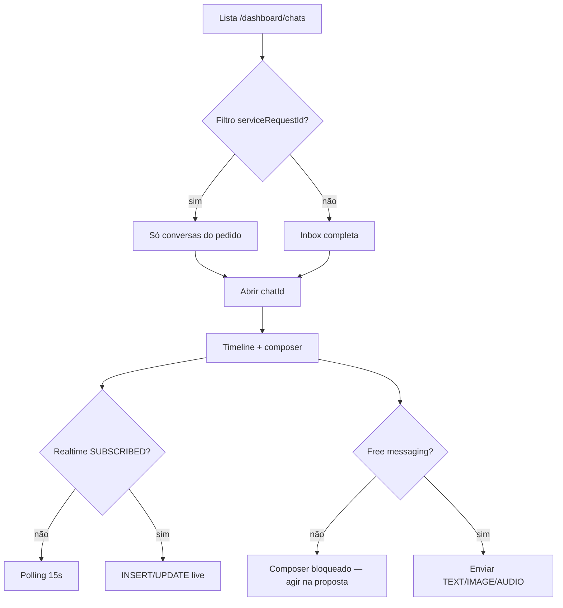

# Conversas e negociação (CNS — thread e inbox)

Documentação baseada em `src/features/chats/`, Edge `chat-upload-media`, RPCs CNS e constants de plataforma. Propostas (composer/aceite) detalhadas em [propostas-negociacao.md](./propostas-negociacao.md).

---

## 1. Resumo executivo

Inbox e tela de conversa do CNS: listagem paginada por cursor, thread com mensagens tipadas, composer com gate de **mensagem livre**, upload de mídia, realtime + polling de fallback, banners de ação e encerramento manual. A conversa é o canal operacional da negociação; o contrato nasce no aceite da proposta (outra feature do módulo).

## 2. Objetivo de negócio

Dar a cliente e prestador um **único fio** por pedido e par, com regras que forçam resposta na proposta pendente, limitam conversas ativas concorrentes e mantêm auditabilidade (tipos de mensagem, fechamento tipado, system messages).

## 3. Localização na plataforma

| Superfície | Detalhe |
|------------|---------|
| Lista | `/dashboard/chats` — `ChatListPage` dentro de `ChatsLayout` |
| Thread | `/dashboard/chats/:chatId` — `ChatsConversationRoute` → `ChatScreen` |
| Guard | `ProtectedRoute` `allowedRoles={['client','provider']}` (`src/router.tsx`) |
| Query | `?serviceRequestId=<uuid>` — filtra lista (`CHAT_SERVICE_REQUEST_FILTER_QUERY`) |
| Menu | Item “Conversas” → `/dashboard/chats` (`dashboardMenu.ts`) |
| Mobile chrome | Lista: tab-root; conversa: `mode: "custom"` (header da feature, sem bottom nav) |
| Entry points externos | Detalhe do serviço / botão chat contratado; deep links de notificação para `/dashboard/chats/{id}` |

## 4. Perfis envolvidos

| Papel | Neste fluxo |
|-------|-------------|
| Cliente participante | Lista próprias conversas; lê/escreve; marca lido; fecha; CTAs de proposta (via dialogs) |
| Prestador participante | Idem; inicia conversa quando a superfície de detalhe permite; banners de enviar/revisar proposta |
| Não participante | RPCs retornam `NOT_A_PARTICIPANT` / conversa não listada |
| Admin | Sem mutação CNS autenticada de produto documentada aqui |

## 5. Fluxo funcional principal

## 6. Fluxos alternativos e exceções

| Cenário | Comportamento |
|---------|---------------|
| Inbox vazia | “Nenhuma conversa ainda” |
| Filtro sem resultados | “Nenhuma conversa para este pedido” + banner “Ver todas” |
| Conversa `CLOSED` | Composer off; sem action banner |
| Conversa `INACTIVE` | Composer on se free messaging; helper “Envie uma mensagem para retomar…” |
| Proposta `PENDING` | Free messaging off; copy diferenciada cliente vs prestador |
| Realtime caído | Polling fallback 15s (mín. 5s) só na conversa aberta |
| Push com chat aberto | Supressão se foreground + mesmo `chatId` |
| Offline no envio | Tratamento via hooks/toasts (erros de rede mapeados) |
| Rate limit | `RATE_LIMITED` + eventual `retryAfterSeconds` |
| Slot esgotado ao iniciar | `NO_ACTIVE_SLOT` |
| Pedido não `OPEN` | `SR_NOT_OPEN` em mutações de mensagem/initiate |

## 7. Regras de negócio

1. **RN-C01** Uma conversa por trio lógico pedido + cliente + prestador (persistência em `chats`).
2. **RN-C02** Admissão ACTIVE limitada por `chats.max_active_slots_per_service_request` (padrão **4**).
3. **RN-C03** Sem mensagem livre se existe proposta `PENDING` (`cns_chat_free_messaging_allowed`).
4. **RN-C04** `CLOSED` impede composer e banners de ação.
5. **RN-C05** `INACTIVE` por `NO_RECIPROCITY` após janela sem bilateral; reativação por mensagem válida **não** reconsume slot (design/migrations de stats).
6. **RN-C06** Rate limit mensagens: `chats.message_rate_limit_per_minute` (padrão **30**).
7. **RN-C07** Envio usa idempotência por chave na mensagem (`idempotency_key` / UNIQUE chat+sender+key).
8. **RN-C08** Upload de mídia exige sessão válida + free messaging; Edge valida MIME/tamanho.
9. **RN-C09** Mark-read automático com debounce (~400ms) via `cns_mark_conversation_read`.
10. **RN-C10** Banner “Enviar proposta” (prestador) só após troca mínima TEXT/IMAGE (prestador enviou e cliente respondeu depois).
11. **RN-C11** Banner “Encerrar conversa” se `ACTIVE` e `last_interaction_at` ≥ **12h**.
12. **RN-C12** Welcome discovery na timeline é **somente UI** (não persiste `SYSTEM`).

## 8. Campos e dados

### Lista (`ConversationListItem` — shape via RPC)

| Campo relevante | Uso |
|-----------------|-----|
| `id` | Navegação `:chatId` |
| `status` | Badge / dim |
| `last_interaction_at` | Ordenação + banner fechar |
| Counterparty / service summary | Título e subtítulo do item |
| Unread / last message preview | UX da inbox |

### Mensagem (`ChatMessageListItem`)

| Campo | Uso |
|-------|-----|
| `message_type` | Render (bolha vs dynamic) |
| `payload` | Texto, paths de mídia, metadados |
| `linked_entity_type` / `id` | Proposta / reschedule / SR |
| `delivery_status` | Meta de entrega/leitura |
| `sender_user_id` | Alinhamento bolha / system null |

### Composer

| Input | Limite / nota |
|-------|----------------|
| Texto | Moderação no envio (utils de composer) |
| Imagens | Até **5**; ≤ **5 MB** cada; JPEG/PNG/WebP/HEIC/HEIF |
| Áudio | **1** arquivo; ≤ ~2,2 MB; duração **1–120 s** |

## 9. Validações de front-end

- Composer: `deriveChatComposerState` — loading, `CLOSED`, `!freeMessagingAllowed`.
- Imagens: `chatImageValidation` alinhado à Edge.
- Áudio: `chatAudioConstants` (duração/bytes).
- Filtro SR: query string parseada em `useChatListServiceRequestFilter`.
- Banner elegibilidade: `hasMinimumProviderClientExchange`, `isChatInactiveForCloseBanner`.

## 10. Validações de back-end

| Gate | Onde |
|------|------|
| Participante | RPCs CNS |
| Pedido aberto | `SR_NOT_OPEN` |
| Slot | `NO_ACTIVE_SLOT` |
| Free messaging | `FREE_MESSAGING_DISABLED_PROPOSAL_PENDING` |
| Conversa fechada | `CONVERSATION_CLOSED` |
| Rate limit | `RATE_LIMITED` |
| Sessão upload | `cns_create_media_upload_session` + `cns_validate_upload_session` |
| Edge | MIME, bytes, rate 30/min, magic bytes áudio |

## 11. Status, estados e transições

### Conversa (`cns_conversation_status`)

| Status | Significado | UI |
|--------|-------------|-----|
| `ACTIVE` | Negociação em curso | Lista sem badge “Ativa” |
| `INACTIVE` | Sem reciprocidade no prazo | Badge “Inativa”; pode retomar |
| `CLOSED` | Terminal | “Encerrada”; composer off |

### Closure (`cns_closure_type`)

| Valor | Origem típica |
|-------|----------------|
| `MANUAL` | `cns_close_conversation` |
| `PROPOSAL_ACCEPTED_ELSEWHERE` | Aceite de outra proposta no mesmo pedido |
| `PROPOSAL_REJECTED` | Recusa de proposta |
| `SERVICE_REQUEST_CANCELLED` | Cancelamento do pedido |
| `CONTRACTED_SERVICE_CANCELLED` | Cancelamento do serviço contratado |

### Inativação

| Motivo | Valor |
|--------|-------|
| Sem reciprocidade | `NO_RECIPROCITY` |

### Tipos de mensagem

`TEXT` | `IMAGE` | `AUDIO` | `SYSTEM` | `PROPOSAL` | `WORKFLOW_ACTION`

## 12. Persistência

| Camada | O quê |
|--------|-------|
| Servidor | `chats`, `chat_messages`, `chat_media_upload_sessions`, stats de negociação |
| Storage | Bucket `chat-media` |
| Cliente | React Query keys (`CHAT_*_QUERY_KEY`); sem draft de mensagem documentado como Preferences |
| Idempotência mensagem | UNIQUE `(chat_id, sender_user_id, idempotency_key)` |

## 13. Integrações

| Sistema | Uso |
|---------|-----|
| Realtime Supabase | Canal conversa + inbox |
| Edge `chat-upload-media` | Upload multipart |
| `negotiation-proposals` | Cards/dialogs na rota de conversa |
| `service-reschedule` | Cards `WORKFLOW_ACTION` / dialogs (cross-link) |
| Message Dispatcher | Notificações; push suppression no cliente |
| Sentry / Analytics | Contexto de chat + eventos de proposta |

## 14. Listagens, buscas, filtros, paginação

| Aspecto | Evidência |
|---------|-----------|
| RPC | `list_conversations` |
| Paginação | Cursor `{ last_interaction_at, id }`; page size padrão **20** |
| Filtro | `p_service_request_id` opcional |
| UI | Botão “Carregar mais”; banner de filtro ativo |
| Mensagens | `list_chat_messages` keyset “mais antigas” |

## 15. Ações disponíveis (matriz por papel)

| Ação | Cliente | Prestador | Pré-condição | Resultado / erro |
|------|---------|-----------|--------------|------------------|
| Listar conversas | sim | sim | autenticado | páginas / empty |
| Abrir thread | sim | sim | participante | detail + messages |
| Filtrar por pedido | sim | sim | query válida | subset |
| Enviar TEXT/IMAGE/AUDIO | sim | sim | free messaging; não CLOSED | mensagem / erros §19 |
| Upload mídia | sim | sim | sessão + free messaging | paths → send |
| Marcar lido | sim | sim | mensagem válida | `cns_mark_conversation_read` |
| Encerrar conversa | sim | sim | não CLOSED; confirm | `CLOSED` / `MANUAL` |
| Iniciar conversa | — | sim* | SR aberto + slot | `cns_initiate_conversation` (*entry em view-services) |
| Banner Ver proposta | sim | sim | PENDING | abre detalhe/dialog |
| Banner Enviar proposta | — | sim | ACTIVE + troca mínima + sem PENDING/ACCEPTED/REVISION_REQUESTED | abre composer |
| Banner Revisar proposta | — | sim | `REVISION_REQUESTED` | composer edit |
| Banner Propor nova data | — | sim | reschedule elegível | dialog service-reschedule |
| Banner Encerrar | sim | sim | ACTIVE + 12h idle | close mutation |

## 16. Dependências

- `auth` (perfil/role)
- `negotiation-proposals` (dialogs/composer na rota)
- `payments` (indireto via aceite)
- `service-reschedule` (pós-contrato)
- `view-services` / `my-services` (navegação para chats)
- `lib/supabase`, React Query, Capacitor (push/App state)

## 17. Regras implícitas

- Welcome não grava no banco.
- Polling **não** substitui inbox realtime — só conversa aberta se canal não `SUBSCRIBED`.
- Prioridade de banners: revision (300) > propose_reschedule (250) > send_proposal (200) > view_proposal (100) > close (50); um banner por vez.
- Dismiss de banner é **por visita** ao chat (estado local).
- Reciprocidade: probe bilateral **sem** `AUDIO` nas migrations encontradas — áudio isolado pode não evitar `INACTIVE`.
- Aceite **não** fecha o chat do prestador vencedor; fecha os dos concorrentes.

## 18. Riscos

- Usuário interpreta composer bloqueado como “bug” — copy de PENDING deve ser clara.
- Contador de slots ≠ contagem física pós-reativação (edge cases de suporte).
- Race: expire de proposta vs ação do cliente no mesmo instante.
- Duplo envio mitigado por idempotency key no cliente.

## 19. Evidências

| Tema | Path |
|------|------|
| Rotas | `src/router.tsx`, `constants/routes.ts` |
| Layout | `ChatsLayout.tsx`, `ChatsConversationRoute.tsx` |
| Lista | `ChatListPage.tsx`, `useChatConversations.ts` |
| Thread | `ChatScreen.tsx`, `ChatTimeline.tsx`, `DynamicMessageRenderer.tsx` |
| Composer | `composerState.ts`, `useChatComposerState.ts` |
| API | `chats.api.ts`, `chats.rpc.ts`, `chatMedia.api.ts`, `realtime.api.ts` |
| Erros UI | `chatApiErrors.ts` |
| Banner | `chatActionBannerState.ts`, `chatActionBannerEligibility.ts` |
| Push | `pushNotificationSuppression.ts` |
| Edge | `supabase/functions/chat-upload-media/constants.ts` |
| Constants SQL | `20260701100900_cns_platform_constants_seeds.sql` |
| Free messaging | `20260701102400_create_cns_chat_free_messaging_allowed.sql` |
| Design | `docs/chats/design.md` |

### Erros CNS → mensagem UI

| Código | Mensagem |
|--------|----------|
| `FREE_MESSAGING_DISABLED_PROPOSAL_PENDING` | Envie ou responda à proposta antes de continuar a conversa. |
| `NO_ACTIVE_SLOT` | Limite de conversas ativas atingido para este pedido. |
| `SR_NOT_OPEN` | Este pedido não está mais aberto para negociação. |
| `CONVERSATION_CLOSED` | Esta conversa foi encerrada. |
| `CONVERSATION_NOT_FOUND` | Conversa não encontrada. |
| `NOT_A_PARTICIPANT` | Você não participa desta conversa. |
| `INVALID_MESSAGE_ID` | Mensagem inválida para marcar como lida. |
| `RATE_LIMITED` | Muitas mensagens em pouco tempo. Aguarde um instante. |
| `REVISION_LIMIT_EXCEEDED` | Limite de revisões de proposta atingido. |
| `PROPOSAL_EXPIRED` | Esta proposta expirou. |
| `UNKNOWN` | message do servidor ou “Não foi possível concluir a operação.” |

## 20. Pendências

- Typing indicator: ver `docs/chats/tasks.md` (não produto completo).
- Inclusão de `AUDIO` na reciprocidade: evidência parcial / possível gap.
- Atualização de documentos transversais (`02-mapa`, glossário, matriz) — fora deste escopo (worker transversal).

## 21. Anexo QA — cenários sugeridos

| # | Cenário | Esperado |
|---|---------|----------|
| Q1 | Abrir lista autenticado | Inbox ou empty |
| Q2 | Filtro `serviceRequestId` | Banner + subset |
| Q3 | PENDING no chat | Composer bloqueado; CTAs na proposta |
| Q4 | Enviar texto com PENDING | Erro free messaging |
| Q5 | Upload 6ª imagem | Bloqueio limite 5 |
| Q6 | Áudio > 120s | Bloqueio cliente/servidor |
| Q7 | Fechar conversa | CLOSED + composer off |
| Q8 | 12h idle | Banner encerrar |
| Q9 | Realtime off | Polling 15s atualiza |
| Q10 | Chat aberto + push | Push suprimido |
| Q11 | Prestador sem reply do cliente | Sem banner enviar proposta |
| Q12 | Slot cheio initiate | `NO_ACTIVE_SLOT` |

## 22. Cross-links

- [propostas-negociacao.md](./propostas-negociacao.md)
- [comparar-orcamentos-meus-servicos.md](./comparar-orcamentos-meus-servicos.md)
- [../service-reschedule/README.md](../service-reschedule/README.md)
- [../message-dispatcher/README.md](../message-dispatcher/README.md)
