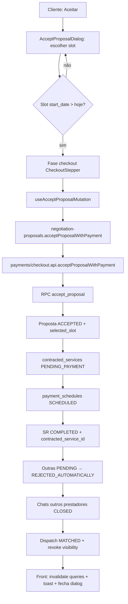
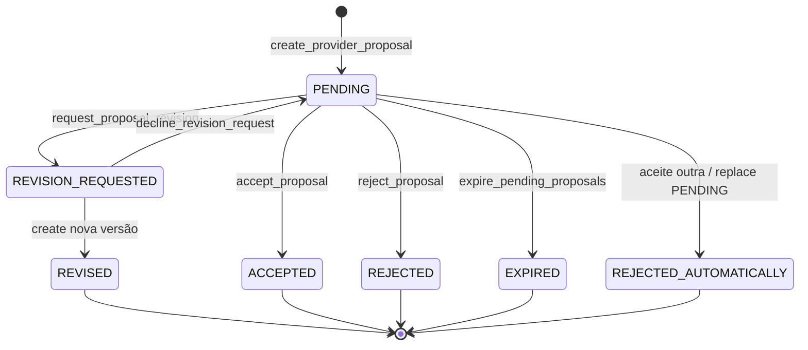

# Propostas de negociação (composer, aceite, revisão)

Documentação baseada em `src/features/negotiation-proposals/`, RPC `accept_proposal` / `create_provider_proposal` / `reject_proposal` / `request_proposal_revision`, e integração com `payments` (checkout). Thread/inbox: [conversas-e-negociacao.md](./conversas-e-negociacao.md).

---

## 1. Resumo executivo

Feature que formaliza o **orçamento versionado** do prestador e as respostas do cliente (aceitar com pagamento, recusar, pedir revisão). O aceite cria `contracted_services` em `PENDING_PAYMENT`, agenda `payment_schedules` em `SCHEDULED`, fecha conversas de concorrentes e marca o pedido como `COMPLETED`.

## 2. Objetivo de negócio

Converter a conversa em **contrato + cobrança agendada**, com limites de revisão, SLA de resposta do cliente e rejeição automática das demais propostas pendentes no mesmo pedido.

## 3. Localização na plataforma

| Superfície | Entrada |
|------------|---------|
| Chat | Card `PROPOSAL` (`DynamicProposalCard`); banners; dialogs na `ChatsConversationRoute` |
| Detalhe do serviço (prestador) | `ServiceProviderProposalSection` / composer |
| Meus Serviços (prestador) | `ProposalComposerDialog` via hooks da feature |
| Meus Serviços / view-services (cliente) | Sheet comparar — ver [comparar-orcamentos-meus-servicos.md](./comparar-orcamentos-meus-servicos.md) |
| Rota própria | Nenhuma — embutida |
| Public API | `src/features/negotiation-proposals/index.ts` |

**Nota:** `provider-jobs` **não** importa esta feature no código atual (entrada via chats / my-services / view-services).

## 4. Perfis envolvidos

| Papel | Ações |
|-------|-------|
| Prestador | Criar proposta; editar após `REVISION_REQUESTED`; ver countdown; (API) `decline_revision_request` — **UI ausente** |
| Cliente | Aceitar (+ checkout); recusar; pedir revisão (até limite) |
| Sistema | Expirar `PENDING`; auto-`REJECTED_AUTOMATICALLY` no aceite ou substituição de PENDING |

## 5. Fluxo funcional principal — aceitar proposta → pagamento / CNS

## 6. Fluxos alternativos e exceções

| Cenário | Comportamento |
|---------|---------------|
| Recusar | `reject_proposal` → `REJECTED`; chat pode fechar com `PROPOSAL_REJECTED` |
| Pedir revisão | `request_proposal_revision` → `REVISION_REQUESTED`; free messaging volta |
| Prestador reenvia | Anterior `REVISED` (se vinha de revisão) ou `REJECTED_AUTOMATICALLY` se substituía `PENDING`; nova `PENDING` |
| Limite de revisões | Front desabilita CTA; back `REVISION_LIMIT_EXCEEDED` se `revision_count >= 2` |
| SLA estourado | Cron `expire_pending_proposals` → `EXPIRED`; aceite também rejeita se já passou SLA |
| Offline no aceite | Toast “Você está offline…” |
| Pricing mudou | `PROPOSAL_PRICING_INVALID` |
| Prestador sem KYC/pagamento | `PROVIDER_NOT_CREDENTIALED` |
| CPF/telefone ausentes | `PROFILE_INCOMPLETE` |
| Replay idempotente | Mesmo `p_idempotency_key` + hash → corpo cacheado |
| Decline revisão (prestador) | RPC `decline_revision_request` → volta `PENDING`; **sem UI** |

## 7. Regras de negócio

1. **RN-P01** Status canônicos: `PENDING`, `ACCEPTED`, `REJECTED`, `EXPIRED`, `REVISION_REQUESTED`, `REVISED`, `REJECTED_AUTOMATICALLY`.
2. **RN-P02** Máx. **2** pedidos de revisão por cadeia (`MAX_PROPOSAL_REVISIONS` / SQL `revision_count >= 2`).
3. **RN-P03** SLA cliente: `chats.proposal_response_sla_hours` (padrão **24**); `expires_at` nas RPCs de detalhe.
4. **RN-P04** Aceite só pelo **cliente do pedido**; proposta deve estar `PENDING` e não expirada.
5. **RN-P05** Slot selecionado deve bater exatamente com um de `proposal_suggested_slots`; `start_date` ≥ amanhã (assert servidor).
6. **RN-P06** Aceite exige payload completo de pagamento (cartão ACTIVE, HMAC parcelas, ClearSale session, pricing signature).
7. **RN-P07** Demais `PENDING` do mesmo SR → `REJECTED_AUTOMATICALLY` no aceite.
8. **RN-P08** Chats de outros prestadores → `CLOSED` + `PROPOSAL_ACCEPTED_ELSEWHERE` + system “Outra proposta foi aceita neste pedido.”
9. **RN-P09** Pedido → `COMPLETED` + `contracted_service_id`; serviço → `PENDING_PAYMENT`.
10. **RN-P10** Composer: 1–3 slots; descrição ≤ 1200; fotos ≤ 5; duração ≤ 24h ou 2–7 dias; início ≥ amanhã; moderação de conteúdo.
11. **RN-P11** Pricing: assinatura gerada em `calculate_provider_service_pricing` e revalidada no aceite.
12. **RN-P12** Rate limit aceite: `platform_check_rate_limit('accept_proposal:{actor}', 5)`.

## 8. Campos e dados

### Composer (`ProposalComposerFormValues`)

| Campo UI | Payload RPC | Validação |
|----------|-------------|-----------|
| Valor | `proposed_amount` + tax/final/signature | obrigatório; debounce pricing 1,5s |
| Descrição | `proposal_description` | 1…1200 + moderação |
| Tempo estimado | `proposal_duration_value` / `unit` | hours ≤24; days 2…7 |
| Disponibilidade | `proposal_suggested_slots[]` | 1–3; shift morning/afternoon/full_day |
| Fotos | `photos[]` | ≤5; ≤5 MB; MIME imagem |

### Aceite

| Campo | Origem |
|-------|--------|
| `selectedSlot` | Escolha UI (filtrado `start_date > today`) |
| `paymentTokenId` / card token | Checkout |
| `installmentNumber` + HMAC + payload | Checkout |
| `clearsaleSessionId` | Sessão mintada servidor |
| `pricingSignature` | Contexto checkout / proposta |
| `idempotencyKey` | UUID v7 estável no retry |
| `clientIp` | best-effort |

### Motivos de revisão

| Enum | Label UI |
|------|----------|
| `PRICE_TOO_HIGH` | Preço alto |
| `REDUCE_SCOPE` | Reduzir escopo |
| `DATE_NOT_AVAILABLE` | Data indisponível |
| `CHANGE_TIMELINE` | Alterar prazo |
| `CLARIFY_DETAILS` | Esclarecer detalhes |
| `OTHER` | Outro |

## 9. Validações de front-end

- Zod `createProposalComposerSchema` (slots, datas, duração, moderação).
- `resolveClientProposalCtas` — só `PENDING`; revisão disabled no limite.
- Accept: slots bookable (`start_date > todayCalendarIso`); offline bloqueia submit.
- Revision dialog: bloqueia se `revisionCount >= MAX_PROPOSAL_REVISIONS`.
- Countdown: `useProposalCountdown` / `ProposalCountdownBanner`; warning ≤ 4h.

## 10. Validações de back-end

| Código / gate | Quando |
|---------------|--------|
| `PROPOSAL_NOT_ACCEPTABLE` | Status ≠ PENDING |
| `PROPOSAL_EXPIRED` | Passou SLA |
| `PAYMENT_REQUIRED` / `PAYMENT_FIELDS_REQUIRED` | Payload pagamento |
| `PROFILE_INCOMPLETE` | Sem CPF ou telefone |
| `PROVIDER_NOT_CREDENTIALED` | Sem onboarding NetCred ACTIVE |
| `PROPOSAL_PRICING_INVALID` | Signature diverge |
| `PAYMENT_TOKEN_INACTIVE` | Cartão inválido/expirado |
| `INVALID_INSTALLMENT_SIGNATURE` / expirado | HMAC parcelas |
| `REVISION_LIMIT_EXCEEDED` | Revisão além do limite |
| `PROPOSAL_ALREADY_PENDING` | Conflito de PENDING |
| `SR_NOT_OPEN` / `SR_ALREADY_COMPLETED` | Pedido |
| `PAYMENT_TOKEN_COMPANY_MISMATCH` | SQL — **não** no mapa `PROPOSAL_BUSINESS_ERROR_CODES` (evidência parcial no front proposals) |
| `STATEMENT_TIMEOUT` | timeout 15s no accept |

## 11. Status, estados e transições

| Status | Quem dispara |
|--------|----------------|
| `PENDING` | Prestador cria; ou decline revision |
| `ACCEPTED` | Cliente + pagamento |
| `REJECTED` | Cliente |
| `REVISION_REQUESTED` | Cliente |
| `REVISED` | Prestador ao reenviar após revisão |
| `REJECTED_AUTOMATICALLY` | Sistema no aceite concorrente ou replace PENDING |
| `EXPIRED` | Cron a cada **10 min** (`cron_proposal_expire_pending`) |

## 12. Persistência

| Artefato | Conteúdo |
|----------|----------|
| `provider_proposals` | Valores, slots, fotos, status, revision_*, pricing_signature, selected_slot |
| `proposal_status_transitions` (história) | Auditoria de FSM |
| `contracted_services` | Insert no aceite |
| `payment_schedules` | Insert `SCHEDULED` no aceite |
| `rpc_idempotency_records` | `chats.accept_proposal`, `chats.submit_proposal`, reject/revision |
| Cliente | React Query: `PROPOSAL_DETAIL_QUERY_KEY`, history, budget compare, invalidação cruzada com chats |

## 13. Integrações

| Sistema | Papel |
|---------|-------|
| `payments` | Dono de `acceptProposalWithPayment` + `CheckoutStepper` |
| `chats` | Mensagem `PROPOSAL`; free messaging; invalidate após mutações |
| Matching | Aceite → `DISPATCH_MATCHED`, revoke visibility, cancel MMD pending |
| ClearSale / NetCred | Session consume + credentialing no accept |
| Cron | `expire_pending_proposals` |

## 14. Listagens, buscas, filtros, paginação

| API | Uso |
|-----|-----|
| `list_proposal_versions` | Versões da cadeia |
| `list_provider_proposal_history` | Histórico prestador |
| `get_proposal_detail_for_provider` / `_for_participant` | Detalhe + `expires_at` |
| `getLatestProviderProposalForServiceRequest` | Resumo no detalhe |
| Sheet compare | Ver feature comparar orçamentos (select em propostas do SR) |

## 15. Ações disponíveis (matriz)

| Ação | Cliente | Prestador | Pré-condição | Resultado |
|------|---------|-----------|--------------|-----------|
| Enviar proposta | — | sim | SR aberto; gates de PENDING/revisão | `PENDING` + timeline |
| Editar / revisar proposta | — | sim | `REVISION_REQUESTED` (CTA) ou fluxo edit | nova versão |
| Aceitar | sim | — | PENDING + slot + checkout ok | ACCEPTED + serviço + schedule |
| Recusar | sim | — | PENDING | REJECTED |
| Pedir revisão | sim | — | PENDING; count &lt; 2 | REVISION_REQUESTED |
| Decline revisão | — | API | REVISION_REQUESTED | PENDING (**sem UI**) |
| Ver countdown | sim | sim | PENDING | banner |
| Expirar | — | — | cron | EXPIRED |

## 16. Dependências

- `chats` (timeline, query keys, analytics)
- `payments` (checkout, RPC accept)
- `view-services` / `my-services` (superfícies)
- `auth` (papel)
- Moderação de conteúdo (`applyContentModerationZodIssue`)

## 17. Regras implícitas

- Accept dialog **não navega** após sucesso — fecha e invalida caches.
- Toast de sucesso do aceite só se `chatId` presente na mutation (`useAcceptProposalMutation`); sheet pode chamar com `chatId=null`.
- Slots passados (≤ hoje) some da lista bookable no Accept dialog — usuário pode ficar sem opção e usar “pedir revisão” (DATE_NOT_AVAILABLE) se habilitado.
- `rejectServiceRequestBudgetProposal` **delega** a `rejectProposal` (RPC legado `reject_client_budget_proposal` dropada).
- Fallback de countdown 24h é **só display**; expiração real é servidor.

## 18. Riscos

- Aceite é operação longa (timeout 15s) — retry com mesma idempotency key.
- Códigos SQL de pagamento fora do mapa proposals podem cair em `UNKNOWN` / tratamento payments.
- UI ausente de `decline_revision_request` — prestador pode ficar só com “editar” path.
- Pedido `COMPLETED` no aceite pode confundir com “serviço executado” — status do **serviço contratado** é `PENDING_PAYMENT`.

## 19. Evidências

| Tema | Path |
|------|------|
| Public API | `src/features/negotiation-proposals/index.ts` |
| API | `api/proposals.api.ts`, `proposals.rpc.ts`, `proposalComposerSupport.api.ts` |
| Composer | `ProposalComposer*.tsx`, `proposalComposer.schema.ts`, `constants/proposalComposer.ts` |
| Dialogs | `AcceptProposalDialog.tsx`, `RejectProposalDialog.tsx`, `RevisionRequestDialog.tsx` |
| Mutations | `hooks/useProposalClientMutations.ts` |
| Erros | `utils/proposalApiErrors.ts` |
| CTAs | `utils/clientProposalCtas.ts`, `chats/.../DynamicProposalCard.tsx` |
| Countdown | `utils/proposalCountdown.ts`, `ProposalCountdownBanner.tsx` |
| Payments | `src/features/payments/api/checkout.api.ts` |
| SQL accept | `supabase/migrations/20260801880000_cns_slot_minimum_start_date_tomorrow.sql` |
| Cron expire | `20260701103900_register_cron_batch_jobs.sql`, `expire_pending_proposals` |
| SLA seed | `20260701100900_cns_platform_constants_seeds.sql` |

### Erros proposta → UI (`mapProposalRpcError`)

| Código | Mensagem |
|--------|----------|
| `FREE_MESSAGING_DISABLED_PROPOSAL_PENDING` | Envie ou responda à proposta antes de continuar a conversa. |
| `NO_ACTIVE_SLOT` | Limite de conversas ativas atingido para este pedido. |
| `SR_NOT_OPEN` | Este pedido não está mais aberto para negociação. |
| `SR_ALREADY_COMPLETED` | Este pedido já foi concluído. |
| `CONVERSATION_CLOSED` | Esta conversa foi encerrada. |
| `CONVERSATION_NOT_FOUND` | Conversa não encontrada. |
| `NOT_A_PARTICIPANT` | Você não participa desta conversa. |
| `RATE_LIMITED` | Muitas ações em pouco tempo. Aguarde um instante. |
| `REVISION_LIMIT_EXCEEDED` | Limite de revisões de proposta atingido. |
| `PROPOSAL_EXPIRED` | Esta proposta expirou. |
| `PROPOSAL_NOT_ACCEPTABLE` | Esta proposta não pode ser alterada no estado atual. |
| `PROPOSAL_ALREADY_PENDING` | Já existe uma proposta pendente nesta conversa. |
| `PAYMENT_REQUIRED` | Este prestador exige pagamento para confirmar a contratação. |
| `PAYMENT_FIELDS_REQUIRED` | Complete os dados de pagamento antes de confirmar. |
| `PROVIDER_NOT_CREDENTIALED` | O prestador ainda não está habilitado para receber pagamentos. |
| `PROFILE_INCOMPLETE` | Complete seu CPF e telefone no checkout antes de confirmar. |
| `PROPOSAL_PRICING_INVALID` | Os valores da proposta foram alterados. Atualize a página e tente novamente. |
| `PAYMENT_TOKEN_INACTIVE` | O cartão selecionado não está mais disponível. Escolha outro cartão. |
| `INSTALLMENT_SIGNATURE_EXPIRED` | A simulação de parcelas expirou. Selecione novamente. |
| `INVALID_INSTALLMENT_SIGNATURE` | Não foi possível validar o parcelamento. Tente novamente. |

## 20. Pendências

- UI para `decline_revision_request`.
- Navigate pós-aceite (produto pode querer ir ao detalhe do serviço) — não implementado no dialog.
- Mapa de erros `PAYMENT_TOKEN_COMPANY_MISMATCH` / `STATEMENT_TIMEOUT` no layer proposals.
- Sync transversais (glossário: CNS, proposta, slot ACTIVE) — fora do escopo deste worker.

## 21. Anexo QA

| # | Cenário | Esperado |
|---|---------|----------|
| Q1 | Prestador envia proposta válida | PENDING + card no chat |
| Q2 | Cliente tenta mensagem livre | Bloqueio free messaging |
| Q3 | Aceite com checkout ok | Serviço PENDING_PAYMENT + schedule SCHEDULED + SR COMPLETED |
| Q4 | Aceite com proposta expirada | PROPOSAL_EXPIRED |
| Q5 | Segunda revisão além do limite | CTA disabled / REVISION_LIMIT_EXCEEDED |
| Q6 | Aceite A com B PENDING | B REJECTED_AUTOMATICALLY; chat B CLOSED |
| Q7 | Recusar | REJECTED; conversa fechada conforme RPC |
| Q8 | Cron 10 min após SLA | EXPIRED |
| Q9 | Retry aceite mesma key | Sem duplicar serviço |
| Q10 | Prestador sem credentialing | PROVIDER_NOT_CREDENTIALED |

## 22. Cross-links

- [conversas-e-negociacao.md](./conversas-e-negociacao.md)
- [comparar-orcamentos-meus-servicos.md](./comparar-orcamentos-meus-servicos.md)
- [../payments/features/checkout-e-cobranca.md](../payments/features/checkout-e-cobranca.md)
- [../service-reschedule/README.md](../service-reschedule/README.md) (pós-contrato)
- [../matching-dispatch/features/dispatch-e-visibilidade.md](../matching-dispatch/features/dispatch-e-visibilidade.md)
