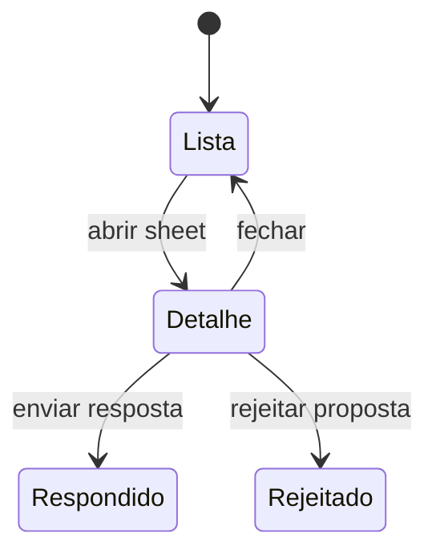

# Orçamentos recebidos pelo cliente

## 1. Resumo executivo

- **O que é:** área do **cliente** para ver **propostas recebidas**, **detalhes do pedido** associado e **threads de perguntas** dos prestadores, com possibilidade de **responder** e **rejeitar propostas** conforme RPCs.
- **Problema que resolve:** centralizar negociação após o pedido sem depender de canais externos.
- **Quem usa:** cliente autenticado.
- **Resultado esperado:** decisão informada sobre propostas (`accepted` / `rejected`) e respostas registradas.

## 2. Objetivo de negócio

- **Finalidade:** fechamento de venda na plataforma.
- **Valor:** histórico auditável de interações.
- **Impacto:** retroalimenta status de `provider_proposals` e perguntas.
- **Contexto:** pós-criação de `service_requests`.

## 3. Localização na plataforma

| Aspecto | Detalhe |
|---------|---------|
| Módulo | `client-budgets` |
| Menu | “Orçamentos” → `/dashboard/orcamentos` |
| Shell | `ClientBudgetsShell` + `ClientBudgetsRouteSlot` |
| Componentes | `ClientBudgetsPage`, `ReceivedBudgetDetailsSheet`, `QuestionThreadSheet` |

## 4. Perfis envolvidos

| Papel | Pode |
|-------|------|
| Cliente | Listar, filtrar, abrir detalhes, responder, rejeitar (conforme RPC) |
| Prestador | Atua pelo próprio módulo de envio |
| Admin | **Evidência parcial em RLS/RPC** — sem UI aqui |

## 5. Fluxo funcional principal

1. Cliente abre `/dashboard/orcamentos`.
2. Visualiza lista/cards com filtros e busca.
3. Abre detalhe (sheet) de orçamento ou pergunta.
4. Executa ação: responder texto/anexos ou rejeitar com motivo.

## 6. Fluxos alternativos e exceções

- **Erro RPC:** mensagem ao usuário (tratamento em hooks — detalhe por código de erro: evidência parcial).
- **Paginação:** carregar mais / infinite conforme implementação do hook.

## 7. Regras de negócio

1. Apenas interações sobre pedidos do **próprio cliente** (RLS/RPC).
2. Rejeição de proposta exige **`client_rejection_response` não vazio** quando status `rejected` no modelo de dados (migration `provider_proposals`).
3. Proposta possui estados: `submitted`, `accepted`, `rejected`, `withdrawn`.

## 8. Campos e dados

**Evidência parcial:** rótulos exatos de colunas vêm de componentes de card/lista. Estrutura de negócio principal vem dos retornos RPC tipados em `database.types.ts`.

| Conceito | Origem | Observação |
|----------|--------|------------|
| Valor da proposta | `provider_proposals` | Pode incluir taxa plataforma |
| Prazo | `proposal_duration_value` + unit | hours/days |
| Slots sugeridos | JSON | 1–3 itens, turnos validados no servidor |
| Pergunta | `provider_service_request_questions` | Status de resposta conforme RPC |

## 9. Validações de front-end

- Campos de resposta/rejeição validados antes do invoke (ver `clientBudgets.api.ts` e componentes de sheet).

## 10. Validações de back-end

- `respond_client_budget_question`, `reject_client_budget_proposal`, `list_client_received_budgets`, etc. (`20260323090000_create_client_budgets_rpcs.sql`).
- Storage **`client-question-responses`** para mídia de resposta (migration relacionada).

## 11. Status, estados e transições

| Entidade | Estados relevantes |
|----------|-------------------|
| Proposta | submitted → accepted / rejected / withdrawn |
| Pergunta | **Evidência parcial:** ver colunas na tabela `provider_service_request_questions` e RPCs |

**Quem altera:** cliente (resposta/rejeição); prestador (withdrawn/envio).

## 12. Persistência

- Tabelas: `provider_proposals`, `provider_service_request_questions`.
- Buckets conforme políticas de imagem de resposta.

## 13. Integrações

- RPCs Supabase; sem Edge Function dedicada neste módulo.

## 14. Listagens, buscas e filtros

- Abas (orçamentos vs perguntas conforme UI), busca textual, filtros de status, paginação.
- **Detalhe fino:** extrair de `ClientBudgetsPage` e hooks em revisão futura.

## 15. Ações disponíveis

| Ação | Quem | Pré-condição | Efeito |
|------|------|--------------|--------|
| Ver lista | Cliente | Auth | — |
| Responder pergunta | Cliente | Pergunta pendente conforme RPC | Atualiza thread + possível upload |
| Rejeitar proposta | Cliente | Proposta em estado rejeitável | Status + motivo |

## 16. Dependências

- Depende de pedidos criados (`client-my-services` / `request-quote`).
- Sheets podem ser reutilizados em “Meus serviços” (integração no código).

## 17. Regras implícitas

- Contadores de “pendentes” no header — reforçam SLA operacional percebido pelo usuário.

## 18. Riscos

- Complexidade de estados entre **pedido** e **proposta** para suporte N1.
- Mensagens RPC não catalogadas integralmente.

## 19. Evidências

- `src/features/client-budgets/`
- `src/router.tsx`
- `supabase/migrations/20260323090000_create_client_budgets_rpcs.sql`
- `supabase/migrations/20260318200000_create_provider_proposals.sql`

## 20. Pendências

- Tabela campo a campo das sheets de UI.
- Mapa completo códigos de erro → mensagem usuário.

## 21. Atualização de auditoria (2026-04-27)

- **Escopo de pedidos na listagem:** RPCs de cliente consideram apenas `service_requests.status IN ('open','in_progress')`.
- **Filtros de orçamento realmente suportados no backend:** `awaiting_decision`, `accepted`, `rejected`, `withdrawn`.
- **Paginação e preview:** resposta agrega `total_count/page/page_size`; previews retornam no máximo 3 itens por grupo (orçamentos/perguntas).
- **Resposta de pergunta com mídia:** limite no front de **5 imagens**, **5 MB por arquivo**, tipos `jpeg/png/webp/heic/heif`, bucket `client-question-responses`.
- **Texto de resposta do cliente:** limite de **1000 caracteres** no composer (`useQuestionResponseComposer`).
