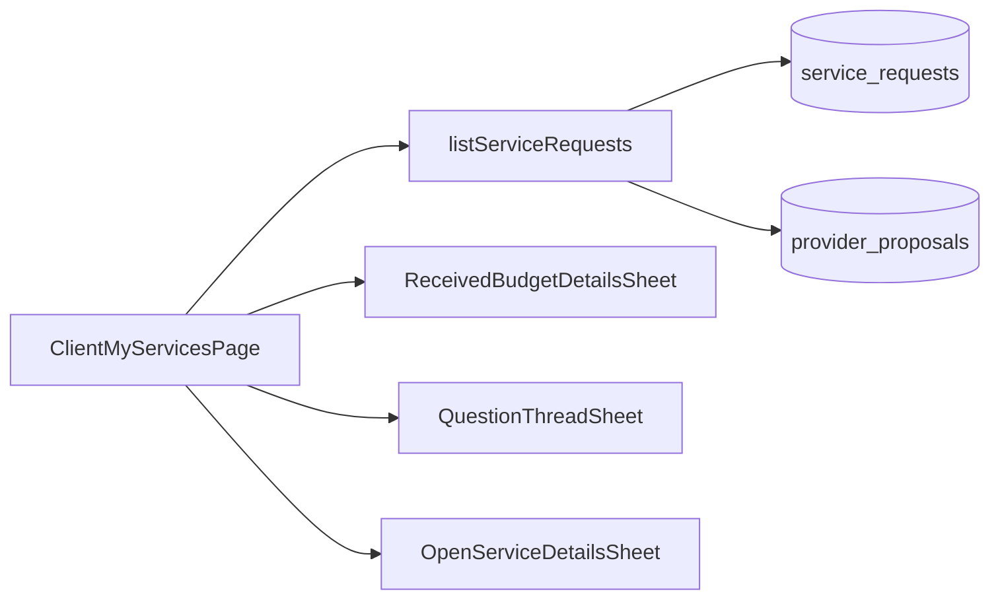

# Solicitações do cliente (Meus Serviços)

Documentação baseada em `src/features/client-my-services/`, `api/serviceRequests.api.ts` e integrações com `client-budgets` e `request-quote`.

---

## 1. Visão geral

| Item | Descrição |
|------|-----------|
| **Objetivo** | Listar e gerenciar **pedidos** (`service_requests`) do cliente autenticado: filtros, busca, abas por visão de status, deep link para um pedido, sheets de orçamentos/perguntas e cancelamento quando aplicável. |
| **Rotas** | **`/dashboard/requests`** — `ClientMyServicesPage`. **`/dashboard/services/:id`** — `ClientMyServicesDetailPlaceholder` (página **placeholder**, não é o fluxo principal de detalhe). |
| **Menu** | Cliente: **“Meus Serviços”** (`dashboardMenu.ts`). Prestador vê **“Solicitações”** apontando para o **mesmo path** — a UI da página é pensada para o cliente; prestador compartilha rota no layout. |
| **Guard** | `ProtectedRoute` com `allowedRoles={['client', 'provider']}` no segmento `dashboard`; não há guard exclusivo de cliente nesta rota. |
| **Origem dos dados** | Pedidos criados em **`request-quote`** (e futuras origens que gravem `service_requests` com o mesmo `client_id`). |

---

## 2. Arquitetura da página

| Camada | Responsável |
|--------|-------------|
| Página | `ClientMyServicesPage.tsx` — composição de header, busca, filtros, abas, lista, `LoadMoreButton`, sheets. |
| Orquestração | `useClientMyServicesPage.ts` — search params, foco, opções de filtro derivadas, scroll ao foco, bloqueio de scroll do `body` quando sheet aberto. |
| Lista | `useClientMyServicesList.ts` — `useInfiniteQuery`, página **20**, chama `listServiceRequests`. |
| Filtros (estado) | `useClientMyServicesFilters.ts` — estado local + `searchQuery` debounced vindo do hook da página. |
| Cancelamento | `useClientMyServicesCancel.ts` — `useMutation` + `invalidateQueries` na chave da lista. |

---

## 3. Lista e paginação (servidor)

- **Função:** `listServiceRequests` em `api/serviceRequests.api.ts`.
- **Cliente Supabase:** `.from("service_requests")` com **`.eq("client_id", params.clientId)`**; RLS no banco reforça que só linhas do usuário retornam.
- **Joins (select):** `client_addresses` (com `platform_cities`, `platform_states`), `platform_services` (title, slug, icon_key, color_key), `provider_proposals (status)`.
- **Ordenação:** `updated_at` descendente.
- **Paginação:** `range(from, to)` com `page` 1-based, `pageSize` clamp **1–100** (UI usa 20).
- **Contagem:** `{ count: "exact" }` para `total_count` e `getNextPageParam`.

**Não há RPC dedicada:** a listagem é **PostgREST/query builder** no cliente, com filtros aplicados na query (servidor Supabase aplica filtros + limit).

---

## 4. Abas de status (`StatusTabId`)

Configuração em `constants/statusTabs.ts` + ícones/cores em `statusTabDisplay.ts`.

| Tab id | Label UI | Filtro real na query |
|--------|----------|----------------------|
| `all` | Todos | Sem filtro de `status`. |
| `waiting_proposals` | Aguardando orçamentos | `status = 'open'` **e** exclui IDs que tenham proposta com `status = 'submitted'`. |
| `negotiation` | Em negociação | `status = 'open'` **e** `id IN` pedidos com pelo menos uma proposta **`submitted`**. |
| `in_progress` | Em andamento | `status = 'in_progress'`. |
| `completed` | Concluídos | `status = 'closed'`. |
| `cancelled` | Cancelados | `status = 'cancelled'`. |
| `dispute` | Disputas | **Sem linhas** quando não há foco: retorno vazio reservado para futuro (sem valor `dispute` no CHECK atual do DB). |

**Queries auxiliares:** para abas que dependem de propostas, a API lê `provider_proposals` com join `service_requests!inner(client_id)` para obter conjuntos de IDs antes de filtrar `service_requests`.

---

## 5. Busca e filtros adicionais

### 5.1 Busca textual

- **Debounce:** **300 ms** (`useClientMyServicesPage` + `useDebouncedValue`).
- **Campos:** `title` e `description` com **ILIKE** (`or`).
- **Sanitização:** `sanitizeSearchForOrIlike` — remove vírgulas, escapa `%`, `_` e `\` para PostgREST.

### 5.2 Filtros da barra (`ClientMyServicesFiltersBar`)

| Filtro | Parâmetro API | Implementação |
|--------|---------------|----------------|
| Categoria | `categoryId` | **Título do serviço:** `.eq("platform_services.title", value)` — o dropdown usa títulos agregados na UI (ver §5.3). |
| Cidade | `cityName` | `.eq("client_addresses.platform_cities.name", ...)`. |
| Bairro | `neighborhoodName` | `.eq("client_addresses.neighborhood", ...)`. |
| Datas | `dateFrom` / `dateTo` | `created_at` com início/fim do dia. |
| Com orçamentos | `hasProposals` true/false | Interseção com IDs de `provider_proposals`. |
| Com imagens | `hasImages` true/false | `photos` não nulo e não `{}` vs nulo ou `{}`. |

**Modo foco (`serviceRequestId` na URL):** se definido, a query aplica **apenas** `eq("id", id)` (além de `client_id` e joins) — **demais filtros não restringem** o resultado.

### 5.3 Opções dos dropdowns de filtro

- `categoryOptions`, `cityOptions`, `neighborhoodOptions` vêm dos **`items` já carregados** na lista.
- **Consequência:** opções **incompletas** com paginação — valores que só existem em outras páginas podem não aparecer. **Lacuna de UX.**

### 5.4 `hasActiveFilters` (página)

Inclui aba ≠ `all`, busca não vazia, qualquer filtro da barra ou presença de **`serviceRequestId`** na query.

---

## 6. Deep link e foco

- **Query:** `SERVICE_REQUEST_FOCUS_QUERY` = **`serviceRequestId`**.
- **Helper:** `getServiceRequestsPageUrlWithFocus(id)` → `/dashboard/requests?serviceRequestId=<uuid>`.
- **Exportado** no `index.ts` da feature.
- **Banner:** `ClientMyServicesFocusBanner` — carregando, pedido encontrado, ou não encontrado.
- **Sincronização de aba:** com foco, `setStatusTabId(statusToTabId(focusedRequest.status))` — **`statusToTabId('open')` é sempre `waiting_proposals`**, não `negotiation`, mesmo com propostas submetidas.
- **Scroll:** `scrollIntoView` em `id="service-request-{id}"` quando há um único item carregado.

---

## 7. Modelo de card (`ServiceRequestCardModel`)

Mapeamento em `utils/serviceRequestCardMapper.ts`:

- Preview de descrição, `form_data` / `form_schema`, `photoPaths`, `proposalCount`, `hasSubmittedProposal`, `tags`.
- `selectedProfessionalName` e `progressPercent` **não preenchidos** pelo mapper atual.

**Fotos:** `useServiceRequestPhotoUrls` (`request-quote`). **Ícone/cor:** `getServiceCardStyle`.

---

## 8. Labels e badges

`constants/statusBadge.ts`: para `open` com proposta submetida, label **“Aguardando decisão”**; caso contrário **“Aguardando orçamentos”**. Variantes de `Badge` conforme `STATUS_BADGE_VARIANT` e contagem de propostas.

---

## 9. Ações por card

### Ver detalhes (`OpenServiceDetailsSheet`)

- **Só** `model.status === 'open'` abre o sheet (`ClientMyServicesSections`: descrição, `buildSummaryEntries` do `dynamic-form`, fotos).
- Outros status: toast *"Visualização detalhada para este status ainda está em construção."* — botão “Ver detalhes” ainda aparece.

### Orçamentos e perguntas (`client-budgets`)

- `ReceivedBudgetDetailsSheet` com `sheetMode="compare"`, `QuestionThreadSheet`.
- **Ver orçamentos:** `open`, `proposalCount > 0` e `proposalCount !== 1`.
- **Ver perguntas:** `open` e `proposalCount !== 1` (exatamente **uma** proposta oculta ambos os botões de orçamentos e perguntas nesta lógica).

### Cancelar

- `cancelServiceRequest`: usuário autenticado = `clientId`, `update` para `cancelled`.
- `canCancelService`: na prática **apenas `status === 'open'`**; ramo `statusTabId === 'negotiation'` não ocorre com o mapper atual (`statusTabId` para `open` é `waiting_proposals`).

---

## 10. Estados de lista (copy)

- **Vazio:** *"Você ainda não solicitou nenhum serviço"* + CTA `/pedir-orcamento`.
- **Filtros sem resultado:** *"Nenhum serviço encontrado"* + limpar filtros.
- **Erro:** *"Não foi possível carregar seus serviços"* + retry.

---

## 11. Header e CTA

- **“Novo serviço”** → `/pedir-orcamento`; FAB no mobile.

---

## 12. Placeholder de rota de detalhe

`ClientMyServicesDetailPlaceholder` em `/dashboard/services/:id`. `getServiceDetailPath` existe mas **não é usado** no app fora de testes.

---

## 13. `filterServiceRequests`

Utilitário em `utils/filterServiceRequests.ts` usado **apenas em testes** — a página filtra sempre via `listServiceRequests`.

---

## 14. Diagrama

---

## 15. Lacunas

- Detalhe em sheet só para **`open`**.
- Deep link ajusta aba para `waiting_proposals` em todo `open`.
- Dropdowns de filtro limitados aos itens carregados.
- Condição `negotiation` em `canCancelService` ineficaz com mapper atual.
- Prestador e cliente compartilham path no menu com UIs distintas no menu.
- Página `/dashboard/services/:id` placeholder.

---

## 16. Evidências

- `src/features/client-my-services/**/*`
- `src/router.tsx`
- `src/layouts/DashboardLayout/dashboardMenu.ts`

## 17. Atualização de auditoria (2026-04-27)

- **Escopo da listagem é estrito por cliente:** query sempre aplica `.eq("client_id", params.clientId)` antes dos demais filtros.
- **Busca textual foi protegida para PostgREST:** `sanitizeSearchForOrIlike` remove vírgulas e escapa `%`, `_` e `\\`.
- **Modo foco (`serviceRequestId`) domina a query:** quando presente, o backend passa a buscar por `id` específico e ignora filtros de barra para restrição final.
- **Cancelamento funcional no código atual:** mutação de cancelamento só considera serviço cancelável quando `status === 'open'`.
