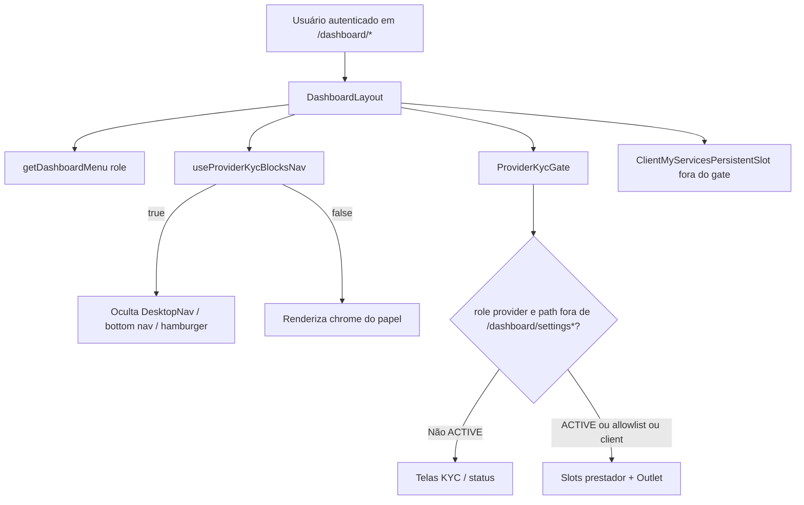

# Dashboard — layout, menu e placeholders

## 1. Resumo executivo

- **O que é:** shell do painel autenticado (`DashboardLayout`) com menu por papel, chrome desktop/mobile, embedding do gate KYC do prestador e rotas filhas — parte **reais**, parte **placeholder** (`DashboardFakePage`).
- **Quem usa:** `client` e `provider` autenticados.
- **Foco desta doc:** o que o menu mostra por papel; paleta do logo Prestway no header (por papel); o que é fake vs real; allowlist KYC; rotas fora do menu top-level (calendário, detalhe; Ganhos/Endereços só no hub Configurações).

## 2. Objetivo de negócio

Dar navegação estável e previsível no painel pós-login, sem misturar regras de domínio das features hospedadas. Placeholders marcam superfícies ainda sem implementação dedicada no path do menu/rota.

## 3. Localização na plataforma

### 3.1 Rota mãe

| Superfície | Rota | Guard |
|------------|------|-------|
| Shell | `/dashboard/*` | `ProtectedRoute` `allowedRoles={['client','provider']}` + `DashboardLayout` |

### 3.2 Inventário de rotas filhas (evidência: `src/router.tsx`)

| Rota | Elemento | Real / Fake | Guard aninhado |
|------|----------|-------------|----------------|
| `/dashboard` (index) | `DashboardFakePage` título “Visão geral” | **Fake** | — (pai) |
| `/dashboard/services` | `MyServicesRouteSlot` | **Real** (`my-services`) | — |
| `/dashboard/services/calendar` | `ProviderCalendarPage` | **Real** (`provider-calendar`) | `provider` |
| `/dashboard/services/:id` | `ServiceDetailShell` | **Real** (`view-services`) | — |
| `/dashboard/settings` (+ seções) | `SettingsLayout` / `SettingsIndexPage` / seções / host earnings | **Real** (`settings` + `provider-earnings` em `earnings`) | `client`/`provider` por seção |
| `/dashboard/jobs` | `ProviderJobsRouteSlot` | **Real** (`provider-jobs`) | `provider` |
| `/dashboard/chats` | `ChatsLayout` | **Real** (`chats`) | `client`, `provider` |
| `/dashboard/chats/:chatId` | `ChatsConversationRoute` | **Real** (`chats`) | (filho de chats) |

**Removidas (sem redirect):** `/dashboard/conta`, `/dashboard/earnings`, `/dashboard/addresses`, `/dashboard/help`.

### 3.3 Entry points fora do menu

| Entry | Destino | Evidência |
|-------|---------|-----------|
| Banner “Ver calendário de serviços” em Meus Serviços (prestador) | `/dashboard/services/calendar` | `ProviderCalendarEntryBanner` em `ProviderMyServicesPage` |
| Deep link / card → detalhe | `/dashboard/services/:id` (sheet ou stack) | `view-services` + `mobileNavigation.config.ts` |
| Menu **Configurações** / URL `/dashboard/settings` | Hub real (`SettingsLayout` + índice/seções) | Item em `dashboardMenu.ts`; feature `settings` |

## 4. Perfis envolvidos

| Perfil | Menu | Observação |
|--------|------|------------|
| `client` | Ver §7 tabela cliente | Sem jobs / earnings / calendar; logo azul (`PrestwayIcon` variant `client`) |
| `provider` | Ver §7 tabela prestador | Gate KYC substitui conteúdo se ≠ `ACTIVE`; chrome de nav oculto se loading ou ≠ `ACTIVE`; logo laranja (variant `provider`) |
| Sem `role` no profile | Tratado como `client` no layout | `profile?.role ?? "client"`; `resolveAudienceTheme` também cai em `client` (azul) para `admin` / null |

## 5. Fluxo funcional principal

Passos:

1. Layout resolve `role`, `getDashboardMenu(role)`, `logoVariant = resolveAudienceTheme(role)` e `useProviderKycBlocksNav`.
2. Se `hideNavForKyc`: omite DesktopNav / bottom nav / hamburger; header/logo permanece (com a paleta do papel); sem `pb-20`.
3. Senão: chrome desktop ou mobile conforme breakpoint e `resolveMobileChrome(pathname, location)`.
4. Conteúdo liberado ou substituído pelo gate; outlet renderiza página real ou `DashboardFakePage` (ou UI KYC).

## 6. Fluxos alternativos e exceções

1. **Offline:** header sticky usa `top-11` quando `!isOnline` (desktop e headers mobile passam `isOffline`).
2. **Prestador em loading de conta KYC:** gate mostra “Verificando credenciamento…”; chrome de nav **já oculto** (sem flash).
3. **Prestador rejeitado / suspenso / em análise / pendente:** UIs de status / wizard no lugar do outlet operacional; menus ocultos.
4. **Detalhe de serviço em sheet:** chrome permanece tab-root (quando nav visível); lista fica no persistent slot.
5. **Conversa `/dashboard/chats/:chatId`:** modo mobile `custom` (header da feature; sem bottom nav do shell) — quando KYC liberado.

## 7. Regras de negócio

1. **Menu cliente** (`clientMenuItems`), ordem fixa — `CLIENT_MAIN_COUNT = 4` (todos no bottom nav; sem overflow de Ajuda):

   | # | Label | Path | No menu | Real / Fake |
   |---|-------|------|---------|-------------|
   | 1 | Visão geral | `/dashboard` | Sim (main) | Fake |
   | 2 | Meus Serviços | `/dashboard/services` | Sim (main) | Real |
   | 3 | Conversas | `/dashboard/chats` | Sim (main) | Real |
   | 4 | Configurações | `/dashboard/settings` | Sim (main) | Real (hub) |

2. **Menu prestador** (`providerMenuItems`), ordem fixa — `PROVIDER_MAIN_COUNT = 5` (`allItems.length = 5`; sem item extra no overflow):

   | # | Label | Path | No menu | Real / Fake |
   |---|-------|------|---------|-------------|
   | 1 | Visão geral | `/dashboard` | Sim (main) | Fake |
   | 2 | Meus Serviços | `/dashboard/services` | Sim (main) | Real |
   | 3 | Trabalhos | `/dashboard/jobs` | Sim (main) | Real |
   | 4 | Conversas | `/dashboard/chats` | Sim (main) | Real |
   | 5 | Configurações | `/dashboard/settings` | Sim (main) | Real (hub; Ganhos dentro) |

3. **Não há item “Orçamentos”** no menu atual (nem cliente nem prestador). Orçamentos/negociação vivem em Conversas / Meus Serviços (outros módulos).

4. **Calendário** (`/dashboard/services/calendar`): rota real **provider-only**; **não** é item de `dashboardMenu.ts`; entrada via banner em Meus Serviços do prestador; mobile stack “Calendário” com back para `/dashboard/services`.

5. **Allowlist KYC:** paths `/dashboard/settings` e `/dashboard/settings/…` passam pelo gate sem substituir children. Constante `PROVIDER_KYC_ALLOWED_PATH_PREFIX = "/dashboard/settings"`.

6. **Menu e KYC:** `getDashboardMenu` define o menu completo do prestador; o layout **omite** DesktopNav, bottom nav e hamburger quando `useProviderKycBlocksNav()` é `true` (loading ou `shouldBlockProviderForKyc`). O `ProviderKycGate` substitui o **conteúdo**. Substitui o comportamento anterior de “menu completo sempre visível”.

7. **Escopo do gate no layout:** dentro — `ProviderJobsPersistentSlot`, `ProviderMyServicesPersistentSlot`, outlet. Fora — `ClientMyServicesPersistentSlot` e `ServiceDetailSheet`.

8. **Título placeholder:** prop `title` **ou** `titleByRole[role]` **ou** `"Dashboard"`; role fallback `"client"`.

9. **Placeholder sem domínio:** `DashboardFakePage` não consulta pedido/orçamento/pagamento — só UI fixa.

10. **Logo no chrome (header):** o mark Prestway (`layout="full"`) no header desktop e no `MobileTabHeader` segue `resolveAudienceTheme(role)` — cliente (e fallback profile null / `admin`) = paleta azul (`client`); prestador = paleta laranja (`provider`). Não usa a variante institucional mista (`inst`). Prop `logoVariant` no `MobileTabHeader` (default `"client"`); `MobileNav` só repassa. `html[data-audience]` continua o mesmo mapeamento (`syncAudienceTheme` no `AuthProvider`). O `MobileStackHeader` não mostra o mark.

## 8. Campos e dados

Placeholders **não** possuem formulários. Shell lê apenas `profile` (role). O gate KYC (módulo provider-kyc) lê o estado da conta NetCred para decidir se substitui o conteúdo.

## 9. Validações de front-end

Nenhuma validação de formulário neste módulo. Guards de papel são do router (`ProtectedRoute`).

## 10. Validações de back-end

Nenhuma RPC/RLS própria do shell. Persistência e regras de KYC/contas estão em **provider-kyc** / **payments**.

## 11. Status, estados e transições

| Estado do shell (prestador) | Nav (chrome) | Conteúdo operacional |
|-----------------------------|--------------|----------------------|
| Cliente | Menu cliente completo | Sem gate |
| Prestador `ACTIVE` | Menu prestador completo | Children liberados |
| Prestador loading conta | **Oculto** (logo permanece, paleta do papel) | Spinner “Verificando credenciamento…” |
| Prestador não-`ACTIVE` em `/dashboard/settings*` | **Oculto** | Children (Configurações) |
| Prestador não-`ACTIVE` fora da allowlist | **Oculto** | Telas de status / formulário KYC |

FSM detalhada de `onboarding_status`: [gate-e-acesso-operacional](../../provider-kyc/features/gate-e-acesso-operacional.md).

## 12. Persistência

Sem persistência própria. Chrome mobile e menu são derivados de rota + role em runtime. Features filhas têm seus próprios caches (React Query, etc.).

## 13. Integrações

| Integração | Papel no shell |
|------------|----------------|
| `ProviderKycGate` | Bloqueio do conteúdo operacional |
| `useProviderKycBlocksNav` | Oculta DesktopNav / bottom nav / hamburger; remove `pb-20` |
| Persistent slots my-services / provider-jobs | Listas montadas para sheet/modal routing |
| `useServiceDetailModal` + `ServiceDetailSheet` | Detalhe sobre lista |
| `useOnlineStatus` | Offset de header offline |
| `useBreakpointMd` | Desktop vs mobile chrome |
| `resolveAudienceTheme` | Paleta do `PrestwayIcon` no header desktop e no `MobileTabHeader` |

## 14. Listagens, buscas, filtros, paginação

Não aplicável ao shell/placeholder. Listagens ficam nas features hospedadas.

## 15. Ações disponíveis

| Ação | Onde | Quem | Pré-condição | Resultado |
|------|------|------|--------------|-----------|
| Navegar item do menu | DesktopNav / MobileBottomNav / overflow hamburger | Conforme itens do papel | Sessão válida **e** chrome visível (KYC `ACTIVE` ou não-provider) | `react-router` navigation |
| Abrir “mais” (desktop) | `DesktopNav` overflow | Itens que não cabem na largura | — | Dropdown com itens restantes |
| Ver placeholder | Outlet em rota Fake | Guard da rota | Outlet liberado pelo KYC (prestador) | Card + “Página em construção.” |
| Voltar (mobile stack) | `MobileStackHeader` | Qualquer | Modo stack | `stackBackPath` / `backFallback` / `navigate(-1)` |

## 16. Dependências

| Dependência | Tipo |
|-------------|------|
| `auth` | Sessão, role, guards; `resolveAudienceTheme` (logo) |
| `provider-kyc` | Gate de conteúdo + `useProviderKycBlocksNav` (chrome) |
| `my-services`, `provider-jobs`, `view-services` | Slots / sheet |
| Features lazy no router (`chats`, `provider-earnings`, `settings`, `provider-calendar`, …) | Conteúdo real das rotas |
| Docs canônicas de domínio | Não duplicar regras: apontar para o módulo da feature |

## 17. Regras implícitas

- Endereços e Ganhos **não** são itens do menu; gestão em `/dashboard/settings/addresses` e `/dashboard/settings/earnings`.
- `/dashboard/settings` é hub real no menu (Configurações); índice mobile = tab-root; seções = stack com back ao índice.
- Prestador pode digitar URL de `/dashboard/jobs` etc. sem KYC `ACTIVE`: o router deixa passar o guard de role; o **gate substitui** o conteúdo (exceto allowlist); chrome de nav permanece oculto.
- Matching de ativo no desktop: path `/dashboard` só ativo em igualdade exata; demais itens usam `pathname.startsWith(itemPath)` (`DesktopNav`).
- Contagem mainItems: `allItems.slice(0, CLIENT_MAIN_COUNT|PROVIDER_MAIN_COUNT)` — cliente: 4 itens (sem overflow); prestador: 5 itens (sem item extra no overflow).
- Logo do header do dashboard **não** usa `variant="inst"`; paleta = papel via `resolveAudienceTheme` (igual a `html[data-audience]`).

## 18. Riscos

| Risco | Impacto | Mitigação observada no código |
|-------|---------|-------------------------------|
| Expectativa de item Endereços / Ganhos no menu | Navegação antiga | Removidos; hub Configurações |
| Expectativa de “Orçamentos” no menu | Doc/legado desatualizado | Menu atual não inclui o item |
| Calendário “invisível” no menu | Prestador não acha pela nav | Banner em Meus Serviços |
| Gate + URL direta | Usuário vê status KYC em vez da feature | Comportamento intencional do gate |

## 19. Evidências

| Artefato | Path |
|----------|------|
| Layout | `src/layouts/DashboardLayout/DashboardLayout.tsx` |
| Menu | `src/layouts/DashboardLayout/dashboardMenu.ts` |
| Testes do menu | `src/layouts/DashboardLayout/__tests__/dashboardMenu.test.ts` |
| Placeholder | `src/layouts/DashboardLayout/DashboardFakePage.tsx` |
| Chrome mobile | `src/layouts/DashboardLayout/mobileNavigation.config.ts` |
| Rotas | `src/router.tsx` (bloco `path: 'dashboard'`) |
| Gate / allowlist / chrome | `ProviderKycGate.tsx`, `useProviderKycBlocksNav.ts`, `kyc.constants.ts`; `DashboardLayout.tsx`, `MobileTabHeader.tsx` (`hideMenu`, `logoVariant`) |
| Paleta do logo | `resolveAudienceTheme` em `src/features/auth/utils/audienceTheme.ts`; `PrestwayIcon` em `src/components/brand/PrestwayIcon.tsx` |
| Banner calendário | `src/features/provider-calendar/components/ProviderCalendarEntryBanner.tsx` |
| Constante rota calendário | `src/features/provider-calendar/constants/routes.ts` |

## 20. Pendências

| Item | Status | Observação |
|------|--------|------------|
| Conteúdo futuro de Visão geral | Não localizado | Só `DashboardFakePage` no index `/dashboard`; `/dashboard/help` removida |
| Hub Configurações | Implementado | `SettingsLayout` + seções; item no menu |
| Módulo `provider-calendar` no índice de `docs/business/modulos/` | Fora do escopo deste doc | Rota hospedada pelo shell; doc de domínio pode estar em outro módulo |

---

## Anexo A — Chrome mobile (resumo)

| Path / condição | Modo | Bottom nav | Header shell |
|-----------------|------|------------|--------------|
| Raízes tab (`/dashboard`, services, chats, jobs, `/dashboard/settings`, …) | `tab-root` | Sim | Logo (paleta do papel) + hamburger |
| `/dashboard/services/calendar` | `stack` | Não | ← + título |
| `/dashboard/settings/:seção` | `stack` | Não | ← + título da seção; back → `/dashboard/settings` |
| `/dashboard/services/:id` com state sheet | `tab-root` (lista atrás) | Sim | Tab |
| `/dashboard/services/:id` full-page | `stack` | Não | “Detalhes do serviço” |
| `/dashboard/chats/:chatId` | `custom` | Não | Header da feature chat |

Evidência: `mobileNavigation.config.ts`, `mobileNavigation.types.ts`.

## Anexo B — Checklist QA (shell)

- [ ] Cliente: bottom nav = Visão geral, Meus Serviços, Conversas, Configurações (4 itens; sem Ajuda).
- [ ] Prestador ACTIVE: bottom nav = Visão geral, Meus Serviços, Trabalhos, Conversas, Configurações (5 itens; sem Ajuda/overflow extra).
- [ ] `/dashboard/help` → 404 (rota removida, sem redirect).
- [ ] Prestador não-ACTIVE (ou loading): menus **ocultos**; header/logo permanece (paleta laranja do prestador); rotas operacionais mostram UI KYC (exceto conteúdo em `/dashboard/settings*`).
- [ ] Logo do header: cliente (e profile null / admin) = paleta azul; prestador = paleta laranja; **não** variante institucional mista (`inst`). Desktop e `MobileTabHeader`.
- [ ] Sem itens Endereços / Ganhos no menu; Ganhos em `/dashboard/settings/earnings`.
- [ ] `/dashboard/chats` → layout real de conversas.
- [ ] Calendário acessível pelo banner em Meus Serviços (prestador), não pelo menu.
- [ ] `/dashboard/settings` → hub real (índice mobile / redirect desktop); item Configurações no menu.
- [ ] Offline: header deslocado.
- [ ] Índice mobile `/dashboard/settings` = tab-root; seções do hub = stack com back ao índice.
