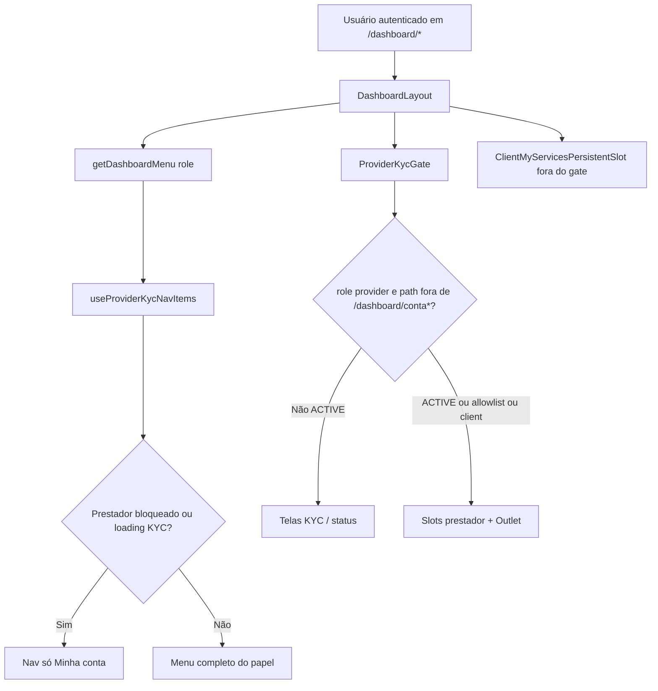

# Dashboard — layout, menu e placeholders

## 1. Resumo executivo

- **O que é:** shell do painel autenticado (`DashboardLayout`) com menu por papel, chrome desktop/mobile, embedding do gate KYC do prestador e rotas filhas — parte **reais**, parte **placeholder** (`DashboardFakePage`).
- **Quem usa:** `client` e `provider` autenticados.
- **Foco desta doc:** o que o menu mostra por papel; o que é fake vs real; allowlist KYC; rotas fora do menu (calendário, settings, detalhe).

## 2. Objetivo de negócio

Dar navegação estável e previsível no painel pós-login, sem misturar regras de domínio das features hospedadas. Placeholders marcam superfícies ainda sem implementação dedicada no path do menu/rota.

## 3. Localização na plataforma

### 3.1 Rota mãe

| Superfície | Rota | Guard |
|------------|------|-------|
| Shell | `/dashboard/*` | `ProtectedRoute` `allowedRoles={['client','provider']}` + `DashboardLayout` |

### 3.2 Inventário de rotas filhas (evidência: `src/router.tsx`)

| Rota | Elemento | Real / Fake | Guard aninhado |
|------|----------|-------------|----------------|
| `/dashboard` (index) | `DashboardFakePage` título “Visão geral” | **Fake** | — (pai) |
| `/dashboard/services` | `MyServicesRouteSlot` | **Real** (`my-services`) | — |
| `/dashboard/services/calendar` | `ProviderCalendarPage` | **Real** (`provider-calendar`) | `provider` |
| `/dashboard/services/:id` | `ServiceDetailShell` | **Real** (`view-services`) | — |
| `/dashboard/addresses` | `DashboardFakePage` título “Endereços” | **Fake** | `client` |
| `/dashboard/conta` | `MyAccountPage` | **Real** (`my-account`) | `client`, `provider` |
| `/dashboard/settings` | `DashboardFakePage` título “Configurações” | **Fake** | — (pai); **fora do menu** |
| `/dashboard/help` | `DashboardFakePage` título “Ajuda” | **Fake** | — (pai) |
| `/dashboard/jobs` | `ProviderJobsRouteSlot` | **Real** (`provider-jobs`) | `provider` |
| `/dashboard/earnings` | `EarningsPage` | **Real** (`provider-earnings`) | `provider` |
| `/dashboard/chats` | `ChatsLayout` | **Real** (`chats`) | `client`, `provider` |
| `/dashboard/chats/:chatId` | `ChatsConversationRoute` | **Real** (`chats`) | (filho de chats) |

### 3.3 Entry points fora do menu

| Entry | Destino | Evidência |
|-------|---------|-----------|
| Banner “Ver calendário de serviços” em Meus Serviços (prestador) | `/dashboard/services/calendar` | `ProviderCalendarEntryBanner` em `ProviderMyServicesPage` |
| Deep link / card → detalhe | `/dashboard/services/:id` (sheet ou stack) | `view-services` + `mobileNavigation.config.ts` |
| URL direta `/dashboard/settings` | Placeholder Configurações | Rota existe; **sem** item em `dashboardMenu.ts` |

## 4. Perfis envolvidos

| Perfil | Menu | Observação |
|--------|------|------------|
| `client` | Ver §7 tabela cliente | Sem jobs / earnings / calendar |
| `provider` | Ver §7 tabela prestador | Gate KYC pode reduzir menu a Minha conta |
| Sem `role` no profile | Tratado como `client` no layout | `profile?.role ?? "client"` |

## 5. Fluxo funcional principal

Passos:

1. Layout resolve `role` e menu base.
2. Filtro KYC eventualmente reduz nav.
3. Chrome desktop ou mobile conforme breakpoint e `resolveMobileChrome(pathname, location)`.
4. Conteúdo liberado ou substituído pelo gate; outlet renderiza página real ou `DashboardFakePage`.

## 6. Fluxos alternativos e exceções

1. **Offline:** header sticky usa `top-11` quando `!isOnline` (desktop e headers mobile passam `isOffline`).
2. **Prestador em loading de conta KYC:** gate mostra “Verificando credenciamento…”; nav já limitada a Minha conta (`useProviderKycNavItems` trata `isLoading` como blocked).
3. **Prestador rejeitado / suspenso / em análise:** UIs de status do módulo provider-kyc no lugar do outlet operacional.
4. **Detalhe de serviço em sheet:** chrome permanece tab-root; lista fica no persistent slot.
5. **Conversa `/dashboard/chats/:chatId`:** modo mobile `custom` (header da feature; sem bottom nav do shell).

## 7. Regras de negócio

1. **Menu cliente** (`clientMenuItems`), ordem fixa — primeiros 5 = bottom nav:

   | # | Label | Path | No menu | Real / Fake |
   |---|-------|------|---------|-------------|
   | 1 | Visão geral | `/dashboard` | Sim (main) | Fake |
   | 2 | Meus Serviços | `/dashboard/services` | Sim (main) | Real |
   | 3 | Conversas | `/dashboard/chats` | Sim (main) | Real |
   | 4 | Endereços | `/dashboard/addresses` | Sim (main) | **Fake** (endereços reais em Minha conta) |
   | 5 | Minha conta | `/dashboard/conta` | Sim (main) | Real |
   | 6 | Ajuda | `/dashboard/help` | Sim (overflow) | Fake |

2. **Menu prestador** (`providerMenuItems`), ordem fixa — primeiros 5 = bottom nav:

   | # | Label | Path | No menu | Real / Fake |
   |---|-------|------|---------|-------------|
   | 1 | Visão geral | `/dashboard` | Sim (main) | Fake |
   | 2 | Meus Serviços | `/dashboard/services` | Sim (main) | Real |
   | 3 | Trabalhos | `/dashboard/jobs` | Sim (main) | Real |
   | 4 | Conversas | `/dashboard/chats` | Sim (main) | Real |
   | 5 | Ganhos | `/dashboard/earnings` | Sim (main) | Real |
   | 6 | Minha conta | `/dashboard/conta` | Sim (overflow) | Real |
   | 7 | Ajuda | `/dashboard/help` | Sim (overflow) | Fake |

3. **Não há item “Orçamentos”** no menu atual (nem cliente nem prestador). Orçamentos/negociação vivem em Conversas / Meus Serviços (outros módulos).

4. **Calendário** (`/dashboard/services/calendar`): rota real **provider-only**; **não** é item de `dashboardMenu.ts`; entrada via banner em Meus Serviços do prestador; mobile stack “Calendário” com back para `/dashboard/services`.

5. **Allowlist KYC:** paths `/dashboard/conta` e `/dashboard/conta/…` passam pelo gate sem substituir children. Constante `PROVIDER_KYC_ALLOWED_PATH_PREFIX = "/dashboard/conta"`.

6. **Filtro de nav KYC:** se prestador e (`accountQuery.isLoading` **ou** `shouldBlockProviderForKyc`), menu vira somente itens cujo `path === "/dashboard/conta"`.

7. **Escopo do gate no layout:** dentro — `ProviderJobsPersistentSlot`, `ProviderMyServicesPersistentSlot`, outlet. Fora — `ClientMyServicesPersistentSlot` e `ServiceDetailSheet`.

8. **Título placeholder:** prop `title` **ou** `titleByRole[role]` **ou** `"Dashboard"`; role fallback `"client"`.

9. **Placeholder sem domínio:** `DashboardFakePage` não consulta pedido/orçamento/pagamento — só UI fixa.

## 8. Campos e dados

Placeholders **não** possuem formulários. Shell lê apenas `profile` (role) e, via hooks KYC, estado da conta NetCred (para filtro de menu / gate — lógica em provider-kyc).

## 9. Validações de front-end

Nenhuma validação de formulário neste módulo. Guards de papel são do router (`ProtectedRoute`).

## 10. Validações de back-end

Nenhuma RPC/RLS própria do shell. Persistência e regras de KYC/contas estão em **provider-kyc** / **payments**.

## 11. Status, estados e transições

| Estado do shell (prestador) | Nav | Conteúdo operacional |
|-----------------------------|-----|----------------------|
| Cliente | Menu cliente completo | Sem gate |
| Prestador `ACTIVE` | Menu prestador completo | Children liberados |
| Prestador loading conta | Só Minha conta | Spinner “Verificando credenciamento…” |
| Prestador não-`ACTIVE` em `/dashboard/conta*` | Só Minha conta | Children (Minha conta) |
| Prestador não-`ACTIVE` fora da allowlist | Só Minha conta | Telas de status / formulário KYC |

FSM detalhada de `onboarding_status`: [gate-e-acesso-operacional](../../provider-kyc/features/gate-e-acesso-operacional.md).

## 12. Persistência

Sem persistência própria. Chrome mobile e menu são derivados de rota + role em runtime. Features filhas têm seus próprios caches (React Query, etc.).

## 13. Integrações

| Integração | Papel no shell |
|------------|----------------|
| `ProviderKycGate` / `useProviderKycNavItems` | Bloqueio operacional + filtro de menu |
| Persistent slots my-services / provider-jobs | Listas montadas para sheet/modal routing |
| `useServiceDetailModal` + `ServiceDetailSheet` | Detalhe sobre lista |
| `useOnlineStatus` | Offset de header offline |
| `useBreakpointMd` | Desktop vs mobile chrome |

## 14. Listagens, buscas, filtros, paginação

Não aplicável ao shell/placeholder. Listagens ficam nas features hospedadas.

## 15. Ações disponíveis

| Ação | Onde | Quem | Pré-condição | Resultado |
|------|------|------|--------------|-----------|
| Navegar item do menu | DesktopNav / MobileBottomNav / overflow hamburger | Conforme itens filtrados | Sessão válida | `react-router` navigation |
| Abrir “mais” (desktop) | `DesktopNav` overflow | Itens que não cabem na largura | — | Dropdown com itens restantes |
| Ver placeholder | Outlet em rota Fake | Guard da rota | Outlet liberado pelo KYC (prestador) | Card + “Página em construção.” |
| Voltar (mobile stack) | `MobileStackHeader` | Qualquer | Modo stack | `stackBackPath` / `backFallback` / `navigate(-1)` |

## 16. Dependências

| Dependência | Tipo |
|-------------|------|
| `auth` | Sessão, role, guards |
| `provider-kyc` | Gate + filtro nav |
| `my-services`, `provider-jobs`, `view-services` | Slots / sheet |
| Features lazy no router (`chats`, `provider-earnings`, `my-account`, `provider-calendar`, …) | Conteúdo real das rotas |
| Docs canônicas de domínio | Não duplicar regras: apontar para o módulo da feature |

## 17. Regras implícitas

- Item **Endereços** no menu cliente **não** monta a feature `addresses`; a gestão real está embutida em Minha conta.
- `/dashboard/settings` é acessível por URL para client e provider (sem subguard), mas **não** aparece no menu.
- Prestador pode digitar URL de `/dashboard/jobs` etc. sem KYC `ACTIVE`: o router deixa passar o guard de role, mas o **gate substitui** o conteúdo (exceto allowlist).
- Matching de ativo no desktop: path `/dashboard` só ativo em igualdade exata; demais itens usam `pathname.startsWith(itemPath)` (`DesktopNav`).
- Contagem mainItems: sempre `allItems.slice(0, 5)` por papel — Ajuda (e, no prestador, Minha conta) ficam fora do bottom nav.

## 18. Riscos

| Risco | Impacto | Mitigação observada no código |
|-------|---------|-------------------------------|
| Clique em Endereços → “em construção” | Confusão vs Minha conta | Documentar; produto decide se remove item ou aponta rota real |
| Expectativa de “Orçamentos” no menu | Doc/legado desatualizado | Menu atual não inclui o item |
| Calendário “invisível” no menu | Prestador não acha pela nav | Banner em Meus Serviços |
| Gate + URL direta | Usuário vê status KYC em vez da feature | Comportamento intencional do gate |

## 19. Evidências

| Artefato | Path |
|----------|------|
| Layout | `src/layouts/DashboardLayout/DashboardLayout.tsx` |
| Menu | `src/layouts/DashboardLayout/dashboardMenu.ts` |
| Testes do menu | `src/layouts/DashboardLayout/__tests__/dashboardMenu.test.ts` |
| Placeholder | `src/layouts/DashboardLayout/DashboardFakePage.tsx` |
| Chrome mobile | `src/layouts/DashboardLayout/mobileNavigation.config.ts` |
| Rotas | `src/router.tsx` (bloco `path: 'dashboard'`) |
| Gate / allowlist | `src/features/provider-kyc/components/ProviderKycGate.tsx`, `constants/kyc.constants.ts` |
| Filtro nav KYC | `src/features/provider-kyc/hooks/useProviderKycNavItems.ts` |
| Banner calendário | `src/features/provider-calendar/components/ProviderCalendarEntryBanner.tsx` |
| Constante rota calendário | `src/features/provider-calendar/constants/routes.ts` |

## 20. Pendências

| Item | Status | Observação |
|------|--------|------------|
| Conteúdo futuro de Visão geral, Ajuda, Configurações | Não localizado | Só `DashboardFakePage` |
| Por que menu Endereços não usa `AddressesSection` / feature addresses | Decisão de produto | Não há comentário no router explicando |
| Se `/dashboard/settings` receberá item de menu | Não localizado | Rota órfã de menu |
| Módulo `provider-calendar` no índice de `docs/business/modulos/` | Fora do escopo deste doc | Rota hospedada pelo shell; doc de domínio pode estar em outro módulo |

---

## Anexo A — Chrome mobile (resumo)

| Path / condição | Modo | Bottom nav | Header shell |
|-----------------|------|------------|--------------|
| Raízes tab (`/dashboard`, services, chats, jobs, …) | `tab-root` | Sim | Logo + hamburger |
| `/dashboard/services/calendar`, help, settings | `stack` | Não | ← + título |
| `/dashboard/services/:id` com state sheet | `tab-root` (lista atrás) | Sim | Tab |
| `/dashboard/services/:id` full-page | `stack` | Não | “Detalhes do serviço” |
| `/dashboard/chats/:chatId` | `custom` | Não | Header da feature chat |

Evidência: `mobileNavigation.config.ts`, `mobileNavigation.types.ts`.

## Anexo B — Checklist QA (shell)

- [ ] Cliente: bottom nav = Visão geral, Meus Serviços, Conversas, Endereços, Minha conta; Ajuda no overflow.
- [ ] Prestador ACTIVE: bottom nav = Visão geral, Meus Serviços, Trabalhos, Conversas, Ganhos; Minha conta e Ajuda no overflow.
- [ ] Prestador não-ACTIVE: só Minha conta na nav; outras rotas mostram UI KYC.
- [ ] `/dashboard/addresses` (cliente) → “Página em construção.”
- [ ] `/dashboard/earnings` (prestador ACTIVE) → página real de ganhos (não placeholder).
- [ ] `/dashboard/chats` → layout real de conversas.
- [ ] Calendário acessível pelo banner em Meus Serviços (prestador), não pelo menu.
- [ ] `/dashboard/settings` por URL → placeholder; sem item de menu.
- [ ] Offline: header deslocado.
