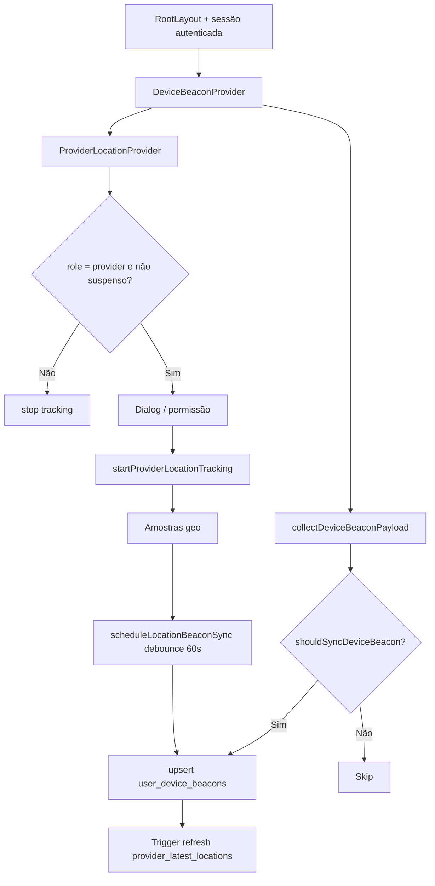

# Rastreamento de dispositivo (beacon + localização operacional)

Documentação baseada em `src/features/device-beacon/`. Efeitos de matching: [matching-dispatch](../../matching-dispatch/README.md). Uso no feed do prestador: [trabalhos-e-propostas](../../provider-jobs/features/trabalhos-e-propostas.md).

**Escopo honesto:** módulo **mínimo em superfície de produto** (sem rotas, sem CRUD de UI além do dialog de permissão). É infraestrutura de cliente: sync de instalação + geo operacional do prestador.

---

## 1. Resumo executivo

- **O que é:** pipeline que (1) registra o **dispositivo** e o **token FCM** em `user_device_beacons`, e (2) para prestadores, coleta **localização aproximada** com baixa frequência e sincroniza no mesmo registro.
- **Problema que resolve:** a plataforma precisa saber **onde notificar** (push) e **onde o prestador está** para lotes de matching; o prestador precisa entender o pedido de permissão antes do prompt do SO.
- **Quem usa:** autenticados (beacon); prestadores (geo + dialog).
- **Resultado de sucesso:** linha atualizada em `user_device_beacons`; para prestador com permissão e fix recente, linha em `provider_latest_locations` (via trigger).
- **Impacto se falhar:** push pode não chegar; prestador pode ficar fora de lotes / discovery por ausência ou staleness de beacon.

---

## 2. Objetivo de negócio

- Manter elegibilidade geográfica do prestador no **matching progressivo** (discovery/ranking) sem rastrear rota em tempo real.
- Manter endpoints de push válidos por instalação.
- Cumprir UX de permissão: explainer em português → prompt do sistema → tracking.

Copy do dialog (produto): matching “dentro de cerca de **20 km**”; coleta periódica de baixa frequência; no app nativo, coleta em segundo plano com **notificação persistente**.

---

## 3. Localização na plataforma (rotas, entry points, deep links, query params)

| Tipo | Valor |
|------|--------|
| Rotas próprias | **Nenhuma** |
| Deep links / query params | **Nenhum** |
| Entry point React | `RootLayout` envolve a árvore com `DeviceBeaconProvider` |
| Providers internos | `DeviceBeaconProvider` → `ProviderLocationProvider` → `LocationPermissionDialogHost` + `useProviderLocationTracking` |
| Capacitor bootstrap | `initCapacitorPlugins` **não** inicia tracking de beacon/geo |

Arquivos: `src/layouts/RootLayout.tsx`, `src/features/device-beacon/components/*`.

---

## 4. Perfis envolvidos

| Papel | Participa? | Detalhe |
|-------|------------|---------|
| Prestador | Sim | Tracking, dialog, campos de localização no upsert |
| Cliente / outros autenticados | Parcial | Só sync de push/metadados; `resolveLocationFields` retorna `location_permission_granted: false` se `role !== 'provider'` |
| Visitante | Não | Sem `profileId` → sync não roda |
| Prestador `operational_status = suspended` | Tracking parado | `useProviderLocationTracking` chama `stopProviderLocationTracking` |

---

## 5. Fluxo funcional principal

---

## 6. Fluxos alternativos e exceções

| Cenário | Comportamento evidenciado |
|---------|---------------------------|
| Permissão já `granted` no SO | Dialog não abre; marca prompt seen + granted; encerra sequência |
| Permissão `denied` no SO | Dialog não abre; stored granted = false; sync sem localização |
| `unsupported` (sem geolocation) | Dialog fechado; fluxo de sequência concluído |
| Prestador já viu explainer (`orbit.location_prompt_seen`) | Dialog não reabre |
| Prestador recusa no explainer (“Agora não”) | Prompt seen + granted false + `syncProviderBeaconNow` + GA `location_permission_denied` |
| Aceita explainer | Fecha dialog → delay 320ms → `requestOperationalLocationPermission` → sync + start tracking se granted |
| Visibilidade da aba (`visibilitychange` → visible) | Reavalia sync do beacon (não force) |
| Mudança de estado FCM (`subscribePushRegistrationState`) | Reavalia sync |
| Falha no upsert | Log `device_beacon_sync_skipped` / `provider_location_sync_failed`; location sync **reagenda** o pending |
| Android nativo + token | Tenta `CapacitorHttp` REST; se falhar, fallback `upsertDeviceBeacon` (supabase-js) |
| Logout | Stop tracking + `deleteDeviceBeacon` + remove snapshot Preferences |
| Revogação de permissão durante tracking | Stored granted false; stop tracking |

---

## 7. Regras de negócio (numeradas, verificáveis)

1. Upsert de beacon usa conflito em **`(profile_id, device_id)`**.
2. Localização só é gravada no payload de API se `location_permission_granted === true` **e** lat/lng finitos; caso contrário location/accuracy/recorded_at/`h3_index` vão **null** (`buildLocationFields` em `deviceBeacon.api.ts`).
3. Campos de localização no **collect** só para `context.role === 'provider'`.
4. Debounce mínimo entre upserts de localização: **60_000 ms** (`LOCATION_SYNC_DEBOUNCE_MS`).
5. Filtro de movimento no background nativo: **350 m** (`LOCATION_DISTANCE_FILTER_METERS`).
6. Snapshot local: re-sync forçado se mudou push/token/permissão/coordenadas/`location_recorded_at`, ou se passaram **7 dias** desde `lastSyncedAt` (`DEVICE_BEACON_SYNC_INTERVAL_MS`).
7. Tracking nativo: `requestPermissions: false` no plugin (permissão já tratada pelo fluxo do explainer).
8. Web: `watchPosition` só em foreground; native: `@capgo/background-geolocation` com título “Prestway” e mensagem de oportunidades próximas.
9. H3 no cliente (path supabase-js): resolução **7** (`H3_RESOLUTION_MATCHING`), alinhada a `matching.h3_resolution`.
10. Freshness no servidor para `provider_latest_locations`: beacon com `location_recorded_at` dentro de **`matching.beacon_location_max_age_hours`** (seed **24**).
11. Raio de discovery no matching: **`matching.discovery_beacon_radius_meters`** = **20000** (alinha ao copy “~20 km”).
12. Purge de linhas de beacon sem update há **30 dias** (cron `purge_stale_user_device_beacons`, 03:00).
13. Prestador suspenso operacionalmente **não** mantém tracking ativo.
14. Explainer aparece no máximo uma vez por instalação (Preferences `orbit.location_prompt_seen`), salvo limpeza manual das chaves (não há UI de reset no módulo).

---

## 8. Campos e dados (inputs / shape)

### Payload de upsert (`DeviceBeaconUpsertPayload`)

| Campo | Origem típica |
|-------|----------------|
| `profile_id` | `user.id` da sessão |
| `device_id` | `Device.getId().identifier` |
| `fcm_token` / `push_enabled` | `getPushRegistrationState` (`@/lib/push`) |
| `platform` | `Capacitor.getPlatform()` (`web` / `android` / `ios`) |
| Metadados device | `Device.getInfo()` (OS, manufacturer, model, virtual, SDK, etc.) |
| `location_permission_granted` | Status OS + Preferences |
| `latitude` / `longitude` / `location_accuracy_meters` / `location_recorded_at` | Amostra operacional (prestador) |

No banco, coordenadas viram `location` EWKT `SRID=4326;POINT(lng lat)`.

### Preferências locais

| Chave | Conteúdo |
|-------|----------|
| `orbit_device_beacon_last_sync_v1` | Array JSON de snapshots por profile+device |
| `orbit.location_prompt_seen` | `'true'` após explainer |
| `orbit.location_permission_granted` | `'true'` / `'false'` |

---

## 9. Validações de front-end

- Não há formulário Zod neste módulo.
- Guardas de runtime: sessão carregada; `profileId` presente; role provider para geo; status de permissão `prompt|granted|denied|unsupported`.
- Dialog: botões desabilitados enquanto `requesting`; fechar durante request é bloqueado.
- Delay 600 ms antes de avaliar abertura do dialog; 320 ms entre fechar explainer e prompt do SO.

---

## 10. Validações de back-end (RPC, RLS, Edge, constraints)

| Camada | Regra |
|--------|--------|
| RLS `user_device_beacons_all` | `auth.uid() = profile_id` (ALL) |
| CHECK `platform` | `web`, `android`, `ios` |
| PK | `(profile_id, device_id)` |
| Cliente sem grant em `provider_latest_locations` | Tabela agregada; revoke a `authenticated`/`anon` |
| Sem Edge Function própria do módulo | Upsert via PostgREST (supabase-js ou CapacitorHttp) |
| Trigger AFTER INSERT/UPDATE | `trg_user_device_beacon_refresh_provider_location` → `matching_refresh_provider_latest_location` (só se `profiles.role = 'provider'`) |
| Disable FCM inválido | `message_dispatcher.message_dispatcher_disable_device_beacon` — **service_role only** (fora do app cliente) |

---

## 11. Status, estados e transições

### Permissão operacional (cliente)

| Estado | Significado |
|--------|-------------|
| `prompt` | Pode mostrar explainer / pedir ao SO |
| `granted` | Pode coletar e syncar coordenadas |
| `denied` | Sem coordenadas; tracking não inicia |
| `unsupported` | Sem API de geo |

### Tracking runtime

| Estado | Condição |
|--------|----------|
| Ativo nativo | `nativeTrackingStarted` após `BackgroundGeolocation.start` |
| Ativo web | `webWatchId != null` |
| Parado | Logout, não-provider, suspenso, denied, stop explícito |

### Agregado matching (`provider_latest_locations`)

| Situação | Efeito |
|----------|--------|
| Beacon fresco + permissão + location | Upsert da linha do prestador |
| Sem beacon elegível na janela | **Delete** da linha do prestador |

Não há FSM de produto nomeada no cliente além desses estados implícitos.

---

## 12. Persistência (servidor + cliente)

### Servidor

- `user_device_beacons` (fonte de verdade por instalação).
- `provider_latest_locations` (derivado; discovery).
- Cron purge 30 dias + telemetria `job_runs` via `cron_purge_stale_user_device_beacons`.

### Cliente

- Capacitor Preferences (snapshots + flags de permissão).
- Mapa em memória `latestSamples` + debounce (limpo no stop).
- **Não** usa React Query / draft de formulário.

---

## 13. Integrações (Edge, gateways, e-mail, push, IA, etc.)

| Integração | Papel |
|------------|--------|
| Supabase Auth session | Token Bearer no path HTTP |
| FCM / `@/lib/push` | Token e `push_enabled` no beacon |
| `@capgo/background-geolocation` | Permissão nativa + tracking + fix seed |
| Browser Geolocation API | Web/PWA |
| h3-js | Índice H3 no upsert supabase-js |
| Analytics (`useAnalytics`) | `location_permission_granted` / `location_permission_denied` |
| Logger / Sentry via logger | Erros e warns de sync |
| Message Dispatcher | Consome beacons para push; pode desabilitar token inválido |
| Matching (SQL) | Discovery/ranking usam `provider_latest_locations` |

Sem IA, sem e-mail direto neste módulo.

---

## 14. Listagens, buscas, filtros, paginação, ordenação

**Não aplicável.** O módulo não lista beacons na UI. Listagem de oportunidades no feed é responsabilidade de provider-jobs / matching-dispatch.

---

## 15. Ações disponíveis (quem / pré-condição / resultado / erro)

| Ação | Quem | Pré-condição | Resultado | Erro / fallback |
|------|------|--------------|-----------|-----------------|
| Sync beacon automático | Autenticado | Sessão pronta | Upsert se `shouldSync` | Log warn; sem toast dedicado |
| Abrir explainer | Prestador | `prompt` + não visto | Dialog | — |
| Continuar (aceitar) | Prestador | Dialog aberto | Prompt SO → sync/tracking | GA denied / warn |
| Agora não | Prestador | Dialog aberto | Sync sem geo | — |
| Tracking contínuo | Prestador | Permissão ok, não suspenso | Upserts debounced | Reagenda pending |
| Unregister no logout | Sessão | `profileId` | Delete row + limpa snapshot | Warn; logout segue |

---

## 16. Dependências (módulos, features, libs)

| Dependência | Uso |
|-------------|-----|
| `@/features/auth` | `useAuth`, logout unregister |
| `@/lib/push` | setup/subscribe FCM no provider |
| `@/lib/capacitor/preferencesStorage` | Preferences |
| `@/lib/appOpenOverlaySequence` | Ordenar location → push |
| `@/features/provider-jobs` (**consumidor**) | `useProviderLocation` importa Public API |
| `@/features/push-permission` (**consumidor indireto**) | Aguarda fim do fluxo de localização |
| matching-dispatch / SQL | Efeito de negócio do beacon fresco |
| Capacitor Device / Core / CapacitorHttp | Device id, platform, HTTP Android |

**Importante:** `initCapacitorPlugins` **não** depende deste módulo.

---

## 17. Regras implícitas (comportamento só visível no código)

1. `DeviceBeaconProvider` sincroniza para **qualquer** autenticado; tracking geo só provider.
2. Path Android HTTP **omite `h3_index`**; path supabase-js calcula H3 no cliente. O refresh SQL usa `udb.h3_index` com fallback `matching_latlng_to_h3_cell(location)` — evidência em migration `20260711240000`.
3. Sync de location no Android prefere HTTP nativo (background) antes do client JS.
4. `flushLocationBeaconSyncNow` / aceite de permissão podem syncar **imediatamente**, furando o debounce.
5. Dialog copy menciona 20 km; a constante canônica no banco é `matching.discovery_beacon_radius_meters` (20000) — o cliente **não** lê essa constante.
6. Amostras em memória alimentam tanto o beacon quanto o GPS de feed nativo (`subscribeProviderLocationSamples`).
7. `force` em `shouldSyncDeviceBeacon` existe, mas o provider montado chama `runSync(false)` nos triggers observados.

---

## 18. Riscos

| Risco | Impacto de negócio |
|-------|--------------------|
| Prestador nega localização | Fora ou penalizado na discovery (penalidade `matching.no_beacon_score_penalty` no ranking — evidência matching; não reimplementada aqui) |
| Beacon >24h sem update de location | Removido de `provider_latest_locations` |
| Web só foreground | Prestador web “some” da geo se ficar só em background |
| Confusão GPS feed vs beacon | Suporte pode orientar “ligar GPS no feed” sem resolver elegibilidade de lote |
| HTTP path sem H3 | Depende do fallback SQL; se location nula, H3 não ajuda |
| Purge 30 dias | Instalação abandonada perde registro de push e geo |

---

## 19. Evidências (paths concretos)

| Artefato | Path |
|----------|------|
| Public API | `src/features/device-beacon/index.ts` |
| Types / constantes | `src/features/device-beacon/types/deviceBeacon.types.ts` |
| Upsert / delete | `src/features/device-beacon/api/deviceBeacon.api.ts` |
| HTTP Android | `src/features/device-beacon/api/deviceBeaconHttp.api.ts` |
| Provider sync push | `src/features/device-beacon/components/DeviceBeaconProvider.tsx` |
| Provider geo + dialog host | `src/features/device-beacon/components/ProviderLocationProvider.tsx`, `LocationPermissionDialog*.tsx` |
| Hooks | `hooks/useProviderLocationTracking.ts`, `hooks/useLocationPermissionDialog.ts` |
| Collect / sync / runtime | `utils/collectDeviceBeaconPayload.ts`, `locationSync.ts`, `syncSchedule.ts`, `providerLocationTracking.runtime.ts`, `requestOperationalLocationPermission.ts`, `unregisterDeviceBeaconOnLogout.ts`, `matchingH3.ts`, `locationPermissionPrompt.storage.ts` |
| Montagem | `src/layouts/RootLayout.tsx` |
| Logout | `src/features/auth/AuthProvider.tsx` |
| Consumo feed | `src/features/provider-jobs/hooks/useProviderLocation.ts` |
| Sequência push | `src/lib/appOpenOverlaySequence.ts`, `src/features/push-permission/hooks/usePushPermissionPrompt.ts` |
| Capacitor init (sem beacon) | `src/lib/capacitor/initCapacitorPlugins.ts` |
| Migrations | `20260520100000_create_user_device_beacons.sql`, `20260711020000_*`, `20260711030000_*`, `20260711000000_matching_platform_constants_seeds.sql`, `20260711240000_matching_h3_index_population.sql`, `20260705216000_instrument_purge_stale_user_device_beacons_job_runs.sql` |
| Docs relacionadas (somente leitura neste pedido) | `docs/business/modulos/matching-dispatch/`, `docs/business/rastreabilidade.md` |

---

## 20. Pendências

| Pendência | Status |
|-----------|--------|
| Atualizar índices transversais (`modulos/README.md`, `02-mapa-…`, `matriz-cobertura-documental.md`, `pendencias-e-incertezas.md`, `rastreabilidade.md`) para apontar esta pasta | **Fora do escopo** deste entregável (orquestrador / worker transversal) |
| Documentar módulo `push-permission` espelhando a sequência location→push | Ainda ausente em `modulos/` |
| Detalhar no glossário termos H3 / freshness / dual GPS além de “Beacon de dispositivo” | Glossário já tem entrada mínima; expansão transversal |
| Confirmar em ops se path HTTP sem `h3_index` gera gaps observáveis em discovery | Evidência de código parcial; sem métrica de produto no app |
| iOS | Platform check admite `ios`; tracking nativo usa o mesmo plugin path — maturidade de produto iOS não auditada neste doc além do código |

---

## 21. Anexo — matriz cliente ↔ matching-dispatch (gap explícito)

| Camada | Responsabilidade | Onde documentar o “porquê de negócio” |
|--------|------------------|----------------------------------------|
| Este módulo | Escrever beacon + permissão + amostras | Este arquivo |
| Trigger + `provider_latest_locations` | Agregar localização elegível | matching-dispatch + migrations |
| Cron lotes / discovery / ranking | Escolher prestadores e abrir lotes | matching-dispatch |
| Feed UI | Mostrar oportunidades + sort nearest | provider-jobs |

**Gap histórico:** matching-dispatch e rastreabilidade citavam `device-beacon` sem README em `modulos/`. Este documento fecha o **lado cliente**; a política de lotes/gates continua apenas em matching-dispatch.

---

## 22. Anexo — checklist QA sugerido (derivado do código)

- [ ] Prestador Android: aceitar explainer → prompt SO → notificação persistente → linha em `user_device_beacons` com location.
- [ ] Prestador web: permissão granted → updates só com app em foco; debounce ≥60s entre upserts de location.
- [ ] Prestador “Agora não”: beacon com `location_permission_granted = false`, location null.
- [ ] Cliente autenticado: beacon sem location; sem dialog de localização.
- [ ] Prestador suspenso: tracking parado.
- [ ] Logout: linha do `device_id` removida (enquanto ainda autenticado no unregister).
- [ ] Após >24h sem location fresca: ausência em `provider_latest_locations` (teste DB / staging matching).
- [ ] Push prompt do prestador só após conclusão do fluxo de localização (`waitForProviderLocationPermissionFlow`).
