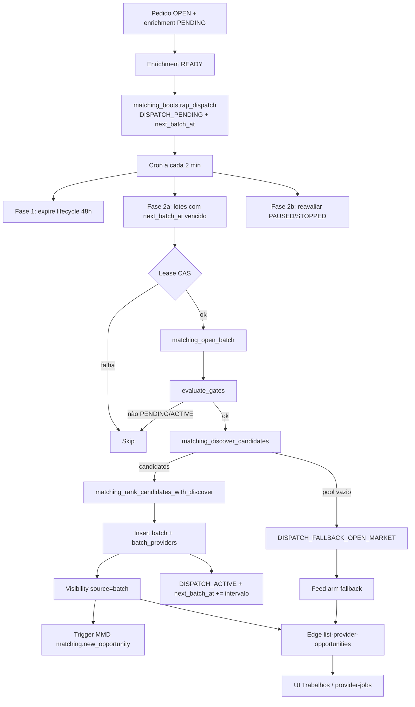

# Dispatch, lotes e visibilidade no feed

Documentação de negócio do **matching progressivo** (backend). UI correspondente: [trabalhos-e-propostas](../../provider-jobs/features/trabalhos-e-propostas.md). Beacon GPS: apenas referência em [rastreabilidade](../../../rastreabilidade.md) / feature `device-beacon` — **não** editar neste escopo.

---

## 1. Resumo executivo

Pedido `OPEN` **não** cria dispatch sozinho. Após enrichment `READY`, `matching_bootstrap_dispatch_for_service_request` cria um **dispatch** 1:1 (`DISPATCH_PENDING` + delay). Um cron abre **lotes** de prestadores elegíveis (discovery + ranking), grava **visibilidade** e notifica via Message Dispatcher. O prestador consome o feed pela Edge **`list-provider-opportunities`**. Gates pausam ou param novos lotes/propostas; pool esgotado abre **mercado aberto**; sem nenhuma proposta em 24h/48h o cliente é avisado e o pedido pode ser cancelado automaticamente.

---

## 2. Objetivo de negócio

- Distribuir demanda de forma **progressiva** (não broadcast imediato).
- Priorizar prestadores por **proximidade, qualidade e conversão**, com exploração controlada.
- Alinhar **notificação** à **visibilidade** no feed.
- Proteger o cliente de sobrecarga de propostas (STOPPED) e o sistema de saturação de chats (PAUSED).
- Tratar pedidos **órfãos** (zero propostas) com comunicação e auto-cancel.

---

## 3. Localização na plataforma

| Superfície | Path / entry |
|------------|----------------|
| **Sem rota própria** | Módulo backend-only |
| Feed prestador | `/dashboard/jobs` — [provider-jobs](../../provider-jobs/README.md) invoca Edge `list-provider-opportunities` |
| Detalhe (deep link push) | `/dashboard/services/{service_request_id}` (template `matching.new_opportunity`, migration `20260712120000`) |
| Lifecycle cliente | Deep link `/dashboard/services/{id}` nos templates `matching.no_proposal_*` |
| Query params | N/A no backend; sort/cursor/lat/lng no body da Edge |

---

## 4. Perfis envolvidos

| Quem | Pode | Não pode / restrição |
|------|------|----------------------|
| **Prestador active** | Ver feed, dismiss, propor (se não STOPPED), chat (slot CNS) | Ver linhas de matching direto (RLS deny) |
| **Prestador suspended** | — | Feed vazio (200); fora do discovery |
| **Cliente** | Criar/cancelar pedido; receber 24h/48h | Abrir lotes ou listar oportunidades de outros |
| **service_role / cron** | Abrir lotes, expirar, gates, cancel sistema | — |

---

## 5. Fluxo funcional principal

---

## 6. Fluxos alternativos e exceções

| Cenário | Comportamento |
|---------|----------------|
| **Pool esgotado no open batch** | Status → `DISPATCH_FALLBACK_OPEN_MARKET`; evento `pool_exhausted`; `next_batch_at` null |
| **PENDING/ACTIVE com propostas ≥ slot cap** | Gate → `DISPATCH_STOPPED`; sem novos lotes; nova proposta bloqueada |
| **Chats ativos ≥ pause threshold** | Gate → `DISPATCH_PAUSED`; sem novos lotes; visibilidade já concedida permanece |
| **Aceite de proposta** | Dispatch → `DISPATCH_MATCHED` (terminal); revoke visibility; MMD pending cancelado |
| **Cancelamento do pedido (cliente ou sistema 48h)** | → `DISPATCH_CANCELLED`; revoke visibility |
| **Lifecycle dispatch 48h** | Cron fase 1 → `DISPATCH_EXPIRED` |
| **Lease em uso / expirado** | Outro worker não adquire; janitor `matching_force_release_stale_leases` |
| READY sem dispatch | Sweeper `enrichment_repair_ready_without_dispatch` (janela **7 dias** em `materialized_at`) |
| **Prestador dismiss** | Batch: `dismissed_at`; fallback: linha `fallback_dismiss`; evento `provider_declined` |
| **MMD falha** | Ingest pode falhar; **não** revoga visibilidade |
| **Duplo cron no mesmo dispatch** | Lease + `SKIP LOCKED` + unique `(dispatch_id, batch_number)` |

---

## 7. Regras de negócio (numeradas)

1. **Bootstrap (READY-handoff):** `trg_service_request_dispatch_bootstrap` **DROP**ada. Dispatch criado só por `matching_bootstrap_dispatch_for_service_request` na TX de `enrichment_finalize_ready` (ou sweeper READY-sem-dispatch, limitado a enrichments com `materialized_at` nos **últimos 7 dias**). No máximo um dispatch (`UNIQUE service_request_id`), status `DISPATCH_PENDING`, `next_batch_at = now() + matching.dispatch_start_delay_minutes` (default **5**). O delay de 5 min e o relógio de lifecycle começam neste bootstrap — **não** no insert `OPEN` (matching CONTEXT #135).
2. **Um lote por processamento** quando status ∈ {`DISPATCH_PENDING`, `DISPATCH_ACTIVE`} e `next_batch_at ≤ now()`.
3. **Tamanho do lote:** `matching.batch_size` (default **10**) após ranking.
4. **Intervalo entre lotes:** `matching.batch_interval_minutes` (default **60**).
5. **Lifecycle do dispatch:** `matching.dispatch_lifecycle_hours` (default **48**) a partir de `created_at` do dispatch (pós-bootstrap) → `DISPATCH_EXPIRED`.
6. **Ladder de gates** (`evaluate_service_request_dispatch_gates`): STOPPED > PAUSED > FALLBACK (se `fallback_opened_at`) > ACTIVE/PENDING. Terminais (`MATCHED`/`CANCELLED`/`EXPIRED`) não são reavaliados.
7. **STOPPED:** propostas `PENDING` + `REVISION_REQUESTED` ≥ `chats.max_active_slots_per_service_request` (default **4**).
8. **PAUSED:** chats `ACTIVE` com mensagem e `last_interaction_at` na janela `matching.dispatch_active_chat_window_hours` (default **24**) ≥ `matching.dispatch_pause_active_chat_threshold` (default **10**).
9. **Nova proposta** com dispatch `DISPATCH_STOPPED` → erro `DISPATCH_STOPPED`.
10. **Iniciar conversa** (`cns_initiate_conversation`): **sem** gate STOPPED (só slot CNS) — evidência COMMENT + teste.
11. **Discovery:** prestador `role=provider`, `operational_status=active`, ofereceere serviço, não já em visibility batch ativa; path beacon (raio + H3 + frescor) ∪ path bairro; load `PENDING_PAYMENT` agendado abaixo de `matching.provider_max_scheduled_load` (default **28**) na janela lookforward.
12. **Ranking:** pesos proximity/quality/conversion + penalties/boosts (ver §14); sem beacon aplica `matching.no_beacon_score_penalty` (default **0.20**).
13. **Feed batch:** visibility `source=batch`, não revogada/dismissed, SR `OPEN`, dispatch não MATCHED/CANCELLED, ainda ofereceere o serviço, sem proposta própria “em andamento” / chat ativo recente (filtros do RPC).
14. **Feed fallback:** `fallback_opened_at` set, status ≠ `DISPATCH_EXPIRED`/`MATCHED`/`CANCELLED`, área + serviço, sem batch visibility ativa e sem `fallback_dismiss`.
15. **Dismiss:** só remove do feed; não bloqueia `get_service` nem CNS (teste `get_service_no_dispatch_side_effects`).
16. **Suspenso:** Edge e RPC retornam feed vazio.
17. **Sem proposta 24h:** push `matching.no_proposal_seeking` (idempotente por SR).
18. **Sem proposta 48h:** cancel sistema + push/e-mail `matching.no_proposal_auto_cancelled`; qualquer linha em `provider_proposals` exclui o SR do janitor.
19. **Notificação de lote:** push + e-mail `matching.new_opportunity` por prestador no batch; deep link detalhe do serviço.
20. **RLS:** acesso direto authenticated/anon **negado** às tabelas de matching.

---

## 8. Campos e dados (inputs / shape)

### 8.1 Edge `list-provider-opportunities` (body)

| Campo | Tipo | Default / regra |
|-------|------|-----------------|
| `sort_mode` | `newest` \| `nearest` \| `least_competitive` | `newest` se inválido |
| `cursor` | string opaca | null |
| `limit` | int | clamp 1–50 (Edge); RPC usa `matching.feed_page_max` |
| `lat` / `lng` | number \| null | ambos ou nenhum; obrigatórios se `nearest` |

### 8.2 Item do feed (contrato compartilhado)

| Campo | Origem |
|-------|--------|
| `service_request_id`, `title`, `description` | `service_requests` |
| `service_name`, `service_icon_key`, `service_color_key` | `platform_services` |
| `neighborhood`, `urgency` | endereço / SR |
| `granted_at` | visibility.granted_at **ou** dispatch.fallback_opened_at |
| `distance_km` | ST_Distance SR ↔ ponto GPS do request (null sem coords) |
| `active_chat_count_24h` | chats ACTIVE com mensagem na janela |
| `source` | `batch` \| `fallback` (**feed**; ≠ coluna DB `fallback_dismiss`) |

### 8.3 Constantes-chave (`platform_constants`)

Ver seeds em `20260711000000` + `20260802190000` (trecho no README do módulo e §7).

---

## 9. Validações de front-end

Superfície em **provider-jobs** (não neste módulo):

- Sort `nearest` exige GPS de feed (`useProviderLocation`); sem GPS, aba oculta e fallback para `newest`.
- Limit clampado com `FEED_MAX_LIMIT` (50).
- Cursor inválido detectado por mensagem / pattern e tratado no hook/API.
- Badge **Mercado aberto** quando `source === "fallback"`.

---

## 10. Validações de back-end

| Camada | Regras |
|--------|--------|
| **Edge** | JWT; só `role=provider`; 429 rate limit 60/min; coords válidas; nearest exige lat/lng; suspended → 200 vazio |
| **RPC `list_provider_opportunities`** | `auth.uid()` = `p_provider_id` (exceto service_role); cursor decode 22023; nearest exige coords |
| **RPC `dismiss_provider_opportunity`** | Auth + role provider; idempotente |
| **`create_provider_proposal`** | Gate `DISPATCH_STOPPED` ao adicionar proposta in-flight |
| **`matching_open_batch`** | Só PENDING/ACTIVE pós-gates; unique batch_number |
| **Constraints** | Fallback exige `fallback_opened_at`; terminais com `next_batch_at` null; lease pairing |

---

## 11. Status, estados e transições

### 11.1 Enum `service_request_dispatch_status`

| Status | Significado de produto |
|--------|-------------------------|
| `DISPATCH_PENDING` | Aguardando primeiro lote |
| `DISPATCH_ACTIVE` | Distribuição progressiva em andamento |
| `DISPATCH_PAUSED` | Novos lotes suspensos (chats) |
| `DISPATCH_STOPPED` | Limite de propostas; bloqueia **nova** proposta |
| `DISPATCH_FALLBACK_OPEN_MARKET` | Pool de lote esgotado; mercado aberto |
| `DISPATCH_MATCHED` | Proposta aceita (terminal) |
| `DISPATCH_CANCELLED` | Pedido cancelado (terminal) |
| `DISPATCH_EXPIRED` | Lifecycle do dispatch esgotado (terminal) |

### 11.2 Eventos de auditoria (`service_request_dispatch_event_type`)

`state_transition`, `batch_opened`, `pool_exhausted`, `provider_viewed`, `provider_declined`, `dispatch_expired`, `dispatch_paused`, `dispatch_resumed`.

### 11.3 Visibilidade (coluna `source` na tabela)

| Valor DB | Uso |
|----------|-----|
| `batch` | Grant de lote (`granted_at` obrigatório) |
| `fallback_dismiss` | Marcador de descarte no mercado aberto (`dismissed_at` set; sem grant) |

---

## 12. Persistência

| Onde | O quê |
|------|--------|
| **Servidor** | Tabelas listadas no README §7; `platform_constants`; templates MMD |
| **Cliente** | Sem draft de matching; React Query cache do feed em provider-jobs |
| **Telemetria** | `job_runs` nos crons `matching_process_service_request_dispatches` e `process_service_requests_without_proposals` |

---

## 13. Integrações

| Sistema | Contrato |
|---------|----------|
| **pg_cron** | `matching_process_service_request_dispatches` → `*/2 * * * *` |
| **pg_cron** | `process_service_requests_without_proposals` → `*/15 * * * *` |
| **pg_cron** | `matching_force_release_stale_leases` (janitor de lease) |
| **MMD** | `matching.new_opportunity` (push+email); `matching.no_proposal_seeking` (push); `matching.no_proposal_auto_cancelled` (push+email) |
| **CNS** | Gates inline em propose/accept/reject/expire; MATCHED no accept; CANCELLED no cancel |
| **Edge** | `list-provider-opportunities` → RPC `list_provider_opportunities` |
| **Beacon** | `user_device_beacons` → `provider_latest_locations` (fora do escopo de edição) |

---

## 14. Listagens, buscas, filtros, paginação, ordenação

| Sort | Critério | Notas |
|------|----------|-------|
| `newest` | `granted_at` DESC | Default sem GPS no app |
| `nearest` | `distance_km` ASC | Exige lat/lng; distância só com GPS do request |
| `least_competitive` | `active_chat_count_24h` ASC | Usa janela de chats da constante matching |

Paginação **keyset** via cursor opaco (sort + k1 + sr_id). `has_more` / `next_cursor`.

Filtros implícitos do feed: SR OPEN; exclusões por proposta/chat do próprio prestador; offered service no arm batch (migration `20260712090000`).

---

## 15. Ações disponíveis

| Ação | Quem | Pré-condição | Resultado | Erro típico |
|------|------|--------------|-----------|-------------|
| Abrir lote | Cron | PENDING/ACTIVE + due + lease | Visibility + MMD + next_batch_at | Skip se gate/lease |
| Listar oportunidades | Prestador | JWT provider | Página JSON | 401/403/429/400 |
| Dismiss | Prestador | Oportunidade batch ou fallback elegível | Fora do feed | Auth |
| Record view | Prestador | RPC audit | Evento `provider_viewed` (unique) | — |
| Criar proposta | Prestador | SR OPEN; não STOPPED | Proposta + gate re-eval | `DISPATCH_STOPPED` |
| Iniciar chat | Prestador | Slot CNS | Chat | Sem STOPPED |
| Aceitar proposta | Cliente | PENDING | MATCHED + side effects CNS | — |
| Cancelar pedido | Cliente / cron 48h | OPEN | CANCELLED + dispatch cancel | — |

---

## 16. Dependências

| Upstream | Downstream / consumidor |
|----------|-------------------------|
| `service_requests`, `client_addresses`, `platform_neighborhoods` | Discovery / fallback |
| `provider_offered_services`, `provider_service_area_neighborhoods` | Elegibilidade |
| `provider_latest_locations` / device-beacon | Path GPS do lote |
| `chats`, `provider_proposals` | Gates e filtros de feed |
| `message_dispatcher` | Notificações |
| **provider-jobs** | UI do feed |
| **view-services** | Deep links de detalhe |

---

## 17. Regras implícitas

- Nomes de status no código usam prefixo `DISPATCH_*` (docs de produto às vezes abreviam PAUSED/STOPPED).
- `source` no **JSON do feed** (`fallback`) ≠ `source` na **tabela** (`fallback_dismiss`).
- Prestador sem GPS de feed ainda lista oportunidades; só perde sort nearest.
- Coordenadas do feed **não** são inventadas no servidor.
- Deep link de oportunidade foi atualizado de `/dashboard/jobs` para `/dashboard/services/:id`.
- Quality/conversion usam defaults neutros até mínimo de ratings/resoluções (`matching.rating_min_count_for_ranking`, `matching.conversion_min_resolved_for_ranking` = 3).
- H3 ring k=3; se extensão H3 falhar, discovery beacon segue sem filtro de célula.
- Gate re-eval após resume de PAUSED/STOPPED seta `next_batch_at = now()` para ACTIVE.

---

## 18. Riscos

| Risco | Mitigação / evidência |
|-------|------------------------|
| Dois workers abrem o mesmo lote | Lease CAS + unique batch_number + SKIP LOCKED |
| Lease órfão | Janitor `matching_force_release_stale_leases` |
| Feed “fantasma” após remoção de serviço ofertado | Check `provider_offered_services` no arm batch |
| Confusão suporte: sem card vs bug | Checklist de elegibilidade §7 |
| EXPIRED ainda com visibility batch | Mercado aberto lazy some; batch arm ainda filtra MATCHED/CANCELLED mas não exige não-EXPIRED explicitamente no arm batch — **evidência parcial**: validar cenários EXPIRED + batch residual em QA |

---

## 19. Evidências

| Artefato | Path |
|----------|------|
| Constantes | `supabase/migrations/20260711000000_matching_platform_constants_seeds.sql` |
| Enums/tabelas | `.../20260711040000_matching_dispatch_enums_tables.sql` |
| Bootstrap (legado OPEN trigger) | `.../20260711050000_matching_dispatch_bootstrap_trigger.sql` — **superseded**; DROP em `20260804120000_drop_service_request_dispatch_bootstrap_trigger.sql` |
| Bootstrap READY-handoff | `20260804110000_matching_bootstrap_dispatch_rpc.sql`; chamado de `enrichment_finalize_ready` / sweeper repair |
| Gates | `.../20260711070000_matching_gate_helper.sql` |
| Discovery/ranking | `.../20260711080000_matching_discovery_ranking.sql` |
| Open batch + cron 2 min | `.../20260711090000_matching_open_batch_and_cron.sql` |
| MMD lote | `.../20260711100000_matching_mmd_batch_notification_trigger.sql`, `.../20260712120000_matching_new_opportunity_service_detail_deeplink.sql` |
| Feed + dismiss | `.../20260711110000_matching_feed_audit_rpcs.sql`, `.../20260712090000_matching_feed_batch_offered_service_check.sql` |
| CNS / MATCHED / cancel | `.../20260711130000`–`20260711180000` |
| Lifecycle 24h/48h | `.../20260802190000_service_request_no_proposal_lifecycle.sql` |
| Edge | `supabase/functions/list-provider-opportunities/` |
| Contrato | `supabase/functions/_shared/contracts/list-provider-opportunities/types.ts` |
| App | `src/features/provider-jobs/api/providerJobs.api.ts`, `JobCard.tsx` (badge Mercado aberto) |
| pgTAP | `supabase/tests/matching/` |

---

## 20. Pendências

| ID | Descrição | Status |
|----|-----------|--------|
| P-MD-01 | Mecanismo admin para `operational_status` | Fora do MVP (comentário migration M2) |
| P-MD-02 | Comportamento exato do arm **batch** quando dispatch já está `DISPATCH_EXPIRED` (visibility residual) | Evidência parcial — validar com QA/pgTAP |
| P-MD-03 | Docs em `docs/matching-algorithm/` são design/QA técnico; sincronizar divergências com código sob demanda | Complementar |
| P-MD-04 | ADR 0001 / design M15 pedem `DROP FUNCTION match_provider_jobs` + remoção da Edge; **Edge removida**, RPC **não dropada**; arquivo `*_matching_drop_legacy_feed.sql` **ausente** | Aberto — ver § legado abaixo |
| P-MD-05 | Gate `payment_provider_is_credentialed` / `PROVIDER_NOT_CREDENTIALED` está na RPC legado `match_provider_jobs` (`20260801240000`); **não** aparece em `list_provider_opportunities` (migrations do feed) | Gap: gate de credentialing no caminho morto do feed |

---

## Legado — feed aberto vs estado real

Estado auditado no tree + banco local (2026-08-02):

| Artefato | Estado | Evidência |
|----------|--------|-----------|
| Edge **`list-provider-opportunities`** | **Viva** | Código em `supabase/functions/list-provider-opportunities/`; `[functions.list-provider-opportunities]` em `config.toml`; front `providerJobs.api.ts` invoca essa função |
| Edge **`match-provider-jobs`** | **Morta (código)** | Arquivos `index.ts`/`types.ts` deletados (histórico git matching); **sem** bloco em `config.toml`; pasta `supabase/functions/match-provider-jobs/` permanece **vazia** no filesystem (não versionada — dirs vazios não entram no git) |
| RPC **`list_provider_opportunities`** | **Viva** | Migrations `20260711110000`, `20260712090000`, …; presente no DB local |
| RPC **`match_provider_jobs`** | **Presente no schema (órfã do feed)** | DB local lista a função; última `CREATE OR REPLACE` em `20260801240000_payment_match_provider_jobs_onboarding_gate.sql` (gate NetCred); EXECUTE só `service_role`/`postgres`; **nenhum** `invoke`/`rpc` em `src/` (só tipagem gerada) |
| Migration **`20260711230000_matching_drop_legacy_feed.sql`** | **Não existe** | Lista de migrations: `…11220000` → `…11240000` (sem `11230000`); design/tasks/QA técnico ainda citam o arquivo |

**Conclusão de negócio:** o feed do prestador **não** usa mais o feed aberto. O caminho vivo é matching progressivo + Edge/RPC `list-provider-opportunities`. A pasta vazia e a RPC legado são **resíduo técnico**, não superfície de produto — exceto risco de alguém reativar a Edge antiga ou assumir DROP já feito.

---

## Anexo A — Matriz de elegibilidade (discovery)

| Critério | Beacon path | Neighborhood path |
|----------|-------------|-------------------|
| `operational_status = active` | Sim | Sim |
| Oferece `service_id` do pedido | Sim | Sim |
| Já em visibility batch ativa | Exclui | Exclui |
| Beacon fresco ≤ `beacon_location_max_age_hours` (24h) | Sim | N/A |
| `ST_DWithin` ≤ `discovery_beacon_radius_meters` (20 km) | Sim | N/A |
| H3 em disk k=3 (se disponível) | Preferencial | N/A |
| Bairro do endereço ∈ área do prestador | N/A | Sim |
| Load agendada abaixo do max | Sim | Sim |
| Cap pool | `discovery_pool_cap` (200) | Idem |

---

## Anexo B — Componentes de ranking (snapshot)

Fórmula efetiva (ordem no SQL):  
`(primary_score * (1 - beacon_penalty_mult) * (1 + exploration_boost)) + inactivity_boost + recent_completion_penalty + recent_batch_boost + recent_batch_penalty + exposure_penalty`

| Componente | Default / regra |
|------------|-----------------|
| `primary_score` | prox×0.40 + (quality/5)×0.35 + conversion×0.25 |
| `beacon_penalty_mult` | 0.20 se sem beacon válido |
| `exploration_boost` | até 0.10 se quality/5 ≥ 0.4 e conversion ≥ 0.35 |
| Inatividade | +0.05 se última conclusão há mais de 30 dias ou null |
| Completions recentes | −0.10 se ≥ 2 em 14 dias |
| Batch recente | +0.05 se conversion ≥ 0.4 e último batch há mais de 30 min |
| Batches 24h | −0.05 × count |
| Exposição 24h | −0.02 × count |

Ordenação final: `ranking_score DESC`, `exposure_count ASC`, `provider_id ASC`.

---

## Anexo C — Checklist QA (cenários)

- [ ] Enrichment READY → bootstrap cria dispatch PENDING com delay 5 min (OPEN sozinho **não** cria)  

- [ ] Cron abre 1º lote ≤ batch_size; notificação MMD; card no feed  
- [ ] Segundo lote após intervalo; sem duplicate batch_number  
- [ ] Pool vazio → FALLBACK; badge Mercado aberto  
- [ ] ≥4 propostas PENDING/REVISION → STOPPED; proposta nova falha; chat ainda possível se slot  
- [ ] ≥10 chats ativos 24h → PAUSED; resume reabre next_batch_at  
- [ ] Aceite → MATCHED; feed some  
- [ ] Cancel cliente → CANCELLED  
- [ ] 24h sem proposta → push seeking; 48h → cancel + push/email  
- [ ] Pedido com qualquer proposal não entra no janitor 24/48  
- [ ] Suspended → feed vazio  
- [ ] Dismiss remove do feed; get_service ainda ok  
- [ ] nearest sem lat/lng → 400  
- [ ] Lease concorrente: um worker só  

---

## Atualização de auditoria

- **2026-08-02** — Documentação expandida para 20+ seções canônicas com evidência em migrations `20260711*`, `20260712*`, `20260802190000`, Edge `list-provider-opportunities` e consumo em `provider-jobs`.
- **2026-08-02 (legado)** — Esclarecido: Edge `match-provider-jobs` removida + pasta vazia residual; RPC `match_provider_jobs` ainda no schema; migration de drop M15 ausente; gate de credentialing só na RPC legado (P-MD-04/05).
- **2026-08-04** — Bootstrap alinhado ao READY-handoff (service-completion): DROP do trigger OPEN; `matching_bootstrap_dispatch_for_service_request`; delay 5 min a partir do bootstrap (CONTEXT #135).
- **2026-08-05** — Sweeper READY-sem-dispatch documentado com janela de **7 dias** em `materialized_at` (hardening service-completion).
