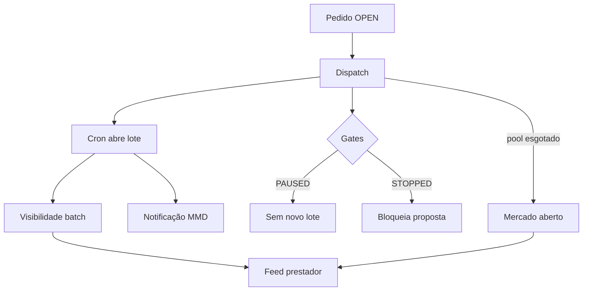

# Dispatch, lotes e visibilidade no feed

Documentação de negócio do matching progressivo (backend). UI correspondente: [trabalhos-e-propostas](../../provider-jobs/features/trabalhos-e-propostas.md).

---

## 1. Fluxo resumido

1. Cliente cria pedido **OPEN** → trigger cria `service_request_dispatches`.
2. Cron (≈ a cada 2 min) abre **um lote** por vez: descobre prestadores (`matching_discover_candidates`), ranqueia, grava `service_request_dispatch_batches` + visibilidade `source = batch`.
3. Message Dispatcher notifica prestadores do lote (`matching.new_opportunity`).
4. Prestador vê card em **Trabalhos** se tiver visibilidade ativa.
5. Se candidatos esgotam → **FALLBACK_OPEN_MARKET**; novos prestadores elegíveis veem via **mercado aberto** (`source = fallback`).
6. Gates de negócio podem **pausar** novos lotes ou **parar** novas propostas sem fechar chats existentes.

---

## 2. Gates que o suporte deve conhecer

| Gate | Efeito no prestador | Efeito no cliente |
|------|---------------------|-------------------|
| **PAUSED** | Mantém oportunidades já visíveis; **não** abre novos lotes | Pode demorar a receber novos orçamentos até gate liberar |
| **STOPPED** | **Não** envia nova proposta (`DISPATCH_STOPPED`); pode **iniciar conversa** se slot disponível | Limite de propostas em andamento atingido |
| **EXPIRED** | Visibilidade de **lote** pode persistir; **mercado aberto lazy** some | Pedido envelheceu na política de dispatch |
| **Proposta aceita** | Dispatch **MATCHED**; demais fluxos seguem CNS | Contratação via aceite de proposta |

---

## 3. Idempotência e concorrência

- **Lease** por dispatch evita dois workers abrindo o mesmo lote.
- **Janitor** libera leases expirados (worker crash).
- **Sem duplicate batch_number** por dispatch (garantia testada em pgTAP).

---

## 4. Evidências

- Migrations `20260711040000`–`20260711230000` (`supabase/migrations/`).
- Testes pgTAP em `supabase/tests/matching/`.
- E2E Playwright: `e2e/matching/dispatch-lifecycle.spec.ts`, `provider-feed.spec.ts`.
