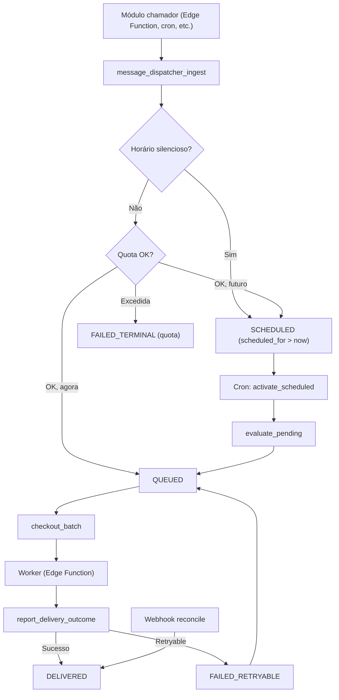

# Message Dispatcher (Notificações)

## 1. Contexto de negócio

O **Message Dispatcher** é o subsistema responsável pelo envio de **notificações multicanal** (e-mail e push) aos usuários da plataforma Renovi. Ele opera inteiramente no backend (Supabase — schema `message_dispatcher`, Edge Functions e cron jobs), sem tela própria no front-end. Outros módulos produzem "intenções de envio" via RPC e o dispatcher se encarrega de agendar, avaliar limites, entregar e rastrear cada mensagem.

## 2. Escopo funcional

| Capacidade | Descrição |
|------------|-----------|
| Ingestão idempotente | RPC `message_dispatcher_ingest` recebe intenção de envio com chave de idempotência, template e canal. |
| Máquina de estados (FSM) | Status do dispatch: `PENDING_EVALUATION → SCHEDULED → QUEUED → PROCESSING → DELIVERED / FAILED_*`. Transições validadas por trigger. |
| Controle de quota | Limites diários por canal (e-mail 5/dia, push 20/dia) e cooldown entre pushes (padrão 10 min). |
| Horário silencioso | Mensagens entre **22:00** e **06:00** (horário de Brasília) são automaticamente reagendadas para **06:00 BRT** do dia seguinte (ou mesmo dia se < 06:00). Ver [feature: horário silencioso](./features/horario-silencioso.md). |
| Cancelamento | RPC `message_dispatcher_cancel` permite cancelar dispatches em estados não terminais. |
| Checkout e lease | Worker consome lote via `message_dispatcher_checkout_batch` com `SKIP LOCKED` e lease temporário. |
| Report de entrega | Worker reporta sucesso/falha via `message_dispatcher_report_delivery_outcome`; falhas retryable seguem backoff exponencial. |
| Reconciliação de webhook | Eventos de vendor (Resend, FCM) reconciliados via `message_dispatcher_reconcile_vendor_event` com deduplicação por `vendor_event_id`. |
| Engagement tracking | Abertura de e-mail (webhook Resend) e clique em push (app) registrados em `message_dispatch_engagements`. |
| Auditoria | Tabela `message_dispatcher_audit` mantém histórico de transições de status com delta. |
| Higiene de token FCM | Tokens inválidos detectados no report desabilitam o beacon do dispositivo automaticamente. |

## 3. Canais suportados

| Canal | Vendor | Observações |
|-------|--------|-------------|
| `email` | Resend | Template renderizado na Edge Function `message-dispatcher-worker`. Webhook de delivered/bounce/opened tratados. |
| `push` | FCM (Firebase Cloud Messaging) | Fan-out por dispositivo; até 10 devices por dispatch (configurável). |

## 4. Limites e constantes operacionais

Valores padrão em `platform_constants`; podem ser ajustados sem deploy.

| Constante | Chave | Padrão |
|-----------|-------|--------|
| Limite diário e-mail | `message_dispatcher.email_daily_limit` | 5 |
| Limite diário push | `message_dispatcher.push_daily_limit` | 20 |
| Cooldown entre pushes | `message_dispatcher.push_cooldown_minutes` | 10 min |
| Lease do worker | `message_dispatcher.lease_seconds` | 30 s |
| Base do backoff | `message_dispatcher.backoff_base_seconds` | 60 s |
| Máx. devices por dispatch | `message_dispatcher.max_devices_per_dispatch` | 10 |
| Janela de horário silencioso | (hardcoded) | 22:00–06:00 America/Sao_Paulo |

## 5. Fluxo macro

## 6. Entidades principais

| Tabela (schema `message_dispatcher`) | Papel |
|--------------------------------------|-------|
| `message_dispatches` | Registro central de cada envio, com FSM de status. |
| `message_dispatch_deliveries` | Fan-out por dispositivo (push); snapshot de token FCM. |
| `message_templates` | Templates de mensagem por canal e chave. |
| `message_dispatcher_user_limits` | Contadores e timestamps de quota/cooldown por perfil. |
| `message_dispatcher_audit` | Log de transições de status. |
| `message_dispatcher_vendor_events` | Deduplicação de webhooks de vendor. |
| `message_dispatch_engagements` | Tracking de abertura/clique por dispatch. |

## 7. Segurança e permissões

- Todas as RPCs do fluxo core (`ingest`, `evaluate_pending`, `activate_scheduled`, `checkout_batch`, `report_delivery_outcome`, `reconcile_vendor_event`) são **`SECURITY DEFINER`** com acesso restrito a **`service_role`**.
- `message_dispatcher_cancel` e `message_dispatcher_audit_timeline` permitem **`authenticated`** (com validação de ownership via `auth.uid()`).
- `message_dispatcher_record_push_click` permite **`authenticated`** com validação de ownership e canal `push`.
- Tabelas do schema `message_dispatcher` possuem **RLS** habilitado; acesso via RPCs SECURITY DEFINER.

## 8. Edge Functions relacionadas

| Função | Papel |
|--------|-------|
| `message-dispatcher-worker` | Consome `checkout_batch`, renderiza templates, envia via Resend/FCM, reporta outcome. |
| `message-dispatcher-webhook-resend` | Recebe webhooks Resend, valida assinatura, chama `reconcile_vendor_event`. |

## 9. Features documentadas

| Feature | Documento | Status |
|---------|-----------|--------|
| Horário silencioso (quiet hours) | [horario-silencioso.md](./features/horario-silencioso.md) | Concluída |

## 10. Evidências

| Artefato | Relevância |
|----------|------------|
| `supabase/migrations/20260621100100_create_message_dispatcher_fsm_functions.sql` | FSM, RPCs, quiet hours, quotas |
| `supabase/functions/message-dispatcher-worker/` | Worker de entrega |
| `supabase/functions/message-dispatcher-webhook-resend/` | Webhook Resend |
| `src/features/notifications/` | API client-side para engagement tracking |
| `supabase/tests/message_dispatcher/` | Testes pgTAP da lógica SQL |
