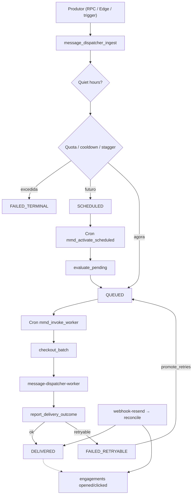

# Message Dispatcher (Notificações)

## 1. Leitura para negócio

- **Para que serve:** enviar **e-mail** e **push** de forma confiável, com limites anti-spam, horário silencioso, retries e rastreio de abertura/clique.
- **Quem é afetado:** **todos os usuários** com perfil (destinatários); **módulos produtores** (CNS, matching, payments, KYC, reagendamento, etc.) que ingerem intenções; **ops** (fila, crons, webhooks).
- **Sem tela própria:** não há rota de UI; o app só participa no **clique de push** (`recordPushClick`).
- **Não confundir** com **dispatch de pedido** do matching (`service_request_dispatches`) — ver [matching-dispatch](../matching-dispatch/README.md).

## 2. Visão geral funcional

O **Multichannel Message Dispatcher (MMD)** vive no schema `message_dispatcher`. Fluxo macro:

1. **Ingest** (`message_dispatcher_ingest`) — intenção idempotente (template + canal + perfil).
2. **Quota / cooldown / quiet hours / stagger push** — podem resultar em `QUEUED`, `SCHEDULED` ou `FAILED_TERMINAL`.
3. **Crons** ativam agendados, promovem retries, reclamam leases e invocam o worker.
4. **Worker** (`message-dispatcher-worker`) — checkout → render → Resend/FCM → report.
5. **Webhook Resend** — delivered / bounce / opened (engagement).
6. **App** — clique em push → `message_dispatcher_record_push_click`.

## 3. Features do módulo

| Feature | Documento | Status |
|---------|-----------|--------|
| Pipeline e FSM | [pipeline-e-fsm.md](./features/pipeline-e-fsm.md) | Documentada |
| Quotas e canais | [quotas-e-canais.md](./features/quotas-e-canais.md) | Documentada |
| Horário silencioso | [horario-silencioso.md](./features/horario-silencioso.md) | Documentada |
| Engagement (push click / e-mail open) | [engagement-push-click.md](./features/engagement-push-click.md) | Documentada |

## 4. Perfis envolvidos

| Papel | Relação com o MMD |
|-------|-------------------|
| Destinatário (`profiles.id`) | Recebe e-mail/push; pode cancelar próprio dispatch e registrar clique de push |
| `service_role` / Edge / cron | Ingest privilegiado, checkout, report, reconcile, disable beacon |
| Produtores de domínio | Chamam ingest (direto ou via wrappers); **não** mutam FSM pelo client |
| Ops | Observam fila via `message_dispatcher_stats` / alert views (sem `job_runs`) |

## 5. Principais fluxos

| Fluxo | Resumo |
|-------|--------|
| Ingest feliz | Template ativo + quota OK → `QUEUED` ou `SCHEDULED` |
| Quiet hours | Entrega na janela 22:00–06:00 BRT → reagenda 06:00 + `bypass_limits` |
| Quota diária | Contagem live 24h → insert já em `FAILED_TERMINAL` com `*_daily_quota_exceeded` |
| Push stagger | Slot = max(now, last_sent+cooldown, cauda da fila) |
| Worker | Lease + send + report → `DELIVERED` / `FAILED_*` |
| Webhook | Svix verify → reconcile (delivered / hard bounce / opened) |
| Engagement app | Tap na notificação com `data.dispatch_id` → RPC click |

Detalhe: [pipeline-e-fsm](./features/pipeline-e-fsm.md), [quotas-e-canais](./features/quotas-e-canais.md).

## 6. Regras transversais

- Mutações de **status** só via RPCs / triggers; client **não** faz UPDATE direto em `message_dispatches.status`.
- Enum de canal: **`email` | `push`** apenas.
- Terminais FSM: `DELIVERED`, `FAILED_TERMINAL`, `CANCELED`.
- `bypass_limits` pula reavaliação de quota/cooldown (ex.: quiet hours, alguns templates de domínio).
- Telemetria MMD: schema próprio (`message_dispatcher_stats`, audit) — **não** usa `job_runs` (exceção documentada na regra de crons).

## 7. Entidades

| Tabela / tipo | Papel |
|---------------|-------|
| `message_dispatches` | Registro FSM central |
| `message_dispatch_deliveries` | Fan-out push por device (snapshot FCM no checkout) |
| `message_templates` | Catálogo `(template_key, channel)` |
| `message_dispatcher_user_limits` | Âncora FOR UPDATE + cache de contadores / `last_push_sent_at` |
| `message_dispatcher_audit` | Histórico de transições |
| `message_dispatcher_vendor_events` | Dedup de webhook por `vendor_event_id` |
| `message_dispatch_engagements` | opened / clicked (ortogonal à FSM) |
| `message_dispatcher_stats` | Gauges de fila (cron `mmd_refresh_stats`) |

## 8. Integrações

| Integração | Papel |
|------------|-------|
| Resend (+ Inbucket local) | E-mail; webhook delivered/bounce/opened |
| FCM HTTP v1 | Push por device |
| `user_device_beacons` | Tokens no checkout; higiene em token inválido |
| `auth.users.email` | Destinatário de e-mail no checkout |
| Vault `dispatcher_worker_url` / `dispatcher_cron_secret` | Fan-out HTTP do cron para o worker |
| Edge `message-dispatcher-ingest` | Ingest autenticado (JWT = `profileId`; `bypass_limits` forçado `false`) |
| Edge `message-dispatcher-worker` | Entrega |
| Edge `message-dispatcher-webhook-resend` | Ingress Resend |

`orbit-emit-sentry-alerts` é ponte SQL→Sentry de **ops/observabilidade** (pagamentos/crons), **fora** do pipeline MMD — ver [rastreabilidade § ops](../../rastreabilidade.md#opsobservabilidade--orbit-emit-sentry-alerts).
## 9. Riscos e lacunas

| Risco / lacuna | Nota |
|----------------|------|
| Quiet hours hardcoded | P-08 — ver [horario-silencioso](./features/horario-silencioso.md) |
| Fuso único BRT | P-09 |
| Fallback SQL ≠ seed | Se `platform_constants` ausente: cooldown fallback **10** min / lease fallback **30** s; seeds oficiais: cooldown **1**, lease **90** |
| Ingest Edge vs RPC service_role | Maioria dos produtores usa RPC privilegiada; Edge ingest é caminho autenticado restrito |
| Webhook FCM | Tabela aceita vendor `fcm`, mas Edge de webhook documentada é só Resend |

## 10. Evidências

| Artefato | Relevância |
|----------|------------|
| `supabase/migrations/20260621100000_create_message_dispatcher_schema_enums_tables.sql` | Schema, enums, constants, engagements |
| `supabase/migrations/20260621100100_create_message_dispatcher_fsm_functions.sql` | FSM, ingest, cancel, checkout, report, reconcile |
| `supabase/migrations/20260621100200_create_message_dispatcher_audit_triggers.sql` | Audit |
| `supabase/migrations/20260621100300_create_message_dispatcher_cron_jobs.sql` | Crons + invoke worker + stats |
| `supabase/migrations/20260712110000_mmd_push_stagger_scheduled_slots.sql` | Stagger de push (substitui trechos de ingest/evaluate) |
| `supabase/migrations/20260802270000_lockdown_message_dispatcher_disable_device_beacon.sql` | Lockdown disable beacon |
| `supabase/functions/message-dispatcher-worker/` | Worker |
| `supabase/functions/message-dispatcher-webhook-resend/` | Webhook |
| `supabase/functions/message-dispatcher-ingest/` | Ingest HTTP autenticado |
| `src/features/notifications/` | `recordPushClick` |
| `src/lib/push.ts` | Disparo de engagement no tap |
| `supabase/tests/message_dispatcher/` | pgTAP |
