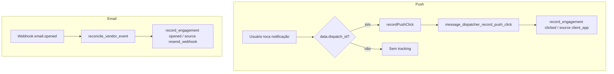

# Engagement — abertura de e-mail e clique em push

## 1. Resumo executivo

- **O que é:** registro de interação do usuário com mensagens já enviadas — **e-mail aberto** (`opened`) e **push clicado** (`clicked`) — ortogonal à FSM do dispatch.
- **Problema que resolve:** medir engajamento sem alterar status de entrega.
- **Quem usa:** webhook Resend (opens); app autenticado no tap da notificação.
- **Sucesso:** linha em `message_dispatch_engagements` com `first_engagement` / incremento de `seen_count`.

## 2. Objetivo de negócio

- Separar “foi entregue” (`DELIVERED`) de “foi aberto/clicado”.
- Permitir analytics/ops sem misturar com retries de envio.
- Idempotência por `(dispatch_id, engagement_type)` via upsert.

## 3. Localização na plataforma

| Superfície | Path |
|------------|------|
| Feature API | `src/features/notifications/api/engagementTracking.api.ts` |
| Public export | `src/features/notifications/index.ts` → `recordPushClick` |
| Disparo no tap | `src/lib/push.ts` (`trackPushClick` em action performed nativo / local) |
| RPC pública | `message_dispatcher_record_push_click` |
| RPC interna | `message_dispatcher_record_engagement` (service_role) |
| Open e-mail | `message-dispatcher-webhook-resend` → reconcile → `email.opened` |

**Sem rota de UI dedicada.**

## 4. Perfis envolvidos

| Papel | Pode |
|-------|------|
| Dono do dispatch (`auth.uid() = profile_id`) | Registrar click |
| `service_role` | Registrar click e engagement genérico |
| Outro usuário | `42501` no click |
| Vendor Resend | Dispara open via webhook (sem JWT de usuário) |

## 5. Fluxo funcional principal



## 6. Fluxos alternativos e exceções

| Cenário | Comportamento |
|---------|---------------|
| Dispatch inexistente | `{ applied: false, reason: 'dispatch_not_found' }` |
| Click em canal ≠ push | `{ applied: false, reason: 'channel_not_push' }` |
| Segundo click/open | Upsert: `seen_count++`, `last_seen_at=now()`, `first_engagement=false` |
| Falha RPC no app | `logger.warn` — **não** bloqueia navegação do deep link |
| Webhook duplicate event id | Noop de reconcile (engagement só no primeiro processamento do event id) |

## 7. Regras de negócio

1. Engagement **não** altera `message_dispatches.status`.
2. Tipos: enum `opened` \| `clicked`.
3. Unique `(dispatch_id, engagement_type)` — um registro lógico por tipo.
4. Push click exige ownership (ou service_role) e `channel = push`.
5. Source fixo no click de app: `'client_app'`.
6. Source no open Resend: `'resend_webhook'`.
7. Payload FCM inclui `data.dispatch_id` (worker) para o app rastrear.
8. Open só se reconcile achar dispatch por `vendor_message_id`.

## 8. Campos e dados

### RPC `message_dispatcher_record_push_click`

| Param | Tipo | Default |
|-------|------|---------|
| `p_dispatch_id` | uuid | obrigatório |
| `p_metadata` | jsonb | `{}` |

Retorno: `applied`, `first_engagement`, `engagement_id` (via record_engagement).

### Tabela `message_dispatch_engagements`

| Campo | Nota |
|-------|------|
| `engagement_type` | opened / clicked |
| `channel` | Copiado do dispatch |
| `source` | Origem do evento |
| `first_seen_at` / `last_seen_at` / `seen_count` | Upsert |
| `metadata` | jsonb livre |

### API TS

```ts
recordPushClick({ dispatchId, metadata? }) → { applied, firstEngagement }
```

## 9. Validações de front-end

- Só chama se `dispatch_id` presente no payload da notificação.
- Erros engolidos após log (best-effort).
- Sem formulário / Zod dedicado.

## 10. Validações de back-end

- `p_dispatch_id` null → `22023`.
- Ownership ≠ service_role → `42501`.
- Canal não push → `applied: false` (não exception).
- RLS: owner SELECT; INSERT/UPDATE/DELETE revogados (só DEFINER).

## 11. Status, estados e transições

Não há FSM de engagement. Campos de “estado”:

| Situação | Observável |
|----------|------------|
| Nunca engajou | Sem linha |
| Primeira vez | `seen_count=1`, `first_engagement=true` |
| Repetição | `seen_count>1`, `first_engagement=false` |

FSM do dispatch permanece independente (ex.: click após `DELIVERED`).

## 12. Persistência

- Servidor: `message_dispatch_engagements`.
- Cliente: nenhum cache local de engagement.
- Webhook: evento também em `message_dispatcher_vendor_events` (dedup).

## 13. Integrações

| Sistema | Papel |
|---------|-------|
| Capacitor Push / LocalNotifications | Action performed → track |
| FCM data payload | Carrega `dispatch_id` |
| Resend webhook `email.opened` | Open tracking |
| Supabase RPC schema `message_dispatcher` | Persistência |

## 14. Listagens, buscas, filtros

Sem UI. Índice `(profile_id, created_at desc)` para consultas futuras/ops.

## 15. Ações disponíveis

| Ação | Quem | Pré-condição | Resultado | Erro |
|------|------|--------------|-----------|------|
| Registrar click | Dono autenticado | Dispatch push próprio | Upsert clicked | 42501 / not found |
| Registrar open | Webhook pipeline | Event opened + vendor id match | Upsert opened | dispatch_not_found noop parcial |
| Ler engagements | Dono (SELECT RLS) | Auth | Linhas próprias | — |

## 16. Dependências

- [pipeline-e-fsm](./pipeline-e-fsm.md) — reconcile e payload FCM.
- `src/lib/push.ts` (fora da pasta `notifications`, mas consumidor).
- Feature `push-permission` / device beacon: **Evidência parcial** quanto a quando o token existe (não alteram engagement diretamente).

## 17. Regras implícitas

- Tracking é fire-and-forget no listener (`void trackPushClick`).
- Open não seta `dispatch_updated` no reconcile (`engagement_recorded: true`).
- Metadata do click é opcional; app hoje chama sem metadata extra.
- Web path de push (Firebase) — **Evidência parcial**: listeners de engagement documentados nos testes/handlers nativos/local; confirmar cobertura web se necessário.

## 18. Riscos

- Notificação sem `dispatch_id` → zero engajamento (silencioso).
- Usuário deslogado no tap → RPC falha (warn); deep link pode ainda navegar.
- Opens dependem do Resend/cliente de e-mail (pixels); não é 100% dos leitores.

## 19. Evidências

- `src/features/notifications/api/engagementTracking.api.ts`
- `src/features/notifications/api/__tests__/engagementTracking.api.test.ts`
- `src/lib/push.ts` (`trackPushClick`, action listeners)
- `src/lib/__tests__/push.test.ts` (engagement cases)
- `supabase/migrations/20260621100000_*` (tabela/enum)
- `supabase/migrations/20260621100100_*` (`record_engagement`, `record_push_click`, reconcile opened)
- `supabase/functions/message-dispatcher-webhook-resend/` + testes `integration_webhook_opened_reconcile_test.ts`
- `supabase/functions/message-dispatcher-worker/fcm.ts` (`dispatch_id` no data)

## 20. Pendências

- Cobertura explícita de click em push **web/PWA** vs nativo: **Evidência parcial**.
- Produto não expõe dashboard de engagement na UI (apenas persistência).
- Atualização de índices transversais: fora de escopo deste pacote.

## 21. Checklist de completude

- [x] Objetivo, atores, fluxos push + e-mail
- [x] Regras, campos, RLS, erros
- [x] Ortogonalidade à FSM
- [x] Evidências de código app + SQL + webhook
- [ ] Analytics GA de click — **não evidenciado** no caminho `recordPushClick` (só logger/Sentry via warn)

## 22. Anexo — Contrato de retorno

| Campo | Significado |
|-------|-------------|
| `applied` | Persistência tentada com sucesso de regra |
| `first_engagement` | Insert vs update (xmax=0 no SQL) |
| `engagement_id` | UUID da linha |
| `reason` | Quando `applied=false` |

## 23. Anexo — QA sugerido

1. Enviar push de teste com `dispatch_id` → tap → linha `clicked` / `source=client_app`.
2. Segundo tap → `seen_count=2`.
3. Tap com outro usuário → 42501.
4. Webhook `email.opened` → linha `opened` / `source=resend_webhook` sem mudar status.
5. Replay mesmo `vendor_event_id` → sem segundo efeito de reconcile.
