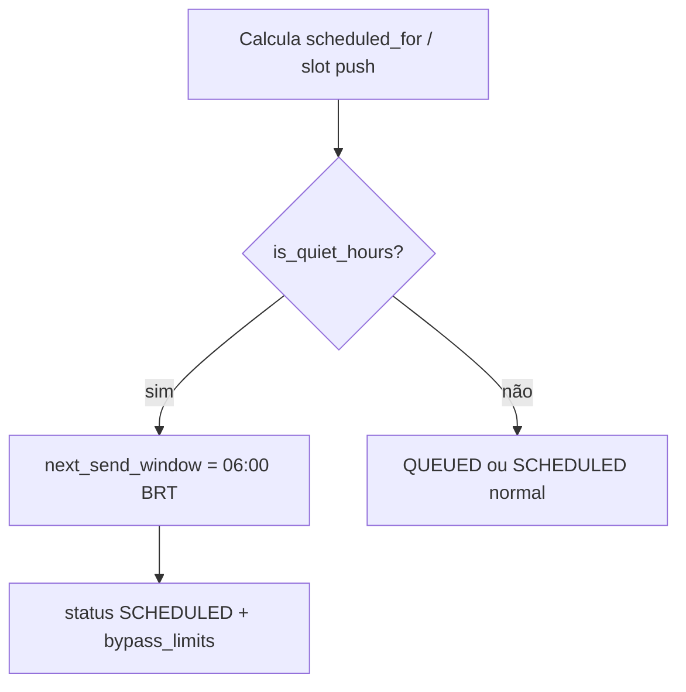

# Horário silencioso (Quiet Hours)

## 1. Resumo executivo

O Message Dispatcher impõe uma **janela de silêncio** das **22:00 às 06:00** no fuso **America/Sao_Paulo**. Entregas que cairiam nessa janela são reagendadas para o próximo **06:00 BRT**, com `bypass_limits = true` para não reaplicar quota na reativação.

## 2. Objetivo de negócio

Evitar notificações na madrugada (experiência e redução de churn por spam noturno), de forma uniforme para e-mail e push.

## 3. Localização na plataforma

Sem UI. Aplicado em SQL:

- `message_dispatcher_ingest` (inclui composição com stagger de push — migration `20260712110000`)
- `message_dispatcher_evaluate_pending` (rede de segurança pós-`activate_scheduled`)

Helpers: `message_dispatcher_is_quiet_hours`, `message_dispatcher_next_send_window`.

Ver também: [pipeline-e-fsm](./pipeline-e-fsm.md), [quotas-e-canais](./quotas-e-canais.md).

## 4. Perfis envolvidos

Todos os destinatários (`profile_id`). Não há opt-out por usuário nem fuso por perfil (P-09).

## 5. Fluxo funcional principal

## 6. Fluxos alternativos e exceções

| Cenário | Resultado |
|---------|-----------|
| Push stagger gera slot às 23h | Reagenda 06:00 + bypass |
| Evaluate durante quiet hours | Pendentes restantes → 06:00 + bypass (não `QUEUED`) |
| Cooldown/stagger dentro da janela | Mesma regra de next window |
| Fora da janela | Sem alteração por quiet hours |

## 7. Regras de negócio

1. Janela: hora local BRT/BRST ≥ 22 ou &lt; 6.
2. `next_send_window`: se hora &lt; 6 → 06:00 **mesmo dia**; senão → 06:00 **dia seguinte**.
3. Reagendamento por quiet hours define `status = SCHEDULED` e `bypass_limits = true` (OR com bypass já pedido).
4. Aplica-se a **email e push**.
5. Janela **hardcoded** (não está em `platform_constants`) — P-08.
6. Abrange ingest e evaluate_pending.

## 8. Campos e dados

| Campo | Impacto |
|-------|---------|
| `scheduled_for` | Movido para 06:00 BRT |
| `status` | `SCHEDULED` |
| `bypass_limits` | `true` quando quiet reschedule |

## 9. Validações de front-end

Não aplicável.

## 10. Validações de back-end

Helpers `STABLE` / `PARALLEL SAFE`; execute grant `service_role`. Testes pgTAP cobrem limites 21:59 / 22:00 / 05:59 / 06:00.

## 11. Status, estados e transições

Quiet hours forçam caminho via `SCHEDULED` → cron `activate_scheduled` → `PENDING_EVALUATION` → `evaluate_pending` (com bypass pula quota) → `QUEUED`.

## 12. Persistência

Apenas campos do dispatch; sem flag separada “quiet_hours” — inferível por horário + bypass.

## 13. Integrações

Com [quotas-e-canais](./quotas-e-canais.md) (stagger) e crons `mmd_activate_scheduled`.

## 14. Listagens

Não há.

## 15. Ações disponíveis

Nenhuma ação de usuário; comportamento automático na pipeline.

## 16. Dependências

Pipeline FSM; `platform_constants` **não** controla a janela.

## 17. Regras implícitas

- `bypass_limits` após quiet hours evita que a mensagem “morra” por quota ao ser reativada de manhã (já aprovada na ingestão original).
- Não há notificação ao usuário de que a mensagem foi adiadas.

## 18. Riscos

- P-08 hardcoded; P-09 fuso único.
- Usuário em outro fuso ainda recebe no relógio de Brasília.

## 19. Evidências

| Artefato | Relevância |
|----------|------------|
| `supabase/migrations/20260621100100_create_message_dispatcher_fsm_functions.sql` | Helpers + quiet no ingest/evaluate (base) |
| `supabase/migrations/20260712110000_mmd_push_stagger_scheduled_slots.sql` | Ingest/evaluate atuais com stagger + quiet |
| `supabase/tests/message_dispatcher/quiet_hours_*_test.sql` | pgTAP |

## 20. Pendências

- P-08: parametrizar janela via `platform_constants`.
- P-09: fuso por perfil.
- UX de transparência ao usuário: não implementada.

## 21. Checklist de completude

- [x] Regra, pontos de aplicação, bypass, testes
- [x] Composição com stagger documentada
- [x] Links para pipeline/quotas
- [ ] Preferência de usuário — inexistente (pendência de produto)

## 22. Anexo — Cenários

| Cenário | Horário | Resultado |
|---------|---------|-----------|
| Push imediato 23h | 23:00 BRT | 06:00 dia seguinte, SCHEDULED, bypass |
| E-mail agendado 03h | 03:00 BRT | 06:00 mesmo dia |
| Push 10h | 10:00 BRT | Fluxo normal |
| Cron activate 01h | PENDING_EVALUATION | evaluate → 06:00 |

## 23. Anexo — Funções auxiliares

| Função | Comportamento |
|--------|---------------|
| `message_dispatcher_is_quiet_hours(ts)` | true se hora SP ≥ 22 ou &lt; 6 |
| `message_dispatcher_next_send_window(ts)` | próximo 06:00 America/Sao_Paulo |
