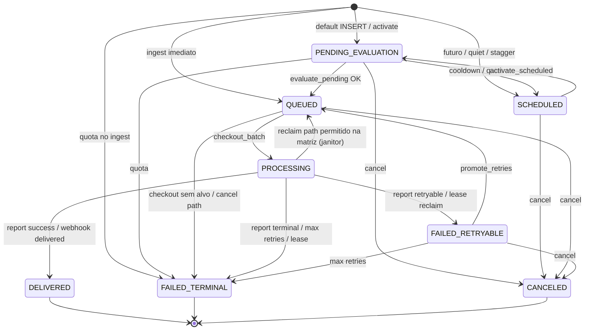

# Pipeline e FSM do Message Dispatcher

## 1. Resumo executivo

- **O que é:** ciclo de vida completo de um **dispatch** — da intenção (`ingest`) até entrega, falha, cancelamento ou reconciliação via webhook.
- **Problema que resolve:** garantir envio assíncrono, idempotente e auditável sem o front controlar a fila.
- **Quem usa:** produtores backend (`service_role`), crons `mmd_*`, Edge worker/webhook; usuário autenticado só em **cancel** e **push click**.
- **Resultado de sucesso:** status `DELIVERED` (e opcionalmente engagement).

## 2. Objetivo de negócio

- Desacoplar “evento de domínio ocorreu” de “mensagem entregue ao usuário”.
- Aplicar políticas (quota, quiet hours, retries) de forma centralizada.
- Permitir suporte/ops rastrear por `dispatch_id` / `correlation_id` / audit timeline.

## 3. Localização na plataforma

| Superfície | Existe? |
|------------|---------|
| Rotas UI | **Não** |
| Edge ingest | `message-dispatcher-ingest` (POST autenticado) |
| Edge worker | `message-dispatcher-worker` (cron auth) |
| Edge webhook | `message-dispatcher-webhook-resend` |
| RPCs schema `message_dispatcher` | ingest, cancel, activate, evaluate, checkout, report, reconcile, audit_timeline |

Deep links / `dispatch_id` no payload FCM: ver [engagement-push-click](./engagement-push-click.md).

## 4. Perfis envolvidos

| Ator | Permissão típica |
|------|------------------|
| `service_role` | Todas as RPCs de pipeline |
| `authenticated` (dono) | `message_dispatcher_cancel`, `message_dispatcher_audit_timeline`, `message_dispatcher_record_push_click` |
| Cron `postgres` | Wrappers `mmd_*` / `invoke_worker` |
| Anon / client direto | Sem mutação de status |

## 5. Fluxo funcional principal

Matriz autoritativa: `message_dispatch_status_allowed` (trigger BEFORE UPDATE).

## 6. Fluxos alternativos e exceções

| Cenário | Comportamento |
|---------|---------------|
| Idempotency replay | Mesma `idempotency_key` → retorno com `duplicate: true`, sem novo efeito |
| Race UNIQUE | `unique_violation` → replay como duplicate |
| Cancel em PROCESSING/DELIVERED | Erro `40901` |
| Lease expirado | `reclaim_leases` → `FAILED_RETRYABLE` ou `FAILED_TERMINAL` (`lease_expired`) |
| Webhook delivered após worker | Noop se já `DELIVERED` |
| Webhook delivered em PROCESSING | Pode promover a `DELIVERED` |
| Hard bounce | `FAILED_TERMINAL` / `hard_bounce` (não requeue) |
| Opened | Só engagement; **sem** mudança de FSM |

## 7. Regras de negócio

1. Status só muda se `message_dispatch_status_allowed(from, to)` for verdadeiro.
2. Terminais (`DELIVERED`, `CANCELED`, `FAILED_TERMINAL`) não saem para outro status.
3. `PROCESSING → QUEUED` é para janitor/reclaim, não para sucesso do worker.
4. Ingest exige `idempotency_key` não nulo, template ativo e `template_variables` ≤ 8192 bytes.
5. Checkout exige `p_worker_id` e `p_limit` ∈ [1, 50]; usa `FOR UPDATE SKIP LOCKED`.
6. Report só aplica se status=`PROCESSING` e `locked_by` = worker; senão `applied: false`.
7. `max_retries` default **3**; esgotado → `FAILED_TERMINAL` / `max_retries_exhausted`.
8. Backoff: `now() + 2^retry_count * backoff_base_seconds` (seed **60** s).
9. Vendor events deduplicados por `vendor_event_id` (replay = noop).
10. Cancelável: `PENDING_EVALUATION`, `SCHEDULED`, `QUEUED`, `FAILED_RETRYABLE`.

## 8. Campos e dados (inputs)

### Ingest (RPC / Edge body)

| Campo | Obrigatório | Notas |
|-------|-------------|-------|
| `p_idempotency_key` / `idempotencyKey` | Sim | UUID |
| `p_profile_id` / `profileId` | Sim | Destinatário |
| `p_channel` / `channel` | Sim | `email` \| `push` |
| `p_template_key` / `templateKey` | Sim | Ativo no catálogo |
| `p_template_variables` | Não | JSON ≤ 8192 |
| `p_scheduled_for` | Não | Default now; push sem bypass usa slot stagger |
| `p_source_system` | Não | Default `orbit` |
| `p_metadata` | Não | Pode receber `rate_limit` em falha de quota |
| `p_bypass_limits` | Não | Edge ingest **força false** |

### Checkout DTO (saída)

Inclui ids, canal, template, variables, `correlation_id`, lease, e-mail destinatário ou array de deliveries (token snapshot).

### Report

`success`, `vendor_message_id`, HTTP status, códigos de erro, `deliveries[]` (push), `retryable`.

## 9. Validações de front-end

**Não aplicável** à pipeline (backend-only). Engagement no app: ver feature de engagement.

## 10. Validações de back-end

| Camada | Validação |
|--------|-----------|
| Trigger FSM | Transição ilegal → `P0001` |
| Ingest | Template inexistente/inativo → `22023` |
| Cancel ownership | Não dono e não service_role → `42501` |
| Checkout | Sem e-mail → `no_email_on_file` terminal; sem devices → `no_push_targets` |
| Worker HTTP | Classifica 429/502/503/timeout como retryable; token FCM inválido terminal |
| Webhook | Assinatura Svix; payload inválido → 400 |

## 11. Status, estados e transições (FSM)

| Status | Significado de negócio |
|--------|------------------------|
| `PENDING_EVALUATION` | Aguardando reavaliação de quota (pós-activate) |
| `SCHEDULED` | Agendado (`scheduled_for` futuro) |
| `QUEUED` | Pronto para checkout |
| `PROCESSING` | Sob lease do worker |
| `DELIVERED` | Envio aceito / reconciliado |
| `FAILED_RETRYABLE` | Falha transitória; aguarda `next_retry_at` |
| `FAILED_TERMINAL` | Dead-letter |
| `CANCELED` | Cancelado por dono/serviço |

Delivery (filho push): `pending` \| `sent` \| `failed_retryable` \| `failed_terminal`.

## 12. Persistência

| Onde | O quê |
|------|-------|
| `message_dispatches` | FSM + lease + retries + vendor_message_id |
| `message_dispatch_deliveries` | Fan-out imutável de token no checkout |
| `message_dispatcher_audit` | Append-only via trigger |
| `message_dispatcher_vendor_events` | Ingress webhook |
| Cliente | Sem draft/Preferences da fila |

## 13. Integrações

| Sistema | Momento |
|---------|---------|
| Resend / Inbucket | Worker e-mail |
| FCM | Worker push (1 HTTP por delivery) |
| pg_cron + pg_net | activate, promote, reclaim, invoke_worker, refresh_stats |
| Vault | URL/secret do worker |
| Sentry (Edge) | Spans no worker (`withSpan`) |

## 14. Listagens, buscas, filtros

Sem UI de listagem. Ops/suporte: `message_dispatcher_audit_timeline(p_dispatch_id)`; índices por `QUEUED`/`SCHEDULED`/`FAILED_RETRYABLE`/`PROCESSING`.

## 15. Ações disponíveis

| Ação | Quem | Pré-condição | Resultado | Erro típico |
|------|------|--------------|-----------|-------------|
| Ingest | service_role / Edge auth | Template ativo | Dispatch criado | 22023, quota terminal |
| Cancel | dono / service_role | Estados canceláveis | `CANCELED` | 40901 se PROCESSING/DELIVERED |
| Checkout | worker | `QUEUED` due | `PROCESSING` + DTO | lease/limites |
| Report | worker | Lease próprio | DELIVERED / FAILED_* | lease_guard |
| Reconcile | webhook | Evento novo | Update / engagement / noop | verify fail |

## 16. Dependências

- Upstream: módulos que chamam ingest / seeds de templates.
- Downstream: usuário final; engagement; higiene de `user_device_beacons`.
- Docs: [quotas-e-canais](./quotas-e-canais.md), [horario-silencioso](./horario-silencioso.md), [matching-dispatch](../../matching-dispatch/README.md).

## 17. Regras implícitas

- Contagem de quota no ingest usa statuses `DELIVERED|QUEUED|PROCESSING|SCHEDULED` (não conta `FAILED_*` / `CANCELED` / `PENDING_EVALUATION`).
- Contadores em `user_limits` são **cache**; autoridade é COUNT live na janela 24h.
- Worker processa itens **sequencialmente** e pode sair por wall-clock (budget 60s / hard 120s).
- Fan-out de workers: `ceil(queued/batch_size)` limitado por `max_parallel_workers` (cap 5).
- Local: `INBUCKET_SMTP_HOST` troca Resend por Inbucket.

## 18. Riscos

- Lease curto vs send lento → reclaim + retry (possível duplicidade no vendor se report falhar após send — mitigado por lease_guard / idempotency Resend correlation).
- Webhook sem `vendor_message_id` não atualiza dispatch.
- Comentário do reconcile menciona FCM, mas Edge de webhook implementada é Resend.

## 19. Evidências

- `supabase/migrations/20260621100100_create_message_dispatcher_fsm_functions.sql`
- `supabase/migrations/20260621100300_create_message_dispatcher_cron_jobs.sql`
- `supabase/migrations/20260712110000_mmd_push_stagger_scheduled_slots.sql`
- `supabase/functions/message-dispatcher-worker/{index,processDispatch,checkout,report,httpClassifier}.ts`
- `supabase/functions/message-dispatcher-webhook-resend/{index,reconcile,svix}.ts`
- `supabase/functions/message-dispatcher-ingest/index.ts`
- `supabase/tests/message_dispatcher/*` (validate_transition, checkout_*, report_*, cron_*, integration_*)

## 20. Pendências

- P-08 / P-09: quiet hours (ver feature dedicada).
- **Evidência parcial:** comportamento exato de alertas externos (Logflare/Sentry emit) fora deste escopo.
- **Gap:** ausência de Edge webhook FCM espelhando Resend (vendor enum permite `fcm`).

## 21. Checklist de completude

### Negócio e valor
- [x] Para que serve / quem usa / sucesso / impacto se falhar (fila para)

### Localização
- [x] Sem rotas UI; entry points Edge/RPC documentados
- [x] Deep link / `dispatch_id` apontado para engagement

### Fluxos
- [x] Feliz caminho mermaid + FSM
- [x] Alternativos: duplicate, cancel, lease, webhook
- [x] Retries / idempotência / SKIP LOCKED

### Regras / estados / I/O
- [x] Matriz FSM, campos ingest/report, códigos de falha principais

### Edge / interligações / rastreio
- [x] Crons, Resend, FCM, evidências listadas
- [ ] Docs transversais (`pendencias`, mapa) — **fora de escopo deste worker** (sinalizar orquestrador)

## 22. Anexo — Crons `mmd_*`

| Job | Schedule | RPC |
|-----|----------|-----|
| `mmd_activate_scheduled` | `* * * * *` | `activate_scheduled` → `evaluate_pending` |
| `mmd_promote_retries` | `* * * * *` | `promote_retries` |
| `mmd_reclaim_leases` | `* * * * *` | `reclaim_leases` |
| `mmd_invoke_worker` | `*/1 * * * *` | `invoke_worker` (pg_net POST) |
| `mmd_refresh_stats` | (migration) | gauges de fila |

## 23. Anexo — Matriz de erros frequentes

| Código / reason | Origem | Efeito |
|-----------------|--------|--------|
| `email_daily_quota_exceeded` | ingest / evaluate | `FAILED_TERMINAL` |
| `push_daily_quota_exceeded` | idem | idem |
| `no_email_on_file` | checkout | `FAILED_TERMINAL` |
| `no_push_targets` | checkout | `FAILED_TERMINAL` |
| `lease_expired` | reclaim | retryable ou terminal |
| `max_retries_exhausted` | report | `FAILED_TERMINAL` |
| `hard_bounce` | reconcile | `FAILED_TERMINAL` |
| `lease_guard` | report | `applied: false` |
| `missing_recipient_email` | worker | report terminal |
