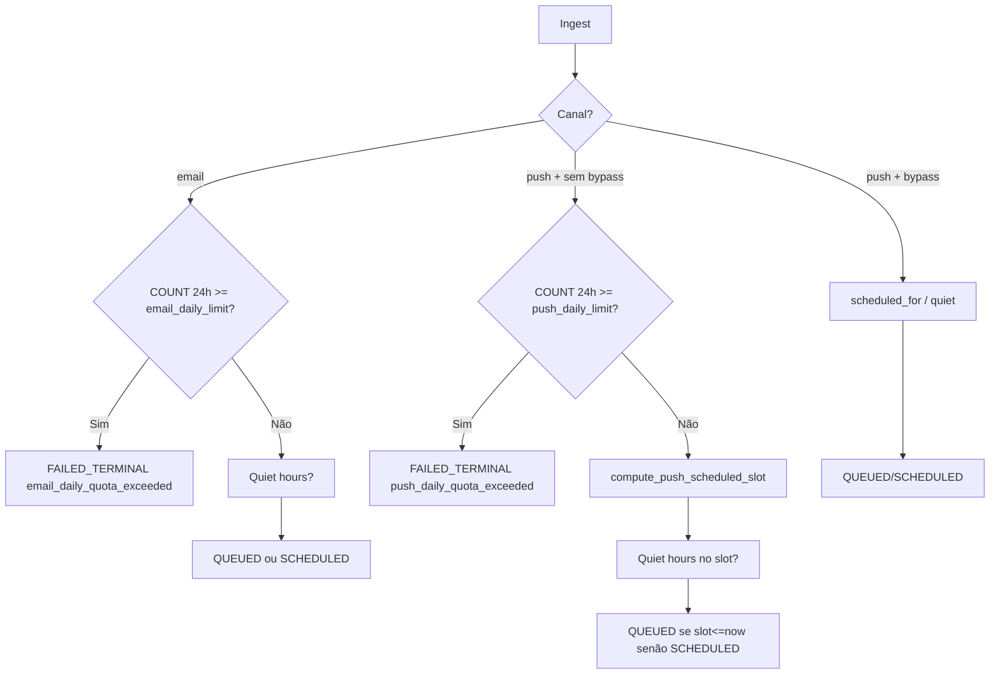

# Quotas e canais (e-mail / push)

## 1. Resumo executivo

- **O que é:** limites anti-abuso e regras por **canal** (`email`, `push`) no Message Dispatcher — quota diária, cooldown/stagger de push, resolução de destinatário e fan-out de devices.
- **Problema que resolve:** evitar spam e rajadas de push; falhar de forma previsível quando não há e-mail/token.
- **Quem usa:** indiretamente todo destinatário; produtores com `bypass_limits` (ex.: alguns fluxos críticos de domínio).
- **Sucesso:** mensagem entra na fila dentro dos limites; excesso vira `FAILED_TERMINAL` com metadata `rate_limit`.

## 2. Objetivo de negócio

- Proteger a experiência do usuário (volume e espaçamento).
- Permitir ajuste operacional via `platform_constants` sem redeploy da lógica SQL (exceto quiet hours).
- Isolar políticas de canal (e-mail ≠ push).

## 3. Localização na plataforma

Sem UI. Avaliação em:

- `message_dispatcher_ingest` (e Edge `message-dispatcher-ingest`)
- `message_dispatcher_evaluate_pending` (pós `activate_scheduled`)
- `message_dispatcher_checkout_batch` (resolução de alvo)
- Worker (Resend/FCM) + `report_delivery_outcome` (atualiza `user_limits` em sucesso)

## 4. Perfis envolvidos

| Papel | Efeito |
|-------|--------|
| Destinatário | Sofre limites por `profile_id` |
| Produtor com `bypass_limits=true` | Pula quota/cooldown/stagger de limites |
| Edge ingest autenticado | Sempre `bypass_limits=false` |
| service_role | Pode passar `bypass_limits` conforme contrato do chamador |

## 5. Fluxo funcional principal

## 6. Fluxos alternativos e exceções

| Cenário | Comportamento |
|---------|---------------|
| Evaluate pending com quiet hours agora | Restantes → `SCHEDULED` 06:00 + `bypass_limits` |
| Vários pushes PENDING_EVALUATION | Stagger com offset de irmãos (`sibling_offset`) |
| Checkout e-mail sem `auth.users.email` | `FAILED_TERMINAL` / `no_email_on_file` |
| Checkout push sem beacon elegível | `FAILED_TERMINAL` / `no_push_targets` |
| Push parcial (alguns devices falham) | Parent pode ficar `DELIVERED` com `metadata.partial_failures` |
| Token inválido | Delivery terminal + `disable_device_beacon` (service_role) |

## 7. Regras de negócio

1. Canais permitidos: apenas `email` e `push` (enum).
2. Quota e-mail: máximo `message_dispatcher.email_daily_limit` (seed **5**) por perfil em 24h.
3. Quota push: máximo `message_dispatcher.push_daily_limit` (seed **20**) por perfil em 24h.
4. Contagem autoritativa: `COUNT` em dispatches com status ∈ {`DELIVERED`,`QUEUED`,`PROCESSING`,`SCHEDULED`}, `created_at > now()-24h`, `bypass_limits=false`.
5. Excesso no ingest: **insere** dispatch já `FAILED_TERMINAL` (não rejeita só com exception) e grava `metadata.rate_limit`.
6. Push sem bypass: `scheduled_for` via `message_dispatcher_compute_push_scheduled_slot` (stagger).
7. Slot = `greatest(now, last_push_sent_at+cooldown, max(scheduled_for pendentes)+cooldown) + sibling*cooldown`.
8. Cooldown seed: `message_dispatcher.push_cooldown_minutes` = **1**; se constante ausente, fallback SQL **10**.
9. Quiet hours compostos com slot/cooldown — ver [horario-silencioso](./horario-silencioso.md).
10. `bypass_limits` true: pula blocos de quota/cooldown no ingest/evaluate.
11. Máx. devices por dispatch: `max_devices_per_dispatch` (seed **10**), ordenados por `updated_at desc`.
12. Beacon elegível: `push_enabled=true` e `fcm_token` não vazio.
13. Em `DELIVERED`, atualiza `last_push_sent_at` (push) e caches `*_count_24h` / windows.
14. Lease worker: seed `lease_seconds` = **90** (fallback código **30** se constante ausente).
15. Batch checkout: seed `checkout_batch_size` = **50**; hard cap RPC 50.

## 8. Campos e dados

### `platform_constants` (seeds)

| Key | Seed | Uso |
|-----|------|-----|
| `message_dispatcher.email_daily_limit` | 5 | Quota e-mail |
| `message_dispatcher.push_daily_limit` | 20 | Quota push |
| `message_dispatcher.push_cooldown_minutes` | 1 | Cooldown / stagger |
| `message_dispatcher.lease_seconds` | 90 | Lease PROCESSING |
| `message_dispatcher.checkout_batch_size` | 50 | Tamanho de lote / fan-out workers |
| `message_dispatcher.backoff_base_seconds` | 60 | Retries |
| `message_dispatcher.max_devices_per_dispatch` | 10 | Fan-out |
| `message_dispatcher.max_parallel_workers` | 5 | Cap invoke_worker |
| `message_dispatcher.retryable_depth_alert_threshold` | 10000 | Alerta profundidade |

### `message_dispatcher_user_limits`

| Campo | Papel |
|-------|-------|
| `last_push_sent_at` | Âncora de cooldown/stagger |
| `email_count_24h` / `push_count_24h` | Cache (não autoridade) |
| `email_window_start` / `push_window_start` | Janela do cache |

## 9. Validações de front-end

Não há formulário de quota. App não configura limites.

## 10. Validações de back-end

- Lock `FOR UPDATE` em `user_limits` no ingest (serializa por perfil).
- Evaluate pending recalcula quotas set-based (inclui peers no batch).
- Worker classifica falhas HTTP (429/502/503/timeout retryable; 400/422 e-mail e token inválido terminais).
- `disable_device_beacon` restrito a `service_role` (migration lockdown).

## 11. Status, estados e transições

Relacionados a quota/canal:

| Evento | Status típico |
|--------|---------------|
| Quota excedida | `FAILED_TERMINAL` |
| Slot futuro / quiet | `SCHEDULED` |
| Slot agora | `QUEUED` |
| Sem alvo no checkout | `FAILED_TERMINAL` (pula DTO) |
| Send OK | `DELIVERED` (+ deliveries `sent`) |

## 12. Persistência

- Decisão de quota no **INSERT** do dispatch (ou UPDATE no evaluate).
- Tokens **snapshot** em `message_dispatch_deliveries` — worker não relê beacons.
- Higiene: `push_enabled=false`, `fcm_token=null` no beacon inválido.

## 13. Integrações

| Canal | Vendor | Observação |
|-------|--------|------------|
| email | Resend (prod) / Inbucket (local) | Destinatário de `auth.users` |
| push | FCM HTTP v1 | Data inclui `dispatch_id`, `correlation_id`, opcional `chat_id` / `deep_link_path` |

Templates: `message_templates` por `(template_key, channel)`; inativo rejeita ingest.

## 14. Listagens / filtros

Não há UI. Índices: `(profile_id, channel, created_at desc)` para contagens/histórico.

## 15. Ações disponíveis

| Ação | Quem | Pré-condição | Resultado |
|------|------|--------------|-----------|
| Ingerir dentro da quota | Produtor | Limites OK | QUEUED/SCHEDULED |
| Ingerir além da quota | Produtor | Limite atingido | FAILED_TERMINAL + rate_limit meta |
| Bypass limits | service_role caller | Flag true | Sem checagem de quota/cooldown |
| Checkout | Worker | Alvos existem | PROCESSING + DTO |

## 16. Dependências

- [pipeline-e-fsm](./pipeline-e-fsm.md) — FSM e worker.
- [horario-silencioso](./horario-silencioso.md) — composição com slot.
- `public.user_device_beacons`, `auth.users`, `public.platform_constants`.
- Matching/CNS/payments: seeds de templates e `bypass_limits` pontuais (**Evidência parcial** por domínio — ver módulos respectivos).

## 17. Regras implícitas

- Dispatches com `bypass_limits=true` **não entram** no COUNT de quota.
- `PENDING_EVALUATION` / `FAILED_*` / `CANCELED` não contam na janela de quota do ingest.
- Stagger considera cauda `SCHEDULED|QUEUED|PROCESSING` sem bypass.
- Partial push success ainda marca parent `DELIVERED` se `p_success=true`.
- Códigos que desabilitam beacon: `invalid_token`, `not_found`, `unregistered`, `registration-token-not-registered`, `invalid_argument`, ou pattern `%invalid%token%`.

## 18. Riscos

- Divergência seed vs fallback (1 vs 10 min; 90 vs 30 s) se constant for apagada.
- Cache `*_count_24h` pode divergir da COUNT live (código documenta live como autoridade).
- Produtores que abusam de `bypass_limits` contornam a política de negócio.

## 19. Evidências

- `supabase/migrations/20260621100000_create_message_dispatcher_schema_enums_tables.sql` (constants + tabelas)
- `supabase/migrations/20260621100100_create_message_dispatcher_fsm_functions.sql` (quota ingest/evaluate/checkout/report/beacon)
- `supabase/migrations/20260712110000_mmd_push_stagger_scheduled_slots.sql`
- `supabase/migrations/20260802270000_lockdown_message_dispatcher_disable_device_beacon.sql`
- `supabase/functions/message-dispatcher-worker/{fcm,resend,httpClassifier,processDispatch}.ts`
- pgTAP: `ingest_email_quota_test.sql`, `ingest_push_quota_test.sql`, `ingest_push_cooldown_test.sql`, `checkout_max_devices_test.sql`, `checkout_no_push_targets_test.sql`, `platform_constants_mmd_test.sql`, etc.

## 20. Pendências

- Inventário completo de templates/`bypass_limits` por domínio: **Evidência parcial** (fora do núcleo MMD).
- P-08/P-09 quiet hours.
- Confirmar em ambiente remoto se seeds de constants não foram alterados pós-migration.

## 21. Checklist de completude

- [x] Quotas, cooldown, stagger, canais, fan-out, falhas de alvo
- [x] Constants e fallbacks honestos
- [x] Mermaid do fluxo de decisão
- [x] Matriz de ações / erros de canal
- [ ] Catálogo completo de templates de produto — pendência

## 22. Anexo — Elegibilidade de envio

| Canal | Requisito no checkout | Falha |
|-------|----------------------|-------|
| email | `auth.users.email` não vazio | `no_email_on_file` |
| push | ≥1 beacon com token e push_enabled | `no_push_targets` |

## 23. Anexo — Classificação HTTP (worker)

| Condição | Retryable? |
|----------|------------|
| HTTP 429, 502, 503 | Sim |
| HTTP 0 + timeout no código | Sim |
| FCM token inválido / 404 | Não |
| Resend 400/422 / validation_error | Não |
