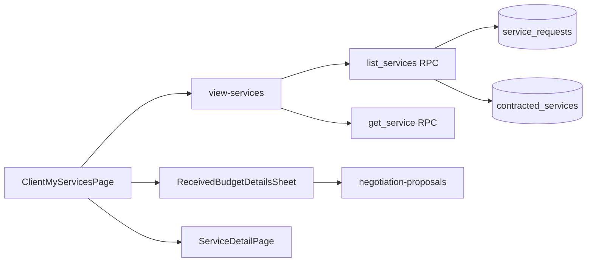

# Meus Serviços do cliente (Meus Serviços)

Documentação baseada em `src/features/my-services/` e integração com `view-services`, `negotiation-proposals` e `request-quote`.

---

## 1. Visão geral

| Item | Descrição |
|------|-----------|
| **Objetivo** | Listar e gerenciar **pedidos** do cliente autenticado: filtros, busca, abas por fase, deep link, sheet de orçamentos e navegação para detalhe em página. |
| **Rotas** | **`/dashboard/services`** — `ClientMyServicesPage`. **`/dashboard/services/:id`** — `ServiceDetailPage` (`view-services`). |
| **Menu** | Cliente: **“Meus Serviços”**. Prestador: **“Meus Serviços”** (mesmo path; UI voltada ao cliente). |
| **Dados** | RPCs `list_services` e `get_service` via `view-services`; cancelamento via `cancel_service_request`. |

---

## 2. Arquitetura da página

| Camada | Responsável |
|--------|-------------|
| Página | `ClientMyServicesPage.tsx` — header, busca, filtros, abas, lista, sheet de orçamentos. |
| Orquestração | `useClientMyServicesPage.ts` — search params, foco, opções de filtro, scroll, navegação para detalhe. |
| Lista | `useClientMyServicesList.ts` → `useServicesList` (RPC `list_services`). |
| Filtros | `useClientMyServicesFilters.ts` — estado local + busca debounced. |
| Cancelamento | `useClientMyServicesCancel.ts` → `useCancelService`. |
| Card | `ServiceListCard` de `view-services`. |

---

## 3. Lista e paginação (RPC)

- **Delegação:** `listServices` em `view-services/api/services.api.ts`.
- **Escopo:** servidor filtra por `auth.uid()` + `profiles.role` (cliente vê só seus SR).
- **Paginação:** `useInfiniteQuery`, página **20**, `total_count` do RPC.
- **Fase:** campo `list_phase` no JSON (`negotiation`, `in_progress`, `completed`, `cancelled`) — sem lógica duplicada no front.

**Modo foco (`serviceRequestId` na URL):** a lista chama `get_service` para o ID focado e retorna um único item (demais filtros de aba não restringem o foco na API).

---

## 4. Abas de status (`StatusTabId`)

Re-export de `view-services/constants/statusTabs.ts`:

| Tab id | Label UI | Filtro RPC |
|--------|----------|------------|
| `all` | Todos | `p_list_phase` null |
| `negotiation` | Em negociação | `negotiation` |
| `in_progress` | Em andamento | `in_progress` |
| `completed` | Concluídos | `completed` |
| `cancelled` | Cancelados | `cancelled` |
| `dispute` | Disputas | Sem linhas (reservado) |

---

## 5. Busca e filtros

| Filtro | Parâmetro RPC |
|--------|---------------|
| Busca | `p_search` |
| Categoria | `p_category_title` |
| Cidade | `p_city_name` |
| Bairro | `p_neighborhood` |
| Datas | `p_date_from` / `p_date_to` |
| Com orçamentos | `p_has_proposals` |
| Com imagens | `p_has_images` |

**Debounce da busca:** 300 ms.

**Opções dos dropdowns:** derivadas dos `items` já carregados — podem ficar incompletas com paginação (lacuna de UX).

---

## 6. Deep link e foco

- **Query:** `SERVICE_REQUEST_FOCUS_QUERY` = `serviceRequestId`.
- **Helper:** `getServiceRequestsPageUrlWithFocus(id)`.
- **Banner:** `ClientMyServicesFocusBanner`.
- **Aba:** sincronizada com `statusToTabId(focusedService.listPhase)`.

---

## 7. Destaque do card — `PENDING_PAYMENT`

Apresentação montada em `clientServiceCardPresentation.ts` (cliente) e `providerServiceCardPresentation.ts` (prestador), com copy compartilhada em `pendingPaymentHighlight.ts` e ênfase `error` no tema do card do cliente (`clientServiceCardTheme.ts`). Detalhe completo no [README do módulo](../README.md) (§8).

Quando `contracted.status === PENDING_PAYMENT` na listagem (usa `contracted.paymentScheduleState`, vindo de `payment_schedule_state` em `project_service_row`):

| Papel / condição | Título | Descrição | Ênfase |
|------------------|--------|-----------|--------|
| Cliente — `FAILED_PERMANENT` | Pagamento falhou | Atualize suas informações de pagamento manualmente para confirmar o serviço. | `error` |
| Cliente — demais | Aguardando pagamento | Serviço agendado para {data}, pagamento ainda pendente. | `attention` |
| Prestador | Aguardando pagamento do cliente | Serviço agendado para {data}, pagamento ainda pendente. | `attention` |

- **Ícone:** cartão (`payment_pending`) em todos os casos acima.
- **Prioridade do destaque:** em `FAILED_PERMANENT`, o alerta de pagamento falhou prevalece sobre mensagem não lida. Nos demais casos de `PENDING_PAYMENT`, mensagem não lida ainda sobrescreve o destaque de pagamento.

---

## 8. Ações por card

### Ver detalhes

- **Todas as fases:** `navigate(getServiceDetailPath(id))` → `/dashboard/services/:id`.

### Ajustar pagamento

- **Quando:** fase `in_progress` com `contracted.status === PENDING_PAYMENT` e `paymentScheduleState === FAILED_PERMANENT`.
- **CTA primário:** label **“Ajustar pagamento”**, intent `adjust_payment`, ícone de cartão (`CreditCard`).
- **Ao clicar:** abre o `ManualPaymentDialog` (mesmo fluxo de pagamento manual do detalhe do serviço: cartão → parcelas com taxas → confirmar), via `useClientCardManualPayment`.
- **Secundário:** **“Ver detalhes”**.
- **Prioridade do CTA:** esta ação tem prioridade sobre mensagem não lida no chat (não usa “Responder” / “Ver conversa com prestador” nesse caso). O destaque visual também prioriza o alerta de pagamento falhou (ver §7).

### Comparar orçamentos / Histórico (`negotiation-proposals`)

- Sheet `ReceivedBudgetDetailsSheet` quando `proposalCount > 0`.
- Modo compare vs history conforme fase do pedido.

### Cancelar

- RPC `cancel_service_request` via `useCancelService`.
- Aplicável na fase `negotiation` (pedido ainda aberto).

### Republicar (somente no detalhe)

- Em `/dashboard/services/:id` com `listPhase === "cancelled"`, o cliente vê **"Republicar novo pedido de serviço"** (`view-services` / `useRepublishCancelledService`).
- Duplica o pedido cancelado em um novo `OPEN` via RPC `republish_cancelled_service_request` (sem abrir o wizard). Não há CTA de republicação no card da listagem.

---

## 9. Diagrama

---

## 10. Evidências

- `src/features/my-services/**/*` (inclui `utils/pendingPaymentHighlight.ts`, `clientServiceCardPresentation.ts`, `providerServiceCardPresentation.ts`, `hooks/useClientCardManualPayment.ts`, `components/client/ClientServiceListCard.tsx`)
- `src/features/view-services/**/*`
- `supabase/migrations/20260705208000_create_view_services_rpcs.sql`
- `src/router.tsx`
