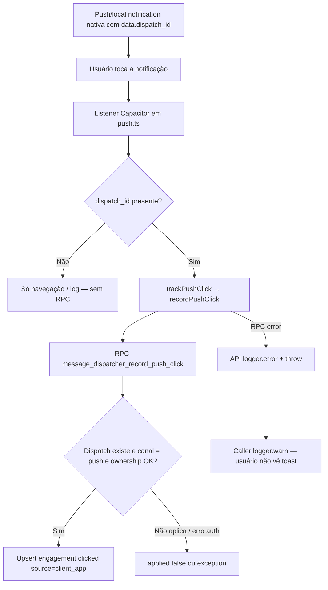

# Engagement push — registro de clique (cliente)

## 1. Resumo executivo

- **O que é:** feature da pasta `src/features/notifications/` que oferece `recordPushClick` para gravar engajamento do tipo **`clicked`** quando o usuário toca um push associado a um dispatch do Message Dispatcher.
- **Problema que resolve:** saber se o destinatário interagiu com a notificação push (além da entrega `DELIVERED`).
- **Quem usa:** indiretamente, usuários autenticados no app nativo; diretamente, apenas `src/lib/push.ts`.
- **Resultado esperado:** linha (ou atualização) em `message_dispatch_engagements` com `engagement_type = clicked`, `source = client_app`, quando a RPC aplica o registro.
- **Limite honesto:** não há UI, formulário, listagem nem fluxo de “preferências de notificação” neste módulo — o contrato é **mínimo** (API + caller).

## 2. Objetivo de negócio

- **Finalidade:** métrica/auditoria de interação com pushes enviados pelo pipeline MMD.
- **Valor:** distingue “entregue” de “tocado”; first vs repeat (`first_engagement` / `seen_count`).
- **Impacto se falhar:** navegação e uso do app **não** quebram (caller engole erro); analytics de clique ficam incompletos.
- **Contexto:** complemento do engagement de e-mail (`opened` via webhook Resend no MMD) — este documento cobre só o caminho **cliente → push click**.

## 3. Localização na plataforma

| Superfície | Existe? | Detalhe |
|------------|---------|---------|
| Rota dedicada | **Não** | Ausente em `src/router.tsx` |
| Tela / dialog / sheet | **Não** | Sem `components/` na feature |
| Hook de UI | **Não** | Sem `hooks/` |
| Entry point de código | Public API `recordPushClick` | `src/features/notifications/index.ts` |
| Disparo em runtime | Listeners Capacitor | `pushNotificationActionPerformed`, `localNotificationActionPerformed` em `src/lib/push.ts` |
| Deep link / query | Indireto | Navegação via `handlePushNotificationOpen` / `deep_link_path` é **paralela** ao tracking; tracking usa só `dispatch_id` |
| Web SW click | Navegação apenas | `src/sw.ts` `notificationclick` — **sem** `recordPushClick` |

## 4. Perfis envolvidos

| Papel | Pode registrar clique? | Critério |
|-------|------------------------|----------|
| Cliente autenticado | Sim, se for dono do dispatch | `auth.uid() = message_dispatches.profile_id` |
| Prestador autenticado | Idem | Mesma regra |
| `service_role` | Sim (bypass de ownership na RPC) | Uso backend / testes; app usa sessão authenticated |
| Anônimo | Não | Sem `GRANT` para `anon` |

**Quem não usa a feature como produto:** não há tela de “meus engajamentos”; o dono só poderia **ler** linhas via RLS SELECT em `message_dispatch_engagements` (fora do escopo desta feature de escrita).

## 5. Fluxo funcional principal

## 6. Fluxos alternativos e exceções

| Cenário | Comportamento observado |
|---------|-------------------------|
| Sem `dispatch_id` no payload | Não chama `recordPushClick` |
| RPC retorna erro (rede, exception SQL) | API faz `logger.error("mmd_record_push_click_rpc_error", …)` e **rethrow**; caller captura e `logger.warn('[PUSH] engagement tracking failed', …)` |
| RPC sucesso com `data: null` | Cliente assume `{ applied: false, firstEngagement: false }` |
| Dispatch inexistente | RPC retorna `{ applied: false, reason: 'dispatch_not_found' }` (sem throw) — cliente mapeia `applied` / `firstEngagement` |
| Canal do dispatch ≠ `push` | RPC retorna `{ applied: false, reason: 'channel_not_push' }` |
| Usuário não dono (authenticated) | RPC `raise exception` `42501` — vira erro no cliente |
| Clique repetido no mesmo dispatch | Upsert: `seen_count++`, `last_seen_at = now()`, `first_engagement = false` |
| Clique web (SW) | Navega; **não** registra engagement neste módulo |
| Mensagem FCM web em foreground (`onMessage`) | Sem chamada a `recordPushClick` no código atual |

## 7. Regras de negócio

1. **RN-01 — Só push:** a RPC pública só registra engagement se o dispatch tiver `channel = push`; caso contrário `applied: false` com `reason: channel_not_push`.
2. **RN-02 — Ownership:** usuário authenticated só registra clique no próprio `profile_id` do dispatch (exceto `service_role`).
3. **RN-03 — Tipo fixo `clicked`:** o cliente não escolhe o tipo; a RPC fixa `'clicked'` e `source = 'client_app'`.
4. **RN-04 — Deduplicação:** no máximo um registro por `(dispatch_id, engagement_type)`; reentradas atualizam contadores, não duplicam linhas.
5. **RN-05 — Ortogonal ao FSM:** inserção/atualização de engagement **não** altera status do dispatch (comentário de schema: orthogonal to FSM).
6. **RN-06 — Metadata opcional:** cliente pode enviar `metadata`; omitido → `{}`. Caller de produção atual omite.
7. **RN-07 — Tracking best-effort no app:** falha de tracking não bloqueia abertura/navegação da notificação.
8. **RN-08 — Pré-condição de payload:** sem `dispatch_id` no `data`/`extra`, não há tentativa de registro.

## 8. Campos e dados (inputs / shape)

### Cliente (`RecordPushClickParams`)

| Campo | Tipo | Obrigatório | Default | Uso |
|-------|------|-------------|---------|-----|
| `dispatchId` | `string` (UUID do dispatch) | Sim | — | `p_dispatch_id` |
| `metadata` | `Record<string, unknown>` | Não | `{}` | `p_metadata` |

### Retorno cliente (`RecordPushClickResult`)

| Campo | Origem RPC | Default se ausente |
|-------|------------|--------------------|
| `applied` | `applied` | `false` |
| `firstEngagement` | `first_engagement` | `false` |

### Payload de notificação (caller)

| Campo em `data` / `extra` | Papel |
|---------------------------|--------|
| `dispatch_id` | Gatilho do tracking |
| Outros (`deep_link_path`, `chat_id`, …) | Navegação / collapse — **não** enviados como metadata pelo caller atual |

### Persistência (servidor)

Campos relevantes em `message_dispatch_engagements`: `dispatch_id`, `profile_id`, `engagement_type`, `channel`, `source`, `first_seen_at`, `last_seen_at`, `seen_count`, `metadata`.

## 9. Validações de front-end

- **Nenhuma** validação Zod/UI nesta feature.
- A API não valida formato de UUID antes da RPC; erros vêm do backend / PostgREST.
- Caller só checa truthiness de `dispatch_id` (string presente).

## 10. Validações de back-end (RPC, RLS, constraints)

| Camada | Regra |
|--------|-------|
| `message_dispatcher_record_push_click` | `p_dispatch_id` NOT NULL; ownership; canal `push`; delega a `record_engagement` |
| `message_dispatcher_record_engagement` | Upsert; `p_source` trim vazio → `'unknown'` (neste caminho sempre `'client_app'`); metadata coalesce `{}` |
| Grants | `record_push_click`: `authenticated`, `service_role`; `record_engagement`: **somente** `service_role` |
| RLS tabela | SELECT dono (`auth.uid() = profile_id`); INSERT/UPDATE/DELETE revogados para authenticated — mutação só via SECURITY DEFINER |
| UNIQUE | `(dispatch_id, engagement_type)` |
| Enum | `message_engagement_type`: `'opened' \| 'clicked'` |

## 11. Status, estados e transições

Não há FSM própria nesta feature. Relação com o MMD:

| Conceito | Comportamento |
|----------|---------------|
| Status do dispatch (`DELIVERED`, etc.) | **Inalterado** pelo clique |
| Engagement `clicked` | Ausente → presente (insert); presente → `seen_count` / `last_seen_at` atualizados |
| `first_engagement` na resposta | `true` no insert (`xmax = 0`); `false` em update |

Tipo `opened` **não** é escrito por este módulo (caminho e-mail/webhook no MMD).

## 12. Persistência

### Servidor

- Tabela `message_dispatcher.message_dispatch_engagements`.
- Sem cache TanStack Query / Preferences nesta feature.

### Cliente

- Sem draft, fila offline ou retry dedicado para `recordPushClick`.
- Se o dispositivo estiver offline no momento do tap, a chamada falha e o erro é engolido pelo caller (possível **perda** de evento — evidência: sem retry no código).

## 13. Integrações

| Sistema | Papel |
|---------|--------|
| Supabase client (schema `message_dispatcher`) | Invoca RPC |
| Capacitor `@capacitor/push-notifications` | Evento de ação nativa |
| Capacitor Local Notifications | Mesmo padrão quando foreground promove a local |
| FCM worker (`fcm.ts`) | Inclui `dispatch_id` no data do push (pré-condição de tracking) |
| Message Dispatcher | Dono da RPC e da tabela |
| Logger | Erros RPC e falhas engolidas no push |

## 14. Listagens, buscas, filtros, paginação, ordenação

**Não aplicável.** Esta feature não lista engajamentos. Índice de suporte no banco: `(profile_id, created_at desc)` — uso eventual fora deste módulo.

## 15. Ações disponíveis

| Ação | Quem | Pré-condição | Resultado sucesso | Erro / não-aplicado |
|------|------|--------------|-------------------|---------------------|
| Registrar clique push | App via `recordPushClick` (usuário autenticado dono) | Sessão + `dispatchId` de dispatch push próprio | `applied: true`; `firstEngagement` conforme insert/update | Throw (auth/RPC error) ou `applied: false` com reason |
| Tocar notificação sem `dispatch_id` | Usuário | — | Só fluxo de navegação/log | Sem tracking |
| Ler engagements | Authenticated dono (RLS SELECT) | — | Fora do escopo da Public API desta feature | — |

## 16. Dependências

| Dependência | Tipo |
|-------------|------|
| Message Dispatcher (schema + RPCs) | Upstream obrigatório |
| `src/lib/push.ts` | Downstream / único caller de produto |
| `src/lib/supabase/client` | Cliente HTTP |
| `src/lib/logger` | Observabilidade |
| `push-permission` / `device-beacon` | **Não** importados por esta feature (podem coexistir no app para delivery de token) |

## 17. Regras implícitas (só no código)

1. **Fire-and-forget:** `void trackPushClick(dispatchId)` — não `await` no listener; não há feedback de UI.
2. **Metadata nunca preenchida** pelo caller atual, embora a API aceite.
3. **Web não rastreia clique** apesar de haver `notificationclick` no SW.
4. Nome do módulo `notifications` ≠ centro de notificações in-app; só engagement API.
5. Retorno `reason` da RPC (`dispatch_not_found`, `channel_not_push`) **não** é tipado/exposto em `RecordPushClickResult` — só `applied` e `firstEngagement`.
6. Template `engagement_push` no worker é template de **conteúdo** de push do MMD; **não** é código desta feature (homônimo; não confundir).

## 18. Riscos

- Subcontagem de cliques na web/PWA.
- Perda de eventos offline / falha de rede sem retry.
- Se FCM omitir `dispatch_id`, tracking nunca dispara (depende do worker).
- Confusão documental entre “notifications” (cliente) e “message-dispatcher” (backend) — manter fronteira clara.

## 19. Evidências

| Path | O que prova |
|------|-------------|
| `src/features/notifications/api/engagementTracking.api.ts` | Contrato e chamada RPC |
| `src/features/notifications/index.ts` | Export público |
| `src/features/notifications/api/__tests__/engagementTracking.api.test.ts` | Params, default metadata, erro, null data |
| `src/lib/push.ts` (`trackPushClick`, listeners) | Quando e como o app dispara |
| `src/lib/__tests__/push.test.ts` | Tap local/nativo + falha engolida |
| `src/sw.ts` | Clique web sem engagement |
| `supabase/migrations/20260621100100_create_message_dispatcher_fsm_functions.sql` (~1828–1887) | Lógica RPC push click |
| `supabase/migrations/20260621100000_create_message_dispatcher_schema_enums_tables.sql` (~329–366) | Tabela / enum / RLS |
| `supabase/tests/message_dispatcher/record_push_click_ownership_test.sql` | Guard de ownership |
| `supabase/tests/message_dispatcher/record_push_click_channel_guard_test.sql` | Guard de canal |
| `supabase/tests/message_dispatcher/engagement_dedup_test.sql` / `record_engagement_upsert_test.sql` | Dedup / upsert |
| `supabase/functions/message-dispatcher-worker/fcm.ts` | `data.dispatch_id` no envio |

## 20. Pendências

| ID | Descrição | Severidade |
|----|-----------|------------|
| N-01 | Engagement de clique na **web** (SW / PWA) não implementado via este módulo | Média — cobertura de canal |
| N-02 | Sem retry/fila offline para falhas de `recordPushClick` | Baixa — ops/analytics |
| N-03 | `reason` da RPC não exposto no tipo de retorno do cliente | Baixa — DX |
| N-04 | Índices transversais (`modulos/README`, matriz, glossário, rastreabilidade) **fora do escopo** deste entregável — outro worker deve refletir o novo módulo | Documentação MMD/orquestração |
| N-05 | Feature docs dedicadas de engagement **no** módulo message-dispatcher (e-mail `opened`, etc.) permanecem lacuna do MMD (P-10) — não resolvidas aqui | Documentação |

## 21. Anexo — checklist QA (derivável da evidência)

| # | Cenário | Esperado |
|---|---------|----------|
| QA-1 | Tap nativo em push com `dispatch_id` válido do próprio usuário | `applied: true` na primeira vez; engagement `clicked` |
| QA-2 | Segundo tap no mesmo dispatch | `firstEngagement: false`; `seen_count` incrementa |
| QA-3 | Tap sem `dispatch_id` | Nenhuma chamada RPC; navegação se houver path |
| QA-4 | Tap com sessão de outro usuário | Exception autorização; warn no push |
| QA-5 | Forçar falha RPC | Warn `[PUSH] engagement tracking failed`; app continua |
| QA-6 | Clique notificação só web (SW) | Abre/foca app; **sem** linha de engagement via este fluxo |
| QA-7 | Dispatch e-mail + tentativa de push click RPC | `applied: false`, `channel_not_push` (cenário backend/pgTAP) |

## 22. Anexo — fronteira com Message Dispatcher

| Responsabilidade | notifications (este módulo) | message-dispatcher |
|------------------|----------------------------|--------------------|
| Enviar push/e-mail | Não | Sim |
| Quotas / quiet hours / FSM | Não | Sim |
| Registrar clique push do app | **Sim** (`recordPushClick`) | RPC + tabela |
| Registrar abertura de e-mail | Não | Webhook / reconcile |
| UI de inbox | Não | Não (neste repo) |
