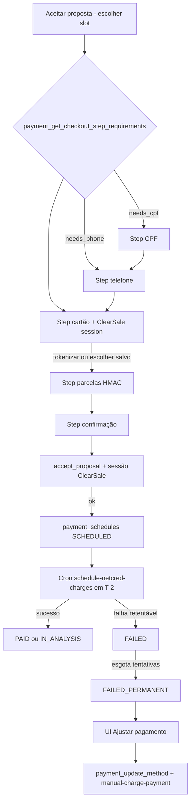

# Checkout e cobrança

Documentação baseada em `src/features/payments/` (stepper, APIs, hooks, ClearSale, tokenização), host `AcceptProposalDialog` em `negotiation-proposals`, Edge Functions `tokenize-payment-card`, `manual-charge-payment`, `schedule-netcred-charges`, `netcred-webhook`, `reconcile-netcred-payments`, `detect-netcred-onboarding`, e RPCs `payment_*` / `accept_proposal`.

**Fora de escopo neste documento:** histórico de captura e reembolso → [historico-e-reembolso.md](./historico-e-reembolso.md); auto-cancel T-12h / void pós-`IN_ANALYSIS` / sync settlements / `DEAD_LETTER` → [reconciliacao-e-voids.md](./reconciliacao-e-voids.md); UI/gate de KYC do prestador → [provider-kyc](../../provider-kyc/README.md); liquidações bancárias (Ganhos) → [provider-earnings](../../provider-earnings/README.md).

---

## 1. Resumo executivo

| Item | Descrição |
|------|-----------|
| **Para que serve** | Cliente aceita proposta com cartão de crédito (NetCred), tokeniza dados sensíveis no gateway, agenda cobrança automática **T-2** (~48h antes do serviço) e recupera falhas via cobrança manual. |
| **Quem usa** | **Cliente** (checkout no aceite, cartões salvos, cobrança manual). Prestador **não** opera o checkout; precisa estar **credenciado** (`ACTIVE` + company + bank) para o aceite/cobrança ocorrerem. |
| **Resultado de sucesso** | `accept_proposal` cria `contracted_services` + `payment_schedules` em `SCHEDULED`; toast “Proposta aceita com sucesso.”; cobrança posterior pode ir a `PAID` / `IN_ANALYSIS`. |
| **Se falhar / indisponível** | Sem prestador credenciado não há aceite com pagamento; falha de cobrança → `FAILED` / `FAILED_PERMANENT` + alerta “Pagamento falhou” / “Ajustar pagamento”; perto de T-12h o serviço pode ser cancelado automaticamente. |

---

## 2. Objetivo de negócio

1. Coletar/confirmar CPF, telefone e cartão do cliente antes de contratar.
2. Tokenizar o cartão sob a **company NetCred da plataforma Renovi** (PCI no gateway; app não persiste PAN/CVV).
3. Fixar parcelamento com HMAC e criar agenda de cobrança com split do prestador (`FIXED_AMOUNT = provider_payout`).
4. Cobrar automaticamente perto do serviço (T-2) e permitir recuperação manual em falha, com antifraude ClearSale e anti double-charge.

---

## 3. Localização na plataforma

| Superfície | Onde | Observação |
|------------|------|------------|
| **Checkout (aceite)** | Dialog `AcceptProposalDialog` (`negotiation-proposals`) — fase `slot` → `checkout` embute `CheckoutStepper` | Sem rota própria; abre a partir do chat / fluxo de proposta. |
| **Cartões salvos** | `SavedCardsList` em `/dashboard/conta` (`my-account` cliente) | Tokenização contexto `profile`. |
| **Cobrança manual — detalhe** | `ManualPaymentRecovery` em `ServiceContractedSection` (`view-services`) | Alerta + botão “Ajustar pagamento”. |
| **Cobrança manual — lista** | Card Meus serviços (cliente): CTA “Ajustar pagamento” quando `PENDING_PAYMENT` + `FAILED_PERMANENT` | Ver [solicitacoes-do-cliente](../../my-services/features/solicitacoes-do-cliente.md). |
| **Query / deep link** | Não há rota `/checkout` dedicada | Deep links de notificação MMD usam paths de serviço (ex. `/dashboard/services/...`). |
| **Mobile** | `ShellDialog` + `useMobileDialogViewport` no aceite e no `ManualPaymentDialog` | Full-screen no mobile; footer sticky acima do teclado. |

Guards: cliente autenticado; RPCs exigem `auth.uid()`; Edges de cobrança/tokenização exigem Bearer do usuário (cron Edges usam auth de cron Orbit).

---

## 4. Perfis envolvidos

| Perfil | Papel nesta feature |
|--------|---------------------|
| **Cliente** | Completa checkout, tokeniza cartão, escolhe parcelas, confirma aceite; dispara cobrança manual; gerencia cartões salvos. |
| **Prestador** | Não usa UI de checkout. Precisa `payment_provider_is_credentialed` = true para aceite/cobrança. UI de KYC em `provider-kyc`. |
| **Sistema / ops** | Crons `schedule-netcred-charges`, `reconcile-netcred-payments`, `auto-cancel-unpaid-services`, `reconcile-inanalysis-auto-cancel-voids`, `detect-netcred-onboarding`; webhook NetCred; runbooks em `docs/payment-system/`. Detalhe ops → [reconciliacao-e-voids](./reconciliacao-e-voids.md). |
| **Visitante / anon** | Não usa. |

---

## 5. Fluxo funcional principal



### Passos do stepper (`resolveCheckoutSteps`)

| Ordem | StepId | Quando entra |
|-------|--------|--------------|
| Condicional | `cpf` | `needs_cpf` (sem CPF em `client_profiles_private`) |
| Condicional | `phone` | `needs_phone` (sem telefone em `profiles`) |
| Sempre | `card` | Sempre (mesmo se `needs_card` for false — seletor de salvos / novo) |
| Sempre | `installments` | Após cartão |
| Sempre | `confirmation` | Confirma contratação |

**Nota:** a RPC devolve `needs_card`, mas o front **sempre** inclui o passo `card` (implicitamente o cliente sempre escolhe/confirma método).

---

## 6. Fluxos alternativos e exceções

| Fluxo | Comportamento |
|-------|---------------|
| **Offline no aceite** | Banner “Você está offline…”; bloqueia avanço/submit. |
| **Sem contexto de pagamento** | Toast se `payment_get_proposal_checkout_context` falhar ao continuar do slot. |
| **Slots só no passado** | Slot filter `start_date > today`; mensagem pedindo revisão. |
| **HMAC de parcelas expirado** | No confirm: volta ao passo de parcelas; na cobrança manual: view `installments`. |
| **ClearSale falha (prod)** | Fail-closed: `clearsaleSessionId` fica `null`; botão Confirmar desabilitado. |
| **ClearSale falha (dev)** | Pode degradar e liberar sessão sem SDK inicializado (`isClearSaleProductionFailClosed`). |
| **Cobrança manual — serviço cancelado** | `SERVICE_AUTO_CANCELLED` → view `service-cancelled`. |
| **Double-charge manual** | Antes de nova cobrança, Edge consulta gateway pela ref. anterior; se já `PAID`/`IN_ANALYSIS`, reconcilia sem `createCharge`. |
| **Cron sem ClearSale (prod)** | Não chama `createCharge`; commit com `MISSING_CLEARSALE_SESSION_ID`. |
| **Prestador não credenciado** | `PROVIDER_NOT_CREDENTIALED` no aceite (e bloqueio análogo na cobrança). |
| **Perfil incompleto no aceite** | `PROFILE_INCOMPLETE` mesmo se UI tiver pulado steps (servidor é fonte da verdade). |
| **Token de outra company** | `PAYMENT_TOKEN_COMPANY_MISMATCH` — cliente deve tokenizar de novo sob platform company. |
| **Idempotência do aceite** | UUID v7 gerado no mount de `CheckoutStepContent`; reutilizado no retry da mesma sessão de UI. |

---

## 7. Regras de negócio (numeradas)

1. **Método suportado:** apenas cartão de crédito (`CREDIT_CARD` / gateway `netcred`).
2. **CPF e telefone da conta** são obrigatórios no servidor antes de `accept_proposal` (`PROFILE_INCOMPLETE`).
3. **CPF do titular do cartão** é campo do formulário de cartão e vai à NetCred na tokenização; **não** precisa ser igual ao CPF da conta Renovi.
4. Tokens são sempre criados sob **`NETCRED_PLATFORM_COMPANY_ID`** (plataforma); a cobrança usa a company do **prestador** no split.
5. Prestador só é cobrável/aceitável se `onboarding_status = ACTIVE` **e** `netcred_company_id` **e** `netcred_bank_account_id` preenchidos (`payment_provider_is_credentialed`).
6. Parcelas escolhidas no checkout/manual passam por **HMAC** (`payment_verify_installment_selection_hmac`) com expiração.
7. **Mínimo por parcela (`min_installment_value`):** a RPC `payment_calculate_installment_options` **sempre** inclui **1x** (à vista). Para `n > 1`, só inclui a opção se `installment_amount >= min_installment_value` (padrão **R$ 150,00** em `platform_constants`). O HMAC assina **apenas** as opções filtradas; portanto `accept_proposal` / `payment_update_method` não conseguem aceitar parcelas abaixo do mínimo (não estão no payload assinado).
8. Sessão ClearSale é **emitida no servidor** (`payment_issue_clearsale_session`, purpose `accept` \| `manual`) e consumida one-shot no aceite / `payment_begin_manual_attempt`.
9. Cobrança automática usa `charge_scheduled_at` ≈ **execução − 2 dias**; se faltar &lt; 48h no aceite, disclosure de emergência (“próximas horas”) e agenda pode ser imediata.
10. Valor no cartão (`charge_amount`) = **gross-up NetCred** (MDR% + PROCESSING + RISK_ANALYSIS); split do prestador permanece `provider_payout` congelado no aceite.
11. UI de cobrança manual só para estados `FAILED` \| `FAILED_PERMANENT` (`isManualPaymentEligible`).
12. Edge `payment_begin_manual_attempt` também exige esses estados; se estiver a ≤ `auto_cancel_hours_before_service` (default **12h**) da execução → `SERVICE_AUTO_CANCELLED`.
13. Em produção, falta de ClearSale no cron **impede** `createCharge`.
14. Mensagens ao usuário: só códigos mapeados em pt-BR; texto bruto do gateway/ClearSale **não** aparece na UI.
15. Rejeição “Análise de Risco: …” → códigos estáveis `RISK_ANALYSIS_*` em `failure_code`.
16. Tokenização rejeitada fina do gateway chega ao cliente como **`CARD_REJECTED`** (opaco).

---

## 8. Campos e dados (inputs / shape)

### 8.1 Aceite com pagamento (`AcceptProposalCheckoutParams` → RPC `accept_proposal`)

| Campo | Origem | Uso |
|-------|--------|-----|
| `proposalId` | Host | Proposta aceita |
| `selectedSlot` | Fase slot | `{ start_date, shift, end_date? }` |
| `clientCardTokenId` | Step cartão | Token ACTIVE |
| `installmentNumber` + HMAC + payload | Step parcelas | Assinatura de tarifas |
| `clearsaleSessionId` | `CardStep` / RPC issue | Antifraude |
| `pricingSignature` | `payment_get_proposal_checkout_context` | Anti-tamper preço |
| `clientIp` | `getClientIpBestEffort` | Auditoria |
| `idempotencyKey` | UUID v7 | Replay seguro |

### 8.2 Tokenização (`TokenizeCardRequest`)

| Campo | Obrigatório | Notas |
|-------|-------------|-------|
| `cardData` (número, CVV, validade, nome) | Sim | Normalizado; Luhn no front |
| `billingAddress` | Sim | street, number, district, city, state (UF), zipCode |
| `cpf` | Sim | CPF do **titular do cartão** |
| `phone` | Sim | Telefone BR |
| `tokenizeContext` | `checkout` \| `profile` | Checkout exige `providerServiceId` |
| `providerServiceId` | Checkout | Id do service request / contexto |

### 8.3 Cobrança manual (Edge body)

| Campo | Obrigatório |
|-------|-------------|
| `schedule_id` | Sim |
| `clearsale_session_id` | Sim (UUID) |

Pré-passo: `payment_update_method` com novo token + parcelas/HMAC.

---

## 9. Validações de front-end

| Superfície | Schema / regra |
|------------|----------------|
| CPF step | `cpfStepSchema` — CPF válido BR |
| Telefone step | `phoneStepSchema` — `validateBrazilPhone` |
| Cartão | `cardFormSchema` — Luhn 13–19 dígitos, validade futura, CVV, nome, CPF titular, endereço completo, CEP 8 dígitos |
| Soft check nome | Compara **primeiro nome** cartão × perfil; aviso não bloqueia (`CARDHOLDER_NAME_SOFT_WARNING`) |
| Confirmar | Exige `clearsaleSessionId`; sem sessão → toast “Aguarde a inicialização…” |
| Offline | Mutação de aceite lança `OFFLINE` |
| Requirements error | `mapCheckoutStepperError` (mensagem amigável ou código) |

---

## 10. Validações de back-end (RPC, RLS, Edge)

| Camada | Regras relevantes |
|--------|-------------------|
| `payment_get_checkout_step_requirements` | Authenticated; deriva `needs_cpf` / `needs_phone` / `needs_card` |
| `payment_calculate_installment_options` | Authenticated; tabela 1–12 com gross-up; filtra `n > 1` por `min_installment_value`; HMAC só sobre opções retornadas |
| `accept_proposal` | Cliente dono do pedido; CPF+phone; proposta `PENDING` não expirada; slot na lista; prestador credentialed; token+HMAC+ClearSale; company do token = platform; parcela deve constar no payload HMAC |
| `payment_issue_clearsale_session` | Purpose + proposal/schedule; sessão server-minted |
| `payment_update_method` | Schedule `SCHEDULED` \| `FAILED` \| `FAILED_PERMANENT`; HMAC se bandeira/parcelas mudam; parcela escolhida deve constar no payload HMAC |
| `payment_begin_manual_attempt` | service_role; rate 10/min; estados FAILED*; janela T-12h; consome ClearSale |
| `tokenize-payment-card` | Body validado; rate profile 3/min + 30/dia; checkout 10/min; fail-closed rate limit |
| `manual-charge-payment` | JWT cliente; rate 10/min; acquire lease; anti double-charge via `getTransaction` |
| `schedule-netcred-charges` | Cron auth; claim batch; prod fail-closed sem ClearSale; credentialing do prestador |
| `payment_auto_cancel_services` / cron T-12h | Cancela `SCHEDULED`/`FAILED`/`FAILED_PERMANENT`/`IN_ANALYSIS` perto da execução; fecha chat; MMD `SERVICE_AUTO_CANCELLED` — detalhe [reconciliacao-e-voids](./reconciliacao-e-voids.md) |
| `reconcile-inanalysis-auto-cancel-voids` | Após auto-cancel vindo de `IN_ANALYSIS`: `getTransaction` + `voidCharge` (ou defer se gateway já `PAID`) |
| RLS `payment_schedules` | Participantes; SELECT allowlist (valores sensíveis via views de histórico) |

---

## 11. Status, estados e transições

Enum `payment_schedule_state` (tipos gerados):

`SCHEDULED` · `PROCESSING` · `PAID` · `IN_ANALYSIS` · `FAILED` · `FAILED_PERMANENT` · `CANCELLED` · `VOIDED` · `REFUND_REQUESTED` · `REFUNDED` · `PARTIALLY_REFUNDED` · `EXPIRED`

| Estado | Significado de negócio (checkout/cobrança) | UI típica |
|--------|--------------------------------------------|-----------|
| `SCHEDULED` | Aguardando `charge_scheduled_at` (T-2) | Sem CTA manual |
| `PROCESSING` | Lease de cobrança em andamento | Sem CTA manual |
| `PAID` | Captura ok | Histórico; cancel/reembolso em outro doc |
| `IN_ANALYSIS` | Análise antifraude/gateway | Toast manual: “em análise…”; cancel ToS bloqueado; **após** T-12h → auto-cancel + void gateway (EF dedicada) |
| `FAILED` | Falha retentável | Alerta + “Ajustar pagamento” |
| `FAILED_PERMANENT` | Tentativas esgotadas / terminal | Idem; risco de auto-cancel T-12h |
| `CANCELLED` | Auto-cancel T-12h ou pré-charge cancel | Serviço cancelado; se veio de `IN_ANALYSIS`, void reconciliado no gateway sem promover a `VOIDED` |
| `VOIDED` | Webhook void a partir de `PAID`/`IN_ANALYSIS`/`PROCESSING` | Distinto do path auto-cancel (que permanece `CANCELLED`) — ver [reconciliacao-e-voids](./reconciliacao-e-voids.md) |
| Refund* / EXPIRED | Ciclo pós-captura / expiração | Ver historico-e-reembolso |

Transições do cron (evidência de testes de integração):  
`SCHEDULED` → `PROCESSING` → `PAID` \| `IN_ANALYSIS` \| `FAILED` → (retries) → `FAILED_PERMANENT`.

Também (ops): `SCHEDULED|FAILED|FAILED_PERMANENT|IN_ANALYSIS` → `CANCELLED` (T-12h); reconcile pode promover `PROCESSING`/`IN_ANALYSIS` → `PAID` ou `FAILED_PERMANENT`.

FSM SQL: trigger de matriz em migração de `payment_schedules` (invariantes PAID / FAILED_PERMANENT).

---

## 12. Persistência

| Dado | Onde |
|------|------|
| CPF conta | `client_profiles_private` (upsert no step CPF) |
| Telefone | `profiles.phone` via `profileApi.updateProfile` |
| Tokens | `client_card_tokens` (leitura segura: `client_card_tokens_safe_v`) |
| Parcela | `payment_schedules` (+ audit append-only `payment_schedules_audit`) |
| Sessão ClearSale | Coluna `clearsale_session_id` na parcela / consumo no aceite |
| Settlement movements | `payment_settlement_movements` (PAYOUT_*; enrich pós-CAPTURE/REFUND; sync) — **UI em provider-earnings**, não neste fluxo |
| Cliente (Preferences) | Sem draft de checkout local (estado só em memória do dialog/stepper) |
| Cache React Query | Requirements, tokens, schedule, installment options |

---

## 13. Integrações

| Integração | Papel |
|------------|-------|
| **NetCred** | Tokenização, `chargeCreate`, consulta de transação, webhook captura/payout |
| **ClearSale** | SDK no browser (`injectClearSaleSdk` + `VITE_CLEARSALE_APP_KEY`); session id server-side |
| **pg_cron → schedule-netcred-charges** | Cobrança T-2 em lote (`payment_claim_charge_batch`) |
| **reconcile-netcred-payments** | Cron reconcilia schedules stale vs gateway |
| **auto-cancel-unpaid-services** + **reconcile-inanalysis-auto-cancel-voids** | T-12h cancel + void pós-`IN_ANALYSIS` — [reconciliacao-e-voids](./reconciliacao-e-voids.md) |
| **sync-netcred-settlements** | Backfill GraphQL de `payment_settlement_movements` (UI Ganhos) |
| **netcred-webhook** | Captura, updates, voids, payouts (pesados enfileirados); enrich settlements pós-CAPTURE/REFUND; unsigned → `DEAD_LETTER` |
| **detect-netcred-onboarding** | Poll company NetCred → `ACTIVE` com bank account |
| **Message Dispatcher** | `payment.upcoming_charge`, `payment.charge_succeeded`, falhas, análise, `SERVICE_AUTO_CANCELLED`, etc. |
| **fee-calculator / RPCs fee** | `payment_total_with_card_fees`, `payment_calculate_charge_amount`, `payment_calculate_installment_options` |

---

## 14. Listagens, buscas, filtros, paginação

Neste escopo (checkout/cobrança):

- **Cartões salvos:** lista ACTIVE do cliente, ordenada por `created_at` desc — sem paginação server-side (volume naturalmente limitado).
- **Opções de parcela:** RPC `payment_calculate_installment_options` avalia 1x–12x (MDR por faixa); **1x sempre** entra; para `n > 1` só se `installment_amount >= min_installment_value` (padrão R$ 150). O seletor da UI lista só o conjunto filtrado assinado por HMAC.
- **Histórico paginado / settlements:** fora de escopo → historico-e-reembolso / provider-earnings.

---

## 15. Ações disponíveis

| Ação | Quem | Pré-condição | Resultado | Erro típico |
|------|------|--------------|-----------|-------------|
| Continuar slot → checkout | Cliente | Online + contexto pagamento | Fase checkout | Toast dados pagamento |
| Salvar CPF/telefone | Cliente | Validação Zod | Persiste perfil | Mensagem inválido |
| Tokenizar cartão | Cliente | Form válido + phone/cpf | Token ACTIVE | `CARD_REJECTED`, rate_limited, CPF_* |
| Escolher cartão salvo | Cliente | Token ACTIVE | Avança parcelas | — |
| Selecionar parcelas | Cliente | Brand + proposal/service | Opções filtradas + HMAC | Erro fetch options; opções `n > 1` abaixo do mínimo não aparecem |
| Confirmar pagamento (aceite) | Cliente | ClearSale + token + HMAC (parcela no payload) | Serviço + schedule SCHEDULED | PROFILE_INCOMPLETE, PROVIDER_NOT_CREDENTIALED, HMAC_*, etc. |
| Ajustar pagamento | Cliente | FAILED* | Dialog manual | — |
| Atualizar método + cobrar | Cliente | ClearSale fresca; janela &gt; T-12h | PAID / IN_ANALYSIS / terminal | SERVICE_AUTO_CANCELLED, RATE_LIMIT, CLEARSALE_* |
| Remover cartão | Cliente | Token não ligado a schedule ativo | revoked | `CARD_TOKEN_LINKED_TO_ACTIVE_SCHEDULE` |
| Cron cobrar | Sistema | charge_scheduled_at ≤ now; lease | Commit outcome | MISSING_CLEARSALE (prod), PROVIDER_NOT_CREDENTIALED |

---

## 16. Dependências

| Módulo / feature | Relação |
|------------------|---------|
| `negotiation-proposals` / `chats` | Host do dialog; mutação `useAcceptProposalMutation` |
| `auth` | Perfil, telefone, sessão |
| `view-services` / `my-services` | Superfície de cobrança manual |
| `my-account` | Cartões salvos + histórico (histórico em outro doc) |
| `provider-kyc` | UI até ACTIVE (backend credentialing neste domínio) |
| `provider-earnings` | UI de settlements (dados gravados por webhook/sync de payments) |
| `message-dispatcher` | Notificações de cobrança |
| `service-reschedule` | Retarget `charge_scheduled_at` / recapture (doc próprio) |

---

## 17. Regras implícitas (só no código)

1. `needs_card` da RPC **não** remove o passo `card` — sempre há seleção de método.
2. Steps do stepper são **congelados** na primeira carga bem-sucedida (`sessionSteps`) até `resetStepper` / fechar enable.
3. Soft warning de nome impresso **não** bloqueia submit; mensagem atual: *“Aconselhamos usar um cartão de titularidade da mesma pessoa que está contratando o serviço.”*
4. Em Card step, se telefone ainda não veio no profile cache, `refreshProfile()` é disparado antes da tokenização.
5. Confirmação usa `scheduledDate` do slot como `Date` para disclosure T-2 (timezone do browser).
6. `failure_reason` textual do gateway é ignorado na UI de falha manual — só `failure_code`.
7. Tokenização de perfil tem rate limit **mais restrito** que checkout (3/min + teto diário 30).
8. Antecipação NetCred: cobranças com `automaticAdvance: false` (fórmula padrão sem antecipação).
9. Drift intencional: estimativa no checkout pode diferir do valor debitado na cobrança (MDR vigente) — divulgado em `PaymentTrustDisclosure`.
10. Alias `ManualPaymentModal` = `ManualPaymentDialog` (deprecado).

---

## 18. Riscos

| Risco | Impacto | Mitigação observada |
|-------|---------|---------------------|
| Double charge em timeout | Cliente cobrado 2× | Reconcilia ref. anterior antes de nova charge (manual e cron) |
| ClearSale ausente em prod no T-2 | Cobrança não dispara | Fail-closed + warning Sentry |
| Prestador perde credentialing / suspensão | Freeze de cobrança | `charge_frozen_at` / gates de credentialing |
| HMAC expirado no confirm | Frustração no último passo | Redirect para reescolher parcelas |
| Leftover `PROCESSING` após deadline do cron | Parcela presa | Política de orphan/lease (`PROCESSING_LEFTOVER_POLICY.md`) |
| Race webhook × cron × manual | Estados concorrentes | Lease SKIP LOCKED; reconcile; matriz FSM |

---

## 19. Evidências

**Front**

- `src/features/payments/components/CheckoutStepper/*`
- `src/features/payments/components/ManualPaymentDialog.tsx`, `ManualPaymentButton.tsx`, `ManualPaymentFailureAlert.tsx`, `PaymentTrustDisclosure.tsx`
- `src/features/payments/hooks/useCheckoutStepper.ts`, `useCheckoutHostActions.ts`, `useManualPaymentDialog.ts`, `useTokenizeCard.ts`, `useManualChargePayment.ts`
- `src/features/payments/api/checkout.api.ts`, `cards.api.ts`, `charges.api.ts`, `clearsale.api.ts`, `payments.rpc.ts`, `payments.edge.ts`
- `src/features/payments/utils/mapPaymentUserMessage.ts`, `chargeTimingDisclosure.ts`, `injectClearSaleSdk.ts`, `cardholderIdentity.ts`, `resolveCheckoutSteps.ts`
- `src/features/negotiation-proposals/components/AcceptProposalDialog.tsx`, `hooks/useProposalClientMutations.ts`
- `src/features/view-services/components/ServiceContractedSection.tsx`
- `src/features/my-account/components/MyAccountClientPage.tsx` (SavedCardsList)

**Backend**

- RPCs: `payment_get_checkout_step_requirements`, `payment_get_proposal_checkout_context`, `payment_calculate_installment_options`, `payment_issue_clearsale_session`, `payment_update_method`, `payment_begin_manual_attempt`, `payment_claim_charge_batch`, `payment_provider_is_credentialed`, `accept_proposal` (gates)
- Edges: `tokenize-payment-card`, `manual-charge-payment`, `schedule-netcred-charges`, `reconcile-netcred-payments`, `reconcile-inanalysis-auto-cancel-voids`, `sync-netcred-settlements`, `netcred-webhook`, `detect-netcred-onboarding`
- `_shared/payment/map-rejected-reason.ts`, fee-calculator / constants
- Migrações `20260801*` / `20260802*` payments; seeds `platform_constants`
- Engenharia: `docs/payment-system/design.md`, ADR split

---

## 20. Pendências

| ID | Tema | Status |
|----|------|--------|
| **P-KYC-ACTIVE** | Credenciamento completo (wizard/gate UI) documentado em `provider-kyc`; este doc só cobre gate de cobrança (`ACTIVE` + company + bank). Manter links sincronizados se FSM de onboarding mudar. | Evidência ok; fronteira de módulo |
| **P-SETTLEMENTS→EARNINGS** | Persistência de `payment_settlement_movements` / webhook `PAYOUT_*` / enrich pós-CAPTURE/REFUND / sync settlements vive no domínio payments; **UI e breakdown de Ganhos** em `provider-earnings`. Não duplicar produto de liquidação aqui. | Gap documental de fronteira — intencional |
| **P-REFUNDS** | Reembolso / histórico de captura → [historico-e-reembolso.md](./historico-e-reembolso.md) (outro worker). | Fora de escopo |
| **P-OPS-RECONCILE** | Auto-cancel / void / DEAD_LETTER / sync settlements → [reconciliacao-e-voids.md](./reconciliacao-e-voids.md). | Fora de escopo (doc irmão) |
| **P-mapCheckoutStepperError** | Erros desconhecidos de requirements podem vazar o **código** bruto (`?? code`) em vez do fallback genérico de `mapPaymentUserMessage`. | Evidência parcial / inconsistência UX |
| **P-Confirmation toast** | `ConfirmationStep` em erro genérico usa `error.message` da mutação (já mapeado na API em vários caminhos, mas não passa por `mapPaymentErrorToUserMessage` local). | Evidência parcial |

---

## Anexo A — Tabela campo a campo (telas)

### A.1 Step CPF

| Campo UI | Persistência | Obrigatório | Validação |
|----------|--------------|-------------|-----------|
| CPF | `client_profiles_private.cpf` | Sim | `validateCPF` |

### A.2 Step telefone

| Campo UI | Persistência | Obrigatório | Validação |
|----------|--------------|-------------|-----------|
| Telefone | `profiles.phone` | Sim | Telefone BR |

### A.3 Formulário de cartão (`CardForm`)

| Campo UI | Enviado à Edge | Obrigatório | Validação |
|----------|----------------|-------------|-----------|
| Número | `cardData.cardNumber` | Sim | Luhn, 13–19 |
| Mês/Ano | expiryMonth/Year | Sim | Não expirado |
| CVV | `cardData.cvv` | Sim | `isValidCvv` |
| Nome impresso | `cardholderName` | Sim | trim min 1 |
| CPF do titular | `cpf` | Sim | CPF válido |
| Logradouro, número, bairro, cidade, UF, CEP | `billingAddress` | Sim | CEP 8 dígitos; UF 2 |
| Complemento | `additionalDetails` | Não | — |
| Disclosure termos / taxas | — | Informativo | Link Termos de Uso |

### A.4 Confirmação

| Campo exibido | Fonte |
|---------------|-------|
| Serviço | `checkoutContext.serviceTitle` |
| Agendamento | Slot formatado |
| Parcelas / total com taxas | Seleção HMAC |
| Quando será cobrado | `getChargeTimingDisclosure` |

### A.5 Dialog cobrança manual (views)

| View | Conteúdo |
|------|----------|
| `card` | Saved + novo (`CardStep` purpose `manual`) |
| `installments` | `InstallmentSelector` |
| `confirm` | Resumo + confirmar |
| `terminal-error` | Mensagem por `failure_code` |
| `service-cancelled` | Serviço cancelado auto |

---

## Anexo B — Matriz erros → UI (pt-BR)

Fonte canônica: `mapPaymentUserMessage.ts` (+ `formatManualPaymentFailureMessage` usa só `failureCode`).

| Código | Mensagem ao usuário (resumo) |
|--------|------------------------------|
| `PROFILE_INCOMPLETE` | Complete seu CPF e telefone no checkout antes de confirmar. |
| `PROVIDER_NOT_CREDENTIALED` / `provider_not_credentialed` | Prestador ainda não apto a receber; tente mais tarde. |
| `PAYMENT_TOKEN_COMPANY_MISMATCH` | Cartão não vinculado à empresa Renovi; adicione de novo. |
| `CARD_REJECTED` | Não foi possível cadastrar este cartão… |
| `REJECTED` / `CARD_DECLINED` | Cartão recusado… |
| `INSUFFICIENT_FUNDS` | Saldo insuficiente… |
| `CPF_INVALID` / `CPF_REQUIRED` | CPF inválido / informe CPF |
| `PHONE_INVALID` / `PHONE_REQUIRED` | Telefone inválido / informe |
| `BILLING_ADDRESS_*` | Informe endereço de cobrança completo |
| `CLEARSALE_SESSION_*` | Aguarde / expirou / já utilizada / inválida |
| `RATE_LIMIT_EXCEEDED` / `rate_limited` | Muitas tentativas… |
| `PAYMENT_ALREADY_IN_PROGRESS` | Já existe pagamento em andamento |
| `INVALID_SCHEDULE_STATE` | Não é possível pagar neste momento |
| `SERVICE_CANCELLED` / `SERVICE_AUTO_CANCELLED` | Serviço cancelado… |
| `INSTALLMENT_HMAC_*` / `INSTALLMENT_SIGNATURE_EXPIRED` / `INVALID_INSTALLMENT_SIGNATURE` | Selecione novamente as parcelas |
| `CARD_TOKEN_LINKED_TO_ACTIVE_SCHEDULE` | Cartão vinculado a pagamentos pendentes |
| `RISK_ANALYSIS_NO_CONTACT` | Não validar… dados de contato / outro cartão |
| `RISK_ANALYSIS_FRAUD_SUSPICION` | Recusado análise de segurança… |
| `RISK_ANALYSIS_CANCELLED_DUPLICATE` | Cancelado por duplicidade… |
| `RISK_ANALYSIS_CONFIRMED_FRAUD` | Recusado… outro cartão ou suporte |
| `RISK_ANALYSIS_BUSINESS_RULE` | Recusado regras de segurança… |
| `RISK_ANALYSIS_POLICY` | Recusado política de segurança… |
| `RISK_ANALYSIS_MANUAL_FACILITATOR` | Recusado na análise… |
| `RISK_ANALYSIS_REJECTED` | Fallback análise de risco |
| `RISK_REJECTED` | Recusado análise de segurança (bucket grosso Edge) |
| `OFFLINE` | Você está offline… |
| Desconhecido / texto bruto | Fallback: “Não foi possível concluir a operação. Tente novamente.” |

**Exceção local:** `mapCheckoutStepperError` pode devolver o código desconhecido literal.

---

## Anexo C — Matriz de elegibilidade

| Ação / superfície | Elegível quando | Inelegível quando |
|-------------------|-----------------|-------------------|
| Steps CPF/telefone | RPC `needs_*` true | Já preenchidos no perfil |
| Aceite com pagamento | Cliente dono; proposta PENDING válida; prestador credentialed; token platform; ClearSale; HMAC com parcela no payload filtrado | Prestador não ACTIVE; PROFILE_INCOMPLETE; proposta expirada; parcela fora do HMAC (ex.: abaixo do mínimo) |
| Opção `n` parcelas (`n > 1`) | `installment_amount >= min_installment_value` (padrão R$ 150) | Parcela unitária abaixo do mínimo — opção omitida da RPC/HMAC |
| Opção 1x (à vista) | Sempre elegível na tabela de opções | — |
| Cobrança manual (UI) | `state ∈ {FAILED, FAILED_PERMANENT}` | Demais estados |
| Cobrança manual (Edge acquire) | Mesmos estados + &gt; T-12h da execução + ClearSale válida + não CANCELLED | `SERVICE_AUTO_CANCELLED`, `INVALID_SCHEDULE_STATE`, lease em andamento |
| `payment_update_method` | `SCHEDULED` \| `FAILED` \| `FAILED_PERMANENT` | Outros estados |
| Remover cartão | Sem schedules ativos ligados | `CARD_TOKEN_LINKED_TO_ACTIVE_SCHEDULE` |
| Cron createCharge (prod) | Token ok; prestador credentialed; `clearsale_session_id` presente | Sem sessão ClearSale; company mismatch |
| Onboarding → ACTIVE | NetCred `companyState=ACTIVE` **e** bank account ativo | ACTIVE sem bank → warning, não ativa |

---

## Anexo D — Valor cobrado (`charge_amount`) e opções de parcela

```
fixed_fees    = cc_fixed_processing_fee_brl + cc_risk_analysis_fee_brl
charge_amount = ROUND_HALF_EVEN((base_amount + fixed_fees) / (1 - MDR%/100), 2)
installment_amount = ROUND_HALF_EVEN(charge_amount / n, 2)
```

- **MDR%:** por bandeira (Visa/Master vs Elo/outras) e faixa de parcelas (1x, 2–6x, 7–12x) em `platform_constants`.
- **Defaults prod tipicamente citados no módulo:** PROCESSING R$ 0,39; RISK_ANALYSIS R$ 0,49 (sandbox local pode usar valores de teste maiores).
- **Filtro de parcelamento:** `payment_calculate_installment_options` sempre oferece 1x; para `n > 1`, exige `installment_amount >= min_installment_value` (seed **150.00** BRL). Opções excluídas **não** entram no HMAC → `accept_proposal` / `payment_update_method` rejeitam seleção fora do conjunto assinado.
- Split prestador: `FIXED_AMOUNT = provider_payout` (congelado no aceite).
- Webhook captura: `paid_amount` = valor **calculado pelo servidor**, não o do payload do gateway (payload fica em metadados se divergir).

Detalhe normativo: `docs/payment-system/design.md`, `docs/adr/0001-payment-split-commission-model.md`.

---

## Anexo E — Checklist de completude (QA / PO)

### Negócio e valor

- [x] Para que serve / problema
- [x] Quem usa e quem não usa
- [x] Resultado de sucesso observável
- [x] Impacto se falhar

### Localização

- [x] Entry points (dialog, conta, detalhe, lista)
- [x] Sem rota própria / deep links de notificação
- [x] Diferenças mobile (ShellDialog / viewport)

### Fluxos

- [x] Feliz ponta a ponta (mermaid)
- [x] Alternativos (HMAC, ClearSale, offline, manual)
- [x] Cancelamento T-12h / auto-cancel
- [x] Idempotência aceite; anti double-charge
- [x] Concorrência lease / webhook / cron (risco)

### Regras / inputs

- [x] Regras numeradas + implícitas
- [x] Campos, validações front/back
- [x] Matriz erros e elegibilidade

### Estados / integrações

- [x] Enum + UI por estado de cobrança
- [x] Edges, crons, MMD, ClearSale, NetCred
- [x] Evidências e pendências honestas

### Lacunas conscientes

- [ ] Histórico/reembolso (outro doc)
- [ ] UI Ganhos/settlements (outro módulo)
- [ ] Wizard KYC UI (outro módulo)

---

## Anexo F — Notificações (MMD) ligadas à cobrança

Templates (exemplos): `payment.upcoming_charge`, `payment.charge_succeeded`, falha / falha permanente / em análise — canais push e e-mail; variáveis incluem título do serviço, valor formatado, `deep_link_path`.

Eventos roteados incluem `CHARGE_SUCCEEDED`, `CHARGE_FAILED`, `CHARGE_FAILED_PERMANENT`, `CHARGE_IN_ANALYSIS` (catálogo em migração MMD de payments).

---

## Anexo G — Fora de escopo / referências engenharia

- API NetCred detalhada: `docs/payment-system/payments-api.md`
- Matriz de requisitos: `docs/payment-system/payment-system-requirements.md`
- Runbooks: `docs/payment-system/`
- Módulo: [README payments](../README.md)
