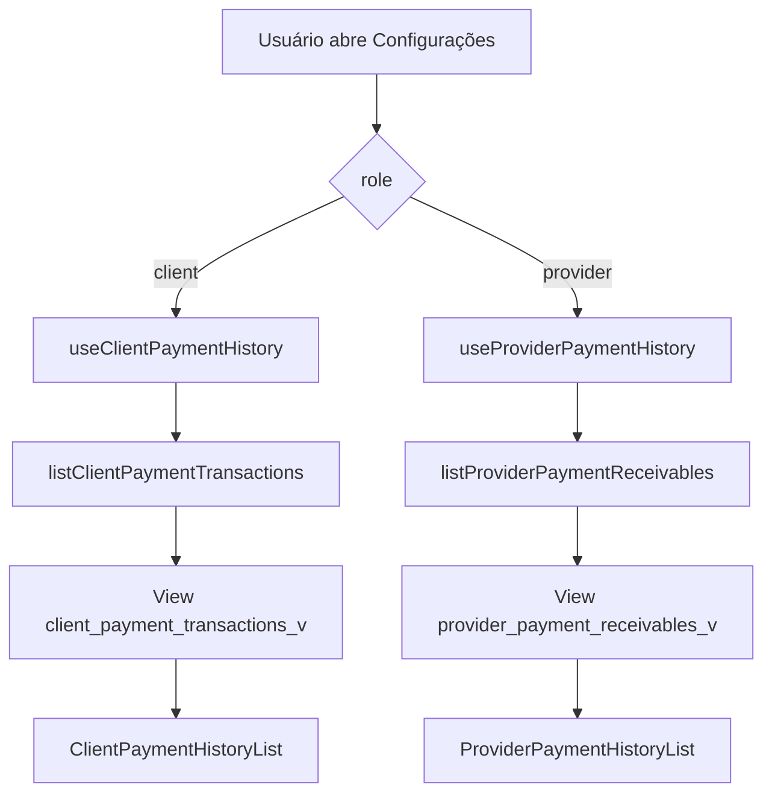
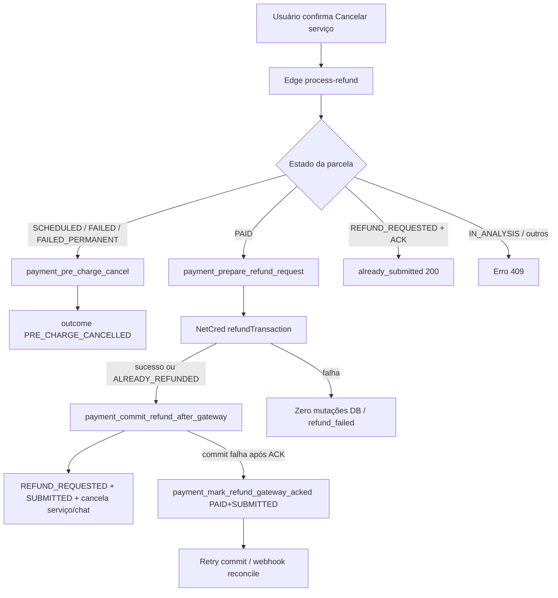

# Histórico de pagamentos e reembolso

## 1. Resumo executivo

- **O que é:** leitura do **histórico de captura** (cliente: cobranças no cartão; prestador: cobranças / `provider_payout` na captura) e o fluxo de **cancelamento com reembolso** pós-pagamento (`process-refund`), inclusive cancelamento **pré-cobrança** sem estorno.
- **Problema que resolve:** transparência do que foi cobrado/reembolsado e do valor combinado com o cliente na captura; execução segura de cancelamento/estorno com política ToS e gateway-first.
- **Quem usa:** cliente e prestador (histórico em Configurações — cliente em Pagamentos; prestador na aba Cobranças de Ganhos; cancelamento no detalhe do serviço contratado).
- **Resultado esperado:** lista atualizada de parcelas pós-captura; cancelamento pré-`PAID` sem custo; pós-`PAID` com estorno submetido ao gateway e serviço/chat cancelados só após ACK.
- **Não confundir** com **Depósitos** em Ganhos (`/dashboard/settings/earnings`, default): liquidações bancárias — ver [ganhos-e-liquidacoes](../../provider-earnings/features/ganhos-e-liquidacoes.md).

## 2. Objetivo de negócio

- **Finalidade:** auditar cobranças na captura e permitir cancelamento com estorno conforme Termos (faixas de antecedência).
- **Valor:** cliente vê breakdown de reembolso; prestador vê líquido após clawback confirmado; plataforma evita cancelar serviço antes do ACK do gateway (P-12).
- **Impacto se falhar:** histórico vazio/erro; cancelamento bloqueado ou inconsistente (gateway ACK sem commit de domínio — recovery via `payment_mark_refund_gateway_acked` + reconcile/webhook).
- **Contexto:** feature de `payments`; UI de cancelamento embutida em `view-services`; histórico embutido em `settings`.

## 3. Localização na plataforma

| Perfil | Superfície | Rota / entry | Componente |
|--------|------------|--------------|------------|
| Cliente | Histórico de pagamentos | `/dashboard/settings/payments` → aba **Histórico** | `PaymentHistorySection` → `ClientPaymentHistoryList` |
| Prestador | Cobranças (captura) | `/dashboard/settings/earnings?view=charges` (aba **Cobranças** de Ganhos) | `PaymentHistorySection` → `ProviderPaymentHistoryList` |
| Cliente / Prestador | Cancelar serviço | Detalhe do serviço (`ServiceDetailPage` → `ServiceDetailActionsBar`) | `ContractedServiceCancelAction` |

- **Rota própria:** nenhuma — seções do hub Configurações (`settings`). Na página do cliente, o histórico divide espaço com cartões via Tabs (aba irmã **Formas de pagamento**); o título da página (“Pagamentos”) fica no `SettingsSectionHeader`. No prestador, o título da página é **Ganhos**; a lista de captura **não** tem header próprio. As listas **não** repetem título de seção.
- **Deep links / query params:** cliente — aba padrão = Formas de pagamento (Histórico só ao selecionar a aba). Prestador — `view=charges` abre Cobranças; default da página Ganhos = Depósitos. Query `period=3m` | `period=6m` (default **Este mês** omite o param) convive com `view` e filtra `received_at` na lista de captura. Rota legado `/dashboard/settings/receivables` faz `Navigate replace` para `/dashboard/settings/earnings?view=charges`.
- **Guards:** hub Configurações e detalhe de serviço sob dashboard autenticado; views de histórico filtram por `auth.uid()` (ou admin).

Evidência: `src/router.tsx` (`settings/payments`, `settings/earnings`, `settings/receivables` redirect); `ClientPaymentsPage.tsx` (Tabs); `ProviderEarningsSectionPage.tsx`; `ProviderReceivablesPage.tsx`; `ServiceDetailActionsBar.tsx` (`ContractedServiceCancelAction` quando há contrato e papel client/provider).

## 4. Perfis envolvidos

| Papel | Histórico | Cancelamento / reembolso |
|-------|-----------|---------------------------|
| Cliente | Vê próprias parcelas em `client_payment_transactions_v` | Pode cancelar se elegível; motivo `CLIENT_INITIATED`; faixa ToS cliente |
| Prestador | Vê próprias cobranças em `provider_payment_receivables_v` | Pode cancelar se elegível; motivo `PROVIDER_INITIATED`; estorno integral (`PROVIDER_FULL_REFUND`) |
| Admin plataforma | Views permitem SELECT via `is_platform_admin()` | **Evidência parcial:** não há UI dedicada de cancelamento admin neste módulo |
| Anônimo / outro usuário | Sem SELECT nas views | `FORBIDDEN` se não for client/provider do serviço |

**Quem não usa o histórico nesta UI:** visitante; papéis sem acesso às seções do hub `/dashboard/settings`.

## 5. Fluxo funcional principal

### 5.1 Leitura do histórico



### 5.2 Cancelamento pós-`PAID` (gateway first)



## 6. Fluxos alternativos e exceções

| Cenário | Comportamento |
|---------|----------------|
| Cancelamento pré-cobrança | `payment_pre_charge_cancel`: serviço `CANCELLED`, parcela `CANCELLED`, chat fechado (`p_pre_charge := true`); sem chamada NetCred de refund |
| Gateway falha no refund | Resposta `refund_failed` / 500; **nenhuma** escrita irreversível na parcela ainda `PAID`; UI permite nova tentativa |
| Commit falha após ACK do gateway | `commitWithRecovery` → `payment_mark_refund_gateway_acked` (mantém `PAID` + `refund_submit_status = SUBMITTED`) → retry commit; se esgotar: `refund_commit_failed` + `support_url` |
| Retry com `REFUND_REQUESTED` já ACK’d | Short-circuit 200 `already_submitted` |
| `REFUND_REQUESTED` sem ACK | `INVALID_SCHEDULE_STATE` (greenfield: estado inválido) |
| Serviço `COMPLETED` | `SERVICE_NOT_CANCELLABLE` |
| Webhook `TRANSACTION_REFUND` | Confirma `REFUNDED` / `PARTIALLY_REFUNDED` a partir de `REFUND_REQUESTED` **ou** `PAID` (estorno externo / chargeback path) |
| Assinatura HMAC inválida no webhook | Evento terminal (`DEAD_LETTER`); sem retry que promova captura forjada — detalhe normativo em [reconciliacao-e-voids](./reconciliacao-e-voids.md) |
| Rate limit Edge | 10 req/min por IP+user, `failClosed`; HTTP 429 |
| Auto-cancel T-12h / void pós-`IN_ANALYSIS` | Cancela serviço sem ToS/refund; distinto de clawback — [reconciliacao-e-voids](./reconciliacao-e-voids.md) |
| Webhook `CHARGE_VOID` com parcela ainda `PAID`/`IN_ANALYSIS`/`PROCESSING` | Domínio → `VOIDED` (sem o fluxo de `refunded_amount`/`refunded_at` deste doc) |

## 7. Regras de negócio

1. Histórico do cliente lista apenas estados `PAID`, `REFUND_REQUESTED`, `PARTIALLY_REFUNDED`, `REFUNDED`, com `paid_amount IS NOT NULL`.
2. Histórico do prestador exige `provider_payout` e `paid_amount` não nulos, mesmos estados.
3. Breakdown de reembolso no cliente: se `refundedAmount > 0`, mostra original riscado → líquido (`amountPaid − refundedAmount`) e linha “Reembolsado” ou “Reembolso em processamento” conforme `refundedAt`.
4. Clawback no líquido do prestador **só** quando `refunded_at IS NOT NULL` (confirmação gateway); em `REFUND_REQUESTED` o líquido permanece o valor da captura.
5. Fórmula de clawback na view: `provider_payout − (refunded_amount × provider_payout / paid_amount)` quando `paid_amount > 0`.
6. Pós-`PAID`: **prepare → gateway → commit** (Option A); prepare **não** cancela serviço/chat nem muda estado da parcela.
7. Só após ACK / `ALREADY_REFUNDED`: `PAID` → `REFUND_REQUESTED`, `refund_submit_status = SUBMITTED`, grava `refunded_amount` esperado, cancela serviço e fecha chat (`payment_complete_refund_domain_side_effects`).
8. `refunded_at` **não** é setado no commit; vem do webhook/reconciliação (que também pode sobrescrever `refunded_amount` com valor confirmado).
9. Faixa ToS usa `payment_service_execution_at` **vigente** do `contracted_services` (slot após reagendamento), não `refund_anchor_execution_at` (snapshot de auditoria no primeiro `PAID`).
10. Prestador iniciador: sempre `PROVIDER_FULL_REFUND` = `charge_amount` integral (inclui taxas de cartão).
11. Cliente: `FULL_REFUND` (>48h) = `charge_amount`; `PENALTY_10` (12–48h) = `min(0.9 × base, charge)`; `PENALTY_30` (<12h) = `min(0.7 × base, charge)` — taxas de cartão **não** reembolsadas nas penalidades.
12. UI de cancelamento: serviço `CANCELLED` / `COMPLETED` não elegível; estados de parcela bloqueados: `IN_ANALYSIS`, `PROCESSING`, `REFUND_REQUESTED`, `REFUNDED`, `PARTIALLY_REFUNDED`, `CANCELLED`; elegíveis: `SCHEDULED`, `FAILED`, `FAILED_PERMANENT`, `PAID`.
13. Motivos enviados à Edge: cliente `CLIENT_INITIATED`; prestador `PROVIDER_INITIATED` (default API se omitido: `CLIENT_INITIATED`).
14. Janela comunicada ao usuário para aparecer na fatura: **30–60 dias** (`EXPECTED_REFUND_DAYS = "30-60"`).
15. Recaptura longe pós-reagendamento (`FAR_RESCHEDULE_RECAPTURE`) é **distinta** de cancelamento ToS — ver [integracao-pagamento-pos-aceite](../../service-reschedule/features/integracao-pagamento-pos-aceite.md).
16. Na aba Cobranças de Ganhos, a lista do prestador filtra `received_at` pelo período da página host (Este mês / 3 meses / 6 meses) via `listProviderPaymentReceivables` (`.gte` + `.lt` fim do dia `-03:00`). O histórico do cliente em Pagamentos **não** tem filtro de data. Sem paginação nova da view.

## 8. Campos e dados

### 8.1 Histórico cliente (`ClientPaymentTransaction`)

| Campo UI / tipo | Origem view | Uso |
|-----------------|-------------|-----|
| `scheduleId` | `schedule_id` | key da lista |
| `contractedServiceId` | `contracted_service_id` | vínculo ao serviço |
| `amountPaid` | `paid_amount` | valor cobrado no cartão |
| `serviceAmount` | `base_amount` | “Serviço: R$ …” |
| `installmentNumber` | `installment_number` | sufixo `· Nx` se > 1 |
| `paidAt` | `paid_at` | data exibida |
| `refundedAmount` / `refundedAt` | colunas homônimas | breakdown |
| `state` | `state` | rótulo |
| `isDisputed` | `is_disputed` | badge “Chargeback em análise” |

### 8.2 Histórico prestador (`ProviderPaymentReceivable`)

| Campo | Origem | Uso |
|-------|--------|-----|
| `amountReceivedAtCapture` | `provider_payout` | **Primário** — valor combinado / acordado |
| `netAmountReceived` | fórmula clawback / payout | **Secundário** se diferente do primário: “Líquido após estornos: …” |
| `receivedAt` | `paid_at` | data de captura (não liquidação bancária) |
| demais | análogos ao cliente | estado, disputa |

### 8.3 Request de cancelamento / reembolso

| Campo Edge | Origem UI | Notas |
|------------|-----------|-------|
| `service_id` | `contractedServiceId` | obrigatório |
| `cancellation_reason` | role → `CLIENT_INITIATED` / `PROVIDER_INITIATED` | |

### 8.4 Sucesso pós-`PAID`

| Campo | Significado |
|-------|-------------|
| `outcome` | `REFUND_SUBMITTED` (API TS) — body Edge sem `outcome` explícito no sucesso pós-PAID; API trata como submitted |
| `refundAmount` / `penaltyTier` / `expectedDays` | eco do cálculo / `"30-60"` |

Sucesso pré-cobrança: `outcome: PRE_CHARGE_CANCELLED`, `scheduleId`.

## 9. Validações de front-end

- **Elegibilidade do botão:** `canCancelContractedService` (status do serviço + estado da parcela); enquanto lifecycle carrega ou inelegível → componente retorna `null`.
- **Disclosure:** `getCancellationDisclosure` — textos distintos pré-cobrança / prestador / cliente com estimativa ToS (usa `serviceExecutionAt` do lifecycle; fallback aproxima data+turno em `America/Sao_Paulo`).
- **Estimativa cliente:** só com `baseAmount` e `paidAmount` > 0 (lidos de `client_payment_transactions_v` quando estado `PAID`); prestador **não** vê valores de multa (mensagem de estorno integral fixa).
- **Double-submit:** botões desabilitados com `processRefund.isPending`; label “Cancelando…”.
- **Histórico:** sem formulário; loading com **skeleton**; erro com mensagem + botão **Tentar novamente** (`refetch`); empty com painel tracejado Prestway (sem título duplicado da página).

## 10. Validações de back-end

| Camada | Checagens |
|--------|-----------|
| Edge `process-refund` | Auth Bearer; rate limit; `service_id`; initiator = client ou provider do serviço; `COMPLETED` bloqueado; `IN_ANALYSIS` bloqueado; pré-cobrança vs `PAID` |
| `payment_prepare_refund_request` | `service_role`; FORBIDDEN por papel; parcela `PAID` com `gateway_transaction_id`; calcula ToS via `payment_calculate_refund_amount` **sem** mutar |
| `payment_commit_refund_after_gateway` | Mesmas guards; opcional `p_expected_refund_amount` (tolerância 0,01 → senão `INVALID_REFUND_AMOUNT`); TX: estado + side effects |
| `payment_pre_charge_cancel` | Estados `SCHEDULED`/`FAILED`/`FAILED_PERMANENT` apenas |
| Reconcile / webhook refund | Podem confirmar `REFUNDED`/`PARTIALLY_REFUNDED` e setar `refunded_at` (clawback na view) — ver [reconciliacao-e-voids](./reconciliacao-e-voids.md) |
| Auto-cancel / void | **Não** percorre prepare/commit de refund; não seta `refunded_amount`/`refunded_at` |
| Views histórico | WHERE tenancy `auth.uid()` ou admin; grants SELECT only (`authenticated`); DML revogado |
| RPCs de refund | **não** concedidas a `authenticated` — só via Edge `service_role` |

## 11. Status, estados e transições

### Parcela (`payment_schedules`) — recorte desta feature

| Estado | Na lista de histórico? | Notas |
|--------|------------------------|-------|
| `PAID` | Sim | Captura ok |
| `REFUND_REQUESTED` | Sim | Estorno submetido; `refunded_amount` esperado possível; `refunded_at` nulo |
| `PARTIALLY_REFUNDED` / `REFUNDED` | Sim | Confirmado gateway |
| `SCHEDULED` / `FAILED` / `FAILED_PERMANENT` | Não | Pré-cobrança (cancelamento sem histórico de captura) |
| `CANCELLED` (parcela) | Não | Resultado pré-charge cancel **ou** auto-cancel T-12h |
| `VOIDED` | Não | Webhook void (não é clawback de histórico); path auto-cancel+void costuma permanecer `CANCELLED` |
| `IN_ANALYSIS` / `PROCESSING` | Não | Bloqueiam cancelamento ToS |

### FSM relevante

```text
PAID --(commit após gateway)--> REFUND_REQUESTED --(webhook TRANSACTION_REFUND)--> REFUNDED | PARTIALLY_REFUNDED
PAID --(webhook TRANSACTION_REFUND externo)--> REFUNDED | PARTIALLY_REFUNDED
SCHEDULED|FAILED|FAILED_PERMANENT --(pre_charge_cancel)--> CANCELLED
```

### `refund_submit_status`

`PENDING_GATEWAY` | `SUBMITTED` | `CONFIRMED` | `FAILED` — ACK Edge considera `SUBMITTED` ou `CONFIRMED`.

### Serviço contratado

Cancelamento pós-commit / side effects → `contracted_services.status = CANCELLED` (+ reason); chat fechado via `cns_close_contracted_service_chat`.

## 12. Persistência

### Servidor

| Artefato | Papel |
|----------|-------|
| `payment_schedules` | Fonte; campos `paid_amount`, `refunded_amount`, `refunded_at`, `refund_submit_status`, `refund_anchor_execution_at`, `is_disputed`, `provider_payout` |
| `client_payment_transactions_v` / `provider_payment_receivables_v` | Read models CLS |
| `contracted_services` | Status cancelado; `service_execution_at` para ToS |
| `payment_audit_log` / events | `REFUND_SUBMITTED`, `REFUND_GATEWAY_ACK`, `PRE_CHARGE_CANCELLED`, etc. |
| `payment_schedules_audit` | Snapshot técnico de linha (append-only) — sem UI |

### Cliente

| Artefato | Papel |
|----------|-------|
| React Query `["payment-history","client"]` | `staleTime` 30s |
| React Query `["payment-history","provider", receivedFrom, receivedTo]` | `staleTime` 30s; from/to = range do período em Ganhos (`YYYY-MM-DD` ou `null`) |
| React Query lifecycle / schedule / chats | invalidados em `useProcessRefund.onSuccess` |
| Preferences / draft | não usados nesta feature |

**Observação:** `useProcessRefund` **não** invalida explicitamente as query keys de histórico; a lista de conta depende de refetch por `staleTime`/remount — ver pendências.

## 13. Integrações

| Integração | Uso |
|------------|-----|
| Edge `process-refund` | Orquestra cancel/refund |
| NetCred `refundTransaction` | Estorno no gateway |
| Webhook NetCred `TRANSACTION_REFUND` | Confirma valor/`refunded_at` e estado final |
| Webhook void / `DEAD_LETTER` / reconcile | Ops de alinhamento gateway — [reconciliacao-e-voids](./reconciliacao-e-voids.md) (não altera fórmula de clawback da view) |
| Reconciliação / `payment_complete_refund_domain_side_effects` | Recovery domínio se commit parcial |
| `provider-earnings` (`ProviderSettlementDisclosure`, rota Ganhos) | Previsão de depósito no caption do ledger / aba Depósitos; `ProviderSettlementStatus` (não nos cards da lista de captura) |
| Chats (`cns_close_contracted_service_chat`) | Fecha conversa no cancelamento |
| `cns_cancel_active_service_reschedule_requests` | Cancela pedidos de reagendamento ativos |
| Sentry / payment-logger | Erros críticos de gateway/commit |
| `PAYMENT_SUPPORT_URL` | URL em payloads de falha crítica (default `https://prestway.com/suporte`) |

## 14. Listagens, buscas, filtros, paginação, ordenação

| Aspecto | Comportamento |
|---------|---------------|
| Fonte | SELECT nas views (sem RPC paginada) |
| Ordenação | Cliente: `paid_at` desc; Prestador: `received_at` desc |
| Filtros UI | Cliente: nenhum. Prestador (Ganhos): período da página host — `listProviderPaymentReceivables` com `.gte('received_at', from)` e `.lt('received_at', '{to}T23:59:59.999-03:00')` (filtro no servidor na view existente; **sem** paginação nova) |
| Busca textual | Não |
| Paginação | **Não** — lista completa no cliente dos registros que passam no filtro (totais do ledger Cobranças = soma client-side de `amountReceivedAtCapture` via `summarizeProviderReceivables`; sem RPC nova) |
| Loading | Skeleton Prestway (sem spinner textual) |
| Empty (cliente) | Painel dashed: “Nenhum pagamento ainda” + copy de apoio |
| Empty (prestador) | Painel dashed: “Nenhuma cobrança neste período” + “Quando um cliente pagar um serviço seu neste período, o valor combinado aparece aqui.”; linha de contagem vazia “Nenhum registrado”; **sem** parágrafo educativo, **sem** link para Ganhos, **sem** `ProviderSettlementDisclosure` por card |
| Erro (cliente) | Mensagem de load fail + **Tentar novamente** |
| Erro (prestador) | “Não foi possível carregar o histórico de cobranças.” + **Tentar novamente** |

## 15. Ações disponíveis

| Ação | Quem | Pré-condição | Resultado sucesso | Erro típico |
|------|------|--------------|-------------------|-------------|
| Ver histórico | Cliente / Prestador | Autenticado; linhas na view | Lista / empty / erro de fetch (retry) | Mensagem de load fail + Tentar novamente |
| Cancelar (pré-cobrança) | Cliente ou prestador do serviço | Elegibilidade UI + estados pré-charge | Toast “Serviço cancelado com sucesso.” | Matriz §Anexo A |
| Cancelar (pós-`PAID`) | Idem | Parcela `PAID` + execução conhecida no servidor | Toast com janela 30–60 dias | `refund_failed`, guards 409, etc. |

**Não há** ação de “solicitar reembolso” isolada do cancelamento do serviço neste módulo.

## 16. Dependências

| Direção | Módulo / feature | Relação |
|---------|------------------|---------|
| Upstream UI | `settings` | Embute `PaymentHistorySection` |
| Upstream UI | `view-services` | Embute `ContractedServiceCancelAction` |
| Downstream | `chats` | Close conversation no cancel |
| Downstream | `service-reschedule` | Cancela requests ativos; ToS usa slot vigente |
| Lateral | `provider-earnings` | Distinção captura (Cobranças) vs liquidação (Depósitos); disclosure **não** nos cards da lista |
| Lateral | Checkout/cobrança | Estados de parcela; captura inicial — [checkout-e-cobranca](./checkout-e-cobranca.md) (não detalhado aqui) |
| Eng. | `docs/payment-system/design.md` §3.13 / §4.8 | Norma técnica |

## 17. Regras implícitas

1. Histórico **não** mostra parcelas pré-captura nem `CANCELLED` da parcela.
2. Prestador vê `received_at = paid_at` (captura), nunca data de settlement bancário nesta lista.
3. Badge de disputa só renderiza se `isDisputed`; texto fixo “Chargeback em análise”.
4. Estimativa ToS na UI do cliente pode divergir levemente do servidor se relógio/slot diferirem; servidor é autoritativo no prepare/commit.
5. Provider na UI de cancelamento pós-`PAID` **não** obtém `baseAmount`/`paidAmount` via lifecycle (view cliente RLS) — disclosure sem valor numérico estimado.
6. Sucesso pós-charge formata `expectedDays` `"30-60"` → “30 a 60”; fallback da mensagem se ausente: mesma janela.
7. Payload `refund_failed` mesmo com HTTP ok é forçado a erro (CHK-008) — nunca toast de sucesso.
8. `supportUrl` é anexado ao `Error` em falhas, mas o toast de `ContractedServiceCancelAction` exibe só `error.message` (URL não aparece na UI atual).
9. Rate limit fail-closed: se o limiter falhar, a Edge rejeita (não “abre” o limite).
10. Título da superfície fica no `SettingsSectionHeader` da página host (cliente: Pagamentos; prestador: Ganhos); `ClientPaymentHistoryList` / `ProviderPaymentHistoryList` / `SavedCardsList` não repetem H2/título de seção.
11. Copy da lista do prestador usa **“cobranças”** (não “recebimentos”): contagem “N cobranças” / empty “Nenhuma cobrança neste período”; loading `aria-label="Carregando cobranças"`.

## 18. Riscos

| Risco | Mitigação / evidência |
|-------|----------------------|
| Cancelar domínio antes do gateway (P-12) | Gateway-first + recovery `mark_refund_gateway_acked` |
| Histórico desatualizado após cancel | Sem invalidate das keys de history; usuário pode ver estado antigo até stale/remount |
| Lista sem paginação | Volume alto de parcelas pode degradar fetch/UI |
| Divergência estimativa UI vs ToS servidor | Servidor recalcula no prepare/commit; UI é disclosure |
| Commit esgotado após ACK | `refund_commit_failed` + support URL; reconcile/webhook |
| Clawback prematuro no prestador | View exige `refunded_at` |

## 19. Evidências

| Área | Paths |
|------|-------|
| UI histórico | `src/features/payments/components/PaymentHistory/*` |
| UI cancel | `src/features/payments/components/ContractedServiceCancelAction.tsx` |
| Hooks | `useClientPaymentHistory.ts`, `useProviderPaymentHistory.ts`, `useProcessRefund.ts`, `usePaymentScheduleLifecycle.ts` |
| API | `api/history.api.ts` (`listProviderPaymentReceivables` aceita `receivedFrom`/`receivedTo`), `api/refund.api.ts`, `api/charges.api.ts` (lifecycle) |
| Utils | `clientPaymentHistoryAmounts.ts`, `summarizeProviderReceivables.ts`, `formatPaymentHistoryState.ts`, `contractedServiceCancellation.ts`, `mapCancellationError.ts`, `formatPostChargeCancelSuccessMessage.ts` |
| Tipos | `types/paymentHistory.types.ts` |
| Conta | `src/features/settings/components/sections/ClientPaymentsPage.tsx` (Tabs), `ProviderEarningsSectionPage.tsx` (aba Cobranças), `ProviderReceivablesPage.tsx` (redirect legado) |
| Detalhe serviço | `src/features/view-services/components/ServiceDetailActionsBar.tsx`, `ServiceDetailPage.tsx` |
| Edge | `supabase/functions/process-refund/{index,handleRequest,types}.ts` |
| Views | `supabase/migrations/20260801140000_create_payment_history_views.sql` |
| Grants DML deny | `20260802290000_revoke_payment_view_dml_grants.sql` |
| RPCs refund | `20260802070000_service_reschedule_cancel_integration.sql` (prepare/commit/mark/complete/pre_charge) |
| Cálculo ToS | `20260801360000_payment_begin_refund_request.sql` (`payment_calculate_refund_amount`) |
| Transição PAID→REFUNDED | `20260801840000_payment_schedules_allow_paid_refund_transition.sql`; webhook `20260801330000_payment_process_webhook_event.sql` |
| Testes | Vitest em `__tests__/` dos componentes/hooks/api; Deno `process-refund/__tests__`; pgTAP `payment_history_views_*`, `payment_fix005_refund_*` |
| Eng. | `docs/payment-system/design.md`; `docs/payment-system/critical-bug-refund-partial-commit.md` |

## 20. Pendências

1. **Invalidação do histórico após refund:** `useProcessRefund` não invalida `CLIENT_PAYMENT_HISTORY_QUERY_KEY` / `PROVIDER_PAYMENT_HISTORY_QUERY_KEY` — confirmar se é intencional (stale 30s) ou gap de UX.
2. **Paginação server-side** do histórico: regra de projeto recomenda paginação para listagens crescentes; hoje é fetch completo — gap técnico/produto.
3. **`supportUrl` na UI:** presente no erro da API/Edge, não exibido no toast de cancelamento.
4. **Admin:** SELECT nas views; fluxo de cancelamento operacional fora do app — evidência parcial.
5. **Disputa / chargeback:** badge exibida; fluxo completo de disputa NetCred não documentado neste arquivo (fora do escopo de cancelamento ToS).
6. **Webhook assinatura inválida / DEAD_LETTER:** pipeline documentada em [reconciliacao-e-voids.md](./reconciliacao-e-voids.md) (ingest unsigned → `DEAD_LETTER`; reset `payment_reset_dead_letter_event`).
7. Matriz completa de cancelamento em outros entry points (ex.: CNS `cns_confirm_service_cancellation`) — integração lateral; não é a UI `ContractedServiceCancelAction`.
8. **Void vs clawback:** `VOIDED` / auto-cancel+void **não** alimentam `refunded_at`; líquido do prestador na view de captura só muda com refund confirmado.

---

## Anexo A — Matriz de erros / códigos → UI (cancelamento e reembolso)

Fontes: `mapCancellationError.ts`, `refund.api.ts`, `process-refund/handleRequest.ts`, `types.ts` (`ProcessRefundErrorCode`).

| Código / condição | HTTP típico (Edge) | Mensagem UI (pt-BR) | Observação |
|-------------------|--------------------|---------------------|------------|
| `PAYMENT_IN_ANALYSIS` | 409 | Seu pagamento está em análise antifraude. Aguarde a conclusão ou entre em contato com o suporte. | Guard Edge + RPC |
| `SERVICE_NOT_CANCELLABLE` | 409 | Este serviço não pode mais ser cancelado. | Ex.: `COMPLETED` |
| `INVALID_SCHEDULE_STATE` | 409 | Não é possível cancelar neste momento. Atualize a página e tente novamente. | Default de mapRpcError em vários falhas |
| `FORBIDDEN` | 403 | Você não tem permissão para cancelar este serviço. | Não é cliente/prestador do serviço |
| `SERVICE_NOT_FOUND` | 404 | Serviço não encontrado. | |
| `SCHEDULE_NOT_FOUND` | 404 | Agendamento de pagamento não encontrado. | Pré-charge sem schedule |
| `TRANSACTION_NOT_FOUND` | 409 | Não encontramos a transação de pagamento. Entre em contato com o suporte. | Sem `gateway_transaction_id` |
| `refund_failed` / gateway fail | 500 | Não foi possível processar o cancelamento/reembolso. Tente novamente. | Zero writes se ainda `PAID`; pode incluir `support_url` no payload |
| `PAYMENT_SCHEDULE_TERMINAL_STATE` | 409 | Não é possível cancelar neste momento. O pagamento já está em um estado final. | Mapeado na UI; origem RPC de transição |
| `PAYMENT_SCHEDULE_INVALID_TRANSITION` | 409 | Não é possível cancelar neste momento. Atualize a página e tente novamente. | |
| `INVALID_REFUND_AMOUNT` | 409 | Fallback genérico (código sem entrada dedicada no mapa) | Divergence prepare vs commit > R$ 0,01 |
| `refund_commit_failed` | 500 | Mensagem via `error_code` aninhado ou fallback genérico | `refund_submit_status: SUBMITTED` + `support_url` |
| `rate_limited` | 429 | Fallback genérico (não está no mapa de cancelamento) | `Retry-After` no header |
| `Unauthorized` / sem Bearer | 401 | Fallback genérico | |
| `service_id` ausente / JSON inválido | 400 | Fallback genérico | |
| `service_scheduled_at_missing` | 422 | Fallback genérico | `service_execution_at` nulo no contexto pós-PAID |
| Erro de rede / fetch history | — | Cliente: histórico de pagamentos; prestador: “Não foi possível carregar o histórico de cobranças.” + **Tentar novamente** | Listas apenas |
| Código desconhecido | — | Não foi possível processar o cancelamento/reembolso. Tente novamente. | `FALLBACK_CANCELLATION_ERROR` |

### Outcomes de sucesso (não são erros)

| Outcome / body | Toast |
|----------------|-------|
| `PRE_CHARGE_CANCELLED` | Serviço cancelado com sucesso. |
| Pós-PAID (`REFUND_SUBMITTED` na API) | Cancelamento solicitado. O estorno pode levar de 30 a 60 dias para aparecer na fatura. |
| `already_submitted` em `REFUND_REQUESTED` | Tratado como sucesso pelo handler Edge (200); fluxo UI típico já ocultou o botão por estado |

---

## Anexo B — Matriz de elegibilidade de cancelamento (UI)

| `serviceStatus` | `scheduleState` | Botão visível? |
|-----------------|-----------------|----------------|
| `CANCELLED` / `COMPLETED` | qualquer | Não |
| outro | `IN_ANALYSIS` / `PROCESSING` / `REFUND_REQUESTED` / `REFUNDED` / `PARTIALLY_REFUNDED` / `CANCELLED` | Não |
| outro | `SCHEDULED` / `FAILED` / `FAILED_PERMANENT` / `PAID` | Sim |
| `PENDING_PAYMENT` / `CONFIRMED` | `scheduleState` ausente | Sim (fallback sem schedule) |
| outro | estado fora dos sets | Não |

Evidência: `contractedServiceCancellation.ts` (`canCancelContractedService`).

---

## Anexo C — Faixas ToS (cliente) e prestador

| Iniciador | Antecedência (`payment_service_execution_at − now`) | Tier | Valor estornado |
|-----------|-----------------------------------------------------|------|-----------------|
| Prestador | — | `PROVIDER_FULL_REFUND` | `charge_amount` |
| Cliente | > 48 h | `FULL_REFUND` | `charge_amount` |
| Cliente | ≥ 12 h e ≤ 48 h | `PENALTY_10` | `min(0.90 × base_amount, charge_amount)` |
| Cliente | < 12 h | `PENALTY_30` | `min(0.70 × base_amount, charge_amount)` |

Evidência: `payment_calculate_refund_amount`; espelho UI em `estimateClientRefundAmount`.

---

## Fora de escopo neste documento

- Checkout, tokenização, T-2, cobrança manual, ClearSale, KYC — [checkout-e-cobranca.md](./checkout-e-cobranca.md).
- Auto-cancel T-12h, void pós-`IN_ANALYSIS`, reconcile, sync settlements, `DEAD_LETTER` — [reconciliacao-e-voids.md](./reconciliacao-e-voids.md).
- Liquidações bancárias / Ganhos — [ganhos-e-liquidacoes](../../provider-earnings/features/ganhos-e-liquidacoes.md).
- Recaptura longe pós-reagendamento — [integracao-pagamento-pos-aceite](../../service-reschedule/features/integracao-pagamento-pos-aceite.md).
- Runbooks NetCred e design normativo completo — `docs/payment-system/`.
