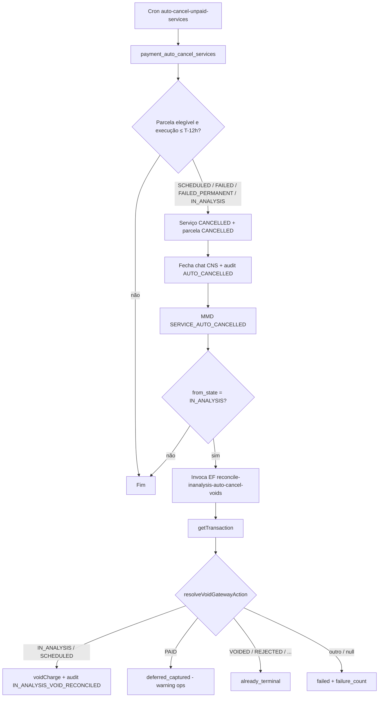
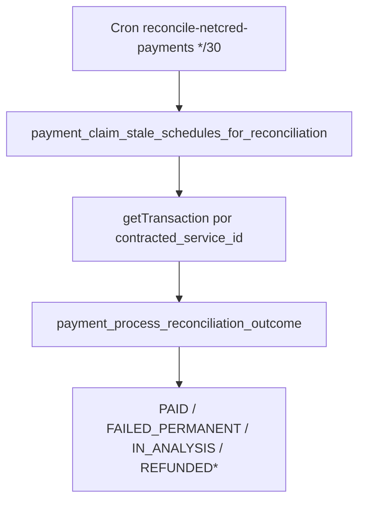
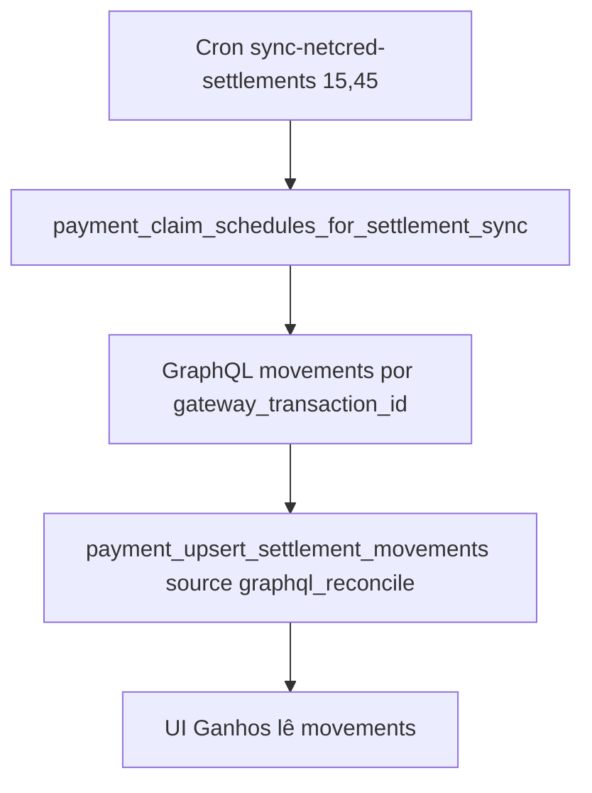

# Reconciliação, auto-cancel T-12h, voids e gaps de webhook

Documentação de **ops/backend de pagamentos** (sem UI dedicada): auto-cancel perto da execução, void pós-`IN_ANALYSIS`, reconciliação de parcelas stale, sync GraphQL de liquidações e quarentena `DEAD_LETTER` de webhooks NetCred.

**Fora de escopo:** checkout/tokenização/T-2/manual → [checkout-e-cobranca.md](./checkout-e-cobranca.md); histórico de captura e reembolso ToS → [historico-e-reembolso.md](./historico-e-reembolso.md); UI Ganhos → [provider-earnings](../../provider-earnings/README.md); KYC UI → [provider-kyc](../../provider-kyc/README.md). Runbooks de infra: `docs/payment-system/`.

---

## 1. Resumo executivo

| Item | Descrição |
|------|-----------|
| **Para que serve** | Alinhar domínio Orbit × gateway NetCred quando webhook atrasa/falha; cancelar serviços não pagos perto de T-12h; estornar no gateway cobranças ainda em análise após esse cancel; preencher gaps de liquidação bancária. |
| **Quem usa** | **Sistema / ops** (pg_cron + Edges com auth de cron). Cliente e prestador só observam efeitos (serviço cancelado, notificações, estados de parcela, Ganhos). |
| **Resultado de sucesso** | Parcela stale vai a `PAID` / `FAILED_PERMANENT` / refund confirmado; unpaid/`IN_ANALYSIS` em T-12h → serviço+parcela `CANCELLED` (+ void gateway quando aplicável); settlements faltantes upsertados; webhook inválido fica terminal sem promover captura. |
| **Se falhar** | Parcela presa em `PROCESSING`/`IN_ANALYSIS`; serviço cancelado com captura no gateway (`deferred_captured`); movements ausentes na UI de Ganhos; eventos em `DEAD_LETTER` exigem reset operacional. |

---

## 2. Objetivo de negócio

1. Não deixar o cliente com serviço ativo sem pagamento válido perto da execução (**T-12h**).
2. Não deixar cobrança em análise “órfã” no gateway após o domínio já ter cancelado (`chargeVoid` / terminal já reconciliado).
3. Recuperar captura/rejeição/estorno quando o webhook não chegou a tempo (**reconcile**).
4. Recuperar movimentos de liquidação quando `PAYOUT_*` falhou ou atrasou (**sync settlements**).
5. Isolar eventos com assinatura inválida ou retries esgotados (`DEAD_LETTER`) sem mutar parcela indevidamente.

---

## 3. Localização na plataforma

| Superfície | Onde | Observação |
|------------|------|------------|
| **UI de produto** | Nenhuma rota/tela dedicada | Efeitos em Meus serviços / detalhe / conta / Ganhos |
| **Cobrança manual** | View `service-cancelled` se `SERVICE_AUTO_CANCELLED` | Ver checkout-e-cobranca |
| **Cancelamento ToS** | Bloqueado em `IN_ANALYSIS` | Ver historico-e-reembolso |
| **Ops** | pg_cron + Edges + RPCs `service_role` | Auth Orbit cron; runbooks em `docs/payment-system/` |

---

## 4. Perfis envolvidos

| Perfil | Papel |
|--------|-------|
| **Cliente** | Recebe notificação `SERVICE_AUTO_CANCELLED` / estados de cobrança; não dispara estas Edges. |
| **Prestador** | Serviço some do calendário operacional ao cancelar; liquidação via settlements (UI em `provider-earnings`). |
| **Sistema** | Crons `auto-cancel-unpaid-services`, `reconcile-inanalysis-auto-cancel-voids`, `reconcile-netcred-payments`, `sync-netcred-settlements`, pipeline webhook. |
| **Suporte / ops** | `payment_reset_dead_letter_event` (service_role); alertas Sentry `auto_cancel` / `webhook_dead_letter`. |
| **Visitante** | Não usa. |

---

## 5. Fluxo funcional principal

### 5.1 Auto-cancel T-12h + void se veio de `IN_ANALYSIS`

### 5.2 Reconciliação de parcelas stale

### 5.3 Sync de settlements (gap de webhook)

---

## 6. Fluxos alternativos e exceções

| Cenário | Comportamento observável |
|---------|--------------------------|
| **`IN_ANALYSIS` antes de T-12h** | Fora do batch de auto-cancel (só entra quando `service_execution_at − now ≤ auto_cancel_hours`). Cancelamento ToS do usuário permanece bloqueado (`PAYMENT_IN_ANALYSIS`). |
| **Prestador `SUSPENDED`** | Motivo `PROVIDER_SUSPENDED` em vez de `NON_PAYMENT`. |
| **Gateway já `PAID` após cancel domínio** | Outcome `deferred_captured`: parcela **permanece** `CANCELLED`; warning; **não** chama void. Dinheiro capturado no gateway com serviço cancelado no Orbit — risco ops. |
| **Gateway já terminal** (`VOIDED`, `REJECTED`, `CANCELLED`, `EXPIRED`, `REFUNDED`, `PARTIALLY_REFUNDED`) | `already_terminal`; audit `IN_ANALYSIS_VOID_RECONCILED`; sem nova void. |
| **Void falha / estado unsupported / sem company / sem charge id** | `failed`; incrementa `reconciliation_failure_count`; para de claimar após max (default **5**). |
| **Webhook `CHARGE_VOID` / `TRANSACTION_VOID` com parcela já `CANCELLED`** | Handler retorna `skipped` / `invalid_transition` (só aceita `PAID` \| `IN_ANALYSIS` \| `PROCESSING`). Domínio pós-auto-cancel **não** vira `VOIDED` por webhook. |
| **Webhook void com parcela `IN_ANALYSIS`/`PROCESSING`/`PAID`** | Transição para `VOIDED` + audit `CHARGE_VOIDED` — **sem** cancelar serviço neste handler. |
| **Assinatura HMAC inválida** | Persistência em `DEAD_LETTER` (quarentena); HTTP 401; sem processar captura. |
| **Retries de processamento esgotados** | `max_webhook_retries` (seed **3**) → `DEAD_LETTER` + alerta Sentry. |
| **Reset ops** | `payment_reset_dead_letter_event` → `RECEIVED` + refileira queue. |
| **Reconcile ainda `IN_ANALYSIS`** | Skip `still_in_analysis` (não falha). |
| **Settlements: grace 30 min pós-`paid_at`** | Evita corrida com `PAYOUT_*` webhook antes do GraphQL. |
| **Path pesado webhook** | `TRANSACTION_UPDATE` e payouts com muitos movements → enqueue assíncrono (não inline). |

---

## 7. Regras de negócio (numeradas)

1. Janela de auto-cancel: `auto_cancel_hours_before_service` (default **12** horas antes de `service_execution_at`).
2. Estados de parcela elegíveis ao auto-cancel: `SCHEDULED`, `FAILED`, `FAILED_PERMANENT`, `IN_ANALYSIS`. Não inclui `PAID`, `PROCESSING`, refund*, `VOIDED`, etc.
3. Ao auto-cancelar: `contracted_services.status = CANCELLED`, parcela `CANCELLED`, fecha chat via `cns_close_contracted_service_chat` (`initiator=system`, `p_pre_charge=false`), audit `AUTO_CANCELLED`.
4. Motivo: `NON_PAYMENT` ou `PROVIDER_SUSPENDED` se onboarding do prestador estiver `SUSPENDED`.
5. Se o estado **anterior** era `IN_ANALYSIS`, marca `requires_gateway_reconcile` e o cron invoca a EF de void (falha da invoke **não** desfaz o cancel — warning).
6. Claim de void só para parcelas `CANCELLED` com `gateway_charge_id`, audit `AUTO_CANCELLED` com `from_state = IN_ANALYSIS`, **sem** audit `IN_ANALYSIS_VOID_RECONCILED`, e `reconciliation_failure_count < max` (default **5**).
7. Void no gateway só se estado NetCred for `IN_ANALYSIS` ou `SCHEDULED`; se `PAID` → defer; se terminal listado → already_terminal.
8. Commit de void **não** muda o estado da parcela (permanece `CANCELLED`); só libera lease e grava audit de reconcile/falha.
9. Reconcile stale: estados `IN_ANALYSIS`, `PROCESSING`, `REFUND_REQUESTED`, ou `PAID` com `refund_submit_status = SUBMITTED` e `refunded_at` nulo; stale se `updated_at` mais antigo que `reconciliation_poll_interval_minutes` (default **30**).
10. Outcomes de reconcile aplicados: gateway `PAID` → parcela `PAID` (+ serviço `PENDING_PAYMENT`→`CONFIRMED`); `REJECTED` → `FAILED_PERMANENT`; `IN_ANALYSIS` só a partir de `PROCESSING`; `REFUNDED`/`PARTIALLY_REFUNDED` a partir de `REFUND_REQUESTED` (e ramo SQL também cita `PAID` no `elsif` de refund — ver pendências se divergir do claim).
11. Sync settlements: parcelas NetCred em `PAID` \| `REFUNDED` \| `PARTIALLY_REFUNDED` com `gateway_transaction_id`, sem movements **ou** com movement pendente (`settled_at` nulo e `settling_at` no passado UTC), respeitando grace de 30 min pós-`paid_at` quando ainda não há overdue pending.
12. Webhook sem assinatura válida → `DEAD_LETTER` na ingestão; `payment_process_webhook_event` recusa unsigned e eventos já em `DEAD_LETTER`.
13. Cliente **não** cancela ToS enquanto parcela está `IN_ANALYSIS` (409 `PAYMENT_IN_ANALYSIS`) — independente do cron T-12h.

---

## 8. Campos e dados (inputs / shape)

### 8.1 Claim void (`payment_claim_inanalysis_auto_cancel_void_batch`)

JSON array com: `schedule_id`, `contracted_service_id`, `client_id`, `provider_id`, `gateway_charge_id`, `gateway_transaction_id`, `reconciliation_failure_count`, `netcred_company_id`.

### 8.2 Commit void (`payment_commit_inanalysis_auto_cancel_void_outcome`)

| Campo | Valores |
|-------|---------|
| `p_outcome` | `voided` \| `deferred_captured` \| `already_terminal` \| `failed` |
| `p_gateway_state` | texto opcional do gateway |
| `p_error_message` | só relevante em `failed` |

### 8.3 Reconcile apply

`payment_process_reconciliation_outcome(schedule_id, gateway_state, paid_amount?, refunded_amount?, gateway_charge_id?, gateway_transaction_id?)`.

### 8.4 Settlement sync schedule

`schedule_id`, `provider_id`, `state`, `gateway_transaction_id`, `gateway_slug`, `paid_at`, `netcred_company_id`.

---

## 9. Validações de front-end

Não há formulário destas Edges. Efeitos indiretos na UI:

| Superfície | Comportamento |
|------------|---------------|
| Cobrança manual | `SERVICE_AUTO_CANCELLED` → view serviço cancelado |
| Cancelar serviço | Botão oculto / 409 se `IN_ANALYSIS` |
| Histórico captura | Não lista `CANCELLED` / `VOIDED` pré-captura típicos |
| Ganhos | Depende de movements (webhook ou sync) |

---

## 10. Validações de back-end (RPC, Edge)

| Camada | Regras |
|--------|--------|
| Todas as RPCs/Edges deste doc | `service_role` ou Orbit cron auth; não concedidas a `authenticated` |
| `payment_auto_cancel_services` | Janela T-12h; estados listados; `FOR UPDATE SKIP LOCKED` |
| Claim void | Audit trail `AUTO_CANCELLED` from `IN_ANALYSIS`; charge id; max failures |
| EF void | `getTransaction` + `voidCharge` NetCred; company id obrigatório |
| Claim reconcile | Stale minutes + lease; estados intermediários / recovery refund |
| Claim settlement sync | Gap de movements ou overdue pending; grace 30 min |
| Webhook ingress | HMAC antes de processar; unsigned → `DEAD_LETTER` |
| `payment_reset_dead_letter_event` | Só se estado atual `DEAD_LETTER` |

---

## 11. Status, estados e transições

### Parcela — recorte ops

| Transição | Gatilho |
|-----------|---------|
| `SCHEDULED`/`FAILED`/`FAILED_PERMANENT`/`IN_ANALYSIS` → `CANCELLED` | `payment_auto_cancel_services` |
| `CANCELLED` (pós-IN_ANALYSIS) + void gateway | EF void; estado **permanece** `CANCELLED` |
| `PROCESSING` → `IN_ANALYSIS` / `PAID` / `FAILED_PERMANENT` | Reconcile ou webhook |
| `IN_ANALYSIS` → `PAID` / `FAILED_PERMANENT` | Reconcile ou webhook captura/reject |
| `IN_ANALYSIS`/`PROCESSING`/`PAID` → `VOIDED` | Webhook void (não o path auto-cancel) |
| `REFUND_REQUESTED` → `REFUNDED`/`PARTIALLY_REFUNDED` | Reconcile ou webhook refund |

### Webhook event

`RECEIVED` → `VALIDATING`/`PROCESSING` → `PROCESSED` \| `FAILED` (retry) \| `DEAD_LETTER` (assinatura inválida ou retries esgotados). Reset ops: `DEAD_LETTER` → `RECEIVED`.

### Serviço contratado

Auto-cancel → `CANCELLED` com `cancellation_reason` `NON_PAYMENT` ou `PROVIDER_SUSPENDED`. Reconcile `PAID` pode promover `PENDING_PAYMENT` → `CONFIRMED`.

---

## 12. Persistência

| Artefato | Papel |
|----------|-------|
| `payment_schedules` | Estado, lease `locked_until`, `reconciliation_failure_count`, ids gateway |
| `payment_audit_log` | `AUTO_CANCELLED`, `IN_ANALYSIS_VOID_*`, `RECONCILIATION_*`, `CHARGE_VOIDED`, `WEBHOOK_DEAD_LETTER_RESET` |
| `payment_webhook_events` | Ingress + `signature_validated` + estado incl. `DEAD_LETTER` |
| `payment_webhook_processing_queue` | Retry / heavy path |
| `payment_settlement_movements` | Liquidações (UI em provider-earnings) |
| `job_runs` | Telemetria dos crons de pagamento |
| `platform_constants` | T-12h, batch sizes, `max_webhook_retries`, poll reconcile, etc. |

---

## 13. Integrações

| Integração | Papel |
|------------|-------|
| **pg_cron `auto-cancel-unpaid-services`** | `payment_cron_auto_cancel_unpaid_services` (versão em `20260801760000` com void invoke + MMD + Sentry) |
| **EF `reconcile-inanalysis-auto-cancel-voids`** | `*/30 * * * *` + invoke imediata pós-cancel IN_ANALYSIS |
| **EF `reconcile-netcred-payments`** | `*/30 * * * *` — `getTransaction` → `payment_process_reconciliation_outcome` |
| **EF `sync-netcred-settlements`** | `15,45 * * * *` — GraphQL movements → upsert |
| **EF `netcred-webhook`** | Ingress HMAC; process / enqueue; payouts; voids |
| **NetCred GraphQL** | `getTransaction`, `voidCharge`, list movements |
| **MMD** | `SERVICE_AUTO_CANCELLED`; notify de reconcile (`CHARGE_SUCCEEDED`, `CHARGE_FAILED_PERMANENT`, `CHARGE_IN_ANALYSIS`) |
| **CNS** | `cns_close_contracted_service_chat` no auto-cancel |
| **Sentry** | `auto_cancel`, `webhook_dead_letter` via `orbit-emit-sentry-alerts` |
| **provider-earnings** | Consome settlements persistidos aqui |

---

## 14. Listagens, buscas, filtros, paginação

Batches server-side apenas (claim RPCs). Sem UI de listagem operacional neste módulo. Defaults observados:

| Constante / default no código | Uso |
|-------------------------------|-----|
| `auto_cancel_batch_size` = 100 | Auto-cancel |
| `inanalysis_void_reconcile_batch_size` default 25 | Void claim |
| `reconciliation_batch_size` default 50 | Reconcile claim |
| `settlement_sync_batch_size` = 20 | Settlement sync |

---

## 15. Ações disponíveis

| Ação | Quem | Pré-condição | Resultado | Erro / exceção |
|------|------|--------------|-----------|----------------|
| Auto-cancel batch | Cron | T-12h + estados elegíveis | Serviço/parcela cancelados; notificação | Erro por linha contado; continua batch |
| Void pós-IN_ANALYSIS | Cron / invoke | Claim elegível | Gateway void + audit reconciled | `deferred_captured`, `failed` |
| Reconcile stale | Cron | Stale intermediário | Aplica estado gateway | Skip / failure count |
| Sync settlements | Cron | Gap / overdue | Upsert movements | skip / empty / failure |
| Processar webhook | NetCred → EF | Assinatura ok | Handler por `event_type` | 401 / DEAD_LETTER / retry |
| Reset DEAD_LETTER | Ops service_role | Evento em `DEAD_LETTER` | Reprocessável | `EVENT_NOT_FOUND_OR_NOT_DEAD_LETTER` |

---

## 16. Dependências

| Direção | Módulo / feature | Relação |
|---------|------------------|---------|
| Upstream cobrança | [checkout-e-cobranca](./checkout-e-cobranca.md) | Produz `IN_ANALYSIS` / `FAILED*` / ClearSale |
| Lateral cancel ToS | [historico-e-reembolso](./historico-e-reembolso.md) | Bloqueio `IN_ANALYSIS`; refund ≠ void auto-cancel |
| Downstream UI | `my-services` / `view-services` | Serviço cancelado; manual charge |
| Downstream UI | [provider-earnings](../../provider-earnings/README.md) | Settlements |
| Lateral | `chats` / CNS | Close no auto-cancel |
| Lateral | `message-dispatcher` | Templates de cancel / charge |
| Eng. | `docs/payment-system/design.md` §1.7.7, §4.12, §4.7 | Norma técnica |

---

## 17. Regras implícitas (só no código)

1. Path de void **não** promove parcela a `VOIDED` — só o webhook void (e só de certos estados fonte).
2. Auto-cancel chama chat close com `p_pre_charge := false` mesmo para parcelas nunca capturadas.
3. Invoke da EF de void após auto-cancel é best-effort (exception → `raise warning`); cancel já commitado.
4. EF void emite warning em `deferred_captured` e quando `failureCount >= 3` no summary da run.
5. Reconcile trata gateway `IN_ANALYSIS` + domínio `IN_ANALYSIS` como skip sem incrementar falha.
6. Settlement sync usa source `graphql_reconcile` (distinto de webhook payout).
7. Constantes `inanalysis_void_reconcile_*` usam default na RPC se não houver seed explícito na migration de seeds base.

---

## 18. Riscos

| Risco | Impacto | Mitigação observada |
|-------|---------|---------------------|
| `deferred_captured` | Cliente cobrado com serviço já cancelado no Orbit | Warning + audit; **sem** auto-refund neste path — gap ops |
| Webhook void após `CANCELLED` | Domínio não vira `VOIDED` | Aceitável se void EF já reconciliou gateway; estado Orbit fica `CANCELLED` |
| Gap `PAYOUT_*` | Ganhos vazios / só D+30 | Cron sync GraphQL secundário |
| `DEAD_LETTER` sem reset | Captura/refund nunca aplicados | RPC reset + alerta Sentry |
| Race webhook × reconcile × void | Estados concorrentes | Lease `SKIP LOCKED`; FSM; regression guards |
| Void max failures | Charge permanece aberta no gateway | Contador + alerta por falhas; ops manual |

---

## 19. Evidências

| Área | Paths |
|------|-------|
| Auto-cancel RPC | `supabase/migrations/20260801420000_payment_auto_cancel_services.sql` (superseded close-chat em `20260801850000_*`) |
| Cron + void invoke | `20260801760000_payment_inanalysis_auto_cancel_void.sql`; cron base `20260801500000_payment_cron_auto_cancel_unpaid_services.sql` |
| EF void | `supabase/functions/reconcile-inanalysis-auto-cancel-voids/` |
| Reconcile EF/RPC | `supabase/functions/reconcile-netcred-payments/`; `20260801380000_payment_process_reconciliation_outcome.sql`; claim em `20260801610000_payment_ef_hardening.sql` |
| Settlements sync | `supabase/functions/sync-netcred-settlements/`; `20260802250000_payment_sync_netcred_settlements_cron.sql` |
| Webhook / void handler / DEAD_LETTER | `supabase/functions/netcred-webhook/`; `20260801330000_payment_process_webhook_event.sql`; ingest `20260801310000_*` / `20260801650000_*`; update state `20260801600000_*`; reset `20260801470000_*` |
| Constantes | `20260801020000_payment_platform_constants_seeds.sql` (`auto_cancel_*`, `max_webhook_retries`, …) |
| Testes | Deno `__tests__` das EFs; pgTAP `payment_auto_cancel_*`, webhook signature/dead letter |
| Eng. | `docs/payment-system/design.md` §4.12; `docs/payment-system/payment-job-runs-monitoring.md` |

---

## 20. Pendências

| ID | Tema | Status |
|----|------|--------|
| **P-DEFERRED-CAPTURED** | Após auto-cancel com gateway já `PAID`, não há refund/recapture automático neste path — só warning. Confirmar runbook ops / produto. | Evidência de código; gap de processo |
| **P-VOIDED vs CANCELLED** | Auto-cancel+void mantém `CANCELLED`; webhook void usaria `VOIDED` só se ainda `IN_ANALYSIS`/`PROCESSING`/`PAID`. Glossário de suporte pode confundir. | Documentado; sem UI |
| **P-CONST-SEED-VOID** | `inanalysis_void_reconcile_batch_size` / `max_failures` defaults na RPC; seed explícito não visto em `20260801020000_*`. | Evidência parcial |
| **P-CHAT-PRECHARGE-FLAG** | Auto-cancel usa `p_pre_charge=false` mesmo pré-captura — impacto só em mensagem CNS; validar copy. | Evidência parcial de produto |
| **P-RECONCILE-PAID-REFUND** | Claim inclui `PAID`+`SUBMITTED` sem `refunded_at`, mas `payment_process_reconciliation_outcome` só seleciona `IN_ANALYSIS`/`PROCESSING`/`REFUND_REQUESTED` no `FOR UPDATE` inicial — recovery `PAID`+SUBMITTED pode depender de outro ramo/migração posterior. | **Evidência parcial / verificar no banco** |
| **P-UI-OPS** | Sem painel de DEAD_LETTER no app — só RPC service_role. | Intencional / gap ops UI |

---

## Anexo A — Matriz void gateway (`resolveVoidGatewayAction`)

| Estado NetCred | Ação |
|----------------|------|
| `IN_ANALYSIS`, `SCHEDULED` | `void` |
| `PAID` | `defer_captured` |
| `VOIDED`, `REJECTED`, `CANCELLED`, `EXPIRED`, `REFUNDED`, `PARTIALLY_REFUNDED` | `already_terminal` |
| `null` / outro | `retry` → commit `failed` |

## Anexo B — Eventos webhook relevantes a este doc

| `event_type` | Handler / efeito |
|--------------|------------------|
| `TRANSACTION_CAPTURE` | Captura → tipicamente `PAID`; depois enrich settlements best-effort (GraphQL) |
| `TRANSACTION_UPDATE` | Roteia por `transactionState` (incl. `VOIDED`, `REJECTED`, refunds) — heavy path enqueue |
| `CHARGE_VOID` / `TRANSACTION_VOID` | `payment_webhook_handle_void` |
| `TRANSACTION_REFUND` | Confirma estorno; depois enrich settlements best-effort (GraphQL) |
| `PAYOUT_CREATE` / `PAYOUT_SETTLE` | Settlements via payout; gaps cobertos por enrich pós-captura e pelo sync |
| `WEBHOOK_PING` | Noop / ignorável no ingress |

## Anexo C — Checklist QA / ops (negócio)

- [ ] Serviço unpaid chega a T-12h → cancel + notificação
- [ ] `IN_ANALYSIS` antes de T-12h → não auto-cancela; cliente não cancela ToS
- [ ] `IN_ANALYSIS` após T-12h → cancel domínio + tentativa de void
- [ ] Gateway já pago no void → `deferred_captured` (alerta)
- [ ] Webhook unsigned → `DEAD_LETTER`, sem mudança de parcela
- [ ] Parcela PAID sem movement após ~30 min → sync GraphQL pode popular Ganhos
