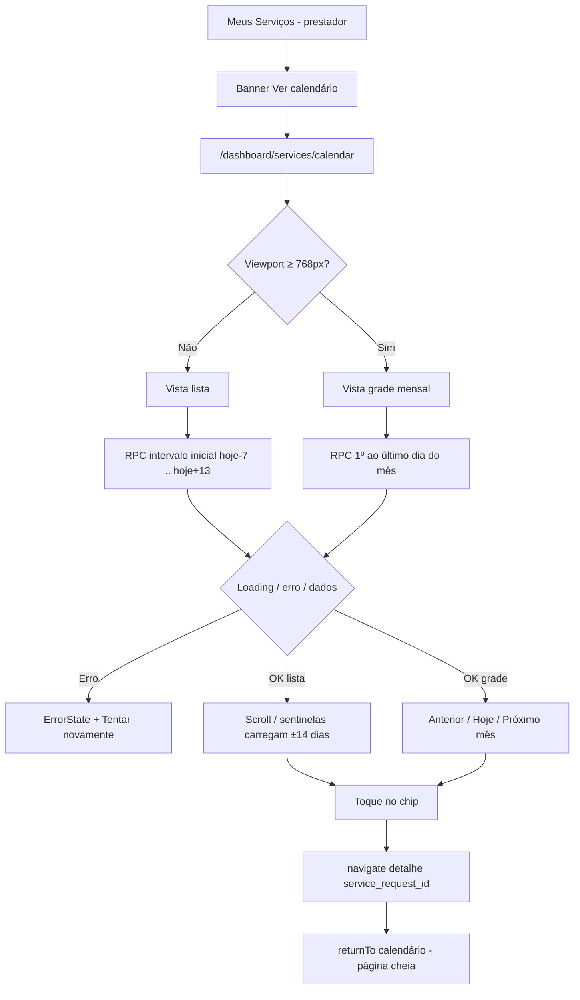

# Calendário do prestador

Documentação baseada em `src/features/provider-calendar/`, RPC `list_provider_scheduled_services` e pontos de entrada em `my-services` / `view-services` / chrome mobile.

---

## 1. Resumo executivo

- **O que é:** tela de **agenda somente leitura** dos **serviços contratados** do prestador, em lista por dia (mobile) ou grade mensal (desktop ≥768px).
- **Problema que resolve:** ver **quando** há serviços agendados (incluindo multi-dia e turnos), sem varrer a lista filtrada de Meus Serviços.
- **Quem usa:** prestador autenticado com acesso operacional ao dashboard.
- **Quem não usa:** cliente, visitante; admin sem UI dedicada.
- **Resultado esperado:** visualizar chips/barras de serviços no intervalo carregado e abrir o detalhe do pedido (`service_request_id`).
- **Impacto se indisponível:** prestador perde a visão temporal; Meus Serviços / detalhe continuam disponíveis por outras rotas.

## 2. Objetivo de negócio

- **Finalidade:** transparência da **carga contratada** no tempo (datas + turno).
- **Valor:** planejamento operacional do prestador após aceite/contrato.
- **Não cobre:** edição de agenda, bloqueio de disponibilidade, oportunidades ainda não contratadas, reagendamento (ver [service-reschedule](../../service-reschedule/README.md)).
- **Contexto:** complementa [my-services](../../my-services/README.md) (lista) e [view-services](../../view-services/README.md) (detalhe).

## 3. Localização na plataforma

| Superfície | Rota / componente | Perfil | Observação |
|------------|-------------------|--------|------------|
| Página Calendário | `/dashboard/services/calendar` → `ProviderCalendarPage` | Prestador | Lazy em `router.tsx`; guard aninhado `allowedRoles={['provider']}` |
| Banner de entrada | `ProviderCalendarEntryBanner` | Prestador | Embutido em `ProviderMyServicesPage` (Meus Serviços) |
| Detalhe do serviço | `/dashboard/services/:id` | Prestador | Navegação a partir do calendário; `returnTo: /dashboard/services/calendar` |
| Menu dashboard | — | — | **Sem** item em `dashboardMenu.ts` |

**Chrome mobile:** modo **stack**, título “Calendário”, `backFallback: /dashboard/services` (`mobileNavigation.config.ts`).

**Deep links / query params:** nenhum query param ou path param além da rota fixa. Constante: `ROUTE_PROVIDER_CALENDAR`.

**Diferença mobile vs desktop:**

| Viewport | Modo (`CalendarViewMode`) | Comportamento |
|----------|---------------------------|---------------|
| &lt; 768px (`useBreakpointMd` false) | `list` | Lista contínua de dias; scroll infinito para trás/frente; header de página oculto no mobile (`ProviderCalendarHeader` retorna `null`) |
| ≥ 768px | `grid` | Grade mensal; navegação mês anterior / Hoje / próximo; título “Calendário” no conteúdo |

Não há toggle de usuário entre lista e grade.

## 4. Perfis envolvidos

| Papel | Acesso | Evidência |
|-------|--------|-----------|
| Prestador | UI + RPC | `ProtectedRoute`; RPC checa `profiles.role = 'provider'` |
| Cliente autenticado | Bloqueado na RPC | pgTAP: `throws_ok` → `42501` / `Provider access only` |
| Não autenticado | Bloqueado | RPC: `Authentication required` se `auth.uid()` null; rota sob `ProtectedRoute` do dashboard |

**Ações bloqueadas:** papel errado na rota → redirect dos guards de auth; chamada RPC por não-prestador → exceção.

## 5. Fluxo funcional principal

## 6. Fluxos alternativos e exceções

| Cenário | Comportamento | Evidência |
|---------|---------------|-----------|
| Erro de rede / RPC | `ProviderCalendarErrorState`: “Não foi possível carregar o calendário” + retry | `ProviderCalendarErrorState.tsx`, hooks lançam erro no `queryFn` |
| Loading inicial | Skeleton lista ou grade conforme `viewMode` | `ProviderCalendarSkeleton` |
| Dia sem serviços (lista) | Texto “Nenhum serviço agendado para este dia.” | `CalendarListDaySection` |
| Grade: &gt;2 serviços de **um único dia** na célula | Mostra 2 chips + “+N serviços” | `ProviderCalendarGridView` |
| Multi-dia na grade | Barras horizontais por semana (`layoutWeekBars`); células só listam serviços single-day | `getSingleDayServicesForCell` |
| Lista: primeiro paint | Auto-scroll até seção `data-date=hoje` | `ProviderCalendarListView` |
| Fim do histórico/futuro | RPC `has_more_before` / `has_more_after` false → para de paginar | `useProviderCalendarList` |
| Intervalo RPC &gt; 42 dias | Backend rejeita `22023` | Migration + pgTAP |
| Cancelamento / abandono | N/A — só leitura; voltar = stack back / browser back | — |
| Idempotência / double-submit | N/A — sem mutações | — |
| Duas abas | Cache React Query por chave; sem sincronização realtime | query keys `provider-calendar-list` / `provider-calendar-month` |

## 7. Regras de negócio

1. Somente prestador autenticado acessa a rota e executa a RPC com sucesso.
2. Itens: `contracted_services` onde `provider_id = auth.uid()`.
3. Exclui sempre `status = 'CANCELLED'`.
4. Inclusão por **sobreposição** de datas (não só start dentro do range); `scheduled_end_date` nulo trata-se como igual ao start (`coalesce` na RPC).
5. Span `(to - from) ≤ 42` dias por chamada.
6. Ordenação RPC: `scheduled_start_date ASC`, depois `title ASC`.
7. Turnos válidos no domínio: `morning`, `afternoon`, `full_day` (check na tabela; labels UI via `formatShift`).
8. Vista lista vs grade determinada só pelo breakpoint md (768px).
9. Clique no serviço navega para detalhe com `returnTo` calendário e `myServicesRole: 'provider'`; **não** define `serviceDetailPresentation: 'sheet'` (página cheia / stack).

## 8. Campos e dados (shape)

Não há formulário. Dados exibidos / transportados:

| Campo (domínio / API) | Origem | Uso na UI |
|-----------------------|--------|-----------|
| `service_request_id` | RPC | Navegação ao detalhe |
| `contracted_service_id` | RPC | Chave de merge / React keys |
| `title` | `service_requests.title` | Título do chip/barra |
| `platform_service_title` | `platform_services.title` | Mapeado no front; **não exibido** nos chips atuais |
| `platform_service_color_key` | `platform_services.color_key` | Mapeado; **não usado** na UI |
| `scheduled_start_date` / `scheduled_end_date` | `contracted_services` | Posição no calendário; labels Início / Continua / Último dia |
| `scheduled_shift` | `contracted_services` | “Turno da manhã/tarde/dia inteiro” |
| `status` | `contracted_services` | Retornado; **não exibido** no chip |
| `has_more_before` / `has_more_after` | RPC | Controle de paginação da lista |
| `range_from` / `range_to` | Eco do pedido | Bounds da página |

Labels de span multi-dia (lista): `Início` | `Continua` | `Último dia` (`CalendarServiceChip`).

## 9. Validações de front-end

- Sem Zod/formulário.
- Datas ISO via helpers `@/lib/utils/calendarDate` e utils locais.
- Constantes: `LIST_CHUNK_DAYS = 14`, janela inicial −7/+13, `MAX_RANGE_DAYS = 42` (espelha backend; o front **não** valida o span antes da chamada — depende do erro RPC se ultrapassar).
- Merge de páginas da lista por `contractedServiceId` (`mergeScheduledItems`).

## 10. Validações de back-end

RPC `list_provider_scheduled_services(p_from_date, p_to_date)` (`SECURITY DEFINER`):

| Condição | Erro |
|----------|------|
| Sem `auth.uid()` | `42501` Authentication required |
| Role ≠ provider | `42501` Provider access only |
| Datas null | `22023` required |
| `from > to` | `22023` must be on or before |
| Span &gt; 42 dias | `22023` maximum span of 42 days |

`GRANT EXECUTE` a `authenticated`; revoke de `public`.

Evidência de teste: `supabase/tests/provider-calendar/list_provider_scheduled_services_test.sql` (cliente bloqueado; multi-dia incluso; título; span 42).

## 11. Status, estados e transições

### UI (React Query)

| Estado | Significado | UI |
|--------|-------------|-----|
| Loading | Primeira carga da vista ativa | Skeleton |
| Error | Falha na query | ErrorState + retry |
| Success | Dados presentes (pode ser lista vazia de itens) | Lista/grade |
| Fetching next/previous (lista) | Paginação | Spinners “Carregando próximos/dias anteriores…” |

### Domínio `contracted_services.status`

A RPC **filtra** `CANCELLED` e devolve o `status` restante (`PENDING_PAYMENT`, `CONFIRMED`, `EXECUTED`, `COMPLETED`, etc. conforme enum vigente). A UI do calendário **não ramifica** por status — todos os não cancelados aparecem iguais.

Não há FSM neste módulo.

## 12. Persistência

### Servidor

- Leitura de `contracted_services` + joins; sem escrita.
- Datas/turno persistidos no contrato (fluxo de aceite de proposta / pagamento — fora deste módulo).

### Cliente

| Mecanismo | Uso |
|-----------|-----|
| TanStack Query | Cache `provider-calendar-list` e `provider-calendar-month` + year/month |
| Capacitor Preferences / draft | Nenhum |
| Realtime | Nenhum |

## 13. Integrações

| Integração | Papel |
|------------|--------|
| Supabase RPC | Única fonte de dados |
| `view-services` | Path e state de navegação ao detalhe |
| `my-services` | Host do banner de entrada |
| `ErrorState` (UI shared) | Estado de erro |
| Logger | `provider_calendar_fetch_failed` em falha da API |
| Edge / e-mail / push / GA | **Não** instrumentados nesta feature (ausência no código) |

## 14. Listagens, buscas, filtros, paginação, ordenação

| Aspecto | Comportamento |
|---------|---------------|
| Filtros de UI | Nenhum (status, busca, categoria) |
| Ordenação | Backend por data+título; lista por dia ordena por start; barras da semana por start/duração/título |
| Paginação lista | `useInfiniteQuery`: chunk de **14 dias**; inicial **hoje−7 … hoje+13**; sentinelas IntersectionObserver no `main` (`rootMargin` 320px) |
| Paginação grade | Um mês por query; troca de mês altera `queryKey` |
| “Carregar mais” | Implícito por scroll (sem botão) |

## 15. Ações disponíveis

| Ação | Quem | Pré-condição | Resultado | Erro |
|------|------|--------------|-----------|------|
| Abrir calendário (banner/link) | Prestador | Rota permitida | Página calendário | Guards auth/KYC shell |
| Navegar mês / Hoje | Prestador (desktop) | Vista grade | Novo fetch do mês | ErrorState |
| Scroll infinito | Prestador (mobile) | `has_more_*` | Anexa páginas | Spinner / erro da query |
| Abrir serviço | Prestador | Item na agenda | `/dashboard/services/:id` com state de retorno | — |
| Tentar novamente | Prestador | Estado de erro | `refetch` | — |

Sem criar, editar, cancelar ou reagendar a partir desta tela.

## 16. Dependências

| Dependência | Uso |
|-------------|-----|
| [my-services](../../my-services/README.md) | Entry banner |
| [view-services](../../view-services/README.md) | Detalhe + navigation helpers |
| [auth](../../auth/README.md) | Guards / sessão |
| [provider-kyc](../../provider-kyc/README.md) | Gate do shell (indireto) |
| `@/lib/utils/calendarDate`, `formatShift` | Datas e labels de turno |
| `@/hooks/useBreakpoint` | Escolha lista/grade |
| Domínio contratado (payments / negotiation) | Origem dos registros em `contracted_services` |

## 17. Regras implícitas

1. Modo de vista **não** é preferência persistida — só media query.
2. Header “Calendário” + subtítulo só no desktop; no mobile o título vem do stack header.
3. `platformServiceColorKey` / `platformServiceTitle` / `status` estão no tipo e no map da API, mas chips/barras usam só `title` + turno (+ span label).
4. Serviços multi-dia na **grade** não aparecem como chip single-day na célula; só como barra (e barras com `span > 1` ou continuidade entre semanas).
5. Na grade, overflow “+N serviços” conta apenas serviços **single-day** além do 2º chip.
6. `createProviderCalendarServiceDetailState` **omite** `serviceDetailPresentation: "sheet"` — detalhe em página/stack, não sheet sobre a lista.
7. Indicadores `has_more_before/after` na RPC olham existência de `scheduled_start_date` fora do range (não apenas overlap) — pode divergir teoricamente de overlap-only em edges; comportamento comprovado no SQL atual.
8. Constantes `LIST_INITIAL_PAST_DAYS` / `LIST_INITIAL_FUTURE_DAYS` espelham a janela de `getInitialListRange` (−7 / +13).

## 18. Riscos

- Descoberta frágil sem item de menu.
- Prestador pode achar que a cor do serviço de plataforma aparece no calendário (campo existe, UI não usa).
- Confusão sheet vs página ao voltar do detalhe (comportamento diferente de Meus Serviços).
- Sem realtime: reagendamento ou cancelamento em outra aba exige refetch/navegação para atualizar.
- Sem analytics: adoção do calendário não mensurada no código atual.

## 19. Evidências

- `src/features/provider-calendar/` (api, hooks, components, utils, types, constants, tests)
- `src/features/provider-calendar/api/providerCalendar.api.ts`
- `src/features/provider-calendar/hooks/useProviderCalendarPage.ts`, `useProviderCalendarList.ts`, `useProviderCalendarMonth.ts`, `useProviderCalendarViewMode.ts`
- `src/features/my-services/components/provider/ProviderMyServicesPage.tsx`
- `src/features/view-services/types/serviceDetailNavigation.types.ts` (`createProviderCalendarServiceDetailState`)
- `src/router.tsx` (`services/calendar`)
- `src/layouts/DashboardLayout/mobileNavigation.config.ts`
- `src/layouts/DashboardLayout/dashboardMenu.ts` (ausência de item)
- `src/lib/utils/formatShift.ts`
- `supabase/migrations/20260712130000_list_provider_scheduled_services.sql`
- `supabase/tests/provider-calendar/list_provider_scheduled_services_test.sql`

## 20. Pendências

| ID | Item | Status |
|----|------|--------|
| PC-01 | Incluir Calendário no mapa transversal (`02-mapa…`), glossário, matriz, rastreabilidade e índice `modulos/README.md` | **Fechado (2026-08-02)** — índices já incluem o módulo |
| PC-02 | Produto: item de menu dedicado vs só banner? | **Aberta** — decisão de produto; código hoje = só banner |
| PC-03 | Produto: usar `color_key` / badge de `status` na UI? | **Aberta** — campos no contrato RPC sem uso visual |
| PC-04 | Confirmar com produto se detalhe deve ser sheet (como Meus Serviços) | **Aberta** — código = sem sheet |
| PC-05 | Instrumentação GA/Sentry além do `logger.error` na API | **Aberta** — não encontrada na feature |

## 21. Checklist de completude

### Negócio e valor

- [x] Para que serve / problema
- [x] Quem usa e quem não usa
- [x] Resultado de sucesso observável
- [x] Impacto se indisponível

### Localização e superfície

- [x] Rotas, lazy, guards
- [x] Banner embutido sem rota própria
- [x] Deep links / query — nenhum além da rota fixa
- [x] Mobile stack vs desktop header/grade

### Fluxos

- [x] Fluxo feliz (mermaid)
- [x] Alternativos (erro, vazio, overflow, multi-dia)
- [x] Cancelamento/abandono — N/A leitura
- [x] Retries — refetch no ErrorState; sem idempotência de mutação
- [x] Concorrência — cache RQ; sem realtime (risco registrado)

### Regras

- [x] Explícitas (RPC + guards)
- [x] Implícitas (seção 17)
- [x] Pré/pós condições das ações
- [x] Limite 42 dias / chunks 14 / janela inicial

### Inputs / outputs

- [x] Shape de dados (sem form)
- [x] Defaults de intervalo e vista
- [x] Outputs: UI + navigate; sem toast/e-mail/push
- [x] Contrato RPC e códigos de erro

### Estados

- [x] UI loading/error/success + paginação
- [x] Status de domínio filtrado mas não ramificado na UI
- [x] Quem força transição — N/A (só leitura)

### Edge cases

- [x] Vazio por dia; overflow na grade
- [x] Papel errado / auth
- [x] Rede → ErrorState
- [x] Validação front fraca / back rejeita span — pendência implícita coberta
- [x] Sem feature flag / placeholders neste módulo
- [x] Inconsistências (menu ausente, campos não usados, sheet) → pendências

### Interligações

- [x] my-services, view-services, auth, provider-kyc, contracted_services
- [x] Sem Edge/cron próprios
- [x] Sem Preferences keys

### Rastreio

- [x] Paths de evidência (seção 19)
- [x] `rastreabilidade.md` / matriz / mapa — **PC-01 fechado**

## 22. Atualização de auditoria (2026-08-02)

- Primeira redação completa do módulo `provider-calendar` e desta feature, somente com evidência de código/migrations/testes no repositório.
