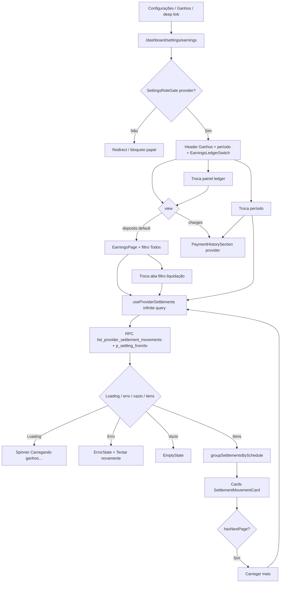

# Ganhos e liquidações bancárias

Documentação baseada em `src/features/provider-earnings/`, rota hospedada `/dashboard/settings/earnings` (`ROUTE_PROVIDER_EARNINGS`), RPC `list_provider_settlement_movements`, tabela/view de settlements e ingestão NetCred (webhooks `PAYOUT_*`, enrich GraphQL pós-`TRANSACTION_CAPTURE`/`TRANSACTION_REFUND`, Edge `sync-netcred-settlements`). Idioma de produto na UI: pt-BR.

> **Não confundir** os dois painéis da mesma página: **Cobranças** = captura / `provider_payout` (lista em `payments`); **Depósitos** = liquidação bancária (esta feature). Ver [historico-e-reembolso](../../payments/features/historico-e-reembolso.md). Este doc **não** redefine checkout, T-2 ou reembolso ToS — só links para [payments](../../payments/README.md).

---

## 1. Resumo executivo

- **O que é:** tela **Ganhos** unificada: controle de **período** + ledger com visões **Cobranças** e **Depósitos** (mesmo poço das abas, sem seta entre painéis), lista paginada de **linhas de liquidação bancária** (movements do payout NetCred) e componente reutilizável de **previsão de depósito** (outras superfícies).
- **Problema que resolve:** prestador precisa ver o **valor combinado** com o cliente e **quando o valor cai na conta** (previsto / liquidado), sem misturar os dois números — a liquidação pode ser N parcelas.
- **Quem usa:** prestador autenticado; conteúdo da lista só após KYC `ACTIVE` (gate do shell nas rotas operacionais); entrada via **Configurações → Ganhos** (sem item no menu top-level; sem item Recebimentos na nav do hub).
- **Quem não usa:** cliente, visitante; admin sem UI dedicada nesta feature.
- **Resultado esperado:** período **Este mês** (default) / **3 meses** / **6 meses** (controle segmentado no mesmo poço das abas) filtram totais do ledger **e** as duas listas; ledger (Cobranças = soma R$ acordada no período; Depósitos = contagem de movements CREDIT no período); captions estáveis **Valor combinado** (Cobranças) e **Na sua conta** (Depósitos); aba ativa = fundo canvas + sombra + `aria-selected` (sem “Lista abaixo”, “Toque para ver a lista” nem ChevronDown); lista com valor líquido, título do serviço (link para detalhe), status Previsto/Liquidado, previsão/data de liquidação, parcela e máscara de conta; filtros da lista Todos/Previsto/Liquidado (= só CREDIT, sem aba Estorno; chips soltos `rounded-full`, sem ícones, distinto do track do período); disclosure de previsão em `ProviderSettlementStatus`.
- **Impacto se indisponível:** prestador perde a visão de depósito bancário; a aba Cobranças (captura) e o detalhe do serviço continuam; ingestão backend independente da UI.

## 2. Objetivo de negócio

- **Finalidade:** transparência de **captura** e **liquidação bancária** na mesma página, com métricas distintas.
- **Valor:** reduzir dúvida “já combinei o valor, mas quando cai na conta?” e ensinar que uma captura pode virar N depósitos.
- **Não cobre:** alterar calendário NetCred, forçar depósito, editar movements, checkout, KYC, filtro por serviço.
- **Contexto:** complementa [payments](../../payments/README.md) (persistência/ingestão + lista de captura) e [settings](../../settings/README.md) (host).

## 3. Localização na plataforma

| Superfície | Rota / componente | Perfil | Observação |
|------------|-------------------|--------|------------|
| Página Ganhos | `/dashboard/settings/earnings` → `ProviderEarningsSectionPage` | Prestador | Lazy via hub `settings`; `SettingsRoleGate allow={['provider']}`; settings **compõe** Public API |
| Ledger | `EarningsLedgerSwitch` | Prestador | Um poço `rounded-xl bg-canvas-soft p-1`: (1) período `role="group"` `aria-label="Período dos ganhos"` `grid grid-cols-3`; botões `h-11` `aria-pressed`; ativo = `bg-canvas shadow-sm`; labels Este mês / 3 meses / 6 meses. (2) abas `TabsList` `grid-cols-2` `aria-label="Listas de ganhos"`. Ícones em poço `bg-audience-soft text-audience` (`strokeWidth={2}`; laranja no prestador via `html[data-audience]`) — **não** `text-accent` (token cinza `#F5F5F5`, invisível): Banknote (Cobranças), Landmark (Depósitos). Captions estáveis: **Valor combinado** / **Na sua conta**. Aba ativa: fundo canvas + sombra + `aria-selected`. **Sem** seta entre painéis. |
| Aba Depósitos (default) | `EarningsPage` | Prestador | Filtros Todos/Previsto/Liquidado (`EarningsFilterTabs`: chips soltos — `TabsList` `w-full justify-start gap-2 overflow-x-auto p-0` `bg-transparent min-h-0 rounded-none` + scroll snap; trigger `rounded-full border border-muted-foreground/10 bg-transparent` `text-muted-foreground`; ativo = `bg-muted` + `border-muted-foreground/60` + `shadow-none`; **sem** ícones; `aria-label="Filtros de ganhos"`) + lista; **sem** header próprio e **sem** link para Recebimentos |
| Aba Cobranças | `PaymentHistorySection role="provider"` | Prestador | Código em **payments**; `?view=charges` |
| Rota legado | `/dashboard/settings/receivables` → `ProviderReceivablesPage` | Prestador | `Navigate replace` para `ROUTE_SETTINGS_RECEIVABLES` = `/dashboard/settings/earnings?view=charges` |
| Nav do hub | Item **Ganhos** (`Wallet`) | Prestador | **Sem** item Recebimentos (`settingsNav.ts`) |
| Menu dashboard | **Sem** item Ganhos | — | Removido de `dashboardMenu.ts`; acesso só pelo hub Configurações |
| Disclosure (Public API) | `ProviderSettlementDisclosure` | Prestador | Export `@/features/provider-earnings`; **não** nos cards da lista de captura |
| `ProviderSettlementStatus` | Componente em **payments** (Public API) | Prestador | Holds estorno / chargeback / `service_dispute`; **não** montado no card `ServiceContractedSection` (view-services) após redesign |

**Constante de rota:** `ROUTE_PROVIDER_EARNINGS = "/dashboard/settings/earnings"`. Helper `providerEarningsPath("charges")` = `/dashboard/settings/earnings?view=charges` (só `view`; **não** inclui `period`).

**Chrome mobile:** seção do hub → modo **stack** com `backFallback` `/dashboard/settings` (`mobileNavigation.config.ts` + `SETTINGS_SECTION_STACK_TITLE.earnings` e `.receivables` = “Ganhos”).

**Deep links / query params:** `view=charges` abre Cobranças; ausência ou qualquer outro valor = Depósitos (`parseEarningsView`). `period=3m` ou `period=6m` seleciona a janela; default `month` (**Este mês**) **omite** o param (`parseEarningsPeriod`). Os dois convivem (ex.: `?view=charges&period=3m`). `useEarningsViewParam` devolve `{ view, setView, period, setPeriod }` e grava com `replace: true`. Filtro da lista de liquidação (Todos/Previsto/Liquidado) é estado React local (`useState`), **não** sincronizado com URL. Rota top-level `/dashboard/earnings` **removida** (sem redirect).

**Diferença mobile vs desktop:** mesma UI de lista dentro do hub (sidebar desktop / stack mobile do hub Configurações). Abas do ledger iguais em todos os breakpoints (**sem** seta entre painéis).

## 4. Perfis envolvidos

| Papel | Acesso | Evidência |
|-------|--------|-----------|
| Prestador | Rota do hub + RPC com `provider_id = auth.uid()` | `SettingsRoleGate`; `list_provider_settlement_movements` |
| Prestador KYC ≠ `ACTIVE` (ou conta ainda carregando) | Menus ocultos; `/dashboard/settings*` na allowlist do gate | `ProviderKycGate`; `useProviderKycBlocksNav` + `DashboardLayout` |
| Cliente autenticado | Seção earnings bloqueada pelo `SettingsRoleGate` | Host em settings |
| Não autenticado | Bloqueado pelo dashboard `ProtectedRoute` | `router.tsx` |
| Admin | Sem tela; list RPC só retorna linhas do `auth.uid()` | Migration da RPC |

**Ações bloqueadas:** papel errado → gate da seção; prestador sem KYC ativo em rotas operacionais → UI KYC; no hub Configurações o conteúdo pode carregar pela allowlist.

## 5. Fluxo funcional principal

**Ingestão (fora da UI, pré-condição de dados):** captura → `payment_schedules` com `gateway_transaction_id` → (1) webhook `PAYOUT_CREATE`/`PAYOUT_SETTLE` → `payment_webhook_handle_payout`; (2) após processar com sucesso `TRANSACTION_CAPTURE` ou `TRANSACTION_REFUND`, `netcred-webhook` faz enrich best-effort GraphQL `movements(transactionId)` → `payment_upsert_settlement_movements` (mesmo pipeline do sync; cobre movements que entram em lote de payout já existente e **não** disparam `PAYOUT_CREATE`; falha do enrich **não** falha o ACK); (3) cron `sync-netcred-settlements` como backfill → linhas visíveis na lista.

## 6. Fluxos alternativos e exceções

| Cenário | Comportamento | Evidência |
|---------|---------------|-----------|
| Erro RPC / rede | `EarningsErrorState`: “Erro ao carregar ganhos” + retry (`refetch`) | `EarningsErrorState.tsx`; hook lança `Error` |
| Resposta RPC inválida (shape) | API retorna `"Resposta inválida do servidor"` | `settlements.api.ts` |
| Lista vazia sem filtro de status | “Nenhuma liquidação neste período” | `EarningsEmptyState` (`hasFilters` false) |
| Lista vazia com filtro Previsto/Liquidado | “Nenhuma liquidação neste filtro” + limpar filtros | `hasFilters` + `onClearFilters` |
| Loading | Spinner “Carregando ganhos…”; abas `disabled` | `SettlementMovementsList`, `EarningsFilterTabs` |
| Várias parcelas mesmo schedule | Grupo “Parcelas do mesmo pagamento” se **consecutivos** e `paymentScheduleId` não nulo | `groupSettlementsBySchedule` |
| Item órfão / schedule null | Card isolado (chave `orphan-{index}`) | `SettlementMovementsList` |
| Estorno (`DEBIT` ou `isRefundClawback`) | Valor com “−”, badge Estorno, ícone destrutivo | `formatSettlementMovement` / card |
| Disclosure: `settlingAt` válido | “Previsão de depósito na conta: {data longa pt-BR}” | `providerSettlementDisclosure.ts` |
| Disclosure: sem `settlingAt` | Mesma frase com **paid_at + 30 dias** | `PROVIDER_BANK_SETTLEMENT_DAYS = 30` |
| Disclosure: data inválida | Componente retorna `null` | Testes + util |
| Hold (refund / chargeback / service_dispute) | Mensagem de suspensão; sem nota de conclusão | `formatProviderSettlementHoldDisclosure` |
| Cancelamento / abandono | N/A — só leitura; voltar = nav do shell | — |
| Idempotência / double-submit | N/A — sem mutações na feature | — |
| Duas abas | Cache React Query por filtro; `staleTime` 30s; `refetchOnWindowFocus: false` | `useProviderSettlements` |
| Filtros de data RPC | UI **envia** `p_settling_from` / `p_settling_to` (coluna date `settling_at`, inclusive `>= from` e `<= to`) com o range do período; `p_settled_from` / `p_settled_to` continuam **não** usados pela UI | `useProviderSettlements` + `getEarningsPeriodRange` |
| Ledger loading | Skeleton no número do painel | `EarningsLedgerSwitch` |
| Ledger erro | “Indisponível” | idem |
| Ledger Cobranças com clawback | Linha “Líquido após estornos: {net}” | `hasClawback` de `summarizeProviderReceivables` |
| Caption do ledger | “O depósito costuma levar cerca de 30 dias após o pagamento e pode ser parcelado.” + `PROVIDER_SETTLEMENT_COMPLETION_NOTE` | `EarningsLedgerSwitch` |

## 7. Regras de negócio

1. Ganhos = **página unificada**. **Cobranças** = captura (`provider_payout` / view de receivables); **Depósitos** = liquidação bancária (movement). Números **não** se misturam: Cobranças mostra soma em R$ de `amountReceivedAtCapture` (client-side, lista do período); Depósitos mostra **contagem** (`total_count` da RPC com filtro `all` / CREDIT **e** range de `settling_at`), não soma em R$.
2. Somente o prestador dono (`provider_id = auth.uid()`) lista movements na RPC.
3. Filtros UI → RPC: Todos / Previsto / Liquidado enviam `record_type = CREDIT`; a RPC **esconde** CREDITS de schedules `REFUNDED`/`REFUND_REQUESTED` e parcelas cujo somatório de DEBIT ≥ CREDIT (clawback total). Previsto também `movement_status = PENDING`; Liquidado → `PAID_OUT`. Não há aba Estorno na UI.
4. Paginação: `page` ≥ 1; `page_size` entre 1 e **100** (front fixa **20**).
5. Ordenação da lista: `settling_at DESC NULLS LAST`, depois `created_at DESC`.
6. Upsert backend persiste só a perna do prestador (`holder_company_id` = `provider_gateway_accounts.netcred_company_id`); pula platform / company não casada (`skipped_platform`).
7. Upsert exige schedule com mesmo `gateway_transaction_id` (+ slug); senão `skipped_not_found` (webhook pode retornar `not_found` para retry).
8. `is_refund_clawback` true quando `record_type = DEBIT` (ou flag no payload).
9. Valores `gross_amount` / `net_amount` ≥ 0; parcela 1–48 ou null; `record_type` só `CREDIT`/`DEBIT`.
10. `raw_snapshot` é ops-only (CLS / sem grant a authenticated na tabela).
11. Marcar serviço como concluído **não** antecipa depósito (`PROVIDER_SETTLEMENT_COMPLETION_NOTE` no caption do ledger).
12. Em hold (reembolso, chargeback ou **disputa de serviço**), disclosure **suspende** a previsão (consumidor: `ProviderSettlementStatus` em payments — **não** nos cards da lista de captura nem no card Serviço contratado de view-services).
13. Agrupamento visual só une itens **consecutivos** com o mesmo `paymentScheduleId` (não reordena a lista).
14. Período (controle segmentado **Este mês** / **3 meses** / **6 meses**, no mesmo poço das abas) filtra **totais do ledger e as duas listas**. Calendário civil `America/Sao_Paulo` (`getEarningsPeriodRange`): Este mês = dia 1 do mês corrente → hoje; 3/6 meses = hoje menos 3/6 meses civis (`addCalendarMonthsIso`) → hoje (**inclusive**). Default **Este mês** omite `period` na URL. Sem filtro por serviço. Sem RPC/migration nova: a RPC já tinha `p_settling_from`/`p_settling_to`; captura filtra a view existente (`listProviderPaymentReceivables`: `.gte('received_at', from)` e `.lt('received_at', '{to}T23:59:59.999-03:00')`), sem paginação nova da view.

## 8. Campos e dados (shape)

Não há formulário. Modelo de domínio `SettlementMovement` (camelCase após map da RPC):

| Campo | Origem RPC / DB | Uso na UI Ganhos |
|-------|-----------------|------------------|
| `id` | PK | Key do card |
| `paymentScheduleId` | FK schedule | Agrupamento de parcelas |
| `netAmount` | `net_amount` | Valor principal (`formatCurrency`); DEBIT com prefixo “−” |
| `grossAmount` | `gross_amount` | **Não exibido** |
| `movementStatus` | text | Badge Previsto / Liquidado (ou raw) |
| `recordType` | `CREDIT`/`DEBIT` | Estorno + filtro |
| `isRefundClawback` | boolean | Trata visualmente como estorno se true |
| `settlingAt` | date | “Previsão: {data}” |
| `settledAt` | timestamptz | “Liquidado em {data}” / fallbacks |
| `installment` | smallint | “Parcela N” se ≥ 1 |
| `bankAccountMask` | text | “Conta: …” se presente |
| `brand`, `isAdvance`, ids gateway, `syncSource`, timestamps | RPC | **Não exibidos** na lista atual |
| Envelope | `items`, `total_count`, `page`, `page_size` | Infinite query / Carregar mais |

| Disclosure (props): `capturePaidAt` (obrigatório); `settlingAt?`; `showCompletionNote?`; `settlementOnHold?`; `holdReason?: "refund" \| "dispute" \| "service_dispute"`.

- `"dispute"` — chargeback gateway (`payment_schedules.is_disputed`).
- `"service_dispute"` — CS em `IN_DISPUTE` (disputa de serviço; copy distinta).
- `"refund"` — estados de reembolso da parcela.

## 9. Validações de front-end

- Sem Zod/formulário.
- `page` / `pageSize` normalizados na API (`Math.max` / `Math.min(..., 100)`).
- `record_type` mapeado: só `"DEBIT"` vira DEBIT; qualquer outro → CREDIT (`toRecordType`).
- Números inválidos → `0` (`toNumber`).
- Datas do disclosure via `normalizeCalendarDateToIso` / `calendarDate`; inválidas → `null` (sem texto).
- Status desconhecido no card: exibe o raw string (`formatSettlementMovementStatus`).

## 10. Validações de back-end

### RPC `list_provider_settlement_movements` (`SECURITY DEFINER`)

| Condição | Efeito |
|----------|--------|
| `auth.uid()` null | `42501` Authentication required |
| `p_record_type` não nulo e ≠ CREDIT/DEBIT | `22023` / `SETTLEMENT_RECORD_TYPE_INVALID` |
| Filtros de status/tipo/datas | WHERE opcional; só linhas `provider_id = v_actor` |
| `GRANT EXECUTE` | `authenticated` + `service_role` |

**Nota:** a RPC **não** checa `profiles.role = 'provider'` explicitamente — isolamento é por `provider_id = auth.uid()`. Cliente autenticado obteria lista vazia se chamasse a RPC.

### Tabela / upsert / grants

| Artefato | Regra |
|----------|--------|
| `payment_settlement_movements` | RLS SELECT: dono ou `is_platform_admin()` (política); após `20260802300000_*`, **authenticated sem privilegio SELECT** na tabela — leitura app via RPC DEFINER |
| `provider_settlement_movements_v` | SELECT authenticated; sem `raw_snapshot`; `security_invoker` |
| `payment_upsert_settlement_movements` | Só `service_role`; payload array; skip invalid / not_found / platform |
| Webhook `payment_webhook_handle_payout` | Mapeia `PayoutPayload.movements[]`; enums desconhecidos: log + ainda tenta upsert se campos mínimos ok |

Evidência de teste: `supabase/tests/payments/payment_settlement_movements_test.sql`, `payment_settlement_table_select_deny_test.sql`, `payment_webhook_handle_payout_test.sql`, `payment_claim_schedules_for_settlement_sync_test.sql`.

## 11. Status, estados e transições

### Movement (domínio NetCred / UI)

| `movement_status` | Label UI | Badge |
|-------------------|----------|-------|
| `PENDING` | Previsto | `secondary` |
| `PAID_OUT` | Liquidado | `success` |
| Outro | string crua | `secondary` (não success) |

| `record_type` | Significado de negócio (UI) |
|---------------|----------------------------|
| `CREDIT` | Crédito / depósito |
| `DEBIT` | Estorno na liquidação (clawback) |

**Transições:** a feature **não** aplica FSM — status muda por ingestão webhook/reconcile (`payment_upsert_settlement_movements` faz upsert por `gateway_movement_id`). UI só reflete o estado persistido.

### Label “Liquidado em / Pendente” (`formatSettlementSettledLabel`)

1. Se `settledAt` formatável → `Liquidado em {data}`.
2. Senão se `movementStatus === PAID_OUT` → `Liquidado`.
3. Senão → `Pendente`.

### Hold do disclosure (consumidor payments)

`ProviderSettlementStatus` coloca hold quando:

- CS ligado está `IN_DISPUTE` → `holdReason: "service_dispute"` (disputa de serviço; copy distinta), **ou**
- `isDisputed` (chargeback) → `"dispute"`, **ou**
- estado da parcela ∈ `REFUND_REQUESTED` \| `REFUNDED` \| `PARTIALLY_REFUNDED` → `"refund"`.

Só renderiza se `paidAt` e estado ∈ `PAID` \| `REFUNDED` \| `PARTIALLY_REFUNDED` \| `REFUND_REQUESTED` (e/ou CS em disputa conforme o read model).

### UI React Query

| Estado | UI |
|--------|-----|
| `isLoading` | Spinner |
| `isError` | ErrorState + retry |
| `items.length === 0` | EmptyState |
| Sucesso | Lista + LoadMore opcional |

## 12. Persistência

### Servidor

| Artefato | Papel |
|----------|--------|
| `payment_settlement_movements` | Linhas de liquidação; join schedule via `gateway_transaction_id` |
| `provider_settlement_movements_v` | Read model sem snapshot |
| `payment_schedules` | Upstream de captura / `paid_at` / transaction id |
| `provider_gateway_accounts.netcred_company_id` | Filtro de holder no upsert |
| `platform_constants.settlement_sync_batch_size` | Batch do claim GraphQL (default 20) |

Migrations: `20260802240000_create_payment_settlement_movements.sql`, `20260802250000_payment_sync_netcred_settlements_cron.sql`, ajuste de grants `20260802300000_payment_schedules_audit_cls_and_settlement_grants.sql`.

### Cliente

| Mecanismo | Detalhe |
|-----------|---------|
| React Query | Key `["provider-earnings","provider-settlements", filterId, settlingFrom, settlingTo]` (`providerSettlementsQueryKey`); `staleTime` 30s; infinite pages |
| Preferences / draft / localStorage | **Não usado** |
| URL state | Query `view` (Cobranças/Depósitos) e `period` (`3m`/`6m`; default Este mês omite o param) via `useEarningsViewParam`; filtro de liquidação (Todos/Previsto/Liquidado) só em memória do `EarningsPage` |

## 13. Integrações

| Integração | Papel | Escopo deste doc |
|------------|-------|------------------|
| Edge `netcred-webhook` | `PAYOUT_CREATE` / `PAYOUT_SETTLE` → handler SQL; após `TRANSACTION_CAPTURE` / `TRANSACTION_REFUND` bem-sucedidos → enrich GraphQL best-effort (`enrichSettlementMovements`) | Link; detalhe em payments / payment-system |
| Edge `sync-netcred-settlements` | Cron `15,45 * * * *` → claim + GraphQL reconcile (mesmo pipeline do enrich) | Backfill quando PAYOUT_* / enrich falham ou atrasam |
| RPC `payment_claim_schedules_for_settlement_sync` | Elegíveis: PAID/REFUNDED/PARTIALLY_REFUNDED, sem movements ou pending vencido; grace 30 min pós-`paid_at` | Backend payments |
| MMD / e-mail / push / IA | **Sem** evidência nesta feature | — |
| GA / Sentry dedicados | **Sem** `trackEvent` / breadcrumbs na pasta `provider-earnings` (erros de API usam `logger.error`) | — |

## 14. Listagens, buscas, filtros, paginação, ordenação

| Aspecto | Comportamento |
|---------|---------------|
| Listagem | Infinite query; flatten de páginas |
| Busca textual | **Não há** |
| Filtro por serviço | **Não há** (o título do serviço aparece no card; não filtra a lista) |
| Filtros | Abas: Todos / Previsto / Liquidado (= CREDIT); server-side; chips soltos (`rounded-full`, `bg-transparent`, ativo `bg-muted`; **não** o track segmentado do período). Período: Este mês / 3 meses / 6 meses (`settling_at` na RPC) |
| Serviço | Título + link sheet para `/dashboard/services/:id` (RPC devolve `service_request_id` / `service_request_title`) |
| Paginação | `PAGE_SIZE = 20`; botão Carregar mais |
| Ordenação | Definida na RPC (settling_at desc, created_at desc) |
| Agrupamento | Cliente: consecutivos por `paymentScheduleId` |

## 15. Ações disponíveis

| Ação | Quem | Pré-condição | Resultado | Erro |
|------|------|--------------|-----------|------|
| Abrir Ganhos | Prestador | Hub Configurações; conteúdo operacional só se KYC `ACTIVE` fora da allowlist | Carrega ledger + lista Depósitos (default) | Gate / role |
| Abrir Cobranças | Prestador | `?view=charges` ou clique na aba | Lista de captura (`PaymentHistorySection`) filtrada pelo mesmo período (`received_at`) | — |
| Trocar período | Prestador | Este mês / 3 meses / 6 meses | Atualiza `period` na URL; refetch totais + lista ativa (e a outra aba no cache) | — |
| Trocar filtro | Prestador | Aba Depósitos carregada | Refetch página 1 do filtro (mesmo range de `settling_at`) | ErrorState se falhar |
| Carregar mais | Prestador | `hasNextPage` | Append itens | Erro na query de página |
| Tentar novamente | Prestador | Estado de erro | `refetch` | — |
| Limpar filtros | Prestador | Empty com filtro ativo | Volta para Todos | — |
| Ver disclosure | Prestador | Superfície consumidora (`ProviderSettlementStatus`) | Texto previsão ou hold | `null` se data inválida |

**Sem ações de escrita** (criar/editar/cancelar liquidação) nesta feature.

## 16. Dependências

| Direção | Módulo / lib | Relação |
|---------|--------------|---------|
| Upstream dados | **payments** (schedules, webhooks, upsert, cron) | Persistência e ingestão |
| Shell | **dashboard-shell**, **provider-kyc**, **settings** (host) | Hub Configurações, gate, chrome mobile stack |
| Downstream UI | **payments** (`ProviderPaymentHistoryList` na aba Cobranças; `ProviderSettlementStatus`) | Lista de captura **sem** disclosure por card; view-services **não** monta settlement no card contratado |
| Cruzado | **settings** | Host `ProviderEarningsSectionPage`; redirect legado `ProviderReceivablesPage`; `useEarningsLedgerSummary` |
| Libs | `@/lib/supabase/client`, `@/lib/logger`, `@/lib/formatCurrency`, `@/lib/utils/calendarDate`, TanStack Query, UI shadcn |

**Não editar payments neste escopo documental** — apenas links.

## 17. Regras implícitas

1. `ProviderPaymentHistoryList` **não** monta `ProviderSettlementDisclosure` por card (previsão ficou no caption do ledger / aba Depósitos). `ProviderSettlementStatus` **não passa `settlingAt`** → usa **sempre** fallback D+30 (ou hold), mesmo que já exista movement com data real (visível na lista Depósitos).
2. Filtro Estorno usa só `record_type = DEBIT`; um CREDIT com `isRefundClawback` true (se existisse) ainda poderia aparecer como estorno **no card** via `isSettlementDebit`, mas **não** na aba Estorno.
3. Troca de filtro reseta a experiência de lista (nova query), sem preservar scroll.
4. `refetchOnWindowFocus: false` — voltar à aba do browser não atualiza sozinho até stale/manual.
5. Valores DEBIT continuam com `net_amount ≥ 0` no banco; o sinal negativo é **só UI**.
6. Admin platform na política RLS histórica da tabela não altera a listagem do app (RPC amarra ao `auth.uid()`).
7. Cron GraphQL: schedules elegíveis só após ~30 min de `paid_at` (exceto pending já vencido) para dar prioridade a PAYOUT_* e ao enrich pós-captura/estorno.

## 18. Riscos

| Risco | Impacto | Mitigação observada / lacuna |
|-------|---------|------------------------------|
| Atraso PAYOUT_* / enrich / reconcile | Lista vazia ou só D+30 no disclosure | Enrich pós-CAPTURE/REFUND; cron `15,45 * * * *`; retry `not_found` no payout |
| Orphan skip (`skipped_not_found`) | Movement NetCred sem schedule local | Retry fila webhook; claim GraphQL |
| Confusão captura × liquidação | Suporte / prestador | Ledger com métricas distintas (R$ vs contagem) e captions **Valor combinado** / **Na sua conta** |
| Disclosure desatualizado vs Ganhos | Expectativa de data errada | **Pendência:** consumidores não passam `settlingAt` |
| Sem analytics | Funil de uso da tela invisível | Pendência de produto |
| Janela máxima 6 meses | Movements com `settling_at` / `received_at` fora da janela não aparecem | Só as três janelas; sem visão “todo o histórico” |

## 19. Evidências

### Front

- `src/features/provider-earnings/` — `components/` (`EarningsPage`, `EarningsLedgerSwitch`, filtros, lista, cards, empty/error, `ProviderSettlementDisclosure`), `api/settlements.api.ts`, `api/settlements.rpc.ts`, `hooks/useProviderSettlements.ts`, `hooks/useEarningsViewParam.ts`, `types/settlements.types.ts`, `utils/*` (incl. `earningsPeriodRange.ts`), `constants/*` (`ROUTE_PROVIDER_EARNINGS`, `earningsView.ts`, `earningsPeriod.ts`, `queryKeys.ts`, `providerEarningsPath`), `index.ts`
- Testes Vitest sob `**/__tests__/` na feature
- `src/router.tsx` — `settings/earnings` via `ProviderEarningsSectionPage`; `settings/receivables` via `ProviderReceivablesPage` (redirect)
- `src/features/settings/components/sections/ProviderEarningsSectionPage.tsx`, `ProviderReceivablesPage.tsx`
- `src/features/settings/hooks/useEarningsLedgerSummary.ts`
- `src/layouts/DashboardLayout/dashboardMenu.ts` (sem Ganhos), `mobileNavigation.config.ts`, `DashboardLayout.tsx`
- `src/lib/utils/calendarDate.ts` — `todayInSaoPauloIso`, `addCalendarMonthsIso`, `getMonthStartIso` (range do período)
- Consumidores: `src/features/payments/components/PaymentHistory/ProviderPaymentHistoryList.tsx` (lista de captura, sem disclosure por card), `ProviderSettlementStatus.tsx` (**não** `ServiceContractedSection`)

### Backend

- `supabase/migrations/20260802240000_create_payment_settlement_movements.sql`
- `supabase/migrations/20260802250000_payment_sync_netcred_settlements_cron.sql`
- `supabase/migrations/20260802300000_payment_schedules_audit_cls_and_settlement_grants.sql` (revoke SELECT authenticated na tabela)
- `supabase/functions/sync-netcred-settlements/`
- `supabase/functions/netcred-webhook/` (`parsePayoutPayload`, routing PAYOUT_*, `maybeEnrichSettlementMovements`)
- `supabase/functions/_shared/payment/enrichSettlementMovements.ts`
- pgTAP: `supabase/tests/payments/payment_settlement_*.sql`, `payment_webhook_handle_payout_test.sql`, `payment_claim_schedules_for_settlement_sync_test.sql`

### Docs relacionados (não substituem evidência de código)

- [README do módulo](../README.md)
- [payments](../../payments/README.md), [historico-e-reembolso](../../payments/features/historico-e-reembolso.md)
- `docs/payment-system/design.md` / `payments-api.md` §10 (complementar)

## 20. Pendências

1. **`settlingAt` em `ProviderSettlementStatus`** — o componente não passa a data real do movement; a lista de captura **não** mostra mais disclosure por card. Gap residual só nesse consumidor.
2. **Filtro por serviço / visão “todo o histórico”** — não existem na UI. O período máximo é 6 meses civis. A RPC ainda aceita `p_settled_from`/`p_settled_to` (não enviados pelo front).
3. **Analytics** — nenhum evento GA na feature; impacto de adoção não mensurado no código.
4. **Checagem explícita de role `provider` na RPC** — isolamento só por `provider_id`; suficiente na prática, diferente de outras RPCs provider-only.
5. **Campos retornados não exibidos** (`grossAmount`, `brand`, `isAdvance`, sources/types) — decisão de UI; sem requisito documentado no código da lista.
6. Transversais (`glossario`, `mapa`, `matriz`, `pendencias-e-incertezas`) — fora do escopo deste worker; já referenciam o módulo (verificar sync por worker transversal se necessário).

---

## Anexo A — Matriz de erros / mensagens UI

| Origem | Mensagem / comportamento |
|--------|--------------------------|
| Falha RPC / throw do hook | Título “Erro ao carregar ganhos”; descrição pedindo checar conexão + retry |
| `error.message` do PostgREST | Log `provider_earnings_list_settlements_error`; UI genérica de erro (não espelha o texto técnico) |
| Shape inválido | `"Resposta inválida do servidor"` → ErrorState |
| Empty sem filtro de status | “Nenhuma liquidação neste período” |
| Empty com filtro Previsto/Liquidado | “Nenhuma liquidação neste filtro” |
| Hold refund | “Há um estorno em andamento. A previsão de depósito fica suspensa até a conclusão do reembolso.” |
| Hold dispute (chargeback) | “Há um chargeback em análise. A previsão de depósito fica suspensa até a resolução da disputa.” |
| Hold service_dispute | Copy distinta: depósito suspenso por **disputa de serviço** (`IN_DISPUTE`) até resolução pela plataforma — **não** reutilizar o texto de chargeback. |
| `SETTLEMENT_RECORD_TYPE_INVALID` | Só se cliente enviar `p_record_type` inválido (UI não envia valores fora do enum) |

## Anexo B — Checklist QA (cenários)

- [ ] Prestador: abre Configurações → Ganhos em `/dashboard/settings/earnings` (default Depósitos); nav **sem** Recebimentos.
- [ ] `?view=charges` abre Cobranças; `/dashboard/settings/receivables` redireciona (replace) para essa URL; `period=3m` / `period=6m` convivem com `view`; default Este mês omite `period`.
- [ ] Período no mesmo poço das abas (`role="group"` `aria-label="Período dos ganhos"`; `grid-cols-3`; `h-11` `aria-pressed`; ativo = `bg-canvas shadow-sm`); labels **Este mês** / **3 meses** / **6 meses**; totais do ledger e as duas listas respeitam o range.
- [ ] Abas Cobranças/Depósitos: mesmo poço `rounded-xl bg-canvas-soft p-1`; `aria-label="Listas de ganhos"`; ícones Banknote/Landmark em `bg-audience-soft text-audience` (não `text-accent`); captions **Valor combinado** / **Na sua conta**; ativa = fundo canvas + sombra + `aria-selected`; **sem** “Lista abaixo”, “Toque para ver a lista” nem ChevronDown; **sem** seta entre painéis.
- [ ] Filtros Todos / Previsto / Liquidado: chips soltos (`rounded-full`, `bg-transparent`, ativo `bg-muted` + `border-muted-foreground/60`); **não** track `rounded-xl bg-canvas-soft` / `grid-cols-3` / `h-11`; **sem** ícones; `aria-label="Filtros de ganhos"`.
- [ ] Cliente: sem seção Ganhos; URL earnings bloqueada pelo `SettingsRoleGate`.
- [ ] Menu dashboard **sem** item Ganhos; `/dashboard/earnings` inexistente (sem redirect).
- [ ] Prestador KYC não ACTIVE: menus **ocultos**; `/dashboard/settings/earnings` na allowlist do gate.
- [ ] Ledger Cobranças: soma R$ de `amountReceivedAtCapture`; se clawback, “Líquido após estornos”.
- [ ] Ledger Depósitos: contagem (`N depósitos`), não soma em R$.
- [ ] `EarningsPage` sem heading “Ganhos” e sem link Recebimentos.
- [ ] Lista com CREDIT PENDING: badge Previsto + previsão.
- [ ] Lista com PAID_OUT + `settledAt`: badge Liquidado + “Liquidado em …”.
- [ ] DEBIT/clawback não aparece nas abas Todos/Previsto/Liquidado (RPC).
- [ ] Duas parcelas consecutivas mesmo `paymentScheduleId`: grupo “Parcelas do mesmo pagamento”.
- [ ] Filtro sem resultados: empty + limpar filtros volta a Todos.
- [ ] Erro simulado: ErrorState + retry.
- [ ] Carregar mais quando `total_count` > 20.
- [ ] Lista de captura: primário = valor combinado; sem disclosure por card; empty “Nenhuma cobrança neste período”.
- [ ] Lista de depósitos sem filtro de status: empty “Nenhuma liquidação neste período”; com Previsto/Liquidado: “neste filtro”.
- [ ] `ProviderSettlementStatus` (payments): hold em chargeback / disputa de serviço (`service_dispute`) / REFUND_* quando montado; **não** esperado no card Serviço contratado (view-services).
- [ ] Confirmar que marcar concluído **não** muda texto de previsão (nota no caption do ledger).

## Anexo C — Distinção captura × liquidação

| Conceito | O que é | Onde |
|----------|---------|------|
| **Cobrança (captura)** | `provider_payout` no momento da captura (`paid_at`); UI: valor combinado; lista filtrada por `received_at` no período | Ganhos → aba Cobranças → `provider_payment_receivables_v` ([payments](../../payments/features/historico-e-reembolso.md)) |
| **Depósito / liquidação bancária** | Movement do payout: previsto (`settling_at`) ou efetivo (`settled_at`); pode ser N parcelas; lista filtrada por `settling_at` no período | Ganhos → aba Depósitos → `list_provider_settlement_movements` (`p_settling_from`/`p_settling_to`) |
| **Fallback D+30** | Estimativa UI `paid_at + 30 dias` se não há `settling_at` no disclosure; caption do ledger também cita ~30 dias | `estimateProviderBankSettlementDate`; `EarningsLedgerSwitch` |
