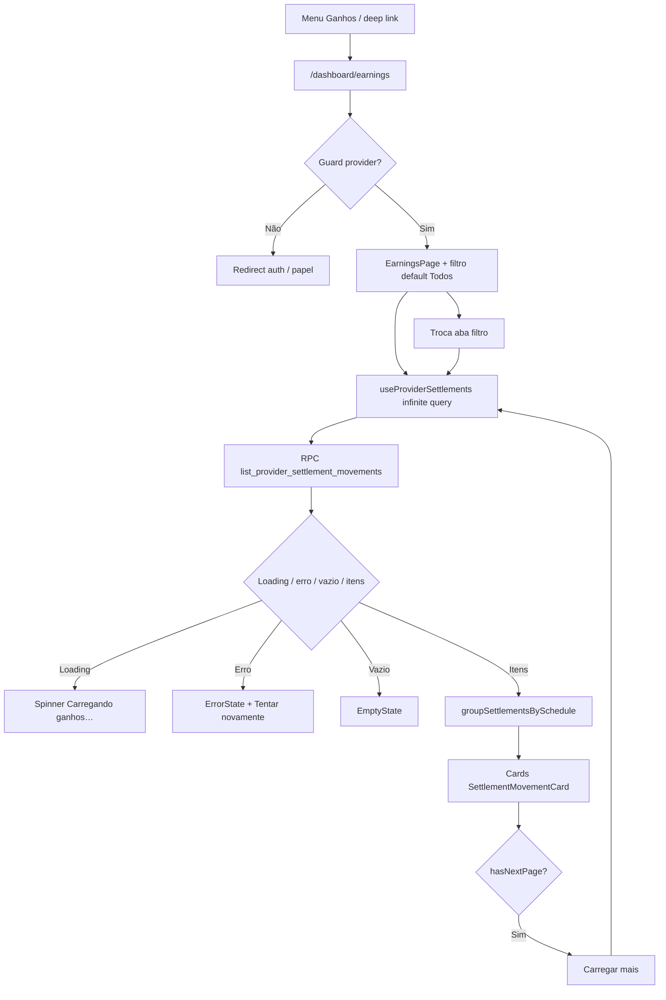

# Ganhos e liquidações bancárias

Documentação baseada em `src/features/provider-earnings/`, rota `/dashboard/earnings`, RPC `list_provider_settlement_movements`, tabela/view de settlements e ingestão NetCred (webhooks `PAYOUT_*`, enrich GraphQL pós-`TRANSACTION_CAPTURE`/`TRANSACTION_REFUND`, Edge `sync-netcred-settlements`). Idioma de produto na UI: pt-BR.

> **Não confundir** com **Recebimentos** (captura / `provider_payout` em Minha conta). Ver [historico-e-reembolso](../../payments/features/historico-e-reembolso.md). Este doc **não** redefine checkout, T-2 ou reembolso ToS — só links para [payments](../../payments/README.md).

---

## 1. Resumo executivo

- **O que é:** tela **Ganhos** com lista paginada de **linhas de liquidação bancária** (movements do payout NetCred) e componente reutilizável de **previsão de depósito**.
- **Problema que resolve:** prestador precisa ver **quando o valor cai na conta** (previsto / liquidado / estorno na liquidação), separado do momento em que o cartão do cliente foi capturado.
- **Quem usa:** prestador autenticado; conteúdo da lista só após KYC `ACTIVE` (gate do shell); item Ganhos sempre no menu do prestador.
- **Quem não usa:** cliente, visitante; admin sem UI dedicada nesta feature.
- **Resultado esperado:** lista com valor líquido, título do serviço (link para detalhe), status Previsto/Liquidado, previsão/data de liquidação, parcela e máscara de conta; abas de filtro (Todos/Previsto/Liquidado = só CREDIT, sem aba Estorno); disclosure de previsão em outras superfícies.
- **Impacto se indisponível:** prestador perde a visão de depósito bancário; Recebimentos (captura) e detalhe do serviço continuam; ingestão backend independente da UI.

## 2. Objetivo de negócio

- **Finalidade:** transparência de **liquidação bancária** pós-captura.
- **Valor:** reduzir dúvida “já recebi na plataforma, mas quando cai na conta?”.
- **Não cobre:** alterar calendário NetCred, forçar depósito, editar movements, histórico de captura, checkout, KYC.
- **Contexto:** complementa [payments](../../payments/README.md) (persistência/ingestão) e [my-account](../../my-account/README.md) (Recebimentos).

## 3. Localização na plataforma

| Superfície | Rota / componente | Perfil | Observação |
|------------|-------------------|--------|------------|
| Página Ganhos | `/dashboard/earnings` → `EarningsPage` | Prestador | Lazy em `router.tsx`; `ProtectedRoute allowedRoles={['provider']}` |
| Menu dashboard | Item **Ganhos** (`Wallet`) | Prestador | `dashboardMenu.ts`; 5º item dos `mainItems` (bottom nav mobile) |
| Disclosure (Public API) | `ProviderSettlementDisclosure` | Prestador | Export `@/features/provider-earnings` |
| Recebimentos (captura) | `/dashboard/conta` → `ProviderPaymentHistoryList` | Prestador | Importa disclosure + link para Ganhos (**código em payments**) |
| Detalhe serviço contratado | `ProviderSettlementStatus` → disclosure | Prestador | `view-services` → payments; hold estorno/disputa |

**Constante de rota:** `ROUTE_PROVIDER_EARNINGS = "/dashboard/earnings"`.

**Chrome mobile:** caminho `/dashboard/earnings` **não** está em `MOBILE_STACK_ROUTES` → cai no default **tab-root** (`mobileNavigation.config.ts`: `pathname.startsWith("/dashboard")`).

**Deep links / query params:** nenhum path/query param de filtro ou deep link documentado na feature; filtro é estado React local (`useState`), **não** sincronizado com URL.

**Diferença mobile vs desktop:** mesma página; abas com scroll horizontal; título “Ganhos” no conteúdo (padrão tab-root). Sem layout distinto além do chrome do shell.

## 4. Perfis envolvidos

| Papel | Acesso | Evidência |
|-------|--------|-----------|
| Prestador | Rota + RPC com `provider_id = auth.uid()` | `ProtectedRoute`; `list_provider_settlement_movements` |
| Prestador KYC ≠ `ACTIVE` (ou conta ainda carregando) | Menu completo; outlet sob `ProviderKycGate` (UI KYC, não a lista) | `ProviderKycGate`; `DashboardLayout` + `getDashboardMenu` |
| Cliente autenticado | Rota bloqueada pelo guard | `allowedRoles={['provider']}` |
| Não autenticado | Bloqueado pelo dashboard `ProtectedRoute` | `router.tsx` |
| Admin | Sem tela; list RPC só retorna linhas do `auth.uid()` | Migration da RPC |

**Ações bloqueadas:** papel errado → redirect dos guards; prestador sem KYC ativo → conteúdo de Ganhos substituído pelo gate (item permanece no menu).

## 5. Fluxo funcional principal

**Ingestão (fora da UI, pré-condição de dados):** captura → `payment_schedules` com `gateway_transaction_id` → (1) webhook `PAYOUT_CREATE`/`PAYOUT_SETTLE` → `payment_webhook_handle_payout`; (2) após processar com sucesso `TRANSACTION_CAPTURE` ou `TRANSACTION_REFUND`, `netcred-webhook` faz enrich best-effort GraphQL `movements(transactionId)` → `payment_upsert_settlement_movements` (mesmo pipeline do sync; cobre movements que entram em lote de payout já existente e **não** disparam `PAYOUT_CREATE`; falha do enrich **não** falha o ACK); (3) cron `sync-netcred-settlements` como backfill → linhas visíveis na lista.

## 6. Fluxos alternativos e exceções

| Cenário | Comportamento | Evidência |
|---------|---------------|-----------|
| Erro RPC / rede | `EarningsErrorState`: “Erro ao carregar ganhos” + retry (`refetch`) | `EarningsErrorState.tsx`; hook lança `Error` |
| Resposta RPC inválida (shape) | API retorna `"Resposta inválida do servidor"` | `settlements.api.ts` |
| Lista vazia sem filtro | “Nenhuma liquidação ainda” | `EarningsEmptyState` |
| Lista vazia com filtro | “Nenhuma liquidação neste filtro” + limpar filtros | `hasFilters` + `onClearFilters` |
| Loading | Spinner “Carregando ganhos…”; abas `disabled` | `SettlementMovementsList`, `EarningsFilterTabs` |
| Várias parcelas mesmo schedule | Grupo “Parcelas do mesmo pagamento” se **consecutivos** e `paymentScheduleId` não nulo | `groupSettlementsBySchedule` |
| Item órfão / schedule null | Card isolado (chave `orphan-{index}`) | `SettlementMovementsList` |
| Estorno (`DEBIT` ou `isRefundClawback`) | Valor com “−”, badge Estorno, ícone destrutivo | `formatSettlementMovement` / card |
| Disclosure: `settlingAt` válido | “Previsão de depósito na conta: {data longa pt-BR}” | `providerSettlementDisclosure.ts` |
| Disclosure: sem `settlingAt` | Mesma frase com **paid_at + 30 dias** | `PROVIDER_BANK_SETTLEMENT_DAYS = 30` |
| Disclosure: data inválida | Componente retorna `null` | Testes + util |
| Hold (refund / dispute) | Mensagem de suspensão; sem nota de conclusão | `formatProviderSettlementHoldDisclosure` |
| Cancelamento / abandono | N/A — só leitura; voltar = nav do shell | — |
| Idempotência / double-submit | N/A — sem mutações na feature | — |
| Duas abas | Cache React Query por filtro; `staleTime` 30s; `refetchOnWindowFocus: false` | `useProviderSettlements` |
| Filtros de data RPC | Aceitos pela API TS/RPC; **UI não envia** | `ListProviderSettlementsParams` vs hook |

## 7. Regras de negócio

1. Ganhos = **liquidação bancária** (movement); Recebimentos = **captura** (`provider_payout` / view de receivables) — cópia explícita na página e link cruzado.
2. Somente o prestador dono (`provider_id = auth.uid()`) lista movements na RPC.
3. Filtros UI → RPC: Todos / Previsto / Liquidado enviam `record_type = CREDIT`; a RPC **esconde** CREDITS de schedules `REFUNDED`/`REFUND_REQUESTED` e parcelas cujo somatório de DEBIT ≥ CREDIT (clawback total). Previsto também `movement_status = PENDING`; Liquidado → `PAID_OUT`. Não há aba Estorno na UI.
4. Paginação: `page` ≥ 1; `page_size` entre 1 e **100** (front fixa **20**).
5. Ordenação da lista: `settling_at DESC NULLS LAST`, depois `created_at DESC`.
6. Upsert backend persiste só a perna do prestador (`holder_company_id` = `provider_gateway_accounts.netcred_company_id`); pula platform / company não casada (`skipped_platform`).
7. Upsert exige schedule com mesmo `gateway_transaction_id` (+ slug); senão `skipped_not_found` (webhook pode retornar `not_found` para retry).
8. `is_refund_clawback` true quando `record_type = DEBIT` (ou flag no payload).
9. Valores `gross_amount` / `net_amount` ≥ 0; parcela 1–48 ou null; `record_type` só `CREDIT`/`DEBIT`.
10. `raw_snapshot` é ops-only (CLS / sem grant a authenticated na tabela).
11. Marcar serviço como concluído **não** antecipa depósito (`PROVIDER_SETTLEMENT_COMPLETION_NOTE`).
12. Em hold (disputa ou estados de reembolso da parcela), disclosure **suspende** a previsão (consumidor: `ProviderSettlementStatus` em payments).
13. Agrupamento visual só une itens **consecutivos** com o mesmo `paymentScheduleId` (não reordena a lista).

## 8. Campos e dados (shape)

Não há formulário. Modelo de domínio `SettlementMovement` (camelCase após map da RPC):

| Campo | Origem RPC / DB | Uso na UI Ganhos |
|-------|-----------------|------------------|
| `id` | PK | Key do card |
| `paymentScheduleId` | FK schedule | Agrupamento de parcelas |
| `netAmount` | `net_amount` | Valor principal (`formatCurrency`); DEBIT com prefixo “−” |
| `grossAmount` | `gross_amount` | **Não exibido** |
| `movementStatus` | text | Badge Previsto / Liquidado (ou raw) |
| `recordType` | `CREDIT`/`DEBIT` | Estorno + filtro |
| `isRefundClawback` | boolean | Trata visualmente como estorno se true |
| `settlingAt` | date | “Previsão: {data}” |
| `settledAt` | timestamptz | “Liquidado em {data}” / fallbacks |
| `installment` | smallint | “Parcela N” se ≥ 1 |
| `bankAccountMask` | text | “Conta: …” se presente |
| `brand`, `isAdvance`, ids gateway, `syncSource`, timestamps | RPC | **Não exibidos** na lista atual |
| Envelope | `items`, `total_count`, `page`, `page_size` | Infinite query / Carregar mais |

**Disclosure (props):** `capturePaidAt` (obrigatório); `settlingAt?`; `showCompletionNote?`; `settlementOnHold?`; `holdReason?: "refund" \| "dispute"`.

## 9. Validações de front-end

- Sem Zod/formulário.
- `page` / `pageSize` normalizados na API (`Math.max` / `Math.min(..., 100)`).
- `record_type` mapeado: só `"DEBIT"` vira DEBIT; qualquer outro → CREDIT (`toRecordType`).
- Números inválidos → `0` (`toNumber`).
- Datas do disclosure via `normalizeCalendarDateToIso` / `calendarDate`; inválidas → `null` (sem texto).
- Status desconhecido no card: exibe o raw string (`formatSettlementMovementStatus`).

## 10. Validações de back-end

### RPC `list_provider_settlement_movements` (`SECURITY DEFINER`)

| Condição | Efeito |
|----------|--------|
| `auth.uid()` null | `42501` Authentication required |
| `p_record_type` não nulo e ≠ CREDIT/DEBIT | `22023` / `SETTLEMENT_RECORD_TYPE_INVALID` |
| Filtros de status/tipo/datas | WHERE opcional; só linhas `provider_id = v_actor` |
| `GRANT EXECUTE` | `authenticated` + `service_role` |

**Nota:** a RPC **não** checa `profiles.role = 'provider'` explicitamente — isolamento é por `provider_id = auth.uid()`. Cliente autenticado obteria lista vazia se chamasse a RPC.

### Tabela / upsert / grants

| Artefato | Regra |
|----------|--------|
| `payment_settlement_movements` | RLS SELECT: dono ou `is_platform_admin()` (política); após `20260802300000_*`, **authenticated sem privilegio SELECT** na tabela — leitura app via RPC DEFINER |
| `provider_settlement_movements_v` | SELECT authenticated; sem `raw_snapshot`; `security_invoker` |
| `payment_upsert_settlement_movements` | Só `service_role`; payload array; skip invalid / not_found / platform |
| Webhook `payment_webhook_handle_payout` | Mapeia `PayoutPayload.movements[]`; enums desconhecidos: log + ainda tenta upsert se campos mínimos ok |

Evidência de teste: `supabase/tests/payments/payment_settlement_movements_test.sql`, `payment_settlement_table_select_deny_test.sql`, `payment_webhook_handle_payout_test.sql`, `payment_claim_schedules_for_settlement_sync_test.sql`.

## 11. Status, estados e transições

### Movement (domínio NetCred / UI)

| `movement_status` | Label UI | Badge |
|-------------------|----------|-------|
| `PENDING` | Previsto | `secondary` |
| `PAID_OUT` | Liquidado | `success` |
| Outro | string crua | `secondary` (não success) |

| `record_type` | Significado de negócio (UI) |
|---------------|----------------------------|
| `CREDIT` | Crédito / depósito |
| `DEBIT` | Estorno na liquidação (clawback) |

**Transições:** a feature **não** aplica FSM — status muda por ingestão webhook/reconcile (`payment_upsert_settlement_movements` faz upsert por `gateway_movement_id`). UI só reflete o estado persistido.

### Label “Liquidado em / Pendente” (`formatSettlementSettledLabel`)

1. Se `settledAt` formatável → `Liquidado em {data}`.
2. Senão se `movementStatus === PAID_OUT` → `Liquidado`.
3. Senão → `Pendente`.

### Hold do disclosure (consumidor payments)

`ProviderSettlementStatus` coloca hold quando `isDisputed` **ou** estado da parcela ∈ `REFUND_REQUESTED` \| `REFUNDED` \| `PARTIALLY_REFUNDED`. Motivo: disputa → `"dispute"`; senão `"refund"`. Só renderiza se `paidAt` e estado ∈ `PAID` \| `REFUNDED` \| `PARTIALLY_REFUNDED` \| `REFUND_REQUESTED`.

### UI React Query

| Estado | UI |
|--------|-----|
| `isLoading` | Spinner |
| `isError` | ErrorState + retry |
| `items.length === 0` | EmptyState |
| Sucesso | Lista + LoadMore opcional |

## 12. Persistência

### Servidor

| Artefato | Papel |
|----------|--------|
| `payment_settlement_movements` | Linhas de liquidação; join schedule via `gateway_transaction_id` |
| `provider_settlement_movements_v` | Read model sem snapshot |
| `payment_schedules` | Upstream de captura / `paid_at` / transaction id |
| `provider_gateway_accounts.netcred_company_id` | Filtro de holder no upsert |
| `platform_constants.settlement_sync_batch_size` | Batch do claim GraphQL (default 20) |

Migrations: `20260802240000_create_payment_settlement_movements.sql`, `20260802250000_payment_sync_netcred_settlements_cron.sql`, ajuste de grants `20260802300000_payment_schedules_audit_cls_and_settlement_grants.sql`.

### Cliente

| Mecanismo | Detalhe |
|-----------|---------|
| React Query | Key `["provider-earnings","provider-settlements", filterId]`; `staleTime` 30s; infinite pages |
| Preferences / draft / localStorage | **Não usado** |
| URL state | **Não usado** (filtro só em memória do componente) |

## 13. Integrações

| Integração | Papel | Escopo deste doc |
|------------|-------|------------------|
| Edge `netcred-webhook` | `PAYOUT_CREATE` / `PAYOUT_SETTLE` → handler SQL; após `TRANSACTION_CAPTURE` / `TRANSACTION_REFUND` bem-sucedidos → enrich GraphQL best-effort (`enrichSettlementMovements`) | Link; detalhe em payments / payment-system |
| Edge `sync-netcred-settlements` | Cron `15,45 * * * *` → claim + GraphQL reconcile (mesmo pipeline do enrich) | Backfill quando PAYOUT_* / enrich falham ou atrasam |
| RPC `payment_claim_schedules_for_settlement_sync` | Elegíveis: PAID/REFUNDED/PARTIALLY_REFUNDED, sem movements ou pending vencido; grace 30 min pós-`paid_at` | Backend payments |
| MMD / e-mail / push / IA | **Sem** evidência nesta feature | — |
| GA / Sentry dedicados | **Sem** `trackEvent` / breadcrumbs na pasta `provider-earnings` (erros de API usam `logger.error`) | — |

## 14. Listagens, buscas, filtros, paginação, ordenação

| Aspecto | Comportamento |
|---------|---------------|
| Listagem | Infinite query; flatten de páginas |
| Busca textual | **Não há** |
| Filtros | Abas: Todos / Previsto / Liquidado (= CREDIT); server-side |
| Serviço | Título + link sheet para `/dashboard/services/:id` (RPC devolve `service_request_id` / `service_request_title`) |
| Paginação | `PAGE_SIZE = 20`; botão Carregar mais |
| Ordenação | Definida na RPC (settling_at desc, created_at desc) |
| Agrupamento | Cliente: consecutivos por `paymentScheduleId` |

## 15. Ações disponíveis

| Ação | Quem | Pré-condição | Resultado | Erro |
|------|------|--------------|-----------|------|
| Abrir Ganhos | Prestador | Guard; conteúdo só se KYC `ACTIVE` (senão UI do gate) | Carrega lista | Guard / gate |
| Trocar filtro | Prestador | Página carregada | Refetch página 1 do filtro | ErrorState se falhar |
| Carregar mais | Prestador | `hasNextPage` | Append itens | Erro na query de página |
| Tentar novamente | Prestador | Estado de erro | `refetch` | — |
| Limpar filtros | Prestador | Empty com filtro ativo | Volta para Todos | — |
| Ir para Recebimentos | Prestador | Link no header | Navigate `/dashboard/conta` | — |
| Ver disclosure | Prestador | Superfície consumidora | Texto previsão ou hold | `null` se data inválida |

**Sem ações de escrita** (criar/editar/cancelar liquidação) nesta feature.

## 16. Dependências

| Direção | Módulo / lib | Relação |
|---------|--------------|---------|
| Upstream dados | **payments** (schedules, webhooks, upsert, cron) | Persistência e ingestão |
| Shell | **dashboard-shell**, **provider-kyc** | Menu, gate, chrome mobile |
| Downstream UI | **payments** (`ProviderPaymentHistoryList`, `ProviderSettlementStatus`), **view-services** (`ServiceContractedSection`) | Consomem Public API do disclosure |
| Cruzado | **my-account** | Destino do link Recebimentos |
| Libs | `@/lib/supabase/client`, `@/lib/logger`, `@/lib/formatCurrency`, `@/lib/utils/calendarDate`, TanStack Query, UI shadcn |

**Não editar payments neste escopo documental** — apenas links.

## 17. Regras implícitas

1. `ProviderPaymentHistoryList` e `ProviderSettlementStatus` **não passam `settlingAt`** → disclosure embutido usa **sempre** fallback D+30 (ou hold), mesmo que já exista movement com data real (visível só na lista Ganhos).
2. Filtro Estorno usa só `record_type = DEBIT`; um CREDIT com `isRefundClawback` true (se existisse) ainda poderia aparecer como estorno **no card** via `isSettlementDebit`, mas **não** na aba Estorno.
3. Troca de filtro reseta a experiência de lista (nova query), sem preservar scroll.
4. `refetchOnWindowFocus: false` — voltar à aba do browser não atualiza sozinho até stale/manual.
5. Valores DEBIT continuam com `net_amount ≥ 0` no banco; o sinal negativo é **só UI**.
6. Admin platform na política RLS histórica da tabela não altera a listagem do app (RPC amarra ao `auth.uid()`).
7. Cron GraphQL: schedules elegíveis só após ~30 min de `paid_at` (exceto pending já vencido) para dar prioridade a PAYOUT_* e ao enrich pós-captura/estorno.

## 18. Riscos

| Risco | Impacto | Mitigação observada / lacuna |
|-------|---------|------------------------------|
| Atraso PAYOUT_* / enrich / reconcile | Lista vazia ou só D+30 no disclosure | Enrich pós-CAPTURE/REFUND; cron `15,45 * * * *`; retry `not_found` no payout |
| Orphan skip (`skipped_not_found`) | Movement NetCred sem schedule local | Retry fila webhook; claim GraphQL |
| Confusão captura × liquidação | Suporte / prestador | Copy + links cruzados |
| Disclosure desatualizado vs Ganhos | Expectativa de data errada | **Pendência:** consumidores não passam `settlingAt` |
| Sem analytics | Funil de uso da tela invisível | Pendência de produto |
| Filtro de datas na RPC sem UI | Ops/produto sem range na tela | Pendência se desejado |

## 19. Evidências

### Front

- `src/features/provider-earnings/` — `components/` (`EarningsPage`, filtros, lista, cards, empty/error, `ProviderSettlementDisclosure`), `api/settlements.api.ts`, `api/settlements.rpc.ts`, `hooks/useProviderSettlements.ts`, `types/settlements.types.ts`, `utils/*`, `constants/*`, `index.ts`
- Testes Vitest sob `**/__tests__/` na feature
- `src/router.tsx` — lazy + guard provider em `earnings`
- `src/layouts/DashboardLayout/dashboardMenu.ts`, `mobileNavigation.config.ts`, `DashboardLayout.tsx` (`getDashboardMenu` + `ProviderKycGate`)
- Consumidores: `src/features/payments/components/PaymentHistory/ProviderPaymentHistoryList.tsx`, `ProviderSettlementStatus.tsx`, `src/features/view-services/components/ServiceContractedSection.tsx`

### Backend

- `supabase/migrations/20260802240000_create_payment_settlement_movements.sql`
- `supabase/migrations/20260802250000_payment_sync_netcred_settlements_cron.sql`
- `supabase/migrations/20260802300000_payment_schedules_audit_cls_and_settlement_grants.sql` (revoke SELECT authenticated na tabela)
- `supabase/functions/sync-netcred-settlements/`
- `supabase/functions/netcred-webhook/` (`parsePayoutPayload`, routing PAYOUT_*, `maybeEnrichSettlementMovements`)
- `supabase/functions/_shared/payment/enrichSettlementMovements.ts`
- pgTAP: `supabase/tests/payments/payment_settlement_*.sql`, `payment_webhook_handle_payout_test.sql`, `payment_claim_schedules_for_settlement_sync_test.sql`

### Docs relacionados (não substituem evidência de código)

- [README do módulo](../README.md)
- [payments](../../payments/README.md), [historico-e-reembolso](../../payments/features/historico-e-reembolso.md)
- `docs/payment-system/design.md` / `payments-api.md` §10 (complementar)

## 20. Pendências

1. **`settlingAt` nos consumidores do disclosure** — Recebimentos e `ProviderSettlementStatus` não passam a data real do movement; evidência de gap de UX vs lista Ganhos.
2. **Filtros de intervalo de datas** — RPC/API prontos; UI ausente. Necessidade de produto não comprovada no front.
3. **Analytics** — nenhum evento GA na feature; impacto de adoção não mensurado no código.
4. **Checagem explícita de role `provider` na RPC** — isolamento só por `provider_id`; suficiente na prática, diferente de outras RPCs provider-only.
5. **Campos retornados não exibidos** (`grossAmount`, `brand`, `isAdvance`, sources/types) — decisão de UI; sem requisito documentado no código da lista.
6. Transversais (`glossario`, `mapa`, `matriz`, `pendencias-e-incertezas`) — fora do escopo deste worker; já referenciam o módulo (verificar sync por worker transversal se necessário).

---

## Anexo A — Matriz de erros / mensagens UI

| Origem | Mensagem / comportamento |
|--------|--------------------------|
| Falha RPC / throw do hook | Título “Erro ao carregar ganhos”; descrição pedindo checar conexão + retry |
| `error.message` do PostgREST | Log `provider_earnings_list_settlements_error`; UI genérica de erro (não espelha o texto técnico) |
| Shape inválido | `"Resposta inválida do servidor"` → ErrorState |
| Empty sem filtro | “Nenhuma liquidação ainda” |
| Empty com filtro | “Nenhuma liquidação neste filtro” |
| Hold refund | “Há um estorno em andamento. A previsão de depósito fica suspensa até a conclusão do reembolso.” |
| Hold dispute | “Há um chargeback em análise. A previsão de depósito fica suspensa até a resolução da disputa.” |
| `SETTLEMENT_RECORD_TYPE_INVALID` | Só se cliente enviar `p_record_type` inválido (UI não envia valores fora do enum) |

## Anexo B — Checklist QA (cenários)

- [ ] Prestador ACTIVE: menu mostra Ganhos; abre `/dashboard/earnings` com título e link para Recebimentos.
- [ ] Cliente: sem item Ganhos; URL direta bloqueada pelo guard.
- [ ] Prestador KYC não ACTIVE: item Ganhos **visível** no menu; ao abrir, UI KYC (não a lista).
- [ ] Lista com CREDIT PENDING: badge Previsto + previsão.
- [ ] Lista com PAID_OUT + `settledAt`: badge Liquidado + “Liquidado em …”.
- [ ] DEBIT/clawback não aparece nas abas Todos/Previsto/Liquidado (RPC).
- [ ] Duas parcelas consecutivas mesmo `paymentScheduleId`: grupo “Parcelas do mesmo pagamento”.
- [ ] Filtro sem resultados: empty + limpar filtros volta a Todos.
- [ ] Erro simulado: ErrorState + retry.
- [ ] Carregar mais quando `total_count` > 20.
- [ ] Disclosure em Recebimentos: D+30 a partir de `receivedAt` (sem settling real).
- [ ] Detalhe serviço: hold em disputa / REFUND_*; nota de conclusão quando `showCompletionNote` e não hold.
- [ ] Confirmar que marcar concluído **não** muda texto de previsão (nota de produto).

## Anexo C — Distinção captura × liquidação

| Conceito | O que é | Onde |
|----------|---------|------|
| **Recebimento (captura)** | `provider_payout` no momento da captura (`paid_at`) | Minha conta → `provider_payment_receivables_v` ([payments](../../payments/features/historico-e-reembolso.md)) |
| **Ganho / liquidação bancária** | Movement do payout: previsto (`settling_at`) ou efetivo (`settled_at`) | Ganhos → `list_provider_settlement_movements` |
| **Fallback D+30** | Estimativa UI `paid_at + 30 dias` se não há `settling_at` no disclosure | `estimateProviderBankSettlementDate` |
