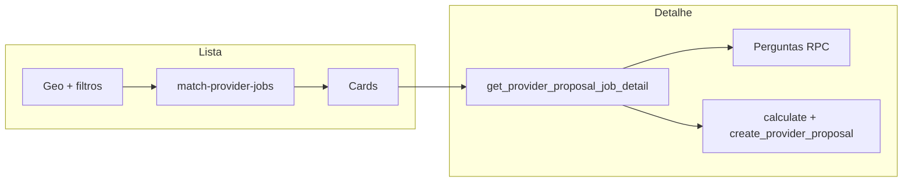

# Trabalhos, perguntas e propostas do prestador

Documentação baseada em `src/features/provider-jobs/`, Edge Function `match-provider-jobs` e comentários de orquestração em `supabase/functions/match-provider-jobs/index.ts`.

---

## 1. Visão geral

| Item | Descrição |
|------|-----------|
| **Objetivo** | Permitir que o **prestador** descubra pedidos compatíveis (geo + serviço + área), abra o **detalhe**, **pergunte** ao cliente e **envie ou edite** orçamento com precificação calculada e assinada no servidor. |
| **Contexto de negócio** | Lado *supply* do marketplace; integra com `my-account` (serviços ofertados e bairros), `client-my-services` / `negotiation-proposals` (lado cliente) e `provider-budgets` (reuso de UI de detalhe). |
| **Perfis** | Apenas **prestador** na UI (`router.tsx`: `allowedRoles={['provider']}`). |
| **Dependências** | `@/features/request-quote` (`getServiceCardStyle`, `useServiceRequestPhotoUrls` nas listagens), `@/features/dynamic-form` (tipo `FormSchema` no item do job). |

---

## 2. Telas e rotas

| Tela | Rota | Objetivo | Perfis |
|------|------|----------|--------|
| Lista de trabalhos | `/dashboard/jobs` | Oportunidades com filtros, ordenação e *infinite scroll* | Prestador |
| Detalhe em **sheet** | `/dashboard/jobs/:jobId` com `location.state.jobDetailPresentation === "sheet"` | Detalhe sobreposta à lista (navegação a partir do card) | Prestador |
| Detalhe em **página cheia** | `/dashboard/jobs/:jobId` sem o state acima | Detalhe em página dedicada | Prestador |

**Shell:** `ProviderJobsShell.tsx` — lista sempre visível quando não há job ou quando o detalhe é sheet; `JobDetailSheet` ou `JobDetailPage` conforme state.

**Navegação a partir do card:** `JobCard.tsx` → `Link` para `/dashboard/jobs/${job.id}` com `state: { job, jobDetailPresentation: "sheet" }`.

---

## 3. Geolocalização e listagem

### 3.1 `useProviderLocation`

- Usa `navigator.geolocation.getCurrentPosition` com timeout 20s; em falha de timeout/indisponível, **retry** com alta precisão (25s, `maximumAge: 0`).
- **Fallback de coordenadas:** centro de Florianópolis `(-27.5969, -48.5495)` quando geo indisponível, permissão negada ou contexto inseguro — `useProviderLocation.ts`.
- **HTTP não seguro:** mensagem específica; exceto `localhost` / `127.0.0.1` / `[::1]`.
- **Permissões:** escuta `navigator.permissions` para `geolocation` e chama `retry` quando passa a `granted`.
- Estados expostos: `location`, `error`, `isLoading`, `permissionDenied`, `insecureContext`, `isUsingDefault` (= erro mas com coordenadas fallback), `retry`.

### 3.2 Banner (`LocationPermissionBanner.tsx`)

Textos conforme `insecureContext` / `permissionDenied` / caso genérico (“localização aproximada”) + botão **Tentar novamente**.

### 3.3 `useProviderJobs`

- **Habilitação:** `enabled: latitude != null && longitude != null` — sem coords a query **não roda**.
- **Chamada:** `fetchProviderJobs` → `supabase.functions.invoke("match-provider-jobs", { body })`.
- **Tamanho de página:** **20** fixo; `staleTime` 60s; `refetchOnWindowFocus: false`.
- **Parâmetros do body** (tipo `MatchProviderJobsBody` em `supabase/functions/match-provider-jobs/types.ts`): `latitude`, `longitude` (obrigatórios), `radius_km` opcional, `service_id`, `sort_mode`, `page`, `page_size` (no app: page size 20).
- **Clamps documentados na Edge:** `radius_km` [1, 100]; `page_size` [1, 50] (comentário no `index.ts` da function).

### 3.4 Critérios de elegibilidade (matching) — evidência Edge `index.ts`

Resumo do que o comentário oficial da function descreve para o RPC `match_provider_jobs`:

- Pedido `open` com localização não nula.
- Serviço: prestador oferece o serviço exato **ou** categoria pai (`parent_id`).
- Cidade do pedido ∈ cidades derivadas de `provider_service_area_neighborhoods`.
- Proximidade PostGIS `ST_DWithin` (raio em km).
- Sem proposta **ativa** deste prestador no pedido (status ≠ `REVISED`).
- Contagem informativa de propostas ativas (`PENDING` + `REVISION_REQUESTED`); sem teto por pedido.
- Filtro opcional `service_id`.

Campos computados citados: `distance_km`, `proposal_count`, `exact_area_match`, `masked_client_name`.

### 3.5 Ordenação (`sort_mode`) — linguagem de negócio

| Valor (`SortMode`) | Label na UI (`sortModes.ts`) | Comportamento (Edge `index.ts`) |
|--------------------|-------------------------------|--------------------------------|
| `nearest` | Mais próximos | `distance_km` ASC (+ desempates) |
| `least_competitive` | Menos concorridos | `proposal_count` ASC |
| `newest` | Mais recentes | `created_at` DESC |

Desempates documentados na function: `created_at DESC` → `distance_km ASC`.

### 3.6 Filtros de UI (`useProviderJobsFilters` + `JobsFiltersBar`)

| Controle | Opções | Persistência |
|----------|--------|--------------|
| Raio | 2, 5, 10, 20, 50 km (`RADIUS_OPTIONS`); padrão **10** | Estado React apenas (sem localStorage) |
| Tipo de serviço | “Todos” ou um ID de `provider_services` retornado na resposta | Idem |
| Ordenação | Abas `JobsSortTabs` | Idem |
| Reset | Volta sort `nearest`, raio 10, serviço null | `resetFilters` |

### 3.7 Estados de lista

- **Loading:** skeletons (`JobCardSkeleton`).
- **Erro:** `JobsErrorState` — *"Erro ao carregar trabalhos"* + descrição de conexão.
- **Vazio com filtros:** *"Nenhum trabalho encontrado"* + sugestão de ajustar filtros.
- **Vazio sem filtros:** *"Nenhuma oportunidade na sua região"* + texto sobre serviços/área.
- **Mais páginas:** `LoadMoreButton` chama `fetchNextPage`.

---

## 4. Detalhe do pedido (`useProviderJobDetail`)

- RPC `get_provider_proposal_job_detail` via `fetchProviderProposalJobDetail` (`providerJobs.api.ts`).
- **Coords:** usa `useProviderLocation()`; se ausente, fallback **centróide Brasil** `(-14.235, -51.9253)` — comentário no hook.
- **`radiusKm`:** 10 fixo na chamada do hook.
- **`proposalId`:** quando `initialJob.provider_proposal_id` existe, passa `p_proposal_id`; senão `p_service_request_id`.
- **Seed:** se `initialJob.id === jobId`, usa `initialData` da lista até o refetch (`staleTime` 60s, `refetchOnMount: "always"`).

---

## 5. Regras de UI no detalhe (`JobDetailContent.tsx`)

Definições no código:

- `hasActiveProposal` = existe `provider_proposal_id` **e** status ≠ `REVISED`.
- `isViewingLatestProposalRow` = `job.is_latest_provider_proposal !== false`.
- **`showBrowseCtas`** = **não** tem proposta ativa **e** está vendo linha mais recente → mostra perguntas, composer, `JobDetailFloatingActions`.
- **`canEditProposal`** = tem proposta, é latest, status ≠ `ACCEPTED` e ≠ `REVISED`.

**Alerta de rejeição:** se status ∈ `{REJECTED, REJECTED_AUTOMATICALLY}`, `Alert` com título *"Orçamento rejeitado pelo cliente"* e texto de `provider_proposal_client_rejection_response` ou fallback sem comentário.

**Badge de concorrência:** `{proposal_count} orçamento(s)` — contagem informativa de propostas ativas (`PENDING` + `REVISION_REQUESTED`); não há teto por pedido.

---

## 6. Perguntas ao cliente

### 6.1 Composer (`useProviderJobQuestionComposer` + `JobQuestionComposerDialog`)

| Regra | Valor |
|-------|--------|
| Máximo de caracteres | **1000** (`MAX_QUESTION_LENGTH`) |
| Validação vazia | Toast *"Escreva uma pergunta antes de enviar."* |
| API | RPC `create_provider_service_request_question` |
| Limite backend | Se mensagem de erro = `PROVIDER_JOB_QUESTION_LIMIT_EXCEPTION_MESSAGE` → toast *"Você já atingiu o limite de 3 perguntas para este pedido."* |
| Sucesso | *"Pergunta enviada com sucesso."* + invalida `["provider-job-questions", serviceRequestId]` |

**Dialog:** schema Zod inline (trim, min 1, max); mobile full-screen com `useMobileDialogViewport`.

### 6.2 Feed

- `JobQuestionsFeed` + `list_provider_service_request_questions` (`providerJobQuestions.api.ts`).

### 6.3 Onde aparece o fluxo de pergunta

- Só quando `showBrowseCtas` — ou seja, sem proposta ativa e visualizando proposta latest.

---

## 7. Orçamento (proposta)

### 7.1 Campos e validações no hook (`useProviderProposalComposer.ts`)

| Campo / grupo | Regras no front |
|---------------|-----------------|
| Valor (`priceInput`) | Máscara BRL `maskBudgetInput`; parse > 0; debounce **1500 ms** antes de chamar `calculate_provider_service_pricing` |
| Descrição | Obrigatória; máx. **1200** caracteres |
| Duração | Inteiro > 0 (`durationValueInput` só dígitos); máx. **24** em `hours`, máx. **7** em `days` (1 semana) |
| Unidade | `hours` \| `days` |
| Slots de disponibilidade | Entre **1 e 3**; adicionar além de 3 → toast *"Você pode sugerir no máximo 3 opções de data."*; remover último → *"Informe pelo menos 1 opção de data."* |
| Data início | Obrigatória por slot; não pode ser **anterior a hoje** (meia-noite local) |
| Modo **dias** | Data final obrigatória; intervalo válido se tiver exatamente `durationValue` **dias corridos** (inclui fim de semana) **ou** `durationValue` **dias úteis** (seg–sex) |
| Fotos novas | Máx. **5** no total (existentes + novas); exceder → toast com limite |
| Submit | Exige `pricing` retornado e, em modo edição, `hasEditedProposal` (compara snapshot) |

### 7.2 Fotos — API (`providerProposals.api.ts`)

- Bucket **`provider-proposals`**.
- Tipos: JPEG, PNG, WebP, HEIC, HEIF.
- Máx. **5 MB** por arquivo.
- Máx. **5** arquivos por upload batch; path `providers/{userId}/proposals/{serviceRequestId}/...`.

### 7.3 Envio

- RPC canônica **`create_provider_proposal`** por **`service_request_id`** (sem `chat_id` na linha de proposta).
- **Sem** limite de quantidade de propostas por pedido; a restrição de capacidade fica nos **slots de chats ativos** (`chats.max_active_slots_per_service_request`).
- Se já existir conversa `(service_request_id, provider_id)`, o servidor espelha mensagem **`PROPOSAL`** na timeline; sem conversa, a proposta é criada normalmente.
- Payload: `p_proposed_amount`, descrição, duração, slots (JSON), `p_photos`, taxas e **`p_pricing_signature`**.
- Cliente unificado: **`createProviderProposal`** no fluxo de trabalhos e no composer de chat (`negotiation-proposals`); **`submit_proposal`** foi removido.

### 7.4 Toasts principais (proposta)

| Situação | Mensagem (trecho) |
|----------|-------------------|
| Valor inválido | *"Informe um valor válido para o orçamento."* |
| Descrição vazia / longa | *"Descreva seu orçamento..."* / máximo 1200 caracteres |
| Duração / slots / datas | Várias mensagens específicas (ver hook) |
| Cálculo de preço | `toast.error(error)` da RPC ou *"Não foi possível calcular a taxa agora."* |
| Upload | Mensagem retornada pela API de storage |
| RPC erro | Mensagem mapeada (`PROPOSAL_ALREADY_PENDING`, etc.) ou texto do Supabase |
| Sucesso | *"Orçamento enviado com sucesso."* |

### 7.5 Resumo do orçamento (`ProviderProposalSummaryCard`)

- Exibido se `provider_proposal_id` existe.
- **Editar orçamento:** botão chama `openProposalComposer({ mode: "edit" })` quando `canEdit`.
- Histórico: acordeão + `fetchProviderProposalHistory` em `provider_proposals`; dialog de detalhe por item.

### 7.6 Labels de status

Labels reutilizam `getProposalStatusLabel` de `negotiation-proposals` (`PENDING`, `ACCEPTED`, `REJECTED`, `REVISION_REQUESTED`, `REVISED`, `EXPIRED`, `REJECTED_AUTOMATICALLY`).

---

## 8. Ações flutuantes (mobile / desktop)

`JobDetailFloatingActions.tsx`:

- **Mobile:** FAB + hint *"Fazer orçamento >"*; `aria-label` *"Fazer orçamento"*.
- **Desktop:** barra fixa com **Quero fazer uma pergunta** e **Estou pronto para enviar um orçamento**.

Offset de `bottom` considera `safe-area-inset-bottom` e se está dentro de sheet.

---

## 9. Metadados e conteúdo do pedido

- **Urgência:** `URGENCY_CONFIG` — Alta/Média/Baixa prioridade com variantes de badge.
- **Duração estimada:** `DURATION_LABELS` mapeia chaves técnicas para PT-BR.
- **Complexidade:** `COMPLEXITY_LABELS` (Simples, Média, Complexo).
- **Equipamentos/materiais sugeridos:** `suggestedItemsMapper` + tooltip `SUGGESTED_ITEMS_TOOLTIP_TEXT`.
- **Seções do pedido:** `JobDetailRequestSections`, `FormResponsesSummary`, fotos via `request-quote`.

---

## 10. APIs e camadas (resumo)

| Camada | Arquivo | Destino |
|--------|---------|---------|
| Lista | `api/providerJobs.api.ts` | `functions.invoke("match-provider-jobs")` |
| Detalhe | idem | `rpc("get_provider_proposal_job_detail")` |
| Preço | `negotiation-proposals` | `rpc("calculate_provider_service_pricing")` |
| Criar proposta | `negotiation-proposals` | `rpc("create_provider_proposal")` |
| Histórico | `negotiation-proposals` | `from("provider_proposals")` select |
| Fotos proposta | `negotiation-proposals` | Storage `provider-proposals` |
| Perguntas | `api/providerJobQuestions.api.ts` | `create_provider_service_request_question`, `list_provider_service_request_questions` |

---

## 11. Observabilidade

- `useProviderJobs` envolve `fetchProviderJobs` em span Sentry `provider_jobs.fetch_list` com atributos de página, raio, sort, filtro de serviço.

---

## 12. Mensagens do sistema (lista adicional)

| Origem | Texto |
|--------|--------|
| `useProviderJobs` throw | *"Erro ao buscar trabalhos"* (erro genérico da query) |
| `JobsHeader` / área | Resumo de cidades/bairros do prestador (dados da primeira página) |

---

## 13. Evidências no código

- Rotas: `src/router.tsx` (`dashboard/jobs`, filhos).
- Shell / páginas: `ProviderJobsShell.tsx`, `ProviderJobsPage.tsx`, `JobDetailPage.tsx`, `JobDetailSheet.tsx`.
- Conteúdo: `JobDetailContent.tsx`, `JobCard.tsx`, `JobsFiltersBar.tsx`, `JobsSortTabs.tsx`.
- Hooks: `useProviderLocation.ts`, `useProviderJobs.ts`, `useProviderJobsFilters.ts`, `useProviderJobDetail.ts`, `useProviderJobQuestionComposer.ts`, `useProviderProposalComposer.ts`, `useProviderProposalHistory.ts`, `useProviderProposalPhotoUrls.ts`.
- Edge: `supabase/functions/match-provider-jobs/index.ts`, `types.ts`.

---

## 14. Lacunas ou confirmação humana

| Item | Observação |
|------|------------|
| Semântica exata da RPC ao “editar” proposta | O app só chama `create_provider_proposal`; ver SQL da função para saber se cria nova versão ou atualiza. |
| Regra `can_provider_ask_question` no SQL | Mencionada em docs antigas; elegibilidade fina está no banco — não reproduzida linha a linha aqui. |
| Limite de propostas “ativas” vs histórico `rejected` | Edge documenta contagem de propostas ativas; detalhe de estados no RPC. |

---

## 15. Diagrama resumido

  ## 16. Atualização de auditoria (2026-04-27)

  - **Query de trabalhos depende de coordenadas válidas:** `useProviderJobs` só habilita busca quando latitude/longitude estão preenchidos.
  - **Fallbacks geográficos distintos por contexto:** lista usa Florianópolis quando geo falha; detalhe usa centróide do Brasil quando necessário.
  - **Composer de proposta recalcula taxa com debounce:** preço é validado e enviado para cálculo após 1500 ms sem edição.
  - **Uploads de proposta:** limite de 5 fotos por envio, até 5 MB por arquivo, com tipos de imagem explicitamente permitidos.
  - **Edição de proposta é restrita por status:** UI permite editar apenas proposta latest e não `ACCEPTED`/`REVISED`.
