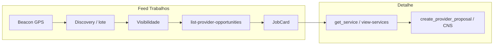

# Trabalhos, perguntas e propostas do prestador

Documentação baseada em `src/features/provider-jobs/`, Edge **`list-provider-opportunities`** e backend [matching-dispatch](../matching-dispatch/README.md).

---

## 1. Visão geral

| Item | Descrição |
|------|-----------|
| **Objetivo** | Permitir que o **prestador** descubra pedidos compatíveis (geo + serviço + área), abra o **detalhe**, **pergunte** ao cliente e **envie ou edite** orçamento com precificação calculada e assinada no servidor. |
| **Contexto de negócio** | Lado *supply* do marketplace; integra com `my-account` (serviços ofertados e bairros), `my-services` / `negotiation-proposals` (lado cliente) e `view-services` (detalhe unificado). |
| **Perfis** | Apenas **prestador** na UI (`router.tsx`: `allowedRoles={['provider']}`). |
| **Dependências** | `@/features/request-quote` (`getServiceCardStyle`, `useServiceRequestPhotoUrls` nas listagens), `@/features/dynamic-form` (tipo `FormSchema` no item do job). |

---

## 2. Telas e rotas

| Tela | Rota | Objetivo | Perfis |
|------|------|----------|--------|
| Lista de trabalhos | `/dashboard/jobs` | Oportunidades com filtros, ordenação e *infinite scroll* | Prestador |
| Detalhe em **sheet** | `/dashboard/jobs/:jobId` com `location.state.jobDetailPresentation === "sheet"` | Detalhe sobreposta à lista (navegação a partir do card) | Prestador |
| Detalhe em **página cheia** | `/dashboard/jobs/:jobId` sem o state acima | Detalhe em página dedicada | Prestador |

**Shell:** `ProviderJobsShell.tsx` — lista sempre visível quando não há job ou quando o detalhe é sheet; `JobDetailSheet` ou `JobDetailPage` conforme state.

**Navegação a partir do card:** `JobCard.tsx` → `Link` para `/dashboard/jobs/${job.id}` com `state: { job, jobDetailPresentation: "sheet" }`.

---

## 3. Geolocalização e listagem (matching progressivo)

> **Cutover 2026-06:** o feed deixou de usar `match-provider-jobs` (raio + página). Ver [matching-dispatch](../matching-dispatch/README.md).

### 3.1 Modelo duplo de localização

| Papel | Hook / componente | Uso de negócio |
|-------|-------------------|----------------|
| **Beacon (lote)** | `useProviderLocationTracking`, `DeviceBeaconProvider`, `locationSync` | Atualiza `user_device_beacons` → `provider_latest_locations`; define se o prestador entra em **lotes** e discovery. Android: background com notificação persistente. Web: **apenas foreground**. |
| **GPS feed** | `useProviderLocation` | Só para sort **Mais próximos** e exibição de distância no card; **nunca** inventa coordenadas (`hasFeedLocation`). |

### 3.2 `useProviderLocation` (feed)

- Foreground `watchPosition` / leitura pontual; timeout 20s; retry alta precisão se necessário.
- **Sem fallback** Florianópolis/Brasil para chamadas de API — se não houver GPS, `hasFeedLocation = false`.
- Banner (`LocationPermissionBanner`) orienta permissão ou contexto inseguro (HTTP).

### 3.3 `useProviderJobs`

- **Chamada:** `fetchProviderJobs` → Edge **`list-provider-opportunities`**.
- **Paginação:** cursor opaco (`next_cursor` / `has_more`); **20** itens (`FEED_DEFAULT_LIMIT`).
- **Habilitação:** query roda sempre exceto quando sort `nearest` sem GPS feed (`enabled: sortMode !== "nearest" || coords presentes`).
- **Body:** `sort_mode`, `cursor`, `limit`, `lat`, `lng` (opcionais).

### 3.4 Elegibilidade no feed (visibilidade)

O prestador **só** vê pedidos com linha ativa em `service_request_provider_visibility`:

- **`source = batch`** — entrou em um lote do cron.
- **`source = fallback`** — mercado aberto após esgotamento de lotes; badge **Mercado aberto** no `JobCard`.

Não há filtro de raio nem de tipo de serviço na barra de filtros (removidos no cutover).

### 3.5 Ordenação (`sort_mode`)

| Valor | Label UI | Requisito |
|-------|----------|-----------|
| `nearest` | Mais próximos | GPS feed disponível; senão UI usa `newest` |
| `newest` | Mais recentes | Padrão sem GPS feed |
| `least_competitive` | Menos concorridos | Sempre disponível |

### 3.6 Descartar oportunidade

- Botão **Não tenho interesse** → RPC `dismiss_provider_opportunity`.
- Idempotente; remove card do feed; **não** impede abrir detalhe por link direto nem chat/proposta se já elegível por outro caminho.

### 3.7 Estados de lista

- **Loading:** skeletons.
- **Erro:** `JobsErrorState`.
- **Vazio:** *"Nenhuma oportunidade na sua região"* — sem visibilidade ativa (aguardar lote/notificação ou revisar área/serviços em Minha conta).
- **Mais páginas:** `LoadMoreButton` (cursor).

### 3.8 Gates de dispatch (impacto no prestador)

| Situação | Feed | Nova proposta | Chat |
|----------|------|---------------|------|
| Normal / PAUSED | Visibilidade mantida | Permitida se elegível | CNS normal |
| **STOPPED** | Pode manter cards já visíveis | **Bloqueada** (`DISPATCH_STOPPED`) | **Iniciar negociação** permitido |
| **EXPIRED** | Lote pode persistir; mercado aberto lazy some | Conforme status do pedido | Conforme CNS |

Detalhe: [dispatch-e-visibilidade.md](../matching-dispatch/features/dispatch-e-visibilidade.md).

---

## 3 LEGADO (pré-2026-06) — referência histórica

Feed aberto via match-provider-jobs (removido)

Antes do matching progressivo, a lista usava Edge `match-provider-jobs`, raio 2–50 km, filtro por serviço e paginação por número de página. Evidência histórica: migrations até `20260711230000_matching_drop_legacy_feed.sql`.

---

## 4. Detalhe do pedido

- RPC `get_provider_proposal_job_detail` via `fetchProviderProposalJobDetail` (`providerJobs.api.ts`).
- **Coords:** usa `useProviderLocation()`; se ausente, fallback **centróide Brasil** `(-14.235, -51.9253)` — comentário no hook.
- **`radiusKm`:** 10 fixo na chamada do hook.
- **`proposalId`:** quando `initialJob.provider_proposal_id` existe, passa `p_proposal_id`; senão `p_service_request_id`.
- **Seed:** se `initialJob.id === jobId`, usa `initialData` da lista até o refetch (`staleTime` 60s, `refetchOnMount: "always"`).

---

## 5. Regras de UI no detalhe (`JobDetailContent.tsx`)

Definições no código:

- `hasActiveProposal` = existe `provider_proposal_id` **e** status ≠ `REVISED`.
- `isViewingLatestProposalRow` = `job.is_latest_provider_proposal !== false`.
- **`showBrowseCtas`** = **não** tem proposta ativa **e** está vendo linha mais recente → mostra perguntas, composer, `JobDetailFloatingActions`.
- **`canEditProposal`** = tem proposta, é latest, status ≠ `ACCEPTED` e ≠ `REVISED`.

**Alerta de rejeição:** se status ∈ `{REJECTED, REJECTED_AUTOMATICALLY}`, `Alert` com título *"Orçamento rejeitado pelo cliente"* e texto de `provider_proposal_client_rejection_response` ou fallback sem comentário.

**Badge de concorrência:** `{proposal_count} orçamento(s)` — contagem informativa de propostas ativas (`PENDING` + `REVISION_REQUESTED`); não há teto por pedido.

---

## 6. Perguntas ao cliente

### 6.1 Composer (`useProviderJobQuestionComposer` + `JobQuestionComposerDialog`)

| Regra | Valor |
|-------|--------|
| Máximo de caracteres | **1000** (`MAX_QUESTION_LENGTH`) |
| Validação vazia | Toast *"Escreva uma pergunta antes de enviar."* |
| API | RPC `create_provider_service_request_question` |
| Limite backend | Se mensagem de erro = `PROVIDER_JOB_QUESTION_LIMIT_EXCEPTION_MESSAGE` → toast *"Você já atingiu o limite de 3 perguntas para este pedido."* |
| Sucesso | *"Pergunta enviada com sucesso."* + invalida `["provider-job-questions", serviceRequestId]` |

**Dialog:** schema Zod inline (trim, min 1, max); mobile full-screen com `useMobileDialogViewport`.

### 6.2 Feed

- `JobQuestionsFeed` + `list_provider_service_request_questions` (`providerJobQuestions.api.ts`).

### 6.3 Onde aparece o fluxo de pergunta

- Só quando `showBrowseCtas` — ou seja, sem proposta ativa e visualizando proposta latest.

---

## 7. Orçamento (proposta)

### 7.1 Campos e validações no hook (`useProviderProposalComposer.ts`)

| Campo / grupo | Regras no front |
|---------------|-----------------|
| Valor (`priceInput`) | Máscara BRL `maskBudgetInput`; parse > 0; debounce **1500 ms** antes de chamar `calculate_provider_service_pricing` |
| Descrição | Obrigatória; máx. **1200** caracteres |
| Duração | Inteiro > 0 (`durationValueInput` só dígitos); máx. **24** em `hours`, máx. **7** em `days` (1 semana) |
| Unidade | `hours` \| `days` |
| Slots de disponibilidade | Entre **1 e 3**; adicionar além de 3 → toast *"Você pode sugerir no máximo 3 opções de data."*; remover último → *"Informe pelo menos 1 opção de data."* |
| Data início | Obrigatória por slot; não pode ser **anterior a hoje** (meia-noite local) |
| Modo **dias** | Data final obrigatória; intervalo válido se tiver exatamente `durationValue` **dias corridos** (inclui fim de semana) **ou** `durationValue` **dias úteis** (seg–sex) |
| Fotos novas | Máx. **5** no total (existentes + novas); exceder → toast com limite |
| Submit | Exige `pricing` retornado e, em modo edição, `hasEditedProposal` (compara snapshot) |

### 7.2 Fotos — API (`providerProposals.api.ts`)

- Bucket **`provider-proposals`**.
- Tipos: JPEG, PNG, WebP, HEIC, HEIF.
- Máx. **5 MB** por arquivo.
- Máx. **5** arquivos por upload batch; path `providers/{userId}/proposals/{serviceRequestId}/...`.

### 7.3 Envio

- RPC canônica **`create_provider_proposal`** por **`service_request_id`** (sem `chat_id` na linha de proposta).
- **Sem** limite de quantidade de propostas por pedido; a restrição de capacidade fica nos **slots de chats ativos** (`chats.max_active_slots_per_service_request`).
- Se já existir conversa `(service_request_id, provider_id)`, o servidor espelha mensagem **`PROPOSAL`** na timeline; sem conversa, a proposta é criada normalmente.
- Payload: `p_proposed_amount`, descrição, duração, slots (JSON), `p_photos`, taxas e **`p_pricing_signature`**.
- Cliente unificado: **`createProviderProposal`** no fluxo de trabalhos e no composer de chat (`negotiation-proposals`); **`submit_proposal`** foi removido.

### 7.4 Toasts principais (proposta)

| Situação | Mensagem (trecho) |
|----------|-------------------|
| Valor inválido | *"Informe um valor válido para o orçamento."* |
| Descrição vazia / longa | *"Descreva seu orçamento..."* / máximo 1200 caracteres |
| Duração / slots / datas | Várias mensagens específicas (ver hook) |
| Cálculo de preço | `toast.error(error)` da RPC ou *"Não foi possível calcular a taxa agora."* |
| Upload | Mensagem retornada pela API de storage |
| RPC erro | Mensagem mapeada (`PROPOSAL_ALREADY_PENDING`, etc.) ou texto do Supabase |
| Sucesso | *"Orçamento enviado com sucesso."* |

### 7.5 Resumo do orçamento (`ProviderProposalSummaryCard`)

- Exibido se `provider_proposal_id` existe.
- **Editar orçamento:** botão chama `openProposalComposer({ mode: "edit" })` quando `canEdit`.
- Histórico: acordeão + `fetchProviderProposalHistory` em `provider_proposals`; dialog de detalhe por item.

### 7.6 Labels de status

Labels reutilizam `getProposalStatusLabel` de `negotiation-proposals` (`PENDING`, `ACCEPTED`, `REJECTED`, `REVISION_REQUESTED`, `REVISED`, `EXPIRED`, `REJECTED_AUTOMATICALLY`).

---

## 8. Ações flutuantes (mobile / desktop)

`JobDetailFloatingActions.tsx`:

- **Mobile:** FAB + hint *"Fazer orçamento >"*; `aria-label` *"Fazer orçamento"*.
- **Desktop:** barra fixa com **Quero fazer uma pergunta** e **Estou pronto para enviar um orçamento**.

Offset de `bottom` considera `safe-area-inset-bottom` e se está dentro de sheet.

---

## 9. Metadados e conteúdo do pedido

- **Urgência:** `URGENCY_CONFIG` — Alta/Média/Baixa prioridade com variantes de badge.
- **Duração estimada:** `DURATION_LABELS` mapeia chaves técnicas para PT-BR.
- **Complexidade:** `COMPLEXITY_LABELS` (Simples, Média, Complexo).
- **Equipamentos/materiais sugeridos:** `suggestedItemsMapper` + tooltip `SUGGESTED_ITEMS_TOOLTIP_TEXT`.
- **Seções do pedido:** `JobDetailRequestSections`, `FormResponsesSummary`, fotos via `request-quote`.

---

## 10. APIs e camadas (resumo)

| Camada | Arquivo | Destino |
|--------|---------|---------|
| Lista | `api/providerJobs.api.ts` | Edge `list-provider-opportunities` |
| Descartar | `api/dismissOpportunity.api.ts` | `rpc("dismiss_provider_opportunity")` |
| Detalhe | `@/features/view-services` | `rpc("get_service")` |
| Preço | `negotiation-proposals` | `rpc("calculate_provider_service_pricing")` |
| Criar proposta | `negotiation-proposals` | `rpc("create_provider_proposal")` |
| Histórico | `negotiation-proposals` | `from("provider_proposals")` select |
| Fotos proposta | `negotiation-proposals` | Storage `provider-proposals` |
| Perguntas | `api/providerJobQuestions.api.ts` | `create_provider_service_request_question`, `list_provider_service_request_questions` |

---

## 11. Observabilidade

- `useProviderJobs` envolve `fetchProviderJobs` em span Sentry `provider_jobs.fetch_list` com atributos de página, raio, sort, filtro de serviço.

---

## 12. Mensagens do sistema (lista adicional)

| Origem | Texto |
|--------|--------|
| `useProviderJobs` throw | *"Erro ao buscar trabalhos"* (erro genérico da query) |
| `JobsHeader` / área | Resumo de cidades/bairros do prestador (dados da primeira página) |

---

## 13. Evidências no código

- Lista / dismiss: `ProviderJobsPage.tsx`, `JobCard.tsx`, `DismissOpportunityButton.tsx`, `useProviderJobs.ts`, `useDismissOpportunity.ts`.
- Geo: `useProviderLocation.ts`, `device-beacon` (`useProviderLocationTracking`).
- Edge: `supabase/functions/list-provider-opportunities/`.
- Matching backend: `docs/business/modulos/matching-dispatch/`.

---

## 14. Lacunas ou confirmação humana

| Item | Observação |
|------|------------|
| Semântica exata da RPC ao “editar” proposta | O app só chama `create_provider_proposal`; ver SQL da função para saber se cria nova versão ou atualiza. |
| Regra `can_provider_ask_question` no SQL | Mencionada em docs antigas; elegibilidade fina está no banco — não reproduzida linha a linha aqui. |
| Limite de propostas “ativas” vs histórico `rejected` | Edge documenta contagem de propostas ativas; detalhe de estados no RPC. |

---

## 15. Diagrama resumido

  ## 16. Atualização de auditoria (2026-04-27)

- **Query de trabalhos usa feed progressivo:** visibilidade concedida pelo dispatch; cursor pagination.
- **GPS feed vs beacon:** sort *Mais próximos* usa foreground GPS; elegibilidade em lote usa beacon/`provider_latest_locations`.
- **Descartar oportunidade:** RPC dedicada; otimistic update no TanStack Query.
