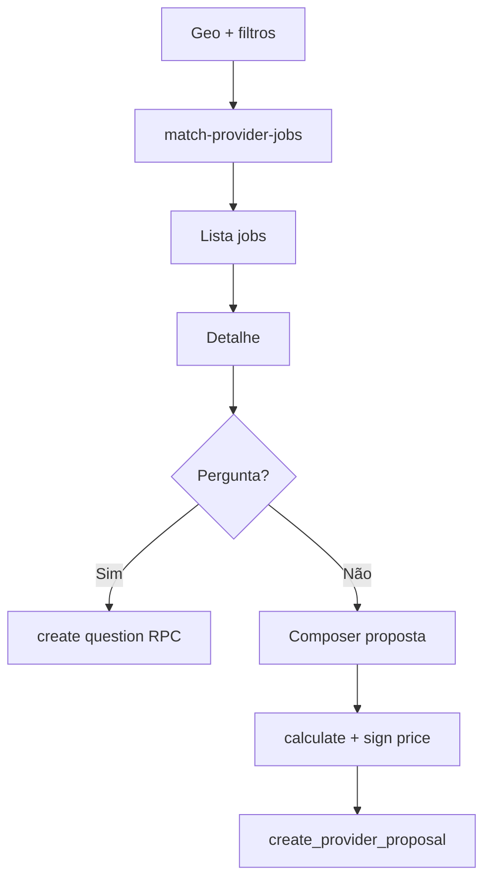

# Trabalhos, perguntas e propostas do prestador

## 1. Resumo executivo

- **O que é:** fluxo do **prestador** para **encontrar pedidos compatíveis**, ver **detalhe**, fazer **perguntas** ao cliente e **enviar proposta** com valores validados no servidor (incluindo assinatura de precificação).
- **Problema que resolve:** liquidez do marketplace (lado oferta).
- **Quem usa:** prestador autenticado.
- **Resultado esperado:** registro em `provider_proposals` e possivelmente perguntas em `provider_service_request_questions`.

## 2. Objetivo de negócio

- **Finalidade:** converter pedidos em receita para prestadores e em taxa para a plataforma.
- **Valor:** matching por serviço + geo + regras SQL.
- **Impacto:** altera status e dados de negociação visíveis ao cliente.
- **Contexto:** rota `/dashboard/jobs`.

## 3. Localização na plataforma

| Rota | Conteúdo |
|------|----------|
| `/dashboard/jobs` | Lista |
| `/dashboard/jobs/:jobId` | Detalhe |

`ProviderJobsShell`, `ProviderJobsRouteSlot`, `JobDetailPage`, componentes de filtros, perguntas e proposta.

## 4. Perfis envolvidos

- **Prestador:** único operador da UI.
- **Cliente:** recebe perguntas/propostas (outros módulos).

## 5. Fluxo funcional principal

1. App obtém geolocalização (quando aplicável) e chama Edge **`match-provider-jobs`** → RPC `match_provider_jobs`.
2. Lista pedidos com infinite scroll.
3. Abre detalhe (`jobId`).
4. Opcional: enviar pergunta (eligibility via RPC `can_provider_ask_question` / `create_provider_service_request_question`).
5. Montar proposta: valores, duração, slots — submit via `create_provider_proposal` com **assinatura de preço**.

## 6. Fluxos alternativos e exceções

- **Sem localização:** comportamento da API com parâmetros opcionais (ver `providerJobs.api.ts`).
- **Proposta rejeitada pelo RPC:** exibir erro de negócio.
- **Rate limit / auth:** Edge valida JWT de usuário.

## 7. Regras de negócio

1. Uma proposta “ativa” por par prestador+pedido exceto `withdrawn` (constraint índice).
2. `proposal_duration_unit` ∈ `hours`, `days`.
3. Slots: 1–3 itens; `shift` ∈ `morning`, `afternoon`, `full_day` (validação RPC em migration de harden).
4. `tax_rate` entre 0 e 1; valores positivos.
5. Taxa plataforma pode vir de `platform_constants` (ex.: `renovi_tax_provider`).

## 8. Campos e dados (proposta — modelo)

| Campo | Significado |
|-------|---------------|
| original_amount | Valor base informado |
| tax_rate | Percentual plataforma |
| final_amount / amounts derivados | Calculados via RPC `calculate_provider_service_pricing` |
| pricing_signature | Integridade HMAC |
| proposal_duration_value + unit | Prazo de execução |
| proposal_suggested_slots | Janelas sugeridas |
| status | Ciclo de vida da proposta |
| client_rejection_response | Obrigatório se rejected |

## 9. Validações de front-end

- Formulário de proposta: tipos numéricos, seleção de slots, UX de loading.
- Pergunta: não vazio, limites se houver.

## 10. Validações de back-end

- `create_provider_proposal`, `calculate_provider_service_pricing`, `generate_provider_pricing_signature`.
- Eligibility de pergunta: `can_provider_ask_question`, `create_provider_service_request_question`.
- RPC `match_provider_jobs` parâmetros: raio, `sort_mode`, paginação.

## 11. Status, estados e transições

- Proposta: `submitted` → `accepted` | `rejected` | `withdrawn`.
- Pedido: permanece com seus próprios status — interação indireta.

## 12. Persistência

- `provider_proposals`, `provider_service_request_questions`, leitura de `service_requests`.
- Imagens de proposta: bucket `provider-proposals` (políticas na migration).

## 13. Integrações

- **Edge Function** `match-provider-jobs`.
- RPCs Postgres para proposta e preço.

## 14. Listagens, buscas e filtros

- Filtro por serviço, raio, modo de ordenação (`sort_mode`).
- Paginação / infinite query.

## 15. Ações disponíveis

| Ação | Quem | Pré-condição | Efeito |
|------|------|--------------|--------|
| Listar jobs | Prestador | Sessão, parâmetros geo | Lista oportunidades |
| Perguntar | Prestador | `can_provider_ask_question` true | Nova pergunta |
| Enviar proposta | Prestador | Dados válidos + assinatura | Proposta `submitted` |
| Retirar proposta | Prestador | **Evidência parcial:** ver UI/API se expõe `withdrawn` |

## 16. Dependências

- Prestador deve ter **serviços ofertados** e **área de atuação** configurados em `my-account` para matching efetivo (**comportamento inferido** do modelo de dados).

## 17. Regras implícitas

- Função Edge usa `invoke` com sessão — utilizador deve ser o prestador autenticado.

## 18. Riscos

- Complexidade de precificação e assinatura dificulta suporte sem ferramentas admin.
- Algoritmo de sort/geo pode mudar sem aviso visual ao usuário.

## 19. Evidências

- `src/features/provider-jobs/`
- `supabase/functions/match-provider-jobs/index.ts`
- `supabase/migrations/20260318200001_match_provider_jobs_rpc.sql`
- `supabase/migrations/20260320110000_harden_provider_proposal_pricing_signature.sql`
- `supabase/migrations/20260318200000_create_provider_proposals.sql`

## 20. Pendências

- Documentar UI completa para **withdrawn** e edição de proposta (se existir).
- Explicar em linguagem de negócio cada `sort_mode` aceito pelo RPC.
