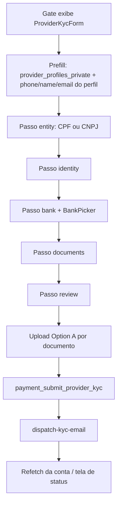

# Formulário de credenciamento (wizard KYC) — Fase 3

## 1. Resumo executivo

- **O que é:** wizard multi-etapas embutido em `ProviderKycForm` para o prestador enviar identidade, dados bancários e documentos de onboarding NetCred.
- **Problema que resolve:** coletar dados de PF/PJ e arquivos de forma guiada (em vez de um único formulário monolítico), com pré-preenchimento e rastreio de funil.
- **Quem usa:** prestador autenticado, quando o gate exibe o formulário (`PENDING_DOCUMENTS` / conta ausente, ou reenvio após `REJECTED`).
- **Resultado esperado:** uploads no bucket `provider-kyc-documents`, RPC `payment_submit_provider_kyc` com campos de identidade, e Edge `dispatch-kyc-email` quando aplicável.

## 2. Objetivo de negócio

- Credenciar o prestador para receber pagamentos (split NetCred).
- Reduzir erro de preenchimento com passos validados e seletor de bancos brasileiros (códigos FEBRABAN).
- Permitir reenvio após rejeição usando o mesmo wizard.

## 3. Localização na plataforma

| Aspecto | Detalhe |
|---------|---------|
| Módulo | `provider-kyc` |
| Host | `ProviderKycGate` renderiza `ProviderKycForm` (não há rota dedicada) |
| Orquestração | Hook `useProviderKycWizard` + UI `ProviderKycWizardStepContent` / `BankPicker` |
| Dependências | `auth` (id, e-mail, telefone, nome do perfil); RPCs/storage de pagamentos; Edge `dispatch-kyc-email` |

## 4. Perfis envolvidos

| Papel | Acesso |
|-------|--------|
| Prestador | Preenche e envia o wizard quando o gate libera o formulário |
| Cliente | Não vê este fluxo |
| Visitante | Sem acesso |

## 5. Fluxo funcional principal

Passos fixos (`KYC_WIZARD_STEPS`): **entity → identity → bank → documents → review**.

Labels na UI: “Tipo de cadastro”, “Dados pessoais”, “Dados bancários”, “Documentos”, “Revisão”. Progresso: “Passo N de 5”. Título: “Credenciamento de pagamentos”.

## 6. Fluxos alternativos e exceções

- **Voltar:** botão “Voltar” limpa erros de passo/envio e decrementa o índice (campos permanecem montados — valores preservados).
- **Validação de passo:** “Continuar” só avança se o schema Zod do passo atual passar; mensagem de erro no rodapé / nos campos.
- **Falha de upload:** interrompe o envio; evento `provider_kyc_submit_failed`.
- **Falha de submit:** mensagem ao usuário; evento `provider_kyc_submit_failed`. Código `INVALID_ONBOARDING_STATE` no submit não aborta antes do dispatch de e-mail (comportamento do hook `useDispatchKyc`).
- **Reenvio pós-rejeição:** mesmo `ProviderKycForm` aberto pelo CTA “Reenviar documentos” no gate.

## 7. Regras de negócio (UI / contrato front)

1. Tipo de entidade no form: `CPF` ou `CNPJ`; na RPC vira `p_entity_type` **`pf`** | **`pj`** (`toRpcEntityType`).
2. PF: documentos obrigatórios `identity` + `address-proof`.
3. PJ: além dos de PF, `corporate-charter` e **`legal-rep-id`** (chave de storage; não usar `legal-rep-doc`).
4. Banco: código FEBRABAN via `BankPicker` (lista da BrasilAPI `/banks/v1`, com fallback no JSON local e overrides de nome amigáveis); agência só dígitos (sem dígito verificador no campo); conta com dígito; PIX opcional.
5. Upload Option A: criar sessão → upload no storage → registrar path → URL assinada.
6. Prefill: dados de `provider_profiles_private`; telefone/nome/e-mail vêm do perfil/conta passados pelo gate (`defaultPhone`, `defaultFullName`, `accountEmail`).

## 8. Campos e dados da feature

### Passo entity

| Campo | Label / UI | Obrigatório | Observação |
|-------|------------|-------------|------------|
| entityType | Cartões Pessoa física (CPF) / Pessoa jurídica (CNPJ) | Sim | Default `CPF` |

### Passo identity

| Campo | Label típica | PF | PJ | Validação |
|-------|--------------|----|----|-----------|
| fullName | Nome completo | Sim | Sim | min 3 |
| document | CPF / CNPJ | Sim | Sim | `validateCPF` / `validateCNPJ` + máscaras |
| phone | Telefone | Sim | Sim | min 10; máscara |
| email | E-mail | Sim | Sim | e-mail; pré-preenchido com e-mail da conta |
| razaoSocial | Razão social | — | Sim | min 3 |
| nomeFantasia | Nome fantasia | — | Sim | min 2 |
| legalRepFullName | Nome do representante | — | Sim | min 3 |
| legalRepCpf | CPF do representante | — | Sim | CPF válido |
| legalRepPhone | Telefone do representante | — | Sim | min 10 |

### Passo bank

| Campo | Label | Obrigatório | Regra |
|-------|-------|-------------|-------|
| bankInstitutionCode | Banco (`BankPicker`) | Sim | Lista FEBRABAN (BrasilAPI + fallback local); busca local por nome/código |
| bankBranch | Agência | Sim | Só números |
| bankAccount | Conta com dígito | Sim | min 1 |
| pixKey | Chave PIX | Não | Opcional |

### Passo documents (arquivos)

| Campo form | Chave de upload (`documentKey`) | PF | PJ | Label UI |
|------------|----------------------------------|----|----|----------|
| identityDoc | `identity` | Sim | Sim | Documento de identidade (CPF/CNH) |
| addressProofDoc | `address-proof` | Sim | Sim | Comprovante de endereço |
| corporateCharterDoc | `corporate-charter` | — | Sim | Contrato social |
| legalRepDoc | **`legal-rep-id`** | — | Sim | Documento do representante legal |

Arquivos: PDF/JPEG/PNG/WebP/HEIC/HEIF; até **50 MB** (`KYC_DOCUMENT_MAX_BYTES`). Path: `providers/{providerId}/kyc/{documentKey}/document.{ext}` no bucket `provider-kyc-documents`.

### Passo review

Resumo somente leitura (tipo, nome, documento, telefone, e-mail, dados PJ se houver, banco, agência/conta, PIX se houver, nomes dos arquivos). Botão **Enviar**.

### Prefill (`fetchProviderPrivateProfileForKyc`)

Lê `provider_profiles_private`: `entity_type` (`pf`/`pj` → CPF/CNPJ), `cpf`/`cnpj`, banco, PIX, razão social, nome fantasia, representante. Não sobrescreve telefone/nome/e-mail vindos do perfil da sessão.

## 9. Validações de front-end

- Schemas Zod por passo + schemas completos `providerKycCpfSchema` / `providerKycCnpjSchema` no submit (`providerKyc.validation.ts`).
- `validateKycDocumentFile` no upload (tipo MIME + tamanho).

## 10. Validações de back-end

- RPCs `payment_create_provider_kyc_upload_session`, `payment_register_provider_kyc_upload_path`, `payment_submit_provider_kyc` (SECURITY DEFINER / RLS conforme migrations).
- Edge `dispatch-kyc-email` após submit bem-sucedido (ou estado `INVALID_ONBOARDING_STATE` tratado no hook).

Detalhe de cobrança / `ACTIVE`: [checkout-e-cobranca](../../payments/features/checkout-e-cobranca.md#prestador-kyc--onboarding-netcred).

## 11. Status, estados e transições

O wizard em si não altera status além do submit. Após sucesso, o gate refetcha a conta; tipicamente segue para “Enviando credenciamento…” / “Documentos enviados” conforme `DOCUMENTS_SUBMITTED` e `email_dispatched_at` — ver [gate-e-acesso-operacional](./gate-e-acesso-operacional.md).

**Reenvio após rejeição:** a FSM de `provider_gateway_accounts` permite **`REJECTED` → `DOCUMENTS_SUBMITTED`**. O CTA “Reenviar documentos” reabre o mesmo wizard; o submit RPC aceita prestadores em `REJECTED` / `PENDING_DOCUMENTS` (bloqueia estados como `ACTIVE`, `SUSPENDED`, `UNDER_NETCRED_REVIEW`, `DOCUMENTS_SUBMITTED` já em andamento).

## 12. Persistência e ciclo de vida

| Artefato | Uso |
|----------|-----|
| Storage `provider-kyc-documents` | Arquivos do KYC |
| `provider_kyc_upload_sessions` | Option A: create → upload → register path; status `pending` → `linked` no submit |
| Janitor `payment_janitor_orphan_kyc_documents` | Expira sessões pendentes e remove objetos órfãos do bucket (cron `cron_payment_janitor_orphan_kyc_documents`) |
| `provider_profiles_private` | Prefill e persistência de identidade/banco via submit (upsert — fonte única) |
| `provider_gateway_accounts` | Conta NetCred / `onboarding_status` após submit |

## 13. Integrações e efeitos externos

| Integração | Papel |
|------------|-------|
| `payment_create_provider_kyc_upload_session` | Cria sessão; retorna `upload_session_id` + `storage_path_prefix` |
| Storage upload | Grava arquivo no path do prestador |
| `payment_register_provider_kyc_upload_path` | Associa path à sessão |
| Signed URL | Expiração 7 dias (`KYC_DOCUMENT_SIGNED_URL_EXPIRY_SEC`) — usada no payload do dispatch de e-mail |
| `payment_submit_provider_kyc` | Persiste identidade (`p_entity_type`, `p_document`, `p_full_name`, `p_phone`, campos PJ) + banco + paths em **`provider_profiles_private`** (fonte única; sem tabela de submissions) |
| `dispatch-kyc-email` | Disparo / retry do e-mail operacional de credenciamento (default `credenciamento@renovi.com.br`; env `NETCRED_CREDENCIAMENTO_EMAIL`) |
| BrasilAPI `/banks/v1` | Catálogo de bancos do `BankPicker` (fallback JSON local se a API falhar) |

## 14. Listagens, buscas e filtros

- Fonte da lista: `fetchBrazilianBanks` (BrasilAPI `https://brasilapi.com.br/api/banks/v1`) via hook `useBrazilianBanks`; em qualquer falha, fallback **lazy** para `brazilianBanksDefault.json` (`loadBrazilianBanksFallback` — o JSON não entra no chunk inicial se a API responder).
- Normalização: exclui entradas sem código FEBRABAN útil (`code` null ou ≤ 0); códigos com `padStart(3)` (ex.: 1 → `"001"`); nomes amigáveis via `BRAZILIAN_BANK_NAME_OVERRIDES` (ex.: 260 → “Nubank”).
- `BankPicker` / `filterBrazilianBanks`: filtro **local** case-insensitive por nome ou código sobre a lista já carregada (a busca do picker não chama a API a cada tecla).

## 15. Ações disponíveis

| Ação | Quem | Pré-condição | Resultado |
|------|------|--------------|-----------|
| Continuar | Prestador | Passo válido | Avança o wizard |
| Voltar | Prestador | Não é o 1º passo | Retrocede |
| Enviar | Prestador | Review; schemas completos | Uploads + submit + dispatch |
| Reabrir formulário | Prestador rejeitado | CTA no gate | Mesmo wizard |

## 16. Dependências

- Consome: `auth`, `provider_profiles_private`, RPCs/storage/Edge de pagamentos.
- Alimenta: onboarding NetCred; gate passa a mostrar telas de status pós-envio.
- Host: [gate-e-acesso-operacional](./gate-e-acesso-operacional.md).

## 17. Regras implícitas

- Analytics: `entity_type` nos eventos é **`pf`** | **`pj`** (não CPF/CNPJ).
- Campos do form ficam montados em todos os passos (`hidden` quando inativos) para não perder valores no React Hook Form.
- E-mail no form é o da conta; não há fluxo de troca de e-mail neste wizard.

## 18. Analytics e observabilidade

| Evento GA (`trackEvent`) | Quando | Props |
|--------------------------|--------|-------|
| `provider_kyc_step_viewed` | Ao exibir cada passo | `step`, `entity_type` (`pf`/`pj`) |
| `provider_kyc_submitted` | Submit + dispatch OK | `step: "review"`, `entity_type` |
| `provider_kyc_submit_failed` | Falha de upload/submit/dispatch | `step: "review"`, `entity_type` |

Breadcrumbs Sentry: `provider_kyc.step_viewed`, `provider_kyc.submit_started`, `provider_kyc.submit_succeeded`, `provider_kyc.submit_failed`.

## 19. Evidências no código

- `src/features/provider-kyc/hooks/useProviderKycWizard.ts`
- `src/features/provider-kyc/components/ProviderKycForm.tsx`
- `src/features/provider-kyc/components/ProviderKycWizardStepContent.tsx`
- `src/features/provider-kyc/components/BankPicker.tsx`
- `src/features/provider-kyc/hooks/useBrazilianBanks.ts`
- `src/features/provider-kyc/api/brazilianBanks.api.ts`
- `src/features/provider-kyc/constants/brazilianBanks.ts` (overrides, mapeamento, fallback)
- `src/features/provider-kyc/constants/brazilianBanksDefault.json`
- `src/features/provider-kyc/types/providerKyc.validation.ts`
- `src/features/provider-kyc/api/kyc.api.ts` (`uploadKycDocument`, `submitProviderKyc`, `fetchProviderPrivateProfileForKyc`)
- `src/features/provider-kyc/api/providerKyc.rpc.ts`
- `src/features/provider-kyc/hooks/useDispatchKyc.ts`
- `src/features/provider-kyc/components/ProviderKycGate.tsx` (host do formulário)

## 20. Pendências para validação com negócio/produto

- ~~Lista FEBRABAN curada (subconjunto)~~ **Resolvido:** catálogo via BrasilAPI + fallback JSON local e overrides de nome.

## 21. Atualização de auditoria (2026-08-02)

- Revalidado sem drift: passos `KYC_WIZARD_STEPS` = entity → identity → bank → documents → review; labels e regras PF/PJ/`legal-rep-id` alinhados ao código.