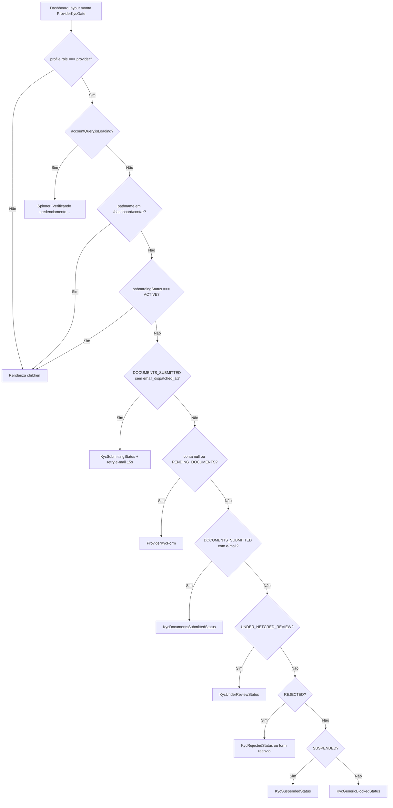
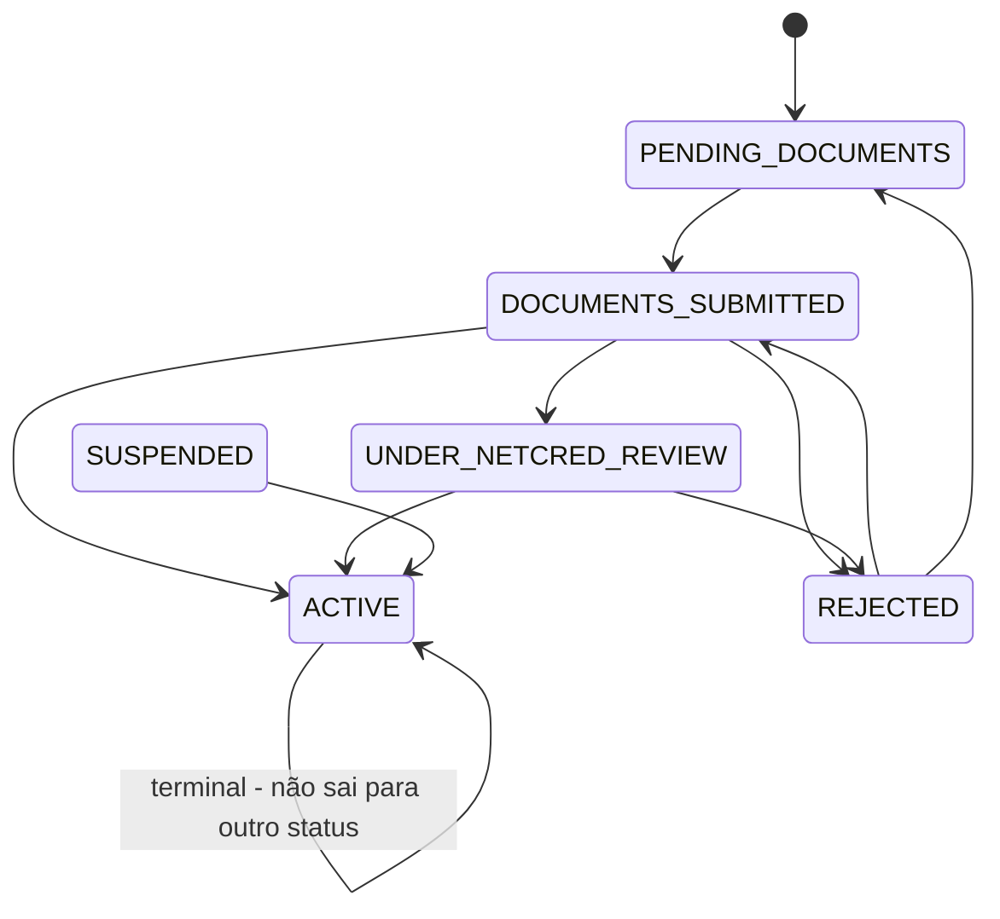

# Gate de KYC — acesso operacional do prestador

## 1. Resumo executivo

- **O que é:** barreira de UI no `DashboardLayout` que substitui o conteúdo operacional do prestador (slots persistentes + `<Outlet />`) por telas de status ou pelo wizard de credenciamento, enquanto a conta NetCred não estiver `ACTIVE`.
- **Problema que resolve:** impedir uso de trabalhos, serviços, conversas, ganhos e demais áreas do painel antes do credenciamento de pagamentos; manter **Minha conta** (logout) acessível.
- **Quem usa:** prestador autenticado (`profiles.role === provider`). Cliente passa pelo componente sem efeito.
- **Resultado esperado:** com `onboarding_status === ACTIVE`, children do gate renderizam normalmente; caso contrário, UI de status/wizard + menu reduzido a Minha conta.

## 2. Objetivo de negócio

- **Finalidade:** só prestadores com onboarding NetCred **ativo** operam o shell do dashboard.
- **Valor:** alinha UX ao requisito de cobrança/split (sem `ACTIVE` não há operação comercial plena); evita confusão com menus operacionais antes do KYC.
- **Impacto se falhar / indisponível:** prestador não-`ACTIVE` veria slots e rotas operacionais; ou, se a query da conta falhar, o gate trata `data` ausente como “sem conta” e exibe o formulário (ver §17).
- **Não é:** cadastro/auth (`/cadastro/profissional`); nem o detalhe campo a campo do wizard — ver [formulário-credenciamento-wizard](./formulario-credenciamento-wizard.md).

## 3. Localização na plataforma

| Aspecto | Detalhe |
|---------|---------|
| Módulo | `provider-kyc` |
| Entry point | `ProviderKycGate` em `DashboardLayout` envolvendo slots do prestador + outlet |
| Rota dedicada | **Nenhuma** — embutido no layout do dashboard |
| Allowlist | `PROVIDER_KYC_ALLOWED_PATH_PREFIX = "/dashboard/conta"` (pathname igual ou prefixo `/dashboard/conta/…`) |
| Menu | `useProviderKycNavItems` filtra `allItems` / `mainItems` do `getDashboardMenu` |
| Query params / deep link | **Nenhum** específico do gate |
| Public API | `ProviderKycGate`, `useProviderKycNavItems`, `useProviderPaymentAccount`, helpers de status em `@/features/provider-kyc` |

**Dentro do gate:** `ProviderJobsPersistentSlot`, `ProviderMyServicesPersistentSlot`, `<Outlet />` (com ou sem `MobileStackTransition`).

**Fora do gate (mesmo `main`):** `ClientMyServicesPersistentSlot`, `ServiceDetailSheet` (fluxo cliente).

## 4. Perfis envolvidos

| Papel | Comportamento |
|-------|---------------|
| Prestador | Gate ativo; query da conta habilitada; nav pode reduzir a Minha conta |
| Cliente | `ProviderKycGate` devolve `children` imediatamente; `useProviderPaymentAccount(false)` no nav |
| Visitante | Sem dashboard autenticado (guards de `auth` — fora deste doc) |
| Admin / outros | Mesmo caminho do cliente no gate se `role !== "provider"` |

**Guards de rota:** `ProtectedRoute` **não** substitui o gate. Rotas como `/dashboard/jobs` continuam declaradas; o conteúdo operacional é substituído pelas UIs de KYC quando bloqueado.

## 5. Fluxo funcional principal

Em paralelo, `useProviderKycNavItems`: se prestador e (`isLoading` **ou** `shouldBlockProviderForKyc`), menu = só itens com `path === "/dashboard/conta"`.

## 6. Fluxos alternativos e exceções

| Cenário | Comportamento observado |
|---------|-------------------------|
| Path `/dashboard/conta` ou `/dashboard/conta/…` após loading | Children liberados mesmo se status ≠ `ACTIVE` (ex.: `SUSPENDED`) |
| Loading da conta | Spinner **antes** da allowlist — Minha conta também fica temporariamente sob o spinner |
| Conta ainda inexistente (`data === null`) | Tratado como pendente → `ProviderKycForm` |
| `REJECTED` + CTA “Reenviar documentos” | Estado local `showRejectedForm`; reabre o wizard; após submit chama `refetch` e limpa o flag |
| `DOCUMENTS_SUBMITTED` sem `emailDispatchedAt` | Tela “Enviando…” + `useRetryKycEmailDispatch(true)` (intervalo 15 s, `retry_only: true`) |
| Status desconhecido ≠ `ACTIVE` | `KycGenericBlockedStatus` (“Credenciamento necessário”) |
| Cliente no mesmo layout | Gate transparent; slots de prestador tipicamente não aplicáveis ao papel |
| Polling 5 s / 30 s | Ver §11 / §12 — enquanto status aguarda parceiro/e-mail |

## 7. Regras de negócio

1. **Escopo do bloqueio:** só `role === "provider"`.
2. **Critério de liberação operacional:** `isProviderCredentialed` ⇔ `account?.onboardingStatus === "ACTIVE"`.
3. **Critério de bloqueio (nav + helpers):** `shouldBlockProviderForKyc` ⇔ `!account` **ou** `onboardingStatus !== "ACTIVE"`.
4. **Allowlist:** pathname `=== "/dashboard/conta"` ou `startsWith("/dashboard/conta/")`.
5. **Ordem de decisão no gate:** não-provider → loading → allowlist → ACTIVE → submitting → pending/null → documents submitted → under review → rejected → suspended → genérico.
6. **Submitting:** `DOCUMENTS_SUBMITTED` **e** `emailDispatchedAt` nulo/ausente.
7. **Documents submitted (UI “enviados”):** `DOCUMENTS_SUBMITTED` **e** `emailDispatchedAt` truthy.
8. **Pending / form:** conta null **ou** `PENDING_DOCUMENTS`.
9. **Menu reduzido também durante loading** da conta (mesmo critério de `blocked` no nav).
10. **Host do wizard:** `ProviderKycForm` recebe `providerId`, `accountEmail`, `defaultPhone`, `defaultFullName`, `onSubmitted` → `accountQuery.refetch()`.
11. **Suporte nas telas de status:** CTA “Falar com suporte” via `PROVIDER_KYC_SUPPORT_URL` (`VITE_MAIN_SITE_URL` + `/suporte`); se vazio, fallback `href="/dashboard/help"`.
12. **Submitting sem CTA de suporte:** `KycSubmittingStatus` usa `showSupportCta={false}`.

## 8. Campos e dados

### Conta lida pelo gate (`ProviderPaymentAccount`)

| Campo (TS) | Coluna | Uso no gate |
|------------|--------|-------------|
| `id` | `id` | Identidade da conta |
| `onboardingStatus` | `onboarding_status` | Roteamento de UI / bloqueio |
| `emailDispatchedAt` | `email_dispatched_at` | Distingue submitting vs. “documentos enviados” |
| `onboardingSubmittedAt` | `onboarding_submitted_at` | Carregado; **não** usado nas condições do gate |

Filtro da query: `provider_id` = usuário logado, `gateway_slug = "netcred"`, `maybeSingle()`.

### Props passadas ao wizard (quando o gate o monta)

| Prop | Origem |
|------|--------|
| `providerId` | `user.id` |
| `accountEmail` | `user.email ?? ""` |
| `defaultPhone` | `profile.phone` |
| `defaultFullName` | `profile.full_name` |
| `onSubmitted` | `refetch` da query (+ reset de `showRejectedForm` no reenvio) |

### Copy das telas de status (UI)

| Componente | Título | Corpo (resumo) | Ação extra |
|------------|--------|----------------|------------|
| Loading (inline) | — | “Verificando credenciamento…” | — |
| `KycSubmittingStatus` | Enviando credenciamento… | Finalizando envio; deixar tela aberta | Spinner; sem suporte |
| `KycDocumentsSubmittedStatus` | Documentos enviados | Encaminhado ao parceiro; pode usar Minha conta | Suporte |
| `KycUnderReviewStatus` | Credenciamento em análise | Pode levar dias úteis | Suporte |
| `KycRejectedStatus` | Credenciamento não aprovado | Revisar e reenviar ou suporte | **Reenviar documentos** + suporte |
| `KycSuspendedStatus` | Conta suspensa | Acesso a oportunidades bloqueado; contato suporte | Suporte |
| `KycGenericBlockedStatus` | Credenciamento necessário | Precisa estar ativo; suporte se erro | Suporte |

## 9. Validações de front-end

- O **gate em si** não valida formulário: apenas escolhe UI por status/path/loading.
- Validação de campos, uploads e schemas Zod pertencem ao wizard — [formulário-credenciamento-wizard](./formulario-credenciamento-wizard.md).
- Layout de status: `role="status"`; links de suporte `target="_blank"` `rel="noopener noreferrer"`.

## 10. Validações de back-end (leitura e side effects do gate)

| Peça | Evidência | Papel para o gate |
|------|-----------|-------------------|
| `fetchProviderPaymentAccount` | SELECT em `provider_gateway_accounts` | Fonte de status; erro → `logger.error` + `{ data: null, error }`; o hook **lança** se `error`, deixando React Query em erro (ver §17) |
| FSM `onboarding_status` | Trigger na migration `20260801060000_create_provider_gateway_accounts.sql` | Transições permitidas (ex.: `REJECTED` → `DOCUMENTS_SUBMITTED` / `PENDING_DOCUMENTS`; `ACTIVE` terminal para saída; `SUSPENDED` ↔ `ACTIVE`) |
| `retryProviderKycEmailDispatch` | Edge `dispatch-kyc-email` com `{ retry_only: true }` | Retry enquanto submitting; invalida query se `emailDispatched` |
| Submit / upload / detect | RPCs `payment_*`, Edge `detect-netcred-onboarding` | **Fora do escopo profundo deste doc** — ver payments + wizard |

**Evidência parcial:** políticas RLS exatas da tabela não detalhadas aqui; o front assume leitura autenticada do próprio `provider_id`.

## 11. Status, estados e transições

### Helpers de UI (front)

| Helper | Condição |
|--------|----------|
| `shouldBlockProviderForKyc` | `!account \|\| status !== "ACTIVE"` |
| `isProviderCredentialed` | `status === "ACTIVE"` |
| `isProviderKycPending` | `!account \|\| PENDING_DOCUMENTS` |
| `isProviderKycSubmitting` | `DOCUMENTS_SUBMITTED && !emailDispatchedAt` |
| `isProviderKycDocumentsSubmitted` | `DOCUMENTS_SUBMITTED && emailDispatchedAt` |
| `isProviderKycAwaitingReview` | `UNDER_NETCRED_REVIEW` |
| `isProviderKycRejected` | `REJECTED` |
| `isProviderKycSuspended` | `SUSPENDED` |

### FSM no banco (resumo verificável na migration)

- `ACTIVE` exige (no trigger) ids NetCred de company e bank account preenchidos ao entrar em `ACTIVE`.
- UI de “submitting” é um **sub-estado de front** de `DOCUMENTS_SUBMITTED` baseado em `email_dispatched_at`, não um valor distinto do enum.

### Polling (transições observadas sem reload)

| Estado da conta em cache | `refetchInterval` |
|--------------------------|-------------------|
| `DOCUMENTS_SUBMITTED` sem e-mail | 5 000 ms |
| `DOCUMENTS_SUBMITTED` com e-mail **ou** `UNDER_NETCRED_REVIEW` | 30 000 ms |
| Demais / sem conta | `false` |

`staleTime`: 10 000 ms. Query key: `["provider-payment-account", providerId]`.

## 12. Persistência

| Camada | O quê |
|--------|--------|
| Servidor | Linha `provider_gateway_accounts` (gateway `netcred`) |
| Cliente | Cache React Query (`PROVIDER_PAYMENT_ACCOUNT_QUERY_KEY`); **sem** Preferences/local draft no gate |
| Estado efêmero UI | `showRejectedForm` em `useState` no gate (perde no unmount) |
| Retry e-mail | Mutation + `invalidateQueries` no sucesso com `emailDispatched` |

## 13. Integrações

| Integração | Papel no gate |
|------------|---------------|
| `auth` (`useAuth`) | `role`, `user`, `profile` |
| `DashboardLayout` | Hospeda gate e consome nav filtrada |
| `my-account` | Allowlist — logout e ajustes |
| Wizard (`ProviderKycForm`) | Coleta/reenvio — [formulário-credenciamento-wizard](./formulario-credenciamento-wizard.md) |
| Edge `dispatch-kyc-email` | Retry via `useRetryKycEmailDispatch` |
| payments / NetCred | Conta, submit, cron `detect-netcred-onboarding`, cobrança exige `ACTIVE` — [checkout-e-cobranca](../../payments/features/checkout-e-cobranca.md) |
| Message Dispatcher | Eventos de catálogo (notificação pós-transição de status) |

### Notificações MMD (prestador) — catálogo referido

| Evento | Template (ex.) | Observação |
|--------|----------------|------------|
| `PROVIDER_KYC_SUBMITTED` | `account.provider_kyc_submitted` | Catálogo de pagamentos |
| `PROVIDER_ONBOARDING_UNDER_REVIEW` | `account.provider_kyc_under_review` | Análise NetCred |
| `PROVIDER_KYC_REJECTED` | `account.provider_kyc_rejected` | UI permite reenvio |
| `PROVIDER_ACTIVATED` | `account.provider_activated` | Cron de ativação |
| `PROVIDER_SUSPENDED` | `account.provider_suspended` (+ variantes) | Já no catálogo |

Evidência: migrations `payment_mmd_notification_catalog`, `provider_activated_mmd_notification`; testes `payment_mmd_notification_catalog_test.sql`. O **gate não dispara** MMD diretamente — só reflete estado.

## 14. Listagens, buscas, filtros, paginação, ordenação

**Não aplicável** a esta feature: não há listagem, busca, filtro de grade nem paginação. A “filtragem” existente é só a **redução do menu** a Minha conta e a **seleção de tela de status** por campos da conta.

## 15. Ações disponíveis

| Ação | Quem | Pré-condição | Resultado | Erro / limite |
|------|------|--------------|-----------|---------------|
| Ver conteúdo operacional | Prestador | `ACTIVE` (e não loading) | Children (slots + outlet) | — |
| Acessar Minha conta | Prestador bloqueado | Path allowlist **após** loading | Children da conta | Durante loading: spinner |
| Preencher/enviar KYC | Prestador | Pending / null / reenvio rejeitado | Wizard; refetch após submit | Detalhe no wizard |
| Reenviar documentos | Prestador `REJECTED` | CTA na tela de rejeição | Abre wizard (`showRejectedForm`) | Estado local |
| Falar com suporte | Prestador em status screens | CTA padrão (exceto submitting) | Abre URL suporte (nova aba) | Fallback `/dashboard/help` se env vazio |
| Retry dispatch e-mail | Sistema (hook) | Submitting e não loading | Mutation `retry_only`; invalida conta se disparado | Log `retry_dispatch_kyc_email_failed`; não bloqueia UI |
| Navegar só Minha conta | Prestador bloqueado/loading | Nav filtrada | Desktop + bottom nav só conta | Deep link manual a `/dashboard/jobs` ainda cai no gate (tela KYC), não no jobs |

## 16. Dependências

| Dependência | Tipo |
|-------------|------|
| `auth` | Sessão / perfil |
| `dashboard-shell` (`DashboardLayout`, `dashboardMenu`) | Hospedeiro |
| `my-account` | Allowlist de rota |
| Wizard interno do mesmo módulo | Host do form |
| `payments` / Supabase | Conta NetCred, RPCs, Edge, FSM |
| `message-dispatcher` | Notificações (indireto) |
| React Query | Cache e polling |
| Lucide + UI Button | Telas de status |

**Não depende de:** listagens de jobs/services para decidir o bloqueio — só da conta gateway.

## 17. Regras implícitas

1. **Loading precede allowlist:** em `ProviderKycGate`, o spinner roda antes do check de `/dashboard/conta*`.
2. **Erro na fetch:** o hook `throw`s em `result.error`; com query em erro e sem `data`, o gate usa `account = null` → caminho do formulário (comportamento de “sem conta”), **não** uma tela de erro dedicada.
3. **Slots do prestador vs. cliente:** mesmo com gate bloqueando o outlet do prestador, `ClientMyServicesPersistentSlot` e o sheet de detalhe ficam **fora** do gate.
4. **Dois consumidores da mesma query:** gate e `useProviderKycNavItems` chamam `useProviderPaymentAccount` — compartilham cache pela query key.
5. **Retry de e-mail a cada 15 s** (independente do polling de 5 s da conta) enquanto `isSubmitting && !isLoading`.
6. **Guard de rota ≠ gate:** URL operacional permanece válida; conteúdo é mascarado.
7. **`onboardingSubmittedAt` não participa** da árvore de decisão do gate.
8. **Reenvio rejeitado:** ao submeter com sucesso no form pós-rejeição, o gate zera `showRejectedForm` antes/junto do refetch — se o status ainda for `REJECTED` momentaneamente, volta à tela de rejeição até o refetch refletir o novo status.

## 18. Riscos

| Risco | Detalhe |
|-------|---------|
| Falha de leitura da conta | Pode empurrar o prestador para o wizard como se não houvesse conta |
| Deep link operacional | Usuário bloqueado ainda “entra” na rota, mas vê KYC — pode confundir QA/analytics de página |
| Janela de loading | Conta/logout inacessíveis até terminar o primeiro fetch |
| Estado `showRejectedForm` | Perde-se em remount; não há deep link “modo reenvio” |
| Divergência menu × URL | Menu só conta, mas URL pode ser `/dashboard/...` com UI KYC |
| Dependência de env | Suporte sem `VITE_MAIN_SITE_URL` cai em `/dashboard/help` (rota placeholder do shell) |

## 19. Evidências

| Path | Papel |
|------|-------|
| `src/features/provider-kyc/components/ProviderKycGate.tsx` | Decisão de UI / allowlist / host do form |
| `src/features/provider-kyc/components/status/*` | Telas de status + `KycStatusLayout` |
| `src/features/provider-kyc/hooks/useProviderPaymentAccount.ts` | Query, polling, staleTime |
| `src/features/provider-kyc/hooks/useProviderKycNavItems.ts` | Filtro de menu |
| `src/features/provider-kyc/hooks/useRetryKycEmailDispatch.ts` | Retry 15 s |
| `src/features/provider-kyc/api/kyc.api.ts` | Fetch conta, helpers de status, retry Edge |
| `src/features/provider-kyc/api/providerKyc.rpc.ts` | Nomes RPC/Edge |
| `src/features/provider-kyc/constants/kyc.constants.ts` | Allowlist, support URL, bucket (wizard) |
| `src/features/provider-kyc/index.ts` | Public API |
| `src/layouts/DashboardLayout/DashboardLayout.tsx` | Integração gate + nav |
| `src/layouts/DashboardLayout/dashboardMenu.ts` | Item Minha conta `/dashboard/conta` |
| `src/features/provider-kyc/components/__tests__/ProviderKycGate.test.tsx` | Status, allowlist, nested conta, reenvio |
| `src/features/provider-kyc/hooks/__tests__/useProviderKycNavItems.test.tsx` | Menu reduzido |
| `src/features/provider-kyc/hooks/__tests__/useProviderPaymentAccount.test.tsx` | Polling |
| `supabase/migrations/20260801060000_create_provider_gateway_accounts.sql` | FSM |
| Docs relacionados | [formulário-credenciamento-wizard](./formulario-credenciamento-wizard.md), [checkout-e-cobranca](../../payments/features/checkout-e-cobranca.md), [placeholders-e-menu](../../dashboard-shell/features/placeholders-e-menu.md) |

## 20. Pendências

| Item | Status |
|------|--------|
| Detalhe campo a campo do wizard | **Fora deste doc** — [formulário-credenciamento-wizard](./formulario-credenciamento-wizard.md) |
| Matriz RLS completa de `provider_gateway_accounts` | **Evidência parcial** — não expandida aqui |
| Tela de erro dedicada quando `fetchProviderPaymentAccount` falha | **Lacuna de produto/UI** — hoje cai no caminho “sem conta” / form |
| Analytics GA específicos do gate (abertura de status, etc.) | **Não evidenciado** neste escopo de front do gate |

---

## Anexo A — Checklist de cenários de QA

- [ ] Cliente: dashboard operacional sem spinner/KYC do gate.
- [ ] Prestador `ACTIVE`: slots + outlet + menu completo (incl. Trabalhos, Ganhos, Ajuda).
- [ ] Prestador sem conta / `PENDING_DOCUMENTS`: formulário; menu só Minha conta.
- [ ] Prestador `DOCUMENTS_SUBMITTED` sem e-mail: “Enviando…”; retry ativo; sem CTA suporte.
- [ ] Prestador `DOCUMENTS_SUBMITTED` com e-mail: “Documentos enviados”; polling 30 s.
- [ ] Prestador `UNDER_NETCRED_REVIEW`: “em análise”; polling 30 s.
- [ ] Prestador `REJECTED`: tela + “Reenviar documentos” abre form; pós-submit refetch.
- [ ] Prestador `SUSPENDED`: “Conta suspensa”; em `/dashboard/conta` conteúdo da conta visível.
- [ ] Path aninhado `/dashboard/conta/...` liberado com status bloqueante.
- [ ] Durante loading inicial: spinner mesmo em intenção de abrir conta.
- [ ] Deep link `/dashboard/jobs` com KYC pendente: UI KYC, não lista de trabalhos.
- [ ] Status desconhecido: “Credenciamento necessário”.

## Anexo B — Matriz status → UI (atalho)

| `onboarding_status` + flags | UI no gate (fora de conta*) |
|-----------------------------|------------------------------|
| (loading) | Spinner verificação |
| null / `PENDING_DOCUMENTS` | Wizard |
| `DOCUMENTS_SUBMITTED`, sem e-mail | Submitting + retry |
| `DOCUMENTS_SUBMITTED`, com e-mail | Documents submitted |
| `UNDER_NETCRED_REVIEW` | Under review |
| `REJECTED` | Rejected (± form) |
| `SUSPENDED` | Suspended |
| `ACTIVE` | Children |
| Outro | Generic blocked |
