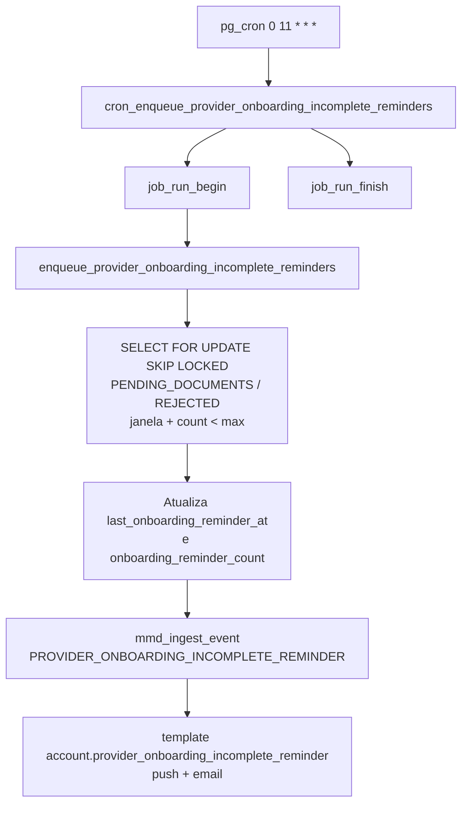

# Lembretes de credenciamento incompleto (NetCred)

## 1. Resumo executivo

- **O que é:** job diário (SQL + pg_cron) que envia **push + e-mail** via Message Dispatcher (MMD) ao prestador com onboarding NetCred ainda incompleto (`PENDING_DOCUMENTS` ou `REJECTED`).
- **Problema que resolve:** lembrar o prestador de concluir ou reenviar o credenciamento, sem depender de abrir o app.
- **Quem usa:** prestadores com linha em `provider_gateway_accounts` (gateway `netcred`) nos status elegíveis; ops observam via `job_runs`.
- **Resultado esperado:** até **8** lembretes por conta gateway, com 1º após **24 h** da criação da conta e seguintes a cada **72 h**; deep link `/dashboard/conta`; **sem** `bypass_limits` (quota/cooldown do MMD aplicam).

## 2. Objetivo de negócio

- Reduzir abandono do KYC antes de `ACTIVE`.
- Manter o nudge **moderado** (limites de contagem/intervalo + quotas MMD), não spam crítico.
- Garantir que todo prestador tenha stub de conta gateway cedo o bastante para o cron ter um caminho único de claim.

## 3. Localização na plataforma

| Aspecto | Detalhe |
|---------|---------|
| Módulo | `provider-kyc` (comportamento de produto); execução **só backend** (sem UI dedicada) |
| Entry point | `cron_enqueue_provider_onboarding_incomplete_reminders` → `enqueue_provider_onboarding_incomplete_reminders` |
| Cron | pg_cron job `enqueue_provider_onboarding_incomplete_reminders`, schedule `0 11 * * *` (11:00 UTC; após `detect-netcred-onboarding` às 10:00) |
| Rota / deep link | Template usa `deep_link_path` = `/dashboard/conta` (allowlist do gate) |
| Edge Function | **Nenhuma** — claim + `mmd_ingest_event` em SQL |

## 4. Perfis envolvidos

| Papel | Comportamento |
|-------|---------------|
| Prestador | Destinatário dos canais push + e-mail; abre deep link em Minha conta / fluxo KYC |
| Cliente | Não recebe este evento |
| `service_role` / `postgres` | Executam a RPC de enqueue e o wrapper de cron |
| Ops | Telemetria em `job_runs` (`job_name` = `enqueue_provider_onboarding_incomplete_reminders`) |

## 5. Fluxo funcional principal

## 6. Fluxos alternativos e exceções

| Cenário | Comportamento |
|---------|---------------|
| Já existe dispatch com idempotency do reminder N (push) | Contadores alinhados se necessário; linha **skipped** (não re-ingere) |
| Update de claim falha (status mudou / race) | **skipped** |
| `mmd_ingest_event` com `ingested_count` = 0 | **skipped** |
| Erro por linha no loop | Conta em `error_count`; log; demais linhas seguem |
| Status saiu de `PENDING_DOCUMENTS`/`REJECTED` | Fora do filtro — sem novo lembrete |
| `onboarding_reminder_count` ≥ max | Fora do filtro |

## 7. Regras de negócio

1. **Candidatos:** somente `onboarding_status ∈ {PENDING_DOCUMENTS, REJECTED}`.
2. **Não candidatos:** `DOCUMENTS_SUBMITTED`, `UNDER_NETCRED_REVIEW`, `ACTIVE`, `SUSPENDED` (e demais fora do filtro).
3. **1º lembrete:** `last_onboarding_reminder_at IS NULL` **e** `now() >= created_at + initial_hours` (default 24).
4. **Seguintes:** `last_onboarding_reminder_at IS NOT NULL` **e** `now() >= last_onboarding_reminder_at + interval_hours` (default 72).
5. **Teto:** `onboarding_reminder_count < max_count` (default 8).
6. **Batch:** até `provider_onboarding_reminder_batch_size` (default 100; parâmetro da RPC limitado a 1–500).
7. **Idempotência:** chave `provider_onboarding_incomplete:{account_id}:reminder:{n}` (+ sufixo de canal no MMD).
8. **MMD:** evento `PROVIDER_ONBOARDING_INCOMPLETE_REMINDER` → template `account.provider_onboarding_incomplete_reminder`; canais **push** e **email**; `bypass_limits` **false** em ambos.
9. **Bootstrap:** ao virar `profiles.role = provider`, trigger cria stub `provider_gateway_accounts` (`document = ''`, `PENDING_DOCUMENTS`) se ainda não existir linha netcred.

## 8. Campos e dados

### Conta gateway (contadores de nudge)

| Coluna | Uso |
|--------|-----|
| `onboarding_reminder_count` | Quantos lembretes já enfileirados (default 0, ≥ 0) |
| `last_onboarding_reminder_at` | Timestamp do último enqueue de nudge |
| `created_at` | Âncora do 1º lembrete quando ainda não houve nudge |
| `onboarding_status` | Filtro de elegibilidade |

### Constantes de plataforma

| Chave | Default | Significado |
|-------|---------|-------------|
| `provider_onboarding_reminder_batch_size` | 100 | Máx. contas claimed por tick |
| `provider_onboarding_reminder_initial_hours` | 24 | Horas após `created_at` até o 1º nudge |
| `provider_onboarding_reminder_interval_hours` | 72 | Intervalo entre nudges seguintes |
| `provider_onboarding_reminder_max_count` | 8 | Máximo de nudges por conta |

### Payload MMD (variáveis / metadata)

| Campo | Valor típico |
|-------|----------------|
| `provider_id` | Destinatário |
| `provider_gateway_account_id` | Conta gateway |
| `onboarding_status` | Status no claim |
| `reminder_count` | Contagem após o tick (`n`) |
| `deep_link_path` | `/dashboard/conta` |
| metadata `recipient` | `provider` |

## 9. Validações de front-end

**Não aplicável** — não há tela ou hook de UI deste cron. O deep link cai no shell (allowlist `/dashboard/conta*` + UIs do gate/wizard).

## 10. Validações de back-end

| Peça | Papel |
|------|-------|
| Índice parcial `provider_gateway_accounts_onboarding_reminder_due_idx` | Hot path: só `PENDING_DOCUMENTS` / `REJECTED`, ordenado por `coalesce(last_onboarding_reminder_at, created_at), id` |
| `FOR UPDATE … SKIP LOCKED` | Claim concorrente seguro |
| Re-check de status no `UPDATE` | Evita nudge se status mudou entre select e update |
| Grants | Enqueue: `service_role`, `postgres`; cron wrapper: `postgres` |
| `job_runs` | Telemetria do wrapper de cron (padrão de product cron) |

## 11. Status, estados e transições

- O cron **não altera** `onboarding_status`.
- Só incrementa `onboarding_reminder_count` e atualiza `last_onboarding_reminder_at`.
- Prestador que avança para `DOCUMENTS_SUBMITTED` / análise / `ACTIVE` deixa de ser candidato automaticamente.
- `REJECTED` continua elegível (incentivo a reenvio via wizard).

## 12. Persistência

| Camada | Artefato |
|--------|----------|
| Conta | `provider_gateway_accounts` (contadores + status) |
| Fila MMD | `message_dispatcher.message_dispatches` (idempotency por reminder N + canal) |
| Telemetria job | `job_runs` |
| Constantes | `platform_constants` |

## 13. Integrações

| Integração | Papel |
|------------|-------|
| **message-dispatcher** | `mmd_ingest_event` → push + e-mail; quotas aplicam (sem bypass) |
| **Gate / my-account** | Deep link `/dashboard/conta` (conteúdo liberado pela allowlist) |
| **detect-netcred-onboarding** | Cron distinto (10:00 UTC); este job roda 11:00 UTC |
| Trigger `trg_profiles_bootstrap_provider_gateway_account` | Stub `PENDING_DOCUMENTS` quando role vira provider |
| Catálogo MMD | Seeds em `payment_mmd_notification_catalog`; rota do evento em `mmd_ingest_event` (`mmd_service_auto_completed` e correlatas) |

### Copy do template (catálogo)

| Canal | Assunto / título | Corpo (resumo) |
|-------|------------------|----------------|
| push | Complete seu credenciamento | Falta pouco para liberar oportunidades e receber pagamentos… |
| email | Complete seu credenciamento na Prestway | Ainda não concluiu o credenciamento… link “Completar credenciamento” |

## 14. Listagens, buscas, filtros, paginação, ordenação

Batch interno (não é listagem de produto):

- Filtro: status + janela temporal + `count < max`.
- Ordenação: `coalesce(last_onboarding_reminder_at, created_at), id`.
- Limite: batch size (constante / parâmetro).

## 15. Ações disponíveis

| Ação | Quem | Pré-condição | Resultado |
|------|------|--------------|-----------|
| Enfileirar lembretes | Cron / `service_role` | Contas due | Push+email MMD; contadores atualizados |
| Abrir deep link | Prestador | Recebeu notificação | `/dashboard/conta` → fluxo KYC do gate |
| Concluir / reenviar KYC | Prestador | Wizard | Sai da elegibilidade ao mudar de status |

## 16. Dependências

- `provider_gateway_accounts` + FSM de onboarding.
- `platform_constants`.
- `mmd_ingest_event` / templates ativos.
- pg_cron + `job_runs`.
- Perfis `provider` (bootstrap trigger).

## 17. Regras implícitas

1. SQL-only: sem I/O externo no enqueue (envio fica no worker MMD).
2. Contagem é por **conta gateway**, não por “sessão de app”.
3. Quiet hours do MMD ainda podem reagendar entrega (bypass de quiet hours é do pipeline MMD, distinto do `bypass_limits` do evento — este evento nasce **sem** bypass de quota).
4. Seed local: prestador seed fica `ACTIVE` (delete+insert) para não receber nudges de stub incompleto.

## 18. Riscos

| Risco | Detalhe |
|-------|---------|
| Quota MMD | Sem bypass, nudge pode ir a `FAILED_TERMINAL` por quota diária |
| Prestador só e-mail / sem push | Um canal pode falhar; o outro ainda tenta |
| Stub `document=''` | Conta existe cedo; gate trata `PENDING_DOCUMENTS` como wizard |
| Teto de 8 | Após o máximo, silêncio até mudança manual/ops |

## 19. Evidências

| Path | Papel |
|------|-------|
| `supabase/migrations/20260810162641_provider_onboarding_incomplete_reminders.sql` | Enqueue, cron, schedule |
| `supabase/migrations/20260801060000_create_provider_gateway_accounts.sql` | Colunas, índice parcial, trigger bootstrap |
| `supabase/migrations/20260801020000_payment_platform_constants_seeds.sql` | Constantes de reminder |
| `supabase/migrations/20260801750000_payment_mmd_notification_catalog.sql` | Template push+email |
| `supabase/migrations/20260804420000_mmd_service_auto_completed.sql` | Rota `PROVIDER_ONBOARDING_INCOMPLETE_REMINDER` (sem bypass) |
| `supabase/tests/payments/payment_provider_onboarding_incomplete_reminders_test.sql` | pgTAP |
| `supabase/seed.sql` | Prestador seed em `ACTIVE` (evita stub incompleto) |

## 20. Pendências

| Item | Status |
|------|--------|
| UI dedicada de “histórico de lembretes” | **Não existe** no produto (não é gap do cron) |
| Ajuste fino de copy / frequência com negócio | Operacional via `platform_constants` |

## Anexo A — Checklist QA / ops

- [ ] Conta `PENDING_DOCUMENTS` com `created_at` há ≥24h e count 0 → 1º enqueue.
- [ ] Após 72h do último nudge e count &lt; 8 → novo enqueue.
- [ ] `DOCUMENTS_SUBMITTED` / `UNDER_NETCRED_REVIEW` / `ACTIVE` / `SUSPENDED` → não entram no batch.
- [ ] `REJECTED` elegível nas mesmas janelas.
- [ ] Deep link `/dashboard/conta`.
- [ ] Cron `0 11 * * *` e linha em `job_runs`.
- [ ] Sem `bypass_limits` no evento (push e email).
