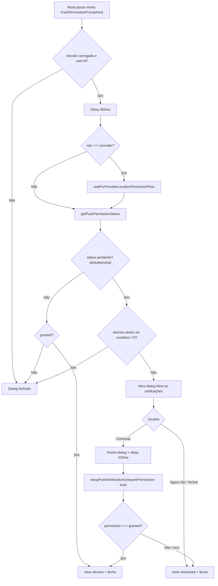

# Prompt explicativo de push e cooldown

## 1. Resumo executivo

- **O que é:** dialog in-app que explica o valor das notificações Prestway e, se o usuário continuar, dispara o pedido de permissão do **sistema** (OS ou navegador), com **cooldown de 7 dias** após dispensa/negativa/falha.
- **Problema que resolve:** browsers/OS costumam exigir gesto do usuário e rejeitam pedido automático; o soft prompt educa e concentra o pedido no botão “Continuar”.
- **Quem usa:** usuário autenticado com permissão ainda pendente.
- **Resultado esperado:** permissão `granted` (e registro de push via `setupPushNotifications`) **ou** dismiss persistido até o cooldown expirar.

## 2. Objetivo de negócio

- **Finalidade:** obter consentimento consciente para push, alinhado a avisos de orçamento, oportunidade, proposta e atualização de pedido (textos no copy).
- **Valor operacional:** menos “denied” silencioso por auto-request; melhor taxa de opt-in em web e nativo.
- **Impacto se falhar:** usuário autenticado pode permanecer sem token FCM utilizável; Message Dispatcher não entrega push a dispositivos sem beacon/`push_enabled` adequado (**efeito colateral em outros módulos**).
- **Contexto:** peça de shell global (não amarrada a uma rota de dashboard).

## 3. Localização na plataforma

| Aspecto | Detalhe |
|---------|---------|
| Módulo | `push-permission` |
| Entry point | `PushPermissionPromptHost` montado em `RootLayout` (todas as rotas sob o layout raiz) |
| Rota dedicada | **Nenhuma** |
| Menu / deep link | **Nenhum** |
| Query params | **Nenhum** |
| Public API | `export { PushPermissionPromptHost }` em `src/features/push-permission/index.ts` |

## 4. Perfis envolvidos

| Papel | Acesso / operação |
|-------|-------------------|
| Cliente | Soft prompt + copy específica; sem espera de localização |
| Prestador | Soft prompt **depois** do fluxo de localização (quando esse fluxo inicia); copy específica |
| Admin / role ausente | Soft prompt + copy genérica |
| Não logado | Não avalia / não abre |

**Visibilidade:** UI global sobre o conteúdo da rota atual; não há listagem filtrada por RLS neste módulo.

## 5. Fluxo funcional principal



## 6. Fluxos alternativos e exceções

| Cenário | Comportamento observado no código |
|---------|-----------------------------------|
| Sessão ainda carregando (`loadingSession`) | Não agenda avaliação; mantém fechado |
| Usuário faz logout | Fecha dialog; não lê status |
| Permissão já `denied` / `unsupported` | Não abre; **não** limpa dismiss se não for `granted` |
| Soft prompt ainda em cooldown | Status pendente, mas `isPushPermissionPromptDismissed` → não abre |
| Prestador: fluxo de localização em andamento | Aguarda `markProviderLocationPermissionFlowComplete` (ou retorna imediato se fluxo nunca iniciou / já completo) |
| “Continuar” e OS nega | `markPushPermissionPromptDismissed` |
| Exceção em `setupPushNotifications` | `logger.warn('push_permission_request_failed', …)` + mark dismissed |
| Fechar dialog enquanto `requesting` | `onOpenChange(false)` **não** chama dismiss se `requesting` (evita dismiss duplo durante o pedido) |

## 7. Regras de negócio

1. **Pré-condição de sessão:** só avalia com `user.id` e `!loadingSession`.
2. **Delay de abertura:** `PROMPT_OPEN_DELAY_MS = 600` antes de `evaluatePrompt`.
3. **Pendência de permissão:** `isPushPermissionPending` é verdadeiro apenas para `default` e `prompt`.
4. **Cooldown de dismiss:** `PUSH_PERMISSION_PROMPT_DISMISS_COOLDOWN_MS = 7 * 24 * 60 * 60 * 1000` (7 dias) a partir do ISO em Preferences.
5. **Marcar dismiss:** “Agora não”, fechar (X / overlay quando não requesting), permissão ≠ `granted` após request, ou erro no request.
6. **Limpar dismiss:** quando status já é `granted` na avaliação, ou quando o request resulta em `granted`.
7. **Gesto obrigatório para pedir ao sistema:** aceite chama `setupPushNotifications(undefined, { requestPermission: true })` após `DISMISS_BEFORE_SYSTEM_PROMPT_MS = 320`.
8. **Copy por papel:** `client` / `provider` / fallback (`admin`, `null`, etc.) via `getPushPermissionCopy`.
9. **Ordem prestador:** localização (quando iniciada) **antes** do soft prompt de push.
10. **Ordem vs avaliação pendente:** ao terminar a avaliação do soft prompt (abriu/fechou ou não abriu), `markPushPermissionPromptFlowComplete` libera o prompt de avaliação pendente (`service-completion`) — que **aguarda** este fluxo e nunca compete com o dialog de push.
11. **Timestamp inválido ou erro de leitura Preferences:** trata como **não** dismissed (pode reabrir o soft prompt).

## 8. Campos e dados da feature

### Dialog (UI)

| Elemento | Conteúdo / origem | Editável |
|----------|-------------------|----------|
| Título | “Ative as notificações” | Não (fixo) |
| Benefícios | `getPushPermissionCopy(userRole).benefits` | Não (por papel) |
| Texto sistema | Explica que o aparelho/navegador pedirá permissão e que dá para mudar depois | Não |
| CTA secundário | “Agora não” | — |
| CTA primário | “Continuar” / “Ativando…” + spinner se `requesting` | — |

### Persistência local

| Chave | Tipo | Significado |
|-------|------|-------------|
| `orbit_push_permission_prompt_dismissed_at` | string ISO | Início da janela de cooldown do soft prompt |

Não há formulário com campos de input do usuário além das ações do dialog.

## 9. Validações de front-end

- Sem schema Zod; decisões booleanas/async no hook.
- Botões desabilitados enquanto `requesting`.
- Dialog mobile: `useMobileDialogViewport` + `ShellDialogContent`.

## 10. Validações de back-end

- **Nenhuma** neste módulo (sem RPC, RLS ou Edge própria).
- Persistência de permissão/token FCM ocorre em camadas externas (`@/lib/push` → beacon / backend de dispositivos), não documentadas como regras deste arquivo além da chamada de setup.

## 11. Status, estados e transições

### Soft prompt (UI)

| Estado | Significado |
|--------|-------------|
| `open = false` | Não exibido |
| `open = true` | Dialog explicativo visível |
| `requesting = true` | Pedido de permissão em curso (dialog já fechado tipicamente) |

### Permissão (sistema / lib)

| Status | Soft prompt |
|--------|-------------|
| `default` / `prompt` | Elegível (se fora do cooldown) |
| `granted` | Não abre; limpa cooldown |
| `denied` / `unsupported` | Não abre |

### Cooldown

```
nunca dismissed  →  elegível
dismissed_at recente (< 7d)  →  bloqueado
dismissed_at antigo (≥ 7d)  →  elegível de novo (se ainda pendente no OS)
clear / granted  →  elegível limpo
```

## 12. Persistência e ciclo de vida

| Camada | O quê |
|--------|--------|
| Capacitor Preferences | `orbit_push_permission_prompt_dismissed_at` via `preferencesGet/Set/Remove` |
| Memória React | `open`, `requesting`, `userRole` no hook |
| Servidor | Sem entidade do módulo |

**Ciclo:** mark no dismiss → isDismissed true por 7 dias → após expirar, soft prompt pode voltar se OS ainda pendente → clear quando `granted`.

## 13. Integrações e efeitos externos

| Integração | Efeito |
|------------|--------|
| `@/lib/push.getPushPermissionStatus` | Nativo: `checkNativeNotificationPermission` (Android LocalNotifications.display; iOS PushNotifications.receive). Web: `Notification.permission` se Firebase configurado; senão `unsupported` |
| `@/lib/push.setupPushNotifications(..., { requestPermission: true })` | Solicita permissão e tenta obter token (FCM nativo/web) |
| `DeviceBeaconProvider` | Em paralelo no layout: `setupPushNotifications(..., { requestPermission: false })` e sync de beacon ao mudar estado de registro |
| `appOpenOverlaySequence` | Serializa overlays na abertura: localização (prestador) → push → avaliação pendente (cliente) |
| Logger / Sentry (via logger) | Warn em falha do request |
| Message Dispatcher | **Não chamado** por este módulo |
| `notifications.recordPushClick` | **Não chamado** por este módulo (usado em `@/lib/push` no open/click de notificação) |

### Capacitor / PWA (evidência)

- **Nativo:** permissão e setup via plugins Capacitor (`@capacitor/push-notifications`, `@capacitor/local-notifications`).
- **Web/PWA:** API `Notification` + Firebase Messaging + service worker (`PWABadge` registra SW no root); soft prompt existe para evitar `requestPermission` automático no load.

## 14. Listagens, buscas e filtros

- **Não aplicável** — sem listagem, busca, paginação ou filtros.

## 15. Ações disponíveis

| Ação | Quem | Pré-condição | Resultado | Erro / efeito |
|------|------|--------------|-----------|---------------|
| Abrir soft prompt (automático) | Sistema | Auth + pendente + fora cooldown (+ sequência provider) | `open=true` | — |
| Agora não / Fechar | Usuário | Dialog aberto, não requesting | Fecha + mark dismissed | Cooldown 7d |
| Continuar | Usuário | Dialog aberto | Fecha, pede permissão OS | granted → clear; else mark dismissed |
| Avaliar após delay | Hook | user + sessão pronta | Abre ou não | — |

## 16. Dependências

| Depende de | Motivo |
|------------|--------|
| `auth` (`useAuth`) | user, profile.role, loadingSession |
| `@/lib/push` | Status e setup |
| `@/lib/capacitor/preferencesStorage` | Cooldown |
| `@/lib/appOpenOverlaySequence` | Ordem localização (prestador) → push → avaliação |
| UI shell (`Dialog`, `ShellDialogContent`, `Button`) | Apresentação |
| `device-beacon` (indireto) | Inicia/completa fluxo de localização; registra token sem pedir permissão |

**Alimenta (indireto):** possibilidade de token FCM → beacon `push_enabled` → elegibilidade de entrega no Message Dispatcher.

## 17. Regras implícitas

1. O soft prompt **não** reabre sozinho ao expirar o cooldown sem remount/reavaliação (reavaliação ligada a `user.id`, `loadingSession` e `evaluatePrompt`); tipicamente nova sessão/navegação com o host montado.
2. `waitForProviderLocationPermissionFlow` **não bloqueia** se o fluxo de localização **nunca** foi iniciado (`!flowStarted`) — clientes e prestadores sem start passam direto.
3. Copy menciona exemplos de negócio (orçamento, oportunidade, etc.) mas **não** lista templates MMD nem eventos de domínio.
4. Fechar pelo `onOpenChange` durante `requesting` não dispara `handleDismiss` (só quando `!next && !requesting`).
5. `DeviceBeaconProvider` envolve o host: setup silencioso e prompt soft podem coexistir; o pedido com gesto fica no soft prompt.

## 18. Riscos e pontos de atenção

- Usuário com `denied` no OS **não** vê soft prompt de novo; precisa mudar nas configurações do dispositivo/navegador (texto do dialog menciona isso, sem deep link para settings).
- Race/ordem com localização: se a sequência de localização falhar em marcar complete, push do prestador pode ficar esperando (**comportamento da lib de sequência**).
- Cooldown do soft prompt ≠ cooldown de envio do Message Dispatcher (1 min entre pushes no backend).
- Sem analytics de produto neste módulo para medir opt-in/dismiss.

## 19. Evidências no código

- `src/features/push-permission/hooks/usePushPermissionPrompt.ts`
- `src/features/push-permission/utils/pushPermissionPrompt.storage.ts`
- `src/features/push-permission/utils/pushPermissionCopy.ts`
- `src/features/push-permission/components/PushPermissionPromptHost.tsx`
- `src/features/push-permission/components/PushPermissionPromptDialog.tsx`
- `src/features/push-permission/index.ts`
- `src/layouts/RootLayout.tsx`
- `src/lib/push.ts` (`getPushPermissionStatus`, `isPushPermissionPending`, `setupPushNotifications`)
- `src/lib/nativeNotificationPermission.ts`
- `src/lib/appOpenOverlaySequence.ts`
- `src/features/device-beacon/components/DeviceBeaconProvider.tsx`
- `src/features/device-beacon/hooks/useLocationPermissionDialog.ts`
- Testes: `hooks/__tests__/usePushPermissionPrompt.test.tsx`, `utils/__tests__/pushPermissionPrompt.storage.test.ts`, `utils/__tests__/pushPermissionCopy.test.ts`, `components/__tests__/*`

## 20. Pendências para validação com negócio/produto

- Confirmar se **admin** deve receber soft prompt (hoje recebe copy genérica e mesma lógica).
- Confirmar se, após `denied` no OS, o produto quer algum CTA in-app para “abrir configurações” (hoje inexistente).
- Definir métricas de funil (exibir / Continuar / granted / dismiss) — código atual sem `trackEvent` neste módulo.
- Alinhar expectativa de negócio: soft prompt **não** garante entrega; entrega depende de Message Dispatcher + beacon.

## 21. Lacuna: ligação Message Dispatcher / notifications

| Elo | Evidência | Relação com `push-permission` |
|-----|-----------|-------------------------------|
| Soft prompt + request OS | Este módulo | Escopo direto |
| Token FCM / `push_enabled` no device beacon | `device-beacon` + `@/lib/push` | Indireta (mesmo layout; setup sem request no beacon) |
| Envio push (ingest, quota, quiet hours, FCM worker) | `docs/business/modulos/message-dispatcher/` | **Sem import** em `push-permission` |
| Clique em push → engagement | `src/features/notifications` (`recordPushClick` → RPC `message_dispatcher_record_push_click`); chamado a partir de `@/lib/push` | **Sem import** em `push-permission` |

**Conclusão (evidência):** `push-permission` cobre só **consentimento/explicação + pedido de permissão**. A documentação de negócio do Message Dispatcher e a feature `notifications` cobrem **entrega e engagement**. Não há contrato de código direto entre as pastas; a cadeia é operacional (permissão → token → dispatch → clique).

## 22. Checklist de cenários de QA

- [ ] Usuário logado, permissão `default`/`prompt`, sem dismiss → dialog abre após ~600 ms
- [ ] “Agora não” → fecha; reabrir app dentro de 7 dias → não reabre
- [ ] Após 7 dias, ainda pendente → pode reabrir
- [ ] “Continuar” + granted → não reabre; Preferences limpa dismiss
- [ ] “Continuar” + denied → mark dismiss; não reabre enquanto denied
- [ ] Erro no setup → warn + dismiss
- [ ] Sem login → nunca abre
- [ ] Prestador: localização em andamento → push só depois do complete
- [ ] Cliente: não chama wait de localização
- [ ] Ao concluir (abriu/fechou ou não abriu), marca fluxo de push completo (libera prompt de avaliação pendente)
- [ ] Copy client vs provider vs fallback (admin/null)
- [ ] Web sem Notification/Firebase → status unsupported → não abre
- [ ] Nativo Android/iOS: fluxo Continuar abre sheet do sistema (após ~320 ms)

## 23. Termos usados neste documento

| Termo | Significado neste módulo |
|-------|--------------------------|
| Soft prompt | Dialog in-app “Ative as notificações”, anterior ao pedido do OS |
| Cooldown de dismiss | 7 dias sem reexibir o soft prompt após dispensa/negativa/falha |
| Permissão pendente | Status `default` ou `prompt` |
| Pedido do sistema | `Notification.requestPermission` (web) ou plugins Capacitor (nativo), via `setupPushNotifications({ requestPermission: true })` |
| Sequência de overlays | Localização (prestador) → push → avaliação (`appOpenOverlaySequence`) |
| Fila de overlays | Localização → soft prompt push → prompt de avaliação pendente (último; `service-completion`) |
