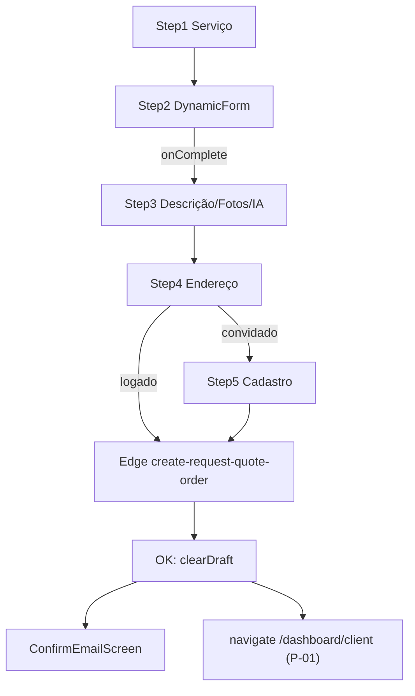

# Pedir orçamento (`request-quote`)

Canal principal de **entrada de pedidos** na plataforma. Wizard público em `/pedir-orcamento` que cria `service_requests` prontos para matching e orçamentos.

Detalhamento passo a passo, validações, analytics e matriz de lacunas: [features/pedir-orcamento.md](./features/pedir-orcamento.md).

---

## 1. Leitura para negócio

- **Para que serve:** visitante ou cliente monta o pedido (serviço, detalhes estruturados, descrição com IA opcional, fotos, endereço, identidade se necessário) e o backend cria **`service_requests`** com `status: "OPEN"`.
- **Quem usa:** visitantes e clientes; **não** é fluxo do prestador.
- **Processo suportado:** captação padronizada de demanda → matching ([matching-dispatch](../matching-dispatch/README.md)) → orçamentos / negociação.
- **Valor:** formulário versionado por serviço + metadados opcionais de IA + geolocalização via endereço; rascunho local reduz abandono.
- **Riscos operacionais:** abuso (rate limit + reCAPTCHA); **redirect pós-pedido logado** quebrado ([P-01](../../pendencias-e-incertezas.md)); **limite de foto** diverge entre cliente (10 MB) e servidor (5 MB).

---

## 2. Visão geral funcional

| Aspecto | Detalhe |
|---------|---------|
| **Objetivo** | Criar pedido aberto (`service_requests`) a partir do wizard |
| **Rota** | Pública `/pedir-orcamento` (`router.tsx`, lazy `RequestQuote`); query opcional `?serviceSlug=` (deep link; apaga rascunho) |
| **Passos** | **5** (convidado) ou **4** (logado — sem passo “Cadastro”) |
| **Criação** | POST multipart → Edge **`create-request-quote-order`** (`verify_jwt = false`; validação interna) |
| **IA** | Edge **`generate-smart-description`** (`verify_jwt = true`); disparo automático ao entrar no passo 3 vindo do passo 2 |
| **Rascunho** | Capacitor Preferences `renovi_request_quote_draft`, versão `REQUEST_QUOTE_DRAFT_VERSION`; sem PII do passo 5; debounce 400 ms |
| **Antes do POST** | reCAPTCHA ação `request_quote_submit` (script **pré-carregado no mount** do submit hook; token no submit); opcionalmente **nsfwjs** nas fotos |
| **Pós-sucesso** | Convidado → `ConfirmEmailScreen`; logado → toast + `navigate("/dashboard/client")` (**rota inexistente** — P-01) |
| **Limites** | Não cobre listagem/acompanhamento do pedido (ver [my-services](../my-services/README.md) / [view-services](../view-services/README.md)) |
| **Relação** | Consome `dynamic-form`, `addresses`, `auth`; alimenta matching via `OPEN` |

---

## 3. Features do módulo

| Feature | Resumo | Documento |
|---------|--------|-----------|
| Pedir orçamento (wizard) | Passos 1–5, IA, rascunho, multipart Edge, analytics, lacunas | [features/pedir-orcamento.md](./features/pedir-orcamento.md) |

Única feature de produto neste módulo; a Public API (`index.ts`) também reexporta helpers reutilizados por outros módulos (estilo de card, fotos de pedido, listagem de serviços).

---

## 4. Perfis envolvidos

| Perfil | Acesso |
|--------|--------|
| **Visitante** | Wizard completo (5 passos); signup inline no passo 5; pós-sucesso exige confirmação de e-mail (`ConfirmEmailScreen`) |
| **Cliente** (logado) | Wizard em 4 passos; submit no passo 4 (endereço); JWT no POST |
| **Prestador** | Não é público-alvo; pode chegar à rota se digitar URL, mas o fluxo de identidade é de cliente |
| **Admin** | Sem UI dedicada neste módulo |

Guarda de rota: **pública** (sem `ProtectedRoute`) — evidência em `src/router.tsx` e [perfis-e-permissoes](../../perfis-e-permissoes.md).

---

## 5. Principais fluxos

1. **Entrada:** `/pedir-orcamento` ou deep link `?serviceSlug=`; CTA em [my-services](../my-services/README.md) / [provider-profile](../provider-profile/README.md).
2. **Serviço → detalhes:** lista `platform_services` com `show_on_request_quote`; formulário dinâmico ativo schema v2.
3. **Descrição/fotos:** IA automática (condições em feature); fotos opcionais.
4. **Endereço:** logado = existente ou novo (submit imediato); convidado = só novo → passo 5.
5. **Identidade (convidado):** signup `client` + reCAPTCHA + POST com anon key.
6. **Saída:** pedido `OPEN` → bootstrap de matching; convidado aguarda e-mail; logado tenta ir a `/dashboard/client` (quebrado).

**Alternativos:** restauração de rascunho; login no meio do fluxo (passo 5 → força passo 4); e-mail já cadastrado → `/login`; rate limit 429; falha de fotos NSFW / tamanho.

Detalhe: [pedir-orcamento.md](./features/pedir-orcamento.md).

---

## 6. Regras transversais

- Serviços listados só com `show_on_request_quote = true`; formulário só se `form_status === 'active'` e schema JSON v2 válido.
- Pedido criado com **`status: "OPEN"`** (enum CNS) na Edge `createServiceRequest`.
- Rate limit Edge: **`RATE_LIMIT_PER_MINUTE = 10`** (`failClosed: true` no handler).
- reCAPTCHA obrigatório na ação **`request_quote_submit`** antes do POST; o script é pré-carregado no mount de `useRequestQuoteSubmit` (`preloadRecaptcha`), e o token é gerado no submit (`executeRecaptcha`).
- Fotos: cliente aceita até **10 MB**; Edge rejeita acima de **5 MB** e no máx. **10** fotos — mismatch documentado.
- Rascunho: **não** persiste fotos nem PII do passo 5; incrementar `REQUEST_QUOTE_DRAFT_VERSION` ao mudar shape persistido.
- Deep link `?serviceSlug=` **limpa** rascunho antes de pré-selecionar serviço.
- `create-request-quote-order` com `verify_jwt = false`; segurança via rate limit, reCAPTCHA e `validateRequestUser`.

---

## 7. Entidades

| Entidade / artefato | Função neste módulo |
|---------------------|---------------------|
| **`service_requests`** | Pedido criado (`OPEN`, formulário, descrição, structured IA, fotos, endereço) |
| **`platform_services`** | Catálogo do passo 1 (`show_on_request_quote`, hierarquia pai/filho) |
| **Formulários dinâmicos** | Schema vinculado ao serviço (`form_id`) — motor em [dynamic-form](../dynamic-form/README.md) |
| **`client_addresses`** | Endereço existente ou criado no passo 4 — [addresses](../addresses/README.md) |
| **`auth.users` / `profiles`** | Sessão logada ou signup convidado (`role: client`) |
| **Storage `service-requests`** | Upload de fotos na Edge |
| **Preferences `renovi_request_quote_draft`** | Rascunho local (Capacitor) |

---

## 8. Integrações

| Integração | Papel |
|------------|--------|
| **[dynamic-form](../dynamic-form/README.md)** | Motor do passo 2 (`DynamicForm`, `validateFormSchema`) |
| **[addresses](../addresses/README.md)** | Passo 4 (`AddressSelectionStep`, `addressFormSchema`) |
| **[auth](../auth/README.md)** | Sessão, signup inline, política de senha, redirect de e-mail |
| **Edge `create-request-quote-order`** | Ordem completa: rate limit, multipart, reCAPTCHA, usuário, endereço, fotos, insert pedido |
| **Edge `generate-smart-description`** | Descrição estruturada via `supabase.functions.invoke` |
| **reCAPTCHA / `verify-recaptcha`** | Pré-carga do script no mount do fluxo; token no submit; validação na Edge de pedido (função dedicada no ecossistema) |
| **[matching-dispatch](../matching-dispatch/README.md)** | Downstream: bootstrap no primeiro `OPEN` |
| **[my-services](../my-services/README.md)** | Upstream UX: CTA novo pedido; acompanhamento fora deste módulo |
| **Analytics / Sentry** | Funil `quote_request_*`, métricas `request_quote.order_created` / `smart_description_generated` |

### Edge Functions (referência)

- `supabase/functions/create-request-quote-order/` — rate limit, multipart, reCAPTCHA, usuário, endereço, fotos, insert `service_requests` com `status: "OPEN"`.
- `supabase/functions/generate-smart-description/` — corpo JSON; usada via `supabase.functions.invoke` no app.

### API pública do pacote (`index.ts`)

Exporta `RequestQuote`, `useServiceSchema`, `useServiceRequestPhotoUrls`, tipos de serviço/IA, `getServiceBySlug` / `getServiceById` / `listServicesForRequestQuote`, `getServiceCardStyle` / `SERVICE_COLOR_KEYS`, `getFormById`, `createServiceRequest`, `uploadPhotosForRequest`, `invokeGenerateSmartDescription`. Consumo externo típico: wizard; outros módulos importam estilo de card e helpers de fotos.

---

## 9. Riscos e lacunas

| ID / tema | Descrição |
|-----------|-----------|
| **[P-01](../../pendencias-e-incertezas.md)** | Pós-sucesso logado navega para `/dashboard/client` — rota **ausente** em `router.tsx`. Alinhar a `/dashboard`, `/dashboard/services` ou `getRedirectPath(profile)`. Confirmado em `useRequestQuoteSubmit.ts` (2026-08-02). |
| **Fotos** | Limite **10 MB** no front vs **5 MB** na Edge — usuário pode anexar e falhar no envio. |
| **JWT** | `create-request-quote-order` sem `verify_jwt`; mitigado por rate limit, reCAPTCHA e `validateRequestUser` — monitorar abuso. |

Detalhe e evidências de QA: [pedir-orcamento.md § lacunas](./features/pedir-orcamento.md).

---

## 10. Evidências

### Código da feature

| Área | Caminhos |
|------|----------|
| Página | `src/features/request-quote/components/RequestQuote/RequestQuote.tsx` |
| Passos | `Step1ServiceSelect.tsx`, `Step2ServiceForm.tsx`, `Step3DescriptionPhotos.tsx`, `Step5Identity.tsx` |
| Pós-envio convidado | `components/ConfirmEmailScreen/ConfirmEmailScreen.tsx` |
| Trust / social proof | `components/TrustSidebar.tsx` |
| Estado e fluxo | `hooks/useRequestQuoteState.ts`, `useRequestQuoteNavigation.ts`, `useRequestQuoteSubmit.ts`, `useRequestQuoteDraft.ts`, `useRequestQuoteServices.ts`, `useServiceSchema.ts`, `useGenerateSmartDescription.ts` |
| API | `api/createRequestQuoteOrder.api.ts`, `smartDescription.api.ts`, `services.api.ts`, `forms.api.ts`, `serviceRequests.api.ts` |
| Rascunho / fotos / IA | `utils/requestQuoteDraft.persistence.ts`, `requestQuoteDraftMeaningful.ts`, `photoContentCheck.ts`, `step3SmartDescriptionSnapshot.ts`, `stableStringify.ts`, `serviceSchemaFallbackMessages.ts`, `serviceCardStyle.ts` |
| Tipos / Public API | `types/request-quote.types.ts`, `index.ts` |
| Rota | `src/router.tsx` — path `pedir-orcamento` |

### Backend

| Área | Caminhos |
|------|----------|
| Edge pedido | `supabase/functions/create-request-quote-order/` (`constants.ts`, `createServiceRequest.ts`, `uploadPhotos.ts`, …) |
| Edge IA | `supabase/functions/generate-smart-description/` |
| Config JWT | `supabase/config.toml` — `[functions.create-request-quote-order]`, `[functions.generate-smart-description]` |

### Docs relacionadas

- Feature: [features/pedir-orcamento.md](./features/pedir-orcamento.md)
- Pendência: [P-01](../../pendencias-e-incertezas.md)
- Matriz: [matriz-cobertura-documental.md](../../matriz-cobertura-documental.md)
- Rastreio: [rastreabilidade.md](../../rastreabilidade.md)
