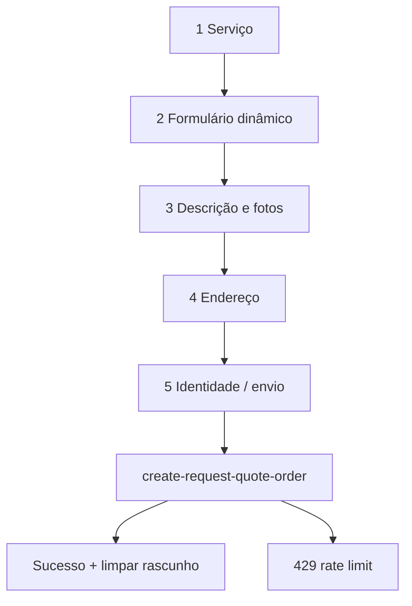

# Pedir orçamento (wizard público)

## 1. Resumo executivo

- **O que é:** wizard multi-etapa em **`/pedir-orcamento`** para criar um **`service_request`**: escolher **serviço**, preencher **formulário dinâmico**, **descrição e fotos** (com **IA opcional**), **endereço**, **identidade** (visitante ou logado) e enviar via Edge Function **`create-request-quote-order`**.
- **Problema que resolve:** captar demanda estruturada com antifraude (reCAPTCHA + rate limit).
- **Quem usa:** visitante ou cliente logado.
- **Resultado esperado:** pedido criado + endereço quando aplicável; visitante pode receber fluxo de **confirmação de e-mail**.

## 2. Objetivo de negócio

- **Finalidade:** gerar leads qualificados para prestadores.
- **Valor:** dados padronizados e georreferenciados.
- **Impacto:** alimenta `match_provider_jobs` e fluxos de orçamento.
- **Contexto:** topo do funil.

## 3. Localização na plataforma

| Etapa | Componente (referência) |
|-------|-------------------------|
| 1 | `Step1ServiceSelect` |
| 2 | `Step2ServiceForm` + `dynamic-form` |
| 3 | `Step3DescriptionPhotos` |
| 4 | `AddressSelectionStep` |
| 5 | `Step5Identity` / confirmação |

Rota: `/pedir-orcamento`. Página: `RequestQuote.tsx`.

## 4. Perfis envolvidos

- **Visitante:** fluxo completo com possível `signUp` e tela `ConfirmEmailScreen`.
- **Cliente logado:** envio com `user.id` + sessão.
- **Prestador:** **não é o público-alvo** do fluxo de pedido (**comportamento inferido**).

## 5. Fluxo funcional principal

## 6. Fluxos alternativos e exceções

- **Rascunho:** persistência local (`requestQuoteDraft.persistence`) — restauração ao voltar.
- **IA:** `invokeGenerateSmartDescription` — loading `generatingDescription`.
- **Fotos:** `checkPhotosContent` bloqueia envio se validação cliente falhar (mensagem `toast.error`).
- **reCAPTCHA:** falha ao obter token interrompe submit.
- **Pós-sucesso logado:** `navigate("/dashboard/client")` — **rota inexistente no router** (pendência P-01).

## 7. Regras de negócio

1. Serviço selecionado determina `form_id` / versão carregados.
2. `step2FormSchema` e `step2FormVersion` enviados ao servidor com `step2Data`.
3. Descrição pode ser enriquecida por structured data da IA (`step3Data.structured`).
4. Visitante: identidade compatível com `clientSignupIdentitySchema` e política de senha quando cria conta.
5. Edge Function `create-request-quote-order` opera com **`verify_jwt = false`** — validação interna + rate limit (`platform_rate_limits`).

## 8. Campos e dados

### Passo 3 (estado `step3Data`)

| Campo | Tipo | Obrigatório | Observação |
|-------|------|-------------|------------|
| description | string | Sim na prática de UX | Texto da necessidade |
| photos | File[] | Não | Upload após validação |
| suggestedTitle | string? | Não | Pode vir da IA |
| structured | objeto? | Não | Salvo em `service_requests` |

### Passo 4 — seleção de endereço

- Tipo `AddressSelection` — ver documento de endereços para campos de formulário.

### Passo 5 — identidade visitante

- Usa `ClientSignupIdentityData` / `defaultClientSignupIdentity` de `auth`.

**Evidência parcial:** todos os rótulos de UI por passo — extrair de cada `Step*.tsx` em auditoria futura.

## 9. Validações de front-end

- Formulário dinâmico: motor `dynamic-form`.
- Endereço: `addressFormSchema` quando modo formulário.
- Senha: `validatePasswordStrength` no fluxo convidado.
- Fotos: validação de conteúdo antes do POST.

## 10. Validações de back-end

- **create-request-quote-order:** parsing multipart, reCAPTCHA ação `request_quote_submit`, criação de endereço e `service_requests`, upload para storage `service-requests`.
- **Rate limit:** resposta 429 com `Retry-After` mapeada no cliente.

## 11. Status, estados e transições

- Pedido criado com `status` inicial conforme migration (tipicamente `open` — confirmar default no insert da função).
- Pós-criação visitante: `orderCreatedEmail` aciona `ConfirmEmailScreen`.

## 12. Persistência

- **`service_requests`** + **`client_addresses`** (quando aplicável).
- Storage **`service-requests`** para fotos.
- Rascunho apenas **local** (não é tabela).

## 13. Integrações e efeitos externos

| Integração | Quando |
|------------|--------|
| `verify-recaptcha` | Server-side na Edge de pedido |
| `generate-smart-description` | Usuário solicita IA no passo 3 |
| OpenAI / Gemini | Dentro da função de IA |
| Supabase Auth | Signup do visitante |
| Analytics/Sentry | Eventos de sucesso/falha no submit |

## 14. Listagens, buscas e filtros

- Passo 1: listagem de serviços para escolha (`listServicesForRequestQuote`).

## 15. Ações disponíveis

| Ação | Quem | Pré-condição | Efeito colateral |
|------|------|--------------|------------------|
| Gerar descrição IA | Usuário | Serviço + dados mínimos | Consumo de tokens registrado (`platform_ai_prompt_usage` — evidência em migrations de IA) |
| Enviar logado | Cliente | reCAPTCHA + validações | Navegação pós-sucesso |
| Enviar visitante | Visitante | Conta criada/autenticada conforme fluxo | E-mail confirmação |

## 16. Dependências

- `dynamic-form`, `addresses`, `auth`, APIs `services.api.ts`, `forms.api.ts`, `createRequestQuoteOrder.api.ts`.

## 17. Regras implícitas

- `clearDraft()` após sucesso evita reenvio acidental ao voltar no browser.

## 18. Riscos

- Redirect quebrado pós-sucesso.
- Função sem JWT exige monitoração de abuso (rate limit + recaptcha).

## 19. Evidências no código

- `src/features/request-quote/components/RequestQuote/RequestQuote.tsx`
- `src/features/request-quote/hooks/useRequestQuoteState.ts`, `useRequestQuoteSubmit.ts`
- `src/features/request-quote/api/createRequestQuoteOrder.api.ts`, `smartDescription.api.ts`
- `supabase/functions/create-request-quote-order/index.ts`
- `supabase/functions/generate-smart-description/index.ts`
- `src/lib/recaptcha.ts`
- `src/router.tsx`

## 20. Pendências para validação com negócio/produto

- Corrigir navegação pós-pedido para rota válida (`/dashboard/requests` ou `/dashboard`).
- Confirmar copy e requisitos legais do fluxo de visitante (LGPD, termos).
- Auditar limites de tamanho/número de fotos na Edge Function.
