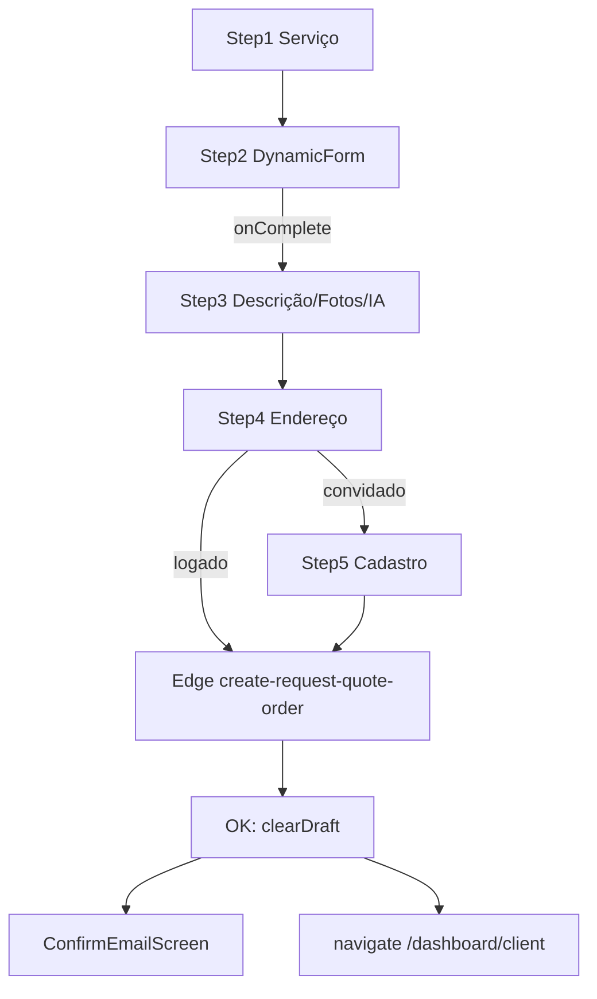

# Pedir orçamento (wizard público)

Documentação baseada em `src/features/request-quote/`, Edge Functions `create-request-quote-order` e `generate-smart-description`, e integrações com `dynamic-form`, `addresses` e `auth`.

---

## 1. Visão geral

| Item | Descrição |
|------|-----------|
| **Objetivo** | Captar demanda: criar **`service_requests`** com formulário dinâmico, descrição (IA opcional), fotos, endereço e identidade (visitante com cadastro inline ou cliente logado). |
| **Rota** | **`/pedir-orcamento`** — componente `RequestQuote` (`router.tsx`, lazy). |
| **Query string** | **`?serviceSlug=<slug>`** — deep link: após carregar serviços, seleciona automaticamente o serviço cujo `slug` coincide; **rascunho local é apagado** ao entrar com esse parâmetro (`useRequestQuoteDraft`). |
| **Quem usa** | Visitante (cadastro no fluxo) ou **cliente** logado. Prestador não é público-alvo do pedido. |
| **Pós-sucesso visitante** | Tela **`ConfirmEmailScreen`** (confirmação de e-mail obrigatória para o pedido “valer” no produto). |
| **Pós-sucesso logado** | Toast + `navigate("/dashboard/client", { replace: true })` — **rota inexistente** no router atual; ver lacuna e [pendência P-01](../../../pendencias-e-incertezas.md). |

---

## 2. Passos do wizard (números e diferença logado vs convidado)

| # | Label no header | Conteúdo | Observação |
|---|-----------------|----------|------------|
| 1 | Serviço (~30s) | `Step1ServiceSelect` | Grid de serviços `show_on_request_quote = true`; hierarquia pai/filho em `listServicesForRequestQuote`. |
| 2 | Detalhes (~3min) | `Step2ServiceForm` + `DynamicForm` | Conclusão do formulário chama `onComplete` → avança **direto para o passo 3** (não usa o botão “Próximo” do rodapé neste passo). |
| 3 | Descrição (~2min) | `Step3DescriptionPhotos` | Descrição obrigatória (trim); fotos opcionais; geração IA automática em condições específicas (ver §6). |
| 4 | Endereço (~1min) | `AddressSelectionStep` (`addresses`) | Logado: endereço existente **ou** novo. Convidado: só fluxo **novo** endereço até avançar para o passo 5. |
| 5 | Cadastro (~2min) | `Step5Identity` (`InlineClientSignupFields`) | **Somente se não houver `user`.** Com sessão, a UI usa `steps.slice(0, 4)` — 4 passos efetivos. |

**`totalSteps`:** `useRequestQuoteNavigation` define `4` se `user`, senão `5`.

**Sincronização sessão:** se o usuário fizer login no meio do fluxo estando no passo 5, `useLayoutEffect` em `RequestQuote.tsx` força `currentStep` para **4** (passo 5 deixa de existir).

**Rodapé Voltar/Próximo:** visível a partir do **passo 3** (`effectiveStep >= 3`). Nos passos 1–2 o `Step2ServiceForm` usa `onCancel` → volta ao passo 1.

---

## 3. Componente raiz e UX global

- **Header fixo:** logo Renovi → `/`; indicador de etapas (desktop) ou barra de progresso (mobile); oculto durante `ConfirmEmailScreen`.
- **Passo 1 — faixas:** “Leva menos de 2 min”, “Pagamento Protegido”; headline e subtítulo de marketing (contratação verificada, até 3 orçamentos).
- **`TrustSidebar`:** desktop sticky; variante mobile abaixo do card no passo 1.
- **Animações:** `framer-motion` entre passos e tela de e-mail.

---

## 4. Passo 1 — seleção de serviço

- **Hook:** `useRequestQuoteServices` — `useQuery` com chave `["request-quote-services"]`, `queryFn: listServicesForRequestQuote`.
- **API:** `services.api.ts` — `platform_services` com `show_on_request_quote`, ordenação `sort_order`, `title`; montagem em árvore (`parent_id`).
- **Seleção:** `handleServiceSelect` zera `step2Data`, `step2FormSchema`, `step2FormVersion` e vai para o passo 2.
- **Analytics:** `service_selected` com `service_id`, `service_slug`.
- **UI:** `Step1ServiceSelect` — cards 4:3, ícone/cor via `getServiceCardStyle`, imagem ou `SERVICE_PLACEHOLDER_IMAGE`.

---

## 5. Passo 2 — formulário dinâmico

- **Hook:** `useServiceSchema` — busca serviço por slug ou id (`getServiceBySlug` / `getServiceById`), depois `getFormById(form_id)`.
- **Requisitos para exibir formulário:** formulário existe, `form_status === 'active'`, JSON com `version === "2.0"` e `steps` (schema v2), `validateFormSchema` ok.
- **Fallbacks:** sem serviço, formulário inativo, schema inválido, etc. → `Alert` “Formulário não configurado” + mensagem de `formatServiceSchemaFallbackReason`.
- **`DynamicForm`:** `onComplete(formData, schema)` persiste dados, schema serializável e `schema.version` em `step2FormVersion`; `onCancel` volta ao passo 1.
- **Metadados injetados no schema:** `categorySlug` / `categoryId` a partir do serviço.

**Evidência slug na listagem:** `getServiceBySlug` também filtra `show_on_request_quote`; `getServiceById` (usado após seleção) **não** reaplica esse filtro — coerente porque o id já veio da lista.

---

## 6. Passo 3 — descrição, fotos e IA

### 6.1 Estado (`Step3Data`)

| Campo | Uso |
|-------|-----|
| `description` | Obrigatório para avançar (validação em `handleNext`). |
| `suggestedTitle` | Opcional; alimenta `serviceRequestTitle` no multipart (trim ou vazio). |
| `photos` / `photoPreviews` | Arquivos + URLs de preview; **não** entram no rascunho persistido. |
| `structured` | Subconjunto de `StructuredAIResponse` persistido em `service_requests` via Edge (urgência, tags, etc.). |

### 6.2 Limites no cliente (upload UI)

- **10 MB** por arquivo (`MAX_PHOTO_BYTES` em `Step3DescriptionPhotos`).
- Tipos: JPEG, PNG, WebP, HEIC, HEIF (`accept` + validação por `file.type`).
- **Mismatch com servidor:** Edge `create-request-quote-order` usa **`MAX_PHOTO_BYTES = 5 * 1024 * 1024`** e **`MAX_PHOTOS = 10`** (`constants.ts`). Usuário pode anexar arquivo aceito no front e falhar no servidor — **lacuna de produto**.

### 6.3 Geração automática de descrição (IA)

- **Disparo:** `useEffect` em `Step3DescriptionPhotos` quando `currentStep === 3` **e** `previousStep === 2` (entrou vindo dos detalhes, não voltando do endereço).
- **Anti-spam:** `step2DataSnapshotRef` (pai) guarda `stableStringify(step2Data)`; se igual ao atual, não chama de novo.
- **Tentativas:** no máximo **`MAX_SMART_DESCRIPTION_ATTEMPTS` (3)** por “montagem” do passo 3; após falhas, `updateSnapshotAfterSmartDescriptionFailure` ajusta o snapshot para permitir retry ou travar.
- **API:** `invokeGenerateSmartDescription` → Edge **`generate-smart-description`** via `supabase.functions.invoke` (**`verify_jwt = true`** em `config.toml`).
- **Payload:** `serviceId`, `formData`, `formSchema`, `userNotes` (primeiro campo preenchido entre chaves `additional_details`, `detalhes`, `observacoes`, `observações`), `mode: "full_description"`, `useStructuredOutput: true`.
- **Sucesso:** preenche `description`, `suggestedTitle` (várias fontes), `structured` mapeado; toast “Descrição gerada com sucesso!”; métrica `request_quote.smart_description_generated`; evento GA `smart_description_used`.
- **UI bloqueada:** enquanto `generatingDescription`, mostra spinner “Gerando descrição profissional...”; botão Próximo desabilitado.

### 6.4 Validação de conteúdo de fotos (pré-envio)

- **`checkPhotosContent`** (`photoContentCheck.ts`) — biblioteca **nsfwjs** (MobileNetV2) no browser; limiar **0,45** para classes Porn / Hentai / Sexy.
- **Fail-closed:** falha ao carregar modelo ou imagem → upload bloqueado com toast.
- Roda **só se houver fotos**, antes de `createRequestQuoteOrder` (logado e convidado).

---

## 7. Passo 4 — endereço (`AddressSelectionStep`)

- **Props:** `userId` null para convidado; textos “Endereço do serviço”, “Escolha um endereço ou cadastre um novo.”, etc.
- **Validação na navegação (`handleNext`):**
  - **Logado:** exige `step4Data`; se `kind === "new"`, valida com `addressFormSchema`; se válido no passo 4, dispara **`handleSubmitLoggedIn`** (envio imediato — não há passo 5).
  - **Convidado:** exige `kind === "new"` e formulário válido; então incrementa passo para **5**.

**Botão Próximo no passo 4 (logado):** na prática submete o pedido; label continua “Próximo” até o último passo no fluxo convidado.

---

## 8. Passo 5 — identidade (só convidado)

- **`Step5Identity`:** reutiliza `InlineClientSignupFields` com título “Seus dados”.
- **Submit (`handleSubmit`):** se já existe `user`, delega a `handleSubmitLoggedIn`.
- **Validação:** `clientSignupIdentitySchema` + `validatePasswordStrength`; toast com primeiro erro.
- **Fluxo:** `signUp` com papel `client` e `getClientEmailRedirectTo()`; se `already_registered` → `navigate("/login", { state: { email } })` + evento `quote_request_guest_already_registered`.
- **reCAPTCHA:** no mount de `useRequestQuoteSubmit`, `preloadRecaptcha()` carrega o script cedo; no submit, ação **`request_quote_submit`** (`executeRecaptcha`); sem token → toast e abort.
- **Pedido:** `createRequestQuoteOrder` com `session: null` (Bearer = **anon key** na API).
- **Sucesso convidado:** `setOrderCreatedEmail(email)` → UI mostra `ConfirmEmailScreen` (sem redirect para dashboard).

---

## 9. Envio logado

- **`handleSubmitLoggedIn`:** reCAPTCHA (token via `executeRecaptcha`; script já pré-carregado no mount), opcionalmente `checkPhotosContent`, depois `createRequestQuoteOrder` com `session` (JWT do usuário).
- **Sucesso:** `clearDraft()`, toast “Pedido enviado com sucesso!”, delay 800 ms, **`navigate("/dashboard/client")`** (lacuna).
- **Erros:** 429 → mensagem com `Retry-After`; outros → toast genérico; 413 no cliente → “Arquivos muito grandes. Reduza o tamanho das fotos.”
- **Observação:** `getRedirectPath` em `useAuth` hoje retorna **`/dashboard`** para cliente — o submit do request-quote **não** reutiliza essa função.

---

## 10. API `createRequestQuoteOrder` (cliente HTTP)

- **URL:** `{VITE_SUPABASE_URL}/functions/v1/create-request-quote-order`
- **Método:** POST **multipart/form-data**
- **Authorization:** `session.access_token` ou, se convidado, **anon key** (`getSupabaseAnonKey()`).
- **Campos principais:** `userId`, `email`, `recaptchaToken`, `address` (JSON), `serviceId`, `serviceTitle`, `serviceRequestTitle`, `description`, `formData`, `formSchema`, `formVersion`, `structuredData`, arquivos `photo_0`, `photo_1`, …
- **Endereço novo:** `label: "Casa"`, `is_default: true`, opcional `location` se presente em `step4Data`.

---

## 11. Edge Function `create-request-quote-order`

| Etapa | Comportamento |
|-------|----------------|
| CORS | `OPTIONS`; origens via secrets |
| Rate limit | `checkRateLimit` — **`RATE_LIMIT_PER_MINUTE = 10`** por IP/usuário função; 429 + `Retry-After` |
| Body | `FormData` parseado (`parseFormData`) |
| reCAPTCHA | `validateRecaptchaToken` ação **`request_quote_submit`** |
| Usuário | `validateRequestUser` — com JWT: `auth.uid() === userId`; sem JWT: usuário existe e bate e-mail |
| Endereço | Existente por id ou criação (`createAddress`) |
| Fotos | `uploadPhotos` — bucket **`service-requests`**, magic bytes, tipos permitidos, **máx. 10 fotos, 5 MB cada** |
| Pedido | `createServiceRequest` — `status: "open"`, campos de formulário e metadados estruturados da IA |

**Config:** `supabase/config.toml` — **`verify_jwt = false`**; segurança descrita no comentário do arquivo e no handler.

---

## 12. Rascunho local (`requestQuoteDraft`)

| Item | Detalhe |
|------|---------|
| Chave | Capacitor **Preferences** **`renovi_request_quote_draft`** (via `preferencesGet` / `preferencesSet` em `requestQuoteDraft.persistence.ts`) |
| Versão | **`REQUEST_QUOTE_DRAFT_VERSION`** (`"1"` em `requestQuoteDraft.persistence.ts`) — alterar fluxo persistido exige **incrementar** (regra do projeto). |
| Conteúdo | Passo atual, serviço, step2 + schema/version, step3 **só texto/structured/title** (sem fotos), step4. **Step 5 (PII) não é persistido.** |
| Debounce gravação | **400 ms** (`PERSIST_DEBOUNCE_MS`) |
| Oferta de restauração | Dialog “Continuar de onde parou?” — **não** aparece se entrada com `?serviceSlug=` (draft é limpo). |
| Restauração | Recoloca estado; fotos ficam vazias; passo limitado a 4 se logado. |
| Limpeza | Sucesso (incl. `orderCreatedEmail`), `discardDraft`, versão incompatível, deep link |

**“Significativo” para persistir:** `isRequestQuoteDraftStateMeaningful` — passo > 1, serviço selecionado, step2 não vazio, descrição, endereço ou e-mail no passo 5.

---

## 13. Analytics, Sentry e logger

| Evento / métrica | Onde |
|------------------|------|
| `quote_request_started` | Montagem passo 1 (`useRequestQuoteNavigation`) |
| `quote_request_step_completed` | Avanço de passos |
| `quote_request_completed` | Pedido criado (logado / convidado) |
| `quote_request_failed` | Validação, rate limit, API, exceção |
| `quote_request_guest_already_registered` | Signup duplicado no fluxo |
| `smart_description_used` | IA com sucesso |
| `metrics.count("request_quote.order_created")` | Submit sucesso |
| `metrics.count("request_quote.smart_description_generated")` | IA |
| Breadcrumbs | `request_quote.started`, `.step_completed`, `.order_created`, falhas, draft restore/discard |

---

## 14. Tela pós-pedido (convidado)

**`ConfirmEmailScreen`:** ícone de sucesso, texto explicando confirmação de e-mail para profissionais verem o pedido, e-mail destacado, link **“Ir para o login”** → `/login`.

---

## 15. Public API da feature (`index.ts`)

Exporta: `RequestQuote`, `useServiceSchema`, `useServiceRequestPhotoUrls`, tipos de serviço/IA, `getServiceBySlug`, `getServiceById`, `listServicesForRequestQuote`, `getServiceCardStyle` / `SERVICE_COLOR_KEYS`, `getFormById`, `createServiceRequest`, `uploadPhotosForRequest` (legado/API direta), `invokeGenerateSmartDescription`.

Consumo externo típico: página do wizard; outros módulos importam estilos de card e helpers de fotos.

---

## 16. Dependências entre features

| Feature | Uso |
|---------|-----|
| `dynamic-form` | `DynamicForm`, `validateFormSchema`, skeleton |
| `addresses` | `AddressSelectionStep`, `addressFormSchema` |
| `auth` | `useAuth`, `signUp`, schemas de identidade/senha, `getClientEmailRedirectTo` |
| `@/lib/recaptcha` | `preloadRecaptcha` (mount), `executeRecaptcha` (submit) |
| `@/hooks/useAnalytics` | Eventos de funil |

---

## 17. Diagrama

---

## 18. Lacunas e riscos (resumo)

| ID / tema | Descrição |
|-----------|-----------|
| **P-01** | Redirect pós-sucesso logado para `/dashboard/client` — rota ausente; alinhar a `/dashboard`, `/dashboard/services` ou `getRedirectPath(profile)`. |
| **Fotos** | Limite **10 MB** no front vs **5 MB** na Edge; possível frustração no envio. |
| **JWT** | `create-request-quote-order` sem `verify_jwt`; mitigado por rate limit, reCAPTCHA e `validateRequestUser` — monitorar abuso. |

---

## 19. Evidências

- `src/features/request-quote/components/RequestQuote/RequestQuote.tsx`
- `src/features/request-quote/hooks/useRequestQuoteState.ts`, `useRequestQuoteNavigation.ts`, `useRequestQuoteSubmit.ts`, `useRequestQuoteDraft.ts`, `useRequestQuoteServices.ts`, `useGenerateSmartDescription.ts`
- `src/features/request-quote/utils/requestQuoteDraft.persistence.ts`, `requestQuoteDraftMeaningful.ts`, `photoContentCheck.ts`, `step3SmartDescriptionSnapshot.ts`
- `src/features/request-quote/api/createRequestQuoteOrder.api.ts`, `smartDescription.api.ts`, `services.api.ts`, `forms.api.ts`
- `supabase/functions/create-request-quote-order/*`
- `supabase/config.toml` — `[functions.create-request-quote-order]`, `[functions.generate-smart-description]`

## 20. Atualização de auditoria (2026-04-27)

- **Transição do passo 4 depende da sessão:** logado valida endereço e já submete; convidado valida endereço e avança para o passo 5 (identidade).
- **Schema do passo 2 tem gate técnico explícito:** serviço só renderiza formulário quando `form_status = active` e schema JSON é v2 válido.
- **Rascunho local evita dados sensíveis:** fotos e dados do passo 5 não entram no payload persistido em Preferences.
- **Armazenamento:** rascunho usa Capacitor Preferences (mesma camada transversal do auth).
- **Envio convidado usa autorização anônima no cliente, com validação de identidade no servidor:** a Edge confere consistência de `userId`/`email` e aplica reCAPTCHA.

## 21. Atualização de auditoria (2026-08-03)

- **reCAPTCHA v3 no pedido:** `useRequestQuoteSubmit` chama `preloadRecaptcha()` no mount (enquanto o usuário preenche o wizard); no submit continua `executeRecaptcha("request_quote_submit")` + validação na Edge. Evita carregar o script só na ação restrita (recomendação Google; score insuficiente).
