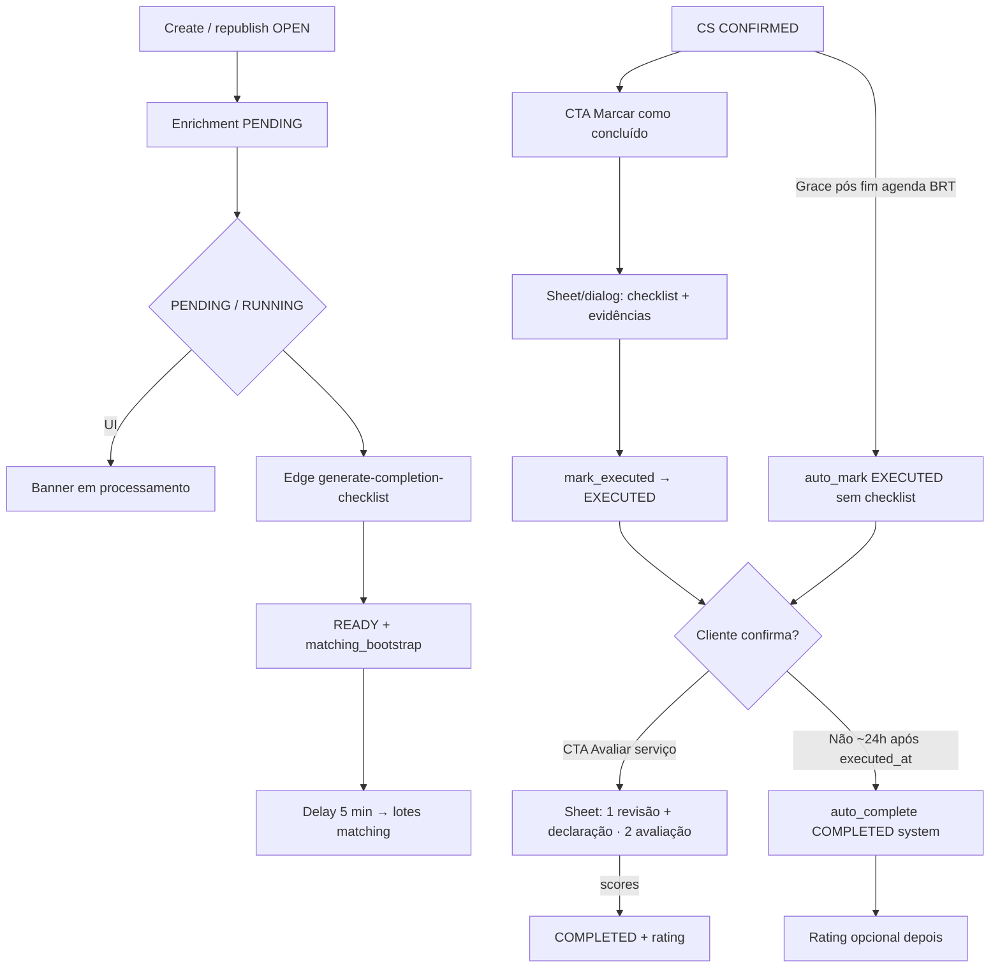

# Conclusão de serviço, enrichment e disputa stub

Documentação de negócio do módulo **service-completion**. Host de UI: [visualizacao-de-servicos](../../view-services/features/visualizacao-de-servicos.md). Matching: [dispatch-e-visibilidade](../../matching-dispatch/features/dispatch-e-visibilidade.md).

---

## 1. Resumo executivo

Pedido `OPEN` enfileira **enrichment** (`PENDING`). Enquanto `PENDING`/`RUNNING`, a UI mostra “Checklist de conclusão em processamento…” e o pedido **não** entra no feed. Em `READY`, o matching faz bootstrap (delay de 5 min a partir daí). Pós-contrato, na seção **Serviço contratado** do detalhe: o prestador usa o botão **“Marcar serviço como concluído”** (abre sheet/dialog com o checklist — **não** fica inline na página); se não marcar a tempo, o sistema **auto-marca EXECUTED** sem checklist (~24h após fim do dia BRT da data agendada). O cliente usa **“Avaliar serviço”** (sheet/dialog em 2 etapas: revisar evidências + declarar execução → avaliar). Sem confirmação, auto-complete EXECUTED→COMPLETED ~24h após `executed_at` (janela distinta). Disputa no app é stub (banner título “Abrir disputa”, botão “Falar com o suporte”; descrição sobre correção/devolução; suporte ou “Em breve”).

---

## 2. Objetivo de negócio

- Garantir checklist de conclusão **antes** de expor o pedido a prestadores.
- Congelar evidências na execução e exigir rating no caminho manual.
- Separar writers de conclusão do domínio de pagamentos (ADR-0004).

---

## 3. Localização na plataforma

| Superfície | Path / entry |
|------------|----------------|
| Sem rota própria | Embutido em `/dashboard/services/:id` e cards (`view-services`) |
| Feature | `src/features/service-completion/` (Public API em `index.ts`) |
| CTAs no host | `ProviderMarkExecutedAction` / `ClientEvaluateServiceAction` na `ServiceContractedSection` (ao lado de cancelar/reagendar) |
| Fluxo modal | `CompletionFlowSheetDialog`: bottom sheet (mobile) ou dialog (desktop); wizards embutidos (`presentation="embedded"`) |
| Edge | `generate-completion-checklist` |
| RPCs produto | `get_service_completion_context`, `service_completion_mark_executed`, `service_completion_confirm_with_rating`, draft/upload (`create_upload_session` / `register_upload_object`), ratings |

---

## 4. Perfis envolvidos

| Quem | Pode | Não pode |
|------|------|----------|
| **Cliente** (dono do SR) | Contexto completo via RPC; processing; revisar evidência frozen; **SELECT storage / `createSignedUrl`** em paths do CS quando evidência está `frozen` (thumbnails/lightbox em “Avaliar serviço”); confirm+rating; stub disputa | Marcar EXECUTED; SELECT direto em `service_request_enrichments`; SELECT storage de evidência ainda em `draft` |
| **Prestador contratado** | Contexto completo; draft + mark EXECUTED em `CONFIRMED`; upload sob sessão própria | Confirmar COMPLETED manual; SELECT direto em enrichments |
| **Prestador só-marketplace** (visibilidade no feed, sem contrato) | Payload **limitado** no contexto (status/`ready`; sem checklist nem `client_id`/`provider_id`) | Checklist, evidências, mutações de conclusão |
| **Admin** (plataforma) | Contexto completo (mesmo sem ser participante) | Mutações de produto via UI do app (sem painel) |
| **Sistema** | Enrichment READY + bootstrap; auto-mark EXECUTED (sem checklist); auto-complete EXECUTED→COMPLETED; janitor órfãos; repair ≤7 dias | — |

---

## 5. Fluxo funcional principal

---

## 6. Fluxos alternativos e exceções

| Cenário | Comportamento |
|---------|----------------|
| Enrichment `ABORTED` / cancel | Banner de interrupção; sem bootstrap |
| IA esgota tentativas | Fallback template → ainda pode chegar a READY |
| READY sem dispatch | Sweeper repara via `matching_bootstrap_dispatch_for_service_request` só se `materialized_at` nos **últimos 7 dias** |
| Path de evidência não registrado | `service_completion_mark_executed` → `EVIDENCE_PATH_NOT_REGISTERED` |
| Sessão upload expirada / não open / CS ≠ CONFIRMED / ≥ max_files | Storage INSERT negado; register object também guarda `max_files` / sessão open |
| Execução atrasada | `executed_late = true` no freeze; badge “Executado com atraso” |
| Prestador não marca EXECUTED a tempo | Auto-mark: após `service_completion_scheduled_end_at` + `auto_mark_executed_grace_hours` (default **24**) → `EXECUTED` com evidência frozen sintética (`responses = {}`, `auto_executed_without_checklist = true`); audit system; MMD `SERVICE_EXECUTED`; invariante EXECUTED↔frozen mantido |
| Auto-mark sem checklist (UI cliente) | Em Avaliar serviço: alerta “Conclusão automática sem checklist”; **não** lista critérios vazios; checkbox de declaração com copy suavizada |
| Auto-complete já rodou | Cliente ainda pode enviar rating opcional |
| Disputa sem URL | Toast “Em breve” + analytics; **não** muda status do CS |
| Disputa com URL | Abre URL externa; analytics |

---

## 7. Regras de negócio

1. Create e republish: mesma TX enfileira enrichment `PENDING` via `service_request_enqueue_enrichment`; **não** bootstrap matching.
2. Trigger `trg_service_request_dispatch_bootstrap` **DROP**ada; bootstrap só em READY (ou reparo).
3. Delay `matching.dispatch_start_delay_minutes` (default **5**) e lifecycle do dispatch começam no **bootstrap**, não no insert `OPEN`.
4. Prestador em `CONFIRMED`: draft mutável; submit EXECUTED valida critérios/evidências/janela temporal (BRT).
5. `service_completion_mark_executed`: paths em `evidence_paths` devem existir em `completion_evidence_upload_objects` ligados a sessão do CS/prestador (`EVIDENCE_PATH_NOT_REGISTERED` se não); marca `referenced_in_responses`; sessões `open` → `committed`; freeze + `executed_late` + CS → `EXECUTED` + MMD.
6. **Auto-mark EXECUTED (sem checklist):** se o prestador não marca `CONFIRMED`→`EXECUTED` dentro de `auto_mark_executed_grace_hours` (default **24**) após o fim do dia BRT de `coalesce(scheduled_end_date, scheduled_start_date)` (`service_completion_scheduled_end_at`), o batch `service_completion_auto_mark_executed` (+ cron `service_completion_cron_auto_mark_executed`, schedule `15 9,15,21,3 * * *`) promove a `EXECUTED` com pacote frozen sintético (`responses = {}`), `auto_executed_without_checklist = true`, `executed_at = now()`, audit actor system, MMD `SERVICE_EXECUTED`. Mantém o invariante EXECUTED exige evidência frozen. **Distinto** do auto-complete EXECUTED→COMPLETED.
7. Confirm manual: scores de rating **obrigatórios** (`service_completion_confirm_with_rating`). Na UI, o step de revisão exige checkbox de declaração de execução antes de “Continuar para avaliação” (aceite jurídico / validade da execução; só no step review do wizard Avaliar serviço — não na superfície dispute-only). Com `auto_executed_without_checklist`, o alerta substitui a lista de critérios e a copy do checkbox é suavizada.
8. Auto-complete: `auto_complete_grace_hours` (default **24**) após `executed_at`; `completed_by = system`; lote `auto_complete_batch_size` (default **100**, distinto de `enrichment_claim_batch_size`). **Não** confundir com auto-mark CONFIRMED→EXECUTED.
9. Writers removidos do produto: `payment_mark_service_executed`, `payment_confirm_service_completed`, `payment_cron_auto_complete_*`.
10. Stub disputa: título “Abrir disputa”, botão **“Falar com o suporte”**; env `VITE_SERVICE_COMPLETION_DISPUTE_SUPPORT_URL` ou remote `orbit.dispute_support_url`; sem FSM.
11. Imutabilidade DB: trigger bloqueia alteração de schema/source/`materialized_at` (e saída de status) após enrichment `READY`; evidência `frozen` tem colunas críticas imutáveis (incl. `auto_executed_without_checklist`); CS em `EXECUTED`/`COMPLETED` exige linha de evidência `frozen` (constraint trigger deferred); FK evidência→CS **ON DELETE RESTRICT**.
12. Upload (padrão KYC, sem Edge de URL assinada): RPC `service_completion_create_upload_session` → `supabase.storage.from('completion-evidence').upload()` autenticado sob prefixo da sessão (RLS) → RPC `service_completion_register_upload_object`. Sessão com `storage_bucket = completion-evidence` e `provider_id` = CS; INSERT storage só com sessão `open`, não expirada, CS `CONFIRMED`, abaixo de `max_files` (**só prestador**).
13. Leitura de produto: `authenticated` **não** faz SELECT em `service_request_enrichments`. Status/`ready` leves vêm de `get_service` / `list_services` (banner/card e gate de CTA). Checklist, evidências e capabilities: RPC `get_service_completion_context` (detalhe completo vs limitado — §4; expõe `auto_executed_without_checklist`), só quando o fluxo de conclusão/avaliação precisa (abrir sheet/wizard ou CTA cliente elegível).
14. Storage SELECT `completion-evidence` (`storage_objects_completion_evidence_select`): prestador contratado (prefixo próprio, draft + frozen via `service_completion_evidence_storage_path_owned`); **ou** cliente do CS quando a evidência está `frozen` (`service_completion_evidence_storage_path_client_readable` — permite `createSignedUrl` para thumbnails/lightbox em “Avaliar serviço”); **ou** admin de plataforma. INSERT permanece só prestador.
15. Janitor de órfãos (SQL, padrão KYC): expira sessões open passadas do TTL; remove objetos com `referenced_in_responses = false` via `DELETE FROM storage.objects` + limpeza do registry; checagem defensiva de frozen só no batch locked; cron com `job_runs`; sem Edge / sem finalize RPC.
16. Repair READY-sem-dispatch: apenas enrichments com `materialized_at >= now() - 7 days`.

---

## 8. Campos e dados (UX)

| Elemento | Conteúdo |
|----------|----------|
| Banner processing | “Checklist de conclusão em processamento…” (`PENDING`/`RUNNING`) — detalhe/card via `enrichmentStatus` / `enrichmentReady` de `get_service`/`list_services` (mesmo padrão do card); **não** dispara `get_service_completion_context`; **não** é o checklist de execução |
| CTA prestador | Botão **“Marcar serviço como concluído”** na seção Serviço contratado (visível se contrato `CONFIRMED` **e** `enrichmentReady` do `get_service` — sem prefetch do completion context) |
| Sheet/dialog prestador | Título “Checklist de conclusão”; ao abrir, `ProviderExecutedWizard` busca `get_service_completion_context` e embute draft + upload + submit EXECUTED |
| CTA cliente | Botão **“Avaliar serviço”** na mesma seção: só monta/busca contexto se contrato `EXECUTED` ou `COMPLETED`; então usa `canConfirmWithRating` / rating opcional do contexto |
| Sheet/dialog cliente | Stepper **2 etapas** (“1 de 2” / “2 de 2”): (1) revisar evidências/checklist congelado + checkbox obrigatório de declaração de execução; (2) avaliar prestador/serviço (`ClientConfirmRatingWizard` embutido). Se `auto_executed_without_checklist`: alerta em `FrozenEvidenceReview` (sem lista vazia de critérios) + copy suavizada do checkbox |
| Declaração de execução (checkbox) | Só no **step de revisão** do wizard Avaliar serviço, **abaixo** do card de disputa (quando houver). Texto padrão: “Declaro que revisei as evidências acima e que o serviço foi executado corretamente, conforme o combinado.” Com auto-mark sem checklist: “Declaro que o serviço foi executado corretamente, conforme o combinado.” Botão **“Continuar para avaliação”** fica **disabled** até o checkbox estar marcado. Declaração do cliente para validade jurídica / aceite da execução antes das notas. **Não** aparece no step de rating nem na superfície dispute-only (inline sem CTA Avaliar serviço) |
| Alerta auto-mark sem checklist | Título “Conclusão automática sem checklist”; explica que o sistema marcou a conclusão porque o prestador não registrou no prazo (`FrozenEvidenceReview` / `ClientConfirmRatingWizard`) |
| Fotos de evidência | Thumbnails (`CompletionEvidenceGallery`); clique abre lightbox fullscreen (padrão `ServicePhotoGallery`); prestador ao preencher e cliente ao revisar; URLs via `createSignedUrl` — cliente só após evidência `frozen` (RLS). Ausente no ramo auto-mark (sem critérios/fotos) |
| Badge atraso | “Executado com atraso” (`executed_late`) |
| Dispute stub | Banner `DisputeStubEntry` no fluxo **Avaliar serviço** (wizard) e **inline** na seção contratada (sem CTA de avaliar): título “Abrir disputa”; botão **“Falar com o suporte”** (evita repetir o título); **descrição** explicando que, se algo estiver errado na execução com base no checklist evidenciado ou não tiver sido cumprido corretamente, o cliente pode abrir disputa — a plataforma avalia e pode pedir correção ao prestador ou devolver parcial/integralmente o valor pago. Comportamento do botão: URL de suporte ou toast “Em breve” + analytics (**sem** FSM). Superfície dispute-only **não** inclui o checkbox de declaração |

---

## 9. Validações de front-end

- Draft/wizard prestador (no sheet): `validateExecutedResponses` + gate temporal (`deriveExecutedTemporalGate`).
- Confirm cliente (etapa 1 / review): checkbox de declaração de execução marcado antes de “Continuar para avaliação”.
- Confirm cliente (etapa 2 do sheet): scores completos antes do submit.
- Upload de evidência: sessão RPC + upload autenticado no storage (prefixo/RLS) + register; limites de imagem; URLs assinadas para thumbnails via `useCompletionEvidencePhotoUrls` (`createSignedUrl` — prestador no próprio prefixo; cliente do CS quando evidência `frozen`).
- Shell modal: dismiss bloqueado enquanto mutação em voo (`dismissDisabled`).
- Banner enrichment no detalhe/lista: campos leves do modelo (`get_service` / `list_services`); **sem** poll via `get_service_completion_context` ao abrir o detalhe. O hook ainda *pode* pollar se algum consumidor passar `pollWhileProcessing`, mas o host atual do detalhe não o usa para o banner.

---

## 10. Validações de back-end

| RPC / job | Regras |
|-----------|--------|
| `enrichment_finalize_ready` | CAS + schema + bootstrap matching mesma TX; após READY schema imutável |
| `get_service_completion_context` | Auth; detalhe completo (checklist + ids) só cliente SR / prestador CS / admin; marketplace → status/`ready` limitado; sem SELECT de tabela enrichment pelo client |
| `service_completion_create_upload_session` | CS `CONFIRMED`; bucket `completion-evidence`; `provider_id` = CS; retorna prefixo da sessão |
| Storage INSERT `completion-evidence` (prestador autenticado) | Upload sob prefixo da sessão; sessão open, não expirada, CS CONFIRMED, contagem &lt; `max_files` (RLS); **sem** Edge de URL assinada de upload |
| Storage SELECT `completion-evidence` | Prestador: prefixo próprio (draft + frozen). Cliente do CS: paths do CS **somente** se evidência `frozen` (`service_completion_evidence_storage_path_client_readable`) — `createSignedUrl` para galeria em “Avaliar serviço”. Admin: sim. |
| `service_completion_register_upload_object` | Sessão `open` do prestador; path sob prefixo; registra em `completion_evidence_upload_objects` |
| `service_completion_mark_executed` | Auth prestador do CS; `CONFIRMED`; payload checklist; paths registrados (`EVIDENCE_PATH_NOT_REGISTERED`); freeze atômico; sessões open → committed |
| `service_completion_auto_mark_executed` / cron | service_role; grace `auto_mark_executed_grace_hours` após `service_completion_scheduled_end_at`; batch `auto_mark_executed_batch_size`; evidência frozen sintética + `auto_executed_without_checklist`; MMD `SERVICE_EXECUTED`; cron `15 9,15,21,3 * * *` |
| `service_completion_confirm_with_rating` | Auth cliente; `EXECUTED`; scores obrigatórios; evidência frozen (invariante deferred) |
| `service_completion_auto_complete_executed` | service_role / cron; grace hours após `executed_at`; batch `auto_complete_batch_size` (default 100); `SKIP LOCKED` |
| `enrichment_repair_ready_without_dispatch` | READY sem dispatch; janela **7 dias** em `materialized_at`; só bootstrap |
| Janitor orphan uploads (`service_completion_janitor_orphan_uploads`) | SQL (padrão KYC): expira sessões + `DELETE FROM storage.objects` / registry quando `referenced_in_responses = false`; checagem frozen JSONB só no batch locked; cron `service_completion_cron_orphan_upload_janitor` + `job_runs`; sem Edge / sem finalize RPC |

---

## 11. Status e transições

### Enrichment (`enrichment_status`)

`PENDING` → `RUNNING` → `READY` (terminal) \| retry → `PENDING`; ou `ABORTED` (terminal).

### Contrato (conclusão)

`CONFIRMED` → `EXECUTED` (mark manual **ou** auto-mark sem checklist) → `COMPLETED` (confirm ou auto-complete).

### Evidência

`draft` (mutável em CONFIRMED) → `frozen` (com EXECUTED).

---

## 12. Persistência

Servidor: tabelas enrichment/evidence/upload sessions+objects/ratings; `platform_constants` (checklist, enrichment, `auto_mark_executed_grace_hours` / `auto_mark_executed_batch_size`, `auto_complete_grace_hours`, **`auto_complete_batch_size`**, orphan TTL). Helper SQL `service_completion_scheduled_end_at(start, end)` = fim do dia BRT de `coalesce(end, start)`. Cliente: projeção leve `enrichmentStatus`/`enrichmentReady` em `get_service`/`list_services`; React Query com `get_service_completion_context` só no wizard/CTA elegível; sem SELECT autenticado em `service_request_enrichments`; sem draft local próprio além do estado do wizard.

---

## 13. Integrações

| Sistema | Contrato |
|---------|----------|
| Matching | `matching_bootstrap_dispatch_for_service_request` (+ repair ≤7 dias) |
| Edge | `generate-completion-checklist` (só enrichment; upload de evidência **sem** Edge) |
| Storage | Bucket `completion-evidence` — INSERT autenticado sob sessão (prestador); SELECT também para cliente do CS com evidência `frozen` (`createSignedUrl`) |
| MMD | `SERVICE_EXECUTED` / `SERVICE_COMPLETED` / `SERVICE_AUTO_COMPLETED` |
| view-services | Host: banner enrichment no detalhe/card (`enrichmentStatus`/`enrichmentReady` do modelo); CTAs na `ServiceContractedSection` (Public API; gate leve + contexto só no fluxo); projeção também `executedLate` |
| my-services | Cards `in_progress`: highlight de follow-up (pós-data-fim `CONFIRMED` / `EXECUTED`); prestador `CONFIRMED` + past → CTA **“Concluir serviço”** no card (sheet; contexto ao abrir); cliente `EXECUTED` → CTA **“Avaliar serviço”** no card (`ClientEvaluateServiceSheet` hospedado na página; contexto RPC só ao abrir o wizard); demais → “Ver detalhes” — ver [solicitacoes-do-cliente](../../my-services/features/solicitacoes-do-cliente.md) Anexo D |
| Analytics | `service_completion_dispute_stub_opened` |

---

## 14. Ações disponíveis

| Ação | Quem | Pré-condição | Resultado |
|------|------|--------------|-----------|
| Abrir “Marcar serviço como concluído” | Prestador contratado | UI: `CONFIRMED` + `enrichmentReady` (`get_service`); contexto RPC ao abrir o sheet | Sheet/dialog; wizard carrega checklist |
| Salvar draft | Prestador contratado | `CONFIRMED` (+ capability do contexto no wizard) | Evidência draft |
| Criar sessão → upload autenticado → register path | Prestador contratado | CS CONFIRMED; sessão open; &lt; max_files | Objeto em `completion-evidence` + registry |
| Marcar executado (submit no sheet) | Prestador contratado | `CONFIRMED` + paths registrados + validação | `EXECUTED`; sessões → committed; fecha sheet |
| Auto-mark EXECUTED (sistema) | Sistema (cron) | `CONFIRMED` + grace após fim agenda BRT | `EXECUTED` + evidência frozen sintética (`auto_executed_without_checklist`) |
| Abrir “Avaliar serviço” | Cliente | UI: contrato `EXECUTED` ou `COMPLETED`; então `canConfirmWithRating` / rating opcional do contexto | Sheet/dialog 2 etapas (detalhe via `ClientEvaluateServiceAction`; lista Meus Serviços via `ClientEvaluateServiceSheet` hospedado na página); etapa 1 exige checkbox de declaração; alerta se auto-mark sem checklist |
| Confirmar + avaliar | Cliente | `EXECUTED` | `COMPLETED` + rating; fecha sheet |
| Falar com o suporte (stub disputa) | Cliente | tipicamente pós-rating / `EXECUTED`/`COMPLETED` | Banner título “Abrir disputa”; botão “Falar com o suporte” → URL ou toast (no wizard de avaliar e inline se sem CTA avaliar; ver §8) |
| Submeter rating pós auto | Cliente | `COMPLETED` system | Rating opcional (mesmo CTA/sheet) |

---

## 15. Dependências

Upstream: pedido (`request-quote` / republish), contrato pago (`payments`/`CNS`), matching. Downstream UI: `view-services`. Notificações: MMD.

---

## 16. Regras implícitas

- Consumidores externos **não** importam internals de `service-completion` — só `index.ts`.
- Host preferencial: `ProviderMarkExecutedAction` / `ClientEvaluateServiceAction` no detalhe; na lista Meus Serviços, hosts usam `ProviderMarkExecutedSheet` / `ClientEvaluateServiceSheet` (wizards ainda exportados para composição embutida / legado de API, mas **não** montados inline no detalhe).
- Checklist de execução **não** permanece aberto na página de detalhe — só dentro do sheet/dialog.
- `ServiceDetailPage` **não** chama `get_service_completion_context` ao abrir o detalhe; banner e gate do CTA prestador usam só o modelo de `get_service`.
- `ProviderMarkExecutedAction` **não** prefetcha contexto ao montar; a RPC roda no `ProviderExecutedWizard` ao abrir o dialog.
- `ClientEvaluateServiceAction` **não** busca contexto em `CONFIRMED` (só `EXECUTED`/`COMPLETED`); o sheet controlado (`ClientEvaluateServiceSheet`) monta o wizard só com `open` e carrega contexto ao abrir.
- `ClientEvaluateServiceAction` reutiliza `ClientEvaluateServiceSheet` (mesmo shell da lista).
- `view-services` não reexporta mais lifecycle de payments para conclusão.
- Chargeback / `is_disputed` em payments **não** é o stub de disputa do app.

---

## 17. Riscos

| Risco | Nota |
|-------|------|
| Suporte: “pedido não no feed” | Enrichment ainda não READY |
| Expectativa de disputa completa | Stub only — ver visão geral / pendências |
| Confusão payment vs completion writers | ADR-0004 |

---

## 18. Evidências

- `src/features/service-completion/**` (incl. `ProviderMarkExecutedAction`, `ProviderMarkExecutedSheet`, `ClientEvaluateServiceAction`, `ClientEvaluateServiceSheet`, `CompletionFlowSheetDialog`, `CompletionEvidenceGallery`)
- `src/features/view-services/components/ServiceContractedSection.tsx`, `ServiceDetailPage.tsx`, `SimpleServiceCard.tsx`
- Migrations `20260804010000`–`2026080452*` (constants, RLS, evidence/sessions, mark/confirm/auto-complete, context RPC, janitor, indexes); `20260806180328_service_completion_auto_mark_executed.sql`
- Edge: `generate-completion-checklist` (upload evidência: RPCs create/register + storage autenticado; sem Edge)
- Janitor SQL: `service_completion_janitor_orphan_uploads` + `service_completion_cron_orphan_upload_janitor`
- Auto-mark: `service_completion_auto_mark_executed` + `service_completion_cron_auto_mark_executed` (`15 9,15,21,3 * * *`); helper `service_completion_scheduled_end_at`
- `docs/service-completion/design.md` §3.7 / §4.1; matching CONTEXT **#135**
- Testes: `src/features/service-completion/**/__tests__` (CTAs, gallery, auto-executed UI), boundary em `view-services`; pgTAP `supabase/tests/service_completion/*` (incl. `auto_mark_executed_grace_and_cron_test.sql`)

---

## 19. Pendências

| ID | Item | Status |
|----|------|--------|
| SC-01 | FSM completa de disputa in-app | Fora do escopo atual (stub) |
| SC-02 | Aba Disputas vazia em Meus Serviços | Produto / view-services |

---

## 20. Atualização de auditoria

- **2026-08-04** — Documentação de negócio alinhada ao cutover service-completion (READY-handoff, RPCs `service_completion_*`, UX enrichment/EXECUTED/confirm/auto-complete/dispute stub).
- **2026-08-05** — Endurecimento SQL: paths registrados / `EVIDENCE_PATH_NOT_REGISTERED`; sessões → `committed` no freeze; storage INSERT gated; imutabilidade frozen/READY; FK RESTRICT; constraint EXECUTED/COMPLETED↔frozen; contexto full vs marketplace; sem SELECT autenticado em enrichments; `auto_complete_batch_size`; repair ≤7 dias; janitor via `referenced_in_responses`.
- **2026-08-05 (UX)** — Checklist/avaliação saem do inline do detalhe: CTAs na seção Serviço contratado → sheet (mobile) / dialog (desktop); cliente com stepper 2 etapas; fotos de evidência como thumbnails + lightbox.
- **2026-08-06** — Lazy load do completion context: detalhe/banner usam só `enrichmentStatus`/`enrichmentReady` de `get_service` (como o card); CTA prestador gated por `CONFIRMED` + `enrichmentReady` sem prefetch; RPC `get_service_completion_context` ao abrir o wizard; CTA cliente só busca contexto em `EXECUTED`/`COMPLETED`.
- **2026-08-06 (lista)** — Cards em Meus Serviços: highlight de follow-up pós-data-fim / `EXECUTED` (sem prefetch de contexto na lista).
- **2026-08-06 (card prestador)** — Prestador `CONFIRMED` + past: CTA **“Concluir serviço”** no card abre sheet (`ProviderMarkExecutedSheet`; contexto RPC ao abrir; gate `enrichmentReady`); secundário “Ver detalhes”.
- **2026-08-06 (card cliente)** — Cliente `EXECUTED`: CTA **“Avaliar serviço”** no card abre `ClientEvaluateServiceSheet` hospedado na página (`ClientEvaluateServiceDialogs` + `useClientEvaluateServiceDialog`); secundário “Ver detalhes”; contexto RPC só ao abrir o wizard; `ClientEvaluateServiceAction` no detalhe reutiliza o mesmo sheet.
- **2026-08-06 (storage SELECT cliente)** — Política `storage_objects_completion_evidence_select` passa a permitir SELECT/`createSignedUrl` ao cliente do CS quando a evidência está `frozen` (helper `service_completion_evidence_storage_path_client_readable`); corrige thumbnails/lightbox “Indisponível” em “Avaliar serviço”. INSERT continua só prestador; SELECT do prestador (draft + frozen no próprio prefixo) inalterado. Migração editada in-place: `20260804100000_service_completion_evidence_storage.sql`.
- **2026-08-06 (Avaliar serviço — declaração + CTA disputa)** — Step de revisão do `ClientConfirmRatingWizard`: checkbox obrigatório de declaração de execução (copy fixa; “Continuar para avaliação” disabled até marcar); só no review, abaixo do stub de disputa quando houver; ausente na superfície dispute-only. `DisputeStubEntry`: título permanece “Abrir disputa”; botão interno passa a **“Falar com o suporte”** (URL/toast + analytics, sem FSM).
- **2026-08-06 (auto-mark EXECUTED)** — Se prestador não marca `CONFIRMED`→`EXECUTED` em `auto_mark_executed_grace_hours` (default 24) após fim do dia BRT de `coalesce(scheduled_end, scheduled_start)` (`service_completion_scheduled_end_at`), batch/cron promove a EXECUTED com evidência frozen sintética (`responses = {}`, `auto_executed_without_checklist = true`), audit system, MMD `SERVICE_EXECUTED`; invariante frozen mantido. UI Avaliar serviço: alerta + sem lista vazia de critérios + copy do checkbox suavizada. Distinto do auto-complete EXECUTED→COMPLETED (`auto_complete_grace_hours` após `executed_at`).
