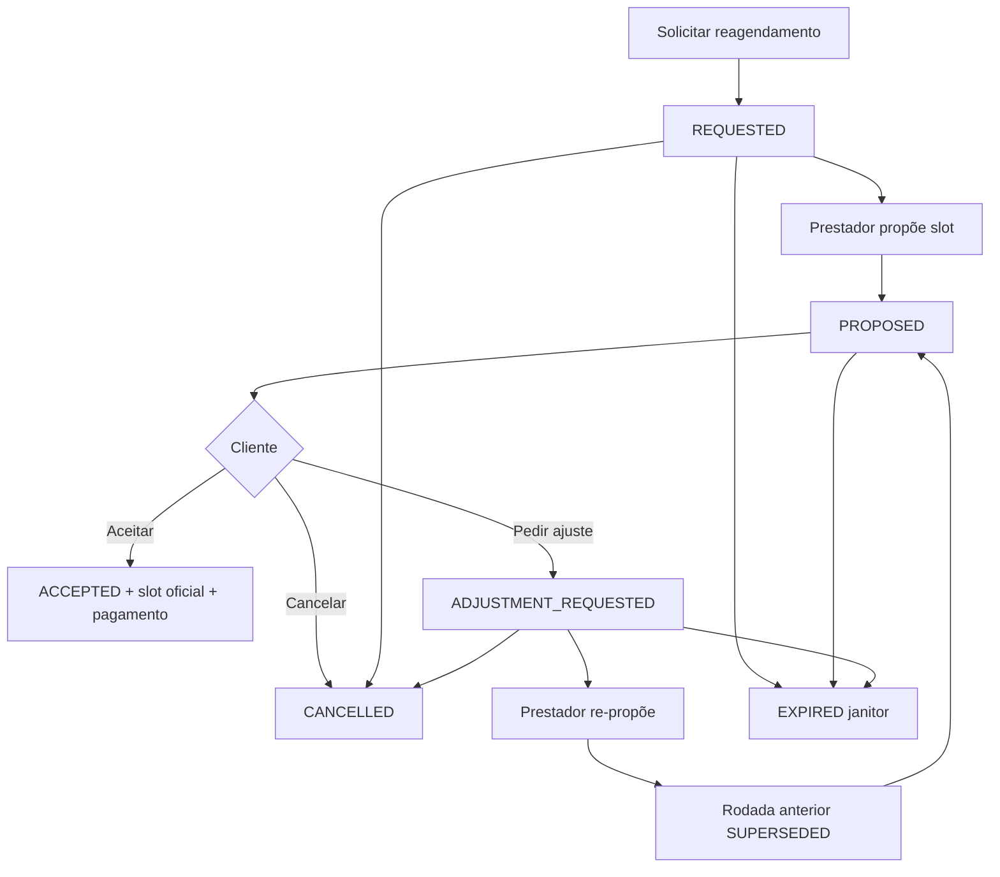

# Reagendamento de serviço (`service-reschedule`)

## 1. Leitura para negócio

- **Para que serve:** negociar e confirmar uma **nova data (ou período) de execução** de um **serviço já contratado**, sem cancelar a contratação. A **Data Oficial do Serviço** só muda após o **aceite formal** do cliente.
- **Quem usa:** cliente e prestador participantes do serviço/conversa (ações conforme status da solicitação e flags do snapshot).
- **Quem não usa:** admin (só SELECT RLS operacional na tabela), visitante, papéis fora do par cliente/prestador do contrato.
- **Valor:** formaliza a troca de agenda no chat e no detalhe do serviço; protege a data atual até o aceite; integra ajuste de cobrança pós-aceite (retarget T-2 ou recaptura longe).
- **Domínio de produto (glossário):** [docs/cancelamento-reagendamento-servicos/CONTEXT.md](../../../cancelamento-reagendamento-servicos/CONTEXT.md).

## 2. Visão geral funcional

| Aspecto | Detalhe |
|---------|---------|
| Feature front | `src/features/service-reschedule/` |
| Superfícies de UI | Dialogs no chat e no detalhe do serviço contratado; cards na timeline (`WORKFLOW_ACTION` / mensagens SYSTEM) |
| Persistência | Tabela `service_reschedule_requests` (FSM); slot oficial em `contracted_services` só no aceite |
| Mutações | RPCs autenticadas `cns_*_service_reschedule*` com idempotência (`rpc_idempotency_records`) |
| Janitors | Expiração (`expire_stale_service_reschedule_requests`, cron `*/15`); lembretes SLA ao prestador (`enqueue_service_reschedule_reminders`) |
| Pagamento pós-aceite | `_cns_apply_service_reschedule_slot` → `payment_reschedule_charge_date`; far-recapture via EF interna |

**Estados da solicitação (`service_reschedule_request_status`):** `REQUESTED` → `PROPOSED` → (`ADJUSTMENT_REQUESTED` → supersede → nova `PROPOSED`) → `ACCEPTED` | `CANCELLED` | `EXPIRED` | `SUPERSEDED` (histórico de rodada). Detalhe: [ciclo-estados-reagendamento.md](./features/ciclo-estados-reagendamento.md).

## 3. Features do módulo

| Documento | Conteúdo |
|-----------|----------|
| [features/ciclo-estados-reagendamento.md](./features/ciclo-estados-reagendamento.md) | FSM completo: request / propose / adjustment / accept / cancel / expire / supersede; quem pode cada transição; side effects (chat, MMD, pagamento) |
| [features/propor-nova-data.md](./features/propor-nova-data.md) | Dialog “Propor nova data”: duração editável; modo data única vs período; slot com duração embutida; validação front/back |
| [features/integracao-pagamento-pos-aceite.md](./features/integracao-pagamento-pos-aceite.md) | Pós-aceite: pré-`PAID` retarget; pós-`PAID` perto vs longe (far-recapture); UI `far_recapture_pending` |

## 4. Perfis envolvidos

| Papel | Pode |
|-------|------|
| **Cliente** | Solicitar (janela 48h antes da execução); cancelar em `REQUESTED` / `PROPOSED` / `ADJUSTMENT_REQUESTED`; aceitar e pedir ajuste em `PROPOSED` |
| **Prestador** | Solicitar (sem janela 48h; flag `is_last_minute` se &lt;24h); propor slot em `REQUESTED` / `ADJUSTMENT_REQUESTED`; cancelar nesses mesmos status (não em `PROPOSED`) |
| **Sistema (cron / service_role)** | Expirar ou cancelar (safety-net) solicitações abertas; enfileirar lembretes; orquestrar far-recapture |

Flags de ação no snapshot (`can_*`) são a fonte de verdade da UI — ver [ciclo-estados-reagendamento](./features/ciclo-estados-reagendamento.md).

## 5. Principais fluxos

1. **Abrir:** `cns_request_service_reschedule` — mensagem SYSTEM + notificação MMD; data oficial inalterada.
2. **Propor:** `cns_propose_service_reschedule` — card `WORKFLOW_ACTION` (`service_reschedule_proposed`).
3. **Ajuste / nova rodada:** cliente pede ajuste; prestador re-propõe → linha anterior `SUPERSEDED`, nova linha `PROPOSED` com `parent_request_id`.
4. **Aceite:** cliente confirma → `_cns_apply_service_reschedule_slot` + `payment_reschedule_charge_date`.
5. **Encerrar sem mudar data:** cancelamento manual ou expiração automática.

## 6. Regras transversais

- **Uma solicitação ativa por serviço:** índice único parcial em `REQUESTED` / `PROPOSED` / `ADJUSTMENT_REQUESTED` → `ACTIVE_RESCHEDULE_EXISTS`.
- **Chat ACTIVE obrigatório** para abrir solicitação (`CHAT_NOT_FOUND` / `CHAT_NOT_ACTIVE`).
- **Cliente — janela:** `service_reschedule.client_request_window_hours` (padrão **48**); erro `CLIENT_RESCHEDULE_WINDOW_CLOSED`.
- **Prestador — última hora:** `service_reschedule.last_minute_hours` (padrão **24**) → `is_last_minute = true` (não bloqueia).
- **Ajustes:** máx. `service_reschedule.max_adjustments` (padrão **5**) → `ADJUSTMENT_LIMIT_REACHED`.
- **Slot proposto:** `start_date` ≥ amanhã (`cns_business_today` / `America/Sao_Paulo`); duração máx. 24h / 7 dias.
- **Idempotência:** UUID v7 por ação do usuário; operações `service_reschedule.request|propose|accept|adjustment|cancel`.
- **Mensagem SYSTEM ao solicitar:** frase automática; se houver `request_note` (≤500 após trim), linha em branco + `Observação: {nota}`.

### Expiração e cancelamento em lote

- **Expirar:** serviço `EXECUTED`/`COMPLETED`; ou `CONFIRMED` com grace de 24h após `original_service_execution_at`; ou `proposed_slot.start_date` ≤ hoje (calendário negócio).
- **Cancelar (não EXPIRED):** serviço já `CANCELLED` (janitor safety-net ou `cns_cancel_active_service_reschedule_requests` no fluxo de cancelamento do serviço).

## 7. Entidades

| Entidade | Papel |
|----------|-------|
| `service_reschedule_requests` | Negociação formal; FSM; snapshot de slots original/proposto |
| `contracted_services` | Data oficial (`scheduled_*`, `agreed_slot`, `duration_*`); status `PENDING_PAYMENT` / `CONFIRMED` para negociar |
| `chat_messages` | SYSTEM / WORKFLOW_ACTION ligados a `linked_entity_id` = request id |
| `payment_schedules` | Ajuste de cobrança no aceite; `far_recapture_pending_at` no caminho longe |
| `platform_constants` | Janelas, limites de ajuste, batch, limiar far-recapture |

## 8. Integrações

| Módulo / sistema | Relação |
|------------------|---------|
| **`chats`** | Cards (`DynamicRescheduleProposalCard`), dialogs (`useChatRescheduleDialogs`), realtime/invalidação de queries de reschedule |
| **`view-services` / `my-services`** | `ContractedServiceRescheduleAction`; snapshot no detalhe; aviso `farRecapturePending` |
| **`negotiation-proposals`** | Limites e regra de dias (`matchesProposalDayDurationISO`, constantes do composer) |
| **`payments`** | `payment_reschedule_charge_date`; EF `process-far-reschedule-recapture` |
| **`message-dispatcher`** | Eventos `SERVICE_RESCHEDULE_*` (push/e-mail conforme catálogo) |

## 9. Riscos e lacunas

| Tema | Nota |
|------|------|
| Concorrência | Índice único + `FOR UPDATE` nas mutações; segunda solicitação ativa falha com `ACTIVE_RESCHEDULE_EXISTS` |
| Aceite + far-recapture | Aceite não invoca EF de dinheiro no app; falha de recaptura fica em pending até cron/pg_net |
| `SLOT_START_DATE_TOO_SOON` | Erro de backend na validação de slot; **não** está no mapa de códigos de UI do front (`serviceRescheduleErrors`) — mensagem pode cair em genérica (**evidência parcial** de UX) |
| P-11 | Ciclo de estados documentado nesta pasta; pendências restantes em § entregável / `pendencias-e-incertezas` (índice transversal fora do escopo deste worker) |
| Histórico de confiabilidade | Campo `is_last_minute` gravado; uso em score de prestador — **evidência parcial** (persistido; consumo em produto não mapeado neste módulo) |

## 10. Evidências

| Área | Caminhos |
|------|----------|
| Public API | `src/features/service-reschedule/index.ts` |
| API / hooks | `api/serviceReschedule.api.ts`, `hooks/useServiceRescheduleMutations.ts`, `useActiveChatReschedule.ts`, `useChatRescheduleDialogs.ts` |
| UI | `ProposeRescheduleDialog`, `RequestRescheduleDialog`, `RescheduleActionDialogs`, `ContractedServiceRescheduleAction`, `ProposeRescheduleFlowReminder` |
| Schema / FSM | `20260802010000_service_reschedule_schema.sql`, `20260802120000_service_reschedule_supersede_enum.sql`, `20260802130000_service_reschedule_supersede_rounds.sql` |
| RPCs | `20260802030000_service_reschedule_rpcs_core.sql` (request/accept/adjustment/cancel; propose superseded) |
| Helpers / apply | `20260802020000_service_reschedule_helpers.sql`, `20260802150000_service_reschedule_apply_slot_restore_claims.sql` |
| Janitors | `20260802080000_service_reschedule_expiration_janitor.sql`, `20260802090000_service_reschedule_sla_reminders.sql` |
| MMD | `20260802060000_service_reschedule_mmd_catalog.sql` |
| Far-recapture | `20260802200000_payment_far_reschedule_recapture.sql`, `supabase/functions/process-far-reschedule-recapture/` |
| Integração chats | `src/features/chats/components/DynamicMessageRenderer/DynamicRescheduleProposalCard.tsx`, `ChatScreen.tsx`, `ChatsConversationRoute.tsx` |
| Integração view-services | `ServiceContractedSection.tsx`, `serviceMapper.ts` |
