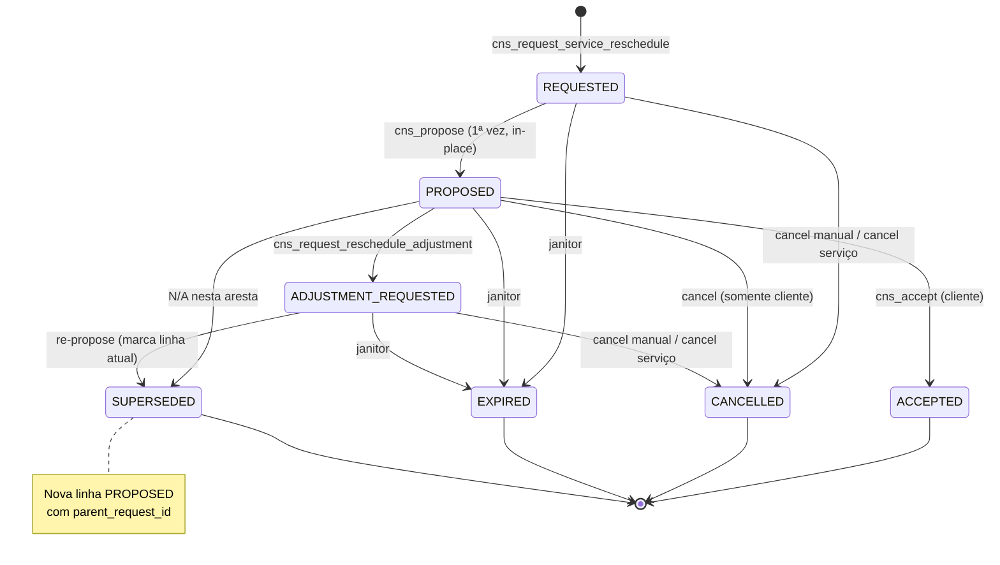

# Ciclo de estados do reagendamento (FSM)

Documentação baseada em `service_reschedule_requests`, triggers FSM, RPCs `cns_*_service_reschedule*` e janitors. A Data Oficial do Serviço **não** muda até `ACCEPTED`.

---

## 1. Resumo executivo

A solicitação de reagendamento é uma **máquina de estados** paralela ao serviço contratado. Estados abertos (`REQUESTED`, `PROPOSED`, `ADJUSTMENT_REQUESTED`) permitem no máximo **uma** linha ativa por `contracted_service_id`. Terminais: `ACCEPTED`, `CANCELLED`, `EXPIRED`, `SUPERSEDED` (rodada histórica após re-proposta).

## 2. Objetivo de negócio

Formalizar negociação de nova agenda no chat, com rastreabilidade, limites de ajuste e encerramento automático quando a data oficial ou o serviço tornam a negociação obsoleta — sem tratar cancelamento de solicitação como cancelamento do serviço.

## 3. Localização na plataforma

| Superfície | Entrada |
|------------|---------|
| Detalhe do serviço | `ContractedServiceRescheduleAction` — “Solicitar reagendamento” / “Ver pedido… no chat” → `/dashboard/chats/:chatId` |
| Chat | Cards na timeline; dialogs via `useChatRescheduleDialogs` |
| Deep link (notificações) | `/dashboard/chats/{chat_id}` (maioria dos eventos); aceite notifica também `/dashboard/services/{service_request_id}` |
| Rota própria | Nenhuma — feature embutida |

## 4. Perfis envolvidos

| Papel | Transições que dispara |
|-------|------------------------|
| Cliente | request; accept; adjustment; cancel (incl. em `PROPOSED`) |
| Prestador | request; propose (e re-propose → supersede); cancel só em `REQUESTED` / `ADJUSTMENT_REQUESTED` |
| Sistema | expire; cancel safety-net se serviço `CANCELLED`; reminders MMD |

Admin: apenas leitura RLS na tabela (ops); sem mutação de produto via RPC autenticada.

## 5. Fluxo funcional principal

**Re-proposta após ajuste (evidência):** linha em `ADJUSTMENT_REQUESTED` → `SUPERSEDED`; **insert** de nova linha `PROPOSED` com `parent_request_id` apontando para a supersedida (cards imutáveis por mensagem).

## 6. Fluxos alternativos e exceções

| Cenário | Comportamento |
|---------|---------------|
| Já existe ativa | `ACTIVE_RESCHEDULE_EXISTS` |
| Cliente fora da janela 48h | `CLIENT_RESCHEDULE_WINDOW_CLOSED` |
| Serviço terminal ao abrir | `RESCHEDULE_NOT_ALLOWED` |
| Chat inexistente / não ACTIVE | `CHAT_NOT_FOUND` / `CHAT_NOT_ACTIVE` |
| Ajuste além do limite | `ADJUSTMENT_LIMIT_REACHED` (padrão 5) |
| Prestador tenta cancelar em `PROPOSED` | `FORBIDDEN` |
| Aceite sem `proposed_slot` | `PROPOSED_SLOT_REQUIRED` |
| Serviço cancelado com request aberta | `cns_cancel_active_service_reschedule_requests` → `CANCELLED` (não `EXPIRED`) |
| Replay idempotente | Mesmo `p_idempotency_key` + hash → corpo cacheado |

## 7. Regras de negócio

1. **RN-01** Insert inicial: status `REQUESTED` (ou `PROPOSED` com `parent_request_id` na rodada supersede).
2. **RN-02** Terminais são imutáveis (`TERMINAL_STATUS_IMMUTABLE` / `TERMINAL_ROW_IMMUTABLE`).
3. **RN-03** Transições validadas por `trg_service_reschedule_requests_fsm` (ver §11).
4. **RN-04** Data oficial e cobrança só no aceite (`_cns_apply_service_reschedule_slot` → `payment_reschedule_charge_date`).
5. **RN-05** Cliente só solicita se `now() < execution_at − 48h` (constante configurável).
6. **RN-06** Prestador solicita/propõe com serviço em `PENDING_PAYMENT` ou `CONFIRMED`.
7. **RN-07** Máximo de ajustes por linha: `service_reschedule.max_adjustments` (default 5); contador incrementa no pedido de ajuste.
8. **RN-08** Uma ativa por serviço (índice parcial).
9. **RN-09** Encerrar solicitação **não** altera slot oficial (“data atual permanece válida” na mensagem SYSTEM de cancel).
10. **RN-10** Expiração por `proposed_slot.start_date ≤ cns_business_today` alinha com gate de slot “a partir de amanhã”.

## 8. Campos e dados

### Linha `service_reschedule_requests` (relevantes)

| Campo | Uso |
|-------|-----|
| `status` | FSM |
| `requested_by_role` / `requested_by_profile_id` | Quem abriu |
| `request_note` | Opcional ≤500 trim |
| `original_slot` / `original_service_execution_at` | Snapshot na abertura |
| `proposed_slot` / `proposed_at` | Slot da proposta |
| `accepted_at` | Aceite |
| `adjustment_count` | Contagem de pedidos de ajuste |
| `is_last_minute` | Prestador &lt;24h da execução |
| `parent_request_id` | Cadeia de rodadas |
| `idempotency_key` | UNIQUE na abertura / re-proposta |
| `last_reminder_at` / `reminder_count` / `urgent_reminder_sent_at` | SLA lembretes |

### Snapshot para UI (`ServiceRescheduleSnapshot`)

Inclui `activeRequest`, `displayStatus`, flags `canClientRequestReschedule`, `canProviderRequestReschedule`, `canProposeReschedule`, `canAcceptReschedule`, `canRequestAdjustment`, `canCancelReschedule`, mais `durationUnit`/`durationValue` do contrato.

## 9. Validações de front-end

| Ação | Gate UI |
|------|---------|
| Solicitar | Flags `canClient*` / `canProvider*`; formulário nota ≤500 (`requestRescheduleFormSchema`) |
| CTAs do card | `resolveRescheduleCardCtas` + flags do snapshot hidratado |
| Offline | Mutações lançam `OFFLINE` (`useServiceRescheduleMutations`) |
| Dialogs | Confirmações em `RescheduleActionDialogs` / propose / request |

Validação detalhada do slot proposto: [propor-nova-data.md](./propor-nova-data.md).

## 10. Validações de back-end

| Camada | O quê |
|--------|-------|
| Trigger FSM | Transições e insert inicial |
| Trigger parent | Cadeia `parent_request_id`, parent deve estar `SUPERSEDED` |
| RPCs | Papel, status do serviço, status da request, chat ACTIVE, slot (`_cns_validate_reschedule_slot`) |
| Constraints | Invariantes PROPOSED/ACCEPTED/REQUESTED no schema |
| RLS | Sem DML autenticado direto; RPC SECURITY DEFINER; admin SELECT |

## 11. Status, estados e transições (FSM)

### Matriz de transição (trigger vigente pós-supersede)

| De \ Para | PROPOSED | ADJUSTMENT_REQUESTED | ACCEPTED | CANCELLED | EXPIRED | SUPERSEDED |
|-----------|----------|----------------------|----------|-----------|---------|------------|
| REQUESTED | ✓ (propose in-place) | — | — | ✓ | ✓ | — |
| PROPOSED | — | ✓ | ✓ | ✓ | ✓ | ✓* |
| ADJUSTMENT_REQUESTED | —** | — | — | ✓ | ✓ | ✓ (antes do insert da nova PROPOSED) |

\* `SUPERSEDED` a partir de `PROPOSED` está na lista do trigger; o caminho de produto documentado de re-proposta parte de `ADJUSTMENT_REQUESTED`.  
\*\* Nova `PROPOSED` é **nova linha** (insert), não update in-place de `ADJUSTMENT_REQUESTED` → `PROPOSED`.

### Quem pode (produto)

| Transição | Quem | RPC / job |
|-----------|------|-----------|
| → REQUESTED | Cliente ou prestador elegível | `cns_request_service_reschedule` |
| REQUESTED → PROPOSED | Prestador | `cns_propose_service_reschedule` |
| PROPOSED → ADJUSTMENT_REQUESTED | Cliente | `cns_request_reschedule_adjustment` |
| ADJUSTMENT_REQUESTED → SUPERSEDED + nova PROPOSED | Prestador | `cns_propose_service_reschedule` |
| PROPOSED → ACCEPTED | Cliente | `cns_accept_service_reschedule` |
| * → CANCELLED (manual) | Ver flags: cliente em abertos+PROPOSED; prestador só REQUESTED/ADJUSTMENT | `cns_cancel_service_reschedule_request` |
| * → CANCELLED (serviço) | Sistema | `cns_cancel_active_service_reschedule_requests` |
| * → EXPIRED | Sistema | `expire_stale_service_reschedule_requests` |

### `display_status` / cópias de card

Backend: `_cns_reschedule_display_status`. Front: `resolveRescheduleCardHeadline` / `Description` (ex.: cliente em REQUESTED — “Aguardando proposta do prestador”).

## 12. Persistência

| Onde | O quê |
|------|-------|
| Servidor | `service_reschedule_requests`; no aceite, colunas de agenda em `contracted_services` |
| Cliente | Cache React Query (`SERVICE_RESCHEDULE_REQUEST_QUERY_KEY`, `CHAT_ACTIVE_RESCHEDULE_QUERY_KEY`, timeline); `patchRescheduleQueryCaches` após mutação |
| Preferências / draft | Não há rascunho persistido de reagendamento |

Realtime: publicação relacionada em migration `20260802110000_service_reschedule_realtime_publication.sql`; chats invalidam keys em `useInvalidateChatRescheduleQueries`.

## 13. Integrações

| Destino | Eventos / efeito |
|---------|------------------|
| Chat | SYSTEM (request, adjustment, accept, cancel, expire); WORKFLOW_ACTION propose |
| MMD | `SERVICE_RESCHEDULE_REQUESTED` (push+email), `PROPOSED` (push+email), `ADJUSTMENT_REQUESTED` (push), `CANCELLED` (push), `ACCEPTED` (push+email cliente e prestador), `REMINDER` (push) |
| Payments | Só no aceite — ver [integracao-pagamento-pos-aceite.md](./integracao-pagamento-pos-aceite.md) |
| Lembretes | `enqueue_service_reschedule_reminders`: 1º após 6h, depois a cada 24h, máx. 3 regulares + urgente &lt;24h da execução original; cron horário `0 * * * *` |
| Expiração | `expire_stale_service_reschedule_requests` cron `*/15 * * * *` |

## 14. Listagens, buscas, filtros, paginação

Não há listagem paginada de solicitações no app. Leitura: por id (`cns_get_service_reschedule_request`), ativa do chat (`cns_get_active_service_reschedule_for_chat`), ou embutida no snapshot do serviço (`project_service_row` / view-services).

## 15. Ações disponíveis

| Ação UI | Pré-condição | Resultado | Erro típico |
|---------|--------------|-----------|-------------|
| Solicitar reagendamento | Flag can request; serviço elegível | REQUESTED + SYSTEM + MMD | Janela / ativa / chat |
| Propor nova data | `canPropose`; REQUESTED ou ADJUSTMENT | PROPOSED (+ supersede se ajuste) | Slot inválido / status |
| Confirmar nova data | `canAccept`; PROPOSED | ACCEPTED + slot + payment | FORBIDDEN / status |
| Pedir ajuste | `canRequestAdjustment`; PROPOSED | ADJUSTMENT_REQUESTED | Limite ajustes |
| Cancelar solicitação | `canCancel` | CANCELLED; data oficial intacta | FORBIDDEN se prestador em PROPOSED |

## 16. Dependências

- `chats` — renderização e dialogs  
- `view-services` — CTA no detalhe + snapshot  
- `negotiation-proposals` — regras de duração (propor)  
- `payments` — pós-aceite  
- `message-dispatcher` — notificações  
- `auth` — `ProfileRole`  

## 17. Regras implícitas

- Prestador **não** cancela enquanto `PROPOSED` (cliente “segura” a proposta).
- Primeira proposta **atualiza a mesma linha**; rodadas seguintes **criam linha nova** (imutabilidade do card).
- `adjustment_count` é herdado na nova linha PROPOSED após supersede.
- Expiração **não** envia MMD de cancelamento; só mensagem SYSTEM de expiração (texto fixo no janitor).
- Cancelamento de solicitação ≠ cancelamento de serviço.
- Flags `can_*` exigem request “ativa” no sentido do snapshot (`p_is_active`); linhas SUPERSEDED históricas hidratam card sem CTAs de mutação da rodada morta.

## 18. Riscos

| Risco | Mitigação / nota |
|-------|------------------|
| Duas abas abrindo request | Idempotência + unique active |
| Proposta com start_date que vira “hoje” | Janitor expira; aceitar falharia na revalidação do slot |
| Far-recapture após aceite | Async; UI de pending em view-services |
| Código `SLOT_START_DATE_TOO_SOON` | Pode não mapear para mensagem amigável no front |

## 19. Evidências

- `supabase/migrations/20260802010000_service_reschedule_schema.sql`
- `supabase/migrations/20260802120000_service_reschedule_supersede_enum.sql`
- `supabase/migrations/20260802130000_service_reschedule_supersede_rounds.sql`
- `supabase/migrations/20260802030000_service_reschedule_rpcs_core.sql`
- `supabase/migrations/20260802020000_service_reschedule_helpers.sql`
- `supabase/migrations/20260802080000_service_reschedule_expiration_janitor.sql`
- `supabase/migrations/20260802090000_service_reschedule_sla_reminders.sql`
- `supabase/migrations/20260802060000_service_reschedule_mmd_catalog.sql`
- `src/features/service-reschedule/types/serviceReschedule.types.ts`
- `src/features/service-reschedule/api/serviceReschedule.api.ts`
- `src/features/service-reschedule/utils/rescheduleCardCopy.ts`
- `src/features/service-reschedule/hooks/useServiceRescheduleMutations.ts`

## 20. Pendências

| ID | Item |
|----|------|
| P-11 (fechamento parcial) | FSM documentado aqui; índices transversais (`matriz-cobertura`, `pendencias-e-incertezas`, mapa de módulos) fora do escopo deste worker |
| P-SR-01 | Consumo de `is_last_minute` em score/confiabilidade do prestador — não evidenciado neste módulo |
| P-SR-02 | Conteúdo exato dos templates e-mail/push MMD (`service.reschedule_*`) — só chaves no catálogo |
| P-SR-03 | Mapeamento UI de `SLOT_START_DATE_TOO_SOON` e erros de trigger (`INVALID_RESCHEDULE_STATUS_TRANSITION`) |

## 21. Anexo — constantes `platform_constants`

| Key | Default | Uso |
|-----|---------|-----|
| `service_reschedule.client_request_window_hours` | 48 | Cliente pode abrir request |
| `service_reschedule.last_minute_hours` | 24 | Flag + lembrete urgente |
| `service_reschedule.expiration_grace_hours` | 24 | Expire após execução original (CONFIRMED) |
| `service_reschedule.reminder_initial_hours` | 6 | 1º lembrete |
| `service_reschedule.reminder_interval_hours` | 24 | Intervalo |
| `service_reschedule.reminder_max_count` | 3 | Máx. lembretes regulares |
| `service_reschedule.max_adjustments` | 5 | Limite de ajustes |
| `service_reschedule.batch_size` | 50 | Batch janitors |

## 22. Anexo — checklist QA (cenários)

- [ ] Cliente solicita dentro/fora da janela 48h  
- [ ] Prestador solicita em `PENDING_PAYMENT` e `CONFIRMED`  
- [ ] Segunda solicitação com ativa → erro  
- [ ] Propor → aceitar → slot e (se aplicável) payment outcome  
- [ ] Propor → ajuste → re-propor → card antigo SUPERSEDED + novo PROPOSED  
- [ ] 6º ajuste → `ADJUSTMENT_LIMIT_REACHED`  
- [ ] Cliente cancela em PROPOSED; prestador tenta cancelar em PROPOSED → FORBIDDEN  
- [ ] Cancelar serviço com request aberta → request CANCELLED  
- [ ] Janitor: start_date proposta ≤ hoje → EXPIRED + SYSTEM  
- [ ] Retry com mesmo idempotency key não duplica efeitos  

## 23. Anexo — side effects por transição

| Transição | Chat | MMD | Contracted / payment |
|----------|------|-----|----------------------|
| Request | SYSTEM (+ Observação) | REQUESTED → contraparte | — |
| Propose | WORKFLOW_ACTION + slot | PROPOSED → cliente | — |
| Adjustment | SYSTEM texto fixo | ADJUSTMENT → prestador | — |
| Accept | SYSTEM nova data | ACCEPTED → ambos | Slot + `payment_reschedule_charge_date` |
| Cancel manual | SYSTEM data permanece | CANCELLED → contraparte | — |
| Expire | SYSTEM texto janitor | — | — |
| Supersede + nova PROPOSED | Nova WORKFLOW_ACTION | PROPOSED | — |
