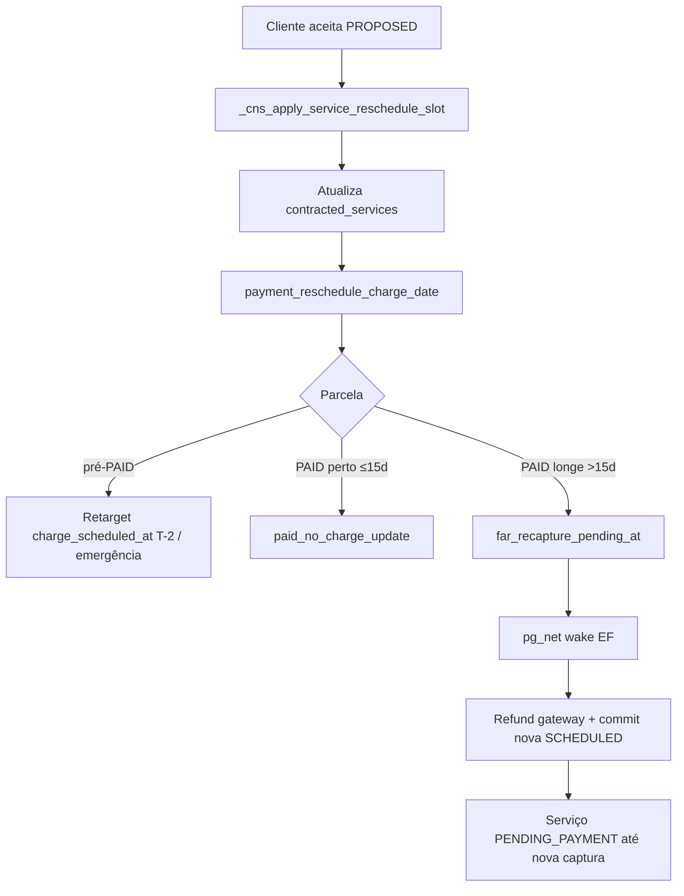

# Integração com pagamento após aceite do reagendamento

Documentação baseada em `_cns_apply_service_reschedule_slot`, `payment_reschedule_charge_date`, migrations de far-recapture e Edge `process-far-reschedule-recapture`. O ciclo FSM da solicitação está em [ciclo-estados-reagendamento.md](./ciclo-estados-reagendamento.md).

---

## 1. Resumo executivo

Quando o cliente **aceita formalmente** uma Data Proposta (`cns_accept_service_reschedule`), o slot oficial do serviço é atualizado e o backend chama `payment_reschedule_charge_date`. O efeito depende do estado da parcela e da distância da nova execução. O app **não** invoca Edge Function de dinheiro no aceite — reembolso/recaptura (quando necessário) é orquestrado no backend (pg_net + cron).

## 2. Objetivo de negócio

Manter a cobrança alinhada à nova Data Oficial: retarget de T-2 antes da captura; após `PAID`, manter o dinheiro se a nova data estiver “perto”, ou reembolsar e reacender parcela T-2 se estiver “longe” — **sem** cancelar o serviço nem fechar o chat.

## 3. Localização na plataforma

| Superfície | Papel |
|------------|-------|
| Chat | CTA “Confirmar nova data” → `AcceptRescheduleDialog` → RPC accept |
| Detalhe do serviço | Aviso discreto se `farRecapturePending` (`ServiceContractedSection`) |
| Edge | `process-far-reschedule-recapture` — **somente** auth de cron/orbit interno |
| Checkout | Cliente pode precisar pagar de novo se status voltar a `PENDING_PAYMENT` pós far-recapture |

## 4. Perfis envolvidos

| Papel | Neste fluxo |
|-------|-------------|
| Cliente | Dispara o aceite; vê aviso de recaptura; pode ter que pagar novamente se `PENDING_PAYMENT` |
| Prestador | Recebe notificação de aceite; não opera pagamento |
| Sistema | `payment_reschedule_charge_date`, EF, cron claim de órfãos |

## 5. Fluxo funcional principal

## 6. Fluxos alternativos e exceções

| Cenário | Outcome / comportamento |
|---------|-------------------------|
| Sem parcela ativa | `outcome: no_schedule` (retorno JSON) |
| Já recapturado | EF `already_done` |
| Gateway já submetido | Commit/recovery path na EF |
| Commit falha após refund | Recovery: `markGatewayAcked` + retry commit; erro crítico capturado |
| Serviço já EXECUTED | Caminho “perto” exige contexto CONFIRMED / não pós-execução — ver design payments (**evidência parcial** de todos os branches no SQL longo) |
| Auth EF inválida | 401/403 via `validateOrbitCronAuth` |

## 7. Regras de negócio

1. **RN-PAY-01** Aceite só pelo cliente em `PROPOSED` com `proposed_slot`.  
2. **RN-PAY-02** Apply revalida slot antes de gravar.  
3. **RN-PAY-03** `payment_reschedule_charge_date` exige `service_role` (elevate no apply).  
4. **RN-PAY-04** Pré-captura (`SCHEDULED` / `FAILED` / `IN_ANALYSIS`): retarget `charge_scheduled_at`.  
5. **RN-PAY-05** Pós-`PAID` ≤ limiar: `paid_no_charge_update` — mantém captura.  
6. **RN-PAY-06** Pós-`PAID` > limiar: marca pending e acorda EF; reembolso **integral**; nova parcela `SCHEDULED` T-2; motivo `FAR_RESCHEDULE_RECAPTURE`.  
7. **RN-PAY-07** Limiar: `far_reschedule_recapture_threshold_days` (padrão **15**).  
8. **RN-PAY-08** Far-recapture **não** cancela serviço/chat.  
9. **RN-PAY-09** App não chama `process-far-reschedule-recapture` / `process-refund` no aceite.  
10. **RN-PAY-10** UI mostra aviso enquanto `far_recapture_pending` / `farRecapturePending`.

## 8. Campos e dados

| Campo | Uso |
|-------|-----|
| `contracted_services.scheduled_*` / `agreed_slot` / `duration_*` | Slot oficial pós-apply |
| `payment_schedules.charge_scheduled_at` | Retarget pré-PAID |
| `payment_schedules.far_recapture_pending_at` | Flag de processamento longe |
| `payment_schedules.state` | → `REFUNDED` + nova `SCHEDULED` no commit |
| `project_service_row.far_recapture_pending` | Expõe à UI |
| Body EF | `schedule_id` e/ou `contracted_service_id` |

## 9. Validações de front-end

- Dialog de aceite confirma ação; mutação exige online.  
- Aviso de far-recapture é somente leitura (sem ação).  
- Sem chamada EF de pagamento no cliente neste fluxo.

## 10. Validações de back-end

| Função | Papel |
|--------|-------|
| `_cns_apply_service_reschedule_slot` | Valida slot, UPDATE serviço, chama payment |
| `payment_reschedule_charge_date` | Ramifica por estado/distância; wake pg_net se longe |
| `payment_prepare_far_reschedule_recapture` / `payment_commit_far_reschedule_after_gateway` | Prepare/commit atômico pós-gateway |
| `payment_claim_far_reschedule_recapture_batch` + cron | Safety-net órfãos |
| EF `handleRequest` | Auth cron; prepare → refund → commit (+ recovery) |

## 11. Status, estados e transições

| Domínio | Transição relevante |
|---------|---------------------|
| Reschedule request | `PROPOSED` → `ACCEPTED` |
| Serviço contratado | Pode permanecer `CONFIRMED` (perto/pré) ou ir a `PENDING_PAYMENT` (longe pós-commit) |
| Parcela | Pré: retarget; PAID→REFUNDED + nova SCHEDULED (longe) |

Detalhe FSM da solicitação: [ciclo-estados-reagendamento](./ciclo-estados-reagendamento.md). Estados de parcela: módulo [payments](../../payments/README.md).

## 12. Persistência

- Servidor: updates em `contracted_services` e `payment_schedules`; auditoria `payment_write_audit` (`FAR_RESCHEDULE_RECAPTURE_PENDING`, etc.).  
- Cliente: mapper `farRecapturePending`; caches de serviço/chat após accept.  
- Sem Preferences locais para este fluxo.

## 13. Integrações

| Sistema | Uso |
|---------|-----|
| NetCred (via PaymentProvider na EF) | `refundTransaction` |
| pg_net / `orbit_invoke_edge_function` | Wake da EF |
| MMD | `SERVICE_RESCHEDULE_ACCEPTED` (independente do payment outcome) |
| view-services | Aviso UI |
| Cron | Claim batch far-recapture |

## 14. Listagens, buscas, filtros, paginação

N/A. Claim batch usa `p_batch_size` / constantes de pagamento (ops).

## 15. Ações disponíveis

| Ação | Quem | Pré | Resultado | Erro |
|------|------|-----|-----------|------|
| Confirmar nova data | Cliente | PROPOSED + flags | ACCEPTED + payment JSON | Status/FORBIDDEN/slot |
| Aguardar recaptura | Sistema | `far_recapture_pending_at` | Nova parcela / PENDING_PAYMENT | Códigos EF (`SCHEDULE_NOT_FOUND`, etc.) |
| Pagar de novo | Cliente | Serviço `PENDING_PAYMENT` pós longe | Fluxo payments/checkout | Ver payments |

## 16. Dependências

`payments` (RPCs, EF, gateway), `service-reschedule` (accept/apply), `view-services` (aviso), `message-dispatcher` (notificação de aceite).

## 17. Regras implícitas

- Aceite notifica cliente **e** prestador (dois `mmd_ingest_event`).  
- Deep link do aceite aponta para **detalhe do serviço**, não só chat.  
- Faixas ToS de cancelamento/reembolso posteriores usam `payment_service_execution_at` **vigente** (slot já reagendado) — ver payments histórico.  
- `refund_anchor_execution_at` é auditoria, não define faixa ToS pós-reagendamento.

## 18. Riscos

| Risco | Nota |
|-------|------|
| Janela entre pending e commit | Usuário vê aviso; cobrança/parcela em transição |
| Falha gateway após aceitar slot | Slot já mudou; ops/cron devem completar recaptura |
| Duplo wake | Idempotência `already_done` / already submitted |

## 19. Evidências

| Tema | Onde |
|------|------|
| Apply + payment hook | `20260802020000_service_reschedule_helpers.sql`, `20260802150000_service_reschedule_apply_slot_restore_claims.sql` |
| Accept RPC | `20260802030000_service_reschedule_rpcs_core.sql` (`cns_accept_service_reschedule`) |
| Far-recapture SQL | `20260802200000_payment_far_reschedule_recapture.sql` |
| Edge | `supabase/functions/process-far-reschedule-recapture/` |
| Constante limiar | `platform_constants.far_reschedule_recapture_threshold_days` |
| UI aviso | `ServiceContractedSection.tsx`; mapper `farRecapturePending` |
| Design técnico | `docs/payment-system/CONTEXT.md`, `design.md` § reagendamento |

## 20. Pendências

| ID | Item |
|----|------|
| P-SR-05 | Enumeração completa de todos os `outcome` strings de `payment_reschedule_charge_date` além dos três caminhos principais — **evidência parcial** (SQL extenso) |
| P-SR-06 | Texto/templates MMD de aceite vs mensagem de recaptura (se houver evento dedicado de payment) — gap payments/MMD |
| — | Tempo máximo esperado do “alguns minutos” na cópia UI — não codificado |

## 21. Anexo — pré-captura (detalhe)

Se a parcela ainda está em estado pré-captura (`SCHEDULED`, `FAILED` ou `IN_ANALYSIS`):

- retarget de `charge_scheduled_at` para T-2 da nova execução (ou `now()` em emergência);  
- serviço permanece no status de pagamento vigente (ex.: `PENDING_PAYMENT`).

## 22. Anexo — pós-PAID perto (≤15 dias)

- Outcome `paid_no_charge_update`;  
- mantém dinheiro capturado;  
- atualiza só o slot;  
- faixas de estorno/T-12h passam a usar o novo `payment_service_execution_at`.

## 23. Anexo — pós-PAID longe (>15 dias) — passos

1. Marca `far_recapture_pending_at` (`paid_far_recapture_required`).  
2. Acorda EF via pg_net; cron reclama órfãos.  
3. Reembolso integral no gateway; commit: antiga → `REFUNDED` (`FAR_RESCHEDULE_RECAPTURE`); nova `SCHEDULED` T-2.  
4. Serviço → `PENDING_PAYMENT` até nova captura.  
5. Não cancela serviço nem fecha chat.

## 24. Anexo — cópia UI

> Estamos reajustando a cobrança para a nova data. Isso pode levar alguns minutos.

## 25. Anexo — checklist QA

- [ ] Aceite com parcela SCHEDULED → charge_scheduled_at muda  
- [ ] Aceite PAID com nova data ≤15d → status serviço permanece CONFIRMED; sem pending  
- [ ] Aceite PAID com nova data >15d → aviso UI; depois PENDING_PAYMENT + nova parcela  
- [ ] Aceite não chama functions.invoke de pagamento no app  
- [ ] Retry accept idempotente não duplica apply  
