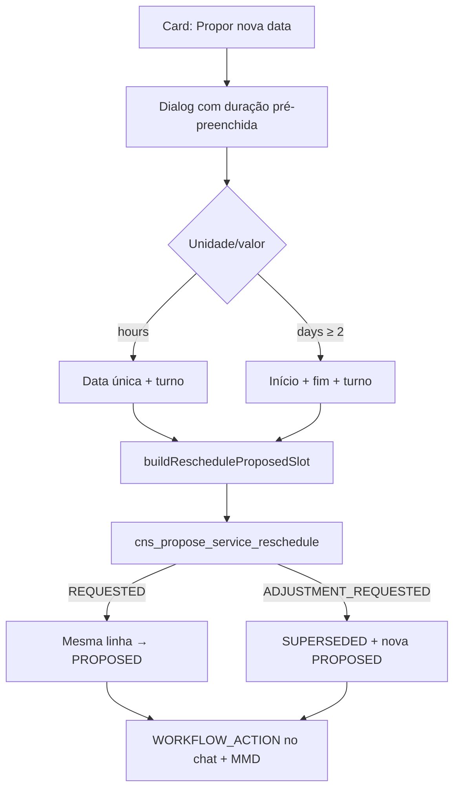

# Propor nova data (reagendamento)

Documentação baseada em `ProposeRescheduleDialog`, formulários Zod, `_cns_validate_reschedule_slot` / `cns_propose_service_reschedule` e cópias de card.

---

## 1. Resumo executivo

Quando o prestador **propõe uma nova data** de reagendamento, o dialog “Propor nova data” permite informar **Medido em** (Horas/Dias) e **Tempo estimado**, nessa ordem, além de data(s) e turno. Os campos de duração vêm **pré-preenchidos** do serviço contratado e podem ser **alterados**, com os **mesmos limites** do composer de proposta (máx. 24 horas / 7 dias). O modo data única vs período deriva da duração informada. Ao aceitar (outro passo), a duração e o slot oficiais do contrato são atualizados a partir do slot proposto.

## 2. Objetivo de negócio

Permitir que o prestador envie formalmente uma **Data Proposta de Reagendamento** (ou período) para o cliente aprovar — sem alterar a Data Oficial até o aceite.

## 3. Localização na plataforma

| Entrada | Detalhe |
|---------|---------|
| Chat | CTA “Propor nova data” no card (`resolveRescheduleCardCtas`) → `ProposeRescheduleDialog` via `useChatRescheduleDialogs` |
| Pré-condição | Snapshot `canProposeReschedule` e status `REQUESTED` ou `ADJUSTMENT_REQUESTED` |
| Rota própria | Nenhuma |
| Deep link | Notificação `SERVICE_RESCHEDULE_*` aponta ao chat; não abre o dialog automaticamente (**evidência:** path só navega ao chat) |

## 4. Perfis envolvidos

| Papel | Neste fluxo |
|-------|-------------|
| Prestador | Único que envia o slot (`cns_propose_service_reschedule` exige `provider_id`) |
| Cliente | Visualiza “Data proposta” / “Período proposto”; não propõe |
| Outros | Sem acesso |

## 5. Fluxo funcional principal

## 6. Fluxos alternativos e exceções

| Cenário | Comportamento |
|---------|---------------|
| Dispensar lembrete do fluxo | Banner some só na sessão aberta do dialog |
| Validação Zod falha | Mensagens de campo; não chama API |
| Offline | Erro `OFFLINE` |
| Slot rejeitado no backend | Códigos `INVALID_SLOT_*` mapeados em `serviceRescheduleErrors` |
| Serviço não PENDING_PAYMENT/CONFIRMED | `RESCHEDULE_NOT_ALLOWED` |
| Request não é a ativa | `INVALID_RESCHEDULE_STATUS` |
| Retry idempotente | Mesmo UUID na mutação |

## 7. Regras de negócio

1. **RN-P01** Duração editável; limites 24h / 7 dias (front e `_cns_validate_reschedule_slot`).
2. **RN-P02** `days` + `duration_value = 1` **proibido** — use `hours`.
3. **RN-P03** Modo UI: hours → `single_day`; days ≥ 2 → `date_range`.
4. **RN-P04** Slot JSON embute `duration_unit`, `duration_value`, datas e `shift`.
5. **RN-P05** Horas: `end_date` ausente; dias: `end_date` obrigatório (intervalo compatível com duração corrida **ou** dias úteis).
6. **RN-P06** `start_date` ≥ amanhã (`cns_business_today` + 1 / Zod `addCalendarDaysIso(today, 1)`).
7. **RN-P07** Turnos: `morning` \| `afternoon` \| `full_day`.
8. **RN-P08** Data oficial só muda no aceite — lembrete UI reforça isso.
9. **RN-P09** Elegibilidade de status do serviço: `PENDING_PAYMENT` ou `CONFIRMED`.
10. **RN-P10** Após ajuste, re-proposta supersede a rodada anterior (ver [ciclo-estados-reagendamento](./ciclo-estados-reagendamento.md)).

## 8. Campos e dados

| Campo UI (ordem) | Payload / origem |
|------------------|------------------|
| Medido em | `duration_unit` — pré: snapshot/contrato |
| Tempo estimado | `duration_value` — pré: snapshot/contrato |
| Data de execução / início | `start_date` ISO |
| Data de fim | `end_date` (só período; horas → null no build) |
| Turno | `shift` |

Montagem: `buildRescheduleProposedSlot`.

## 9. Validações de front-end

| Regra | Onde |
|-------|------|
| Limites duração | `proposeRescheduleFormSchema` + `MAX_PROPOSAL_DURATION_*` |
| Dias ≥ 2 | Mensagem “Para serviços de um único dia, use… horas” |
| Data ≥ amanhã | Zod superRefine |
| Período vs `matchesProposalDayDurationISO` | Mesma regra da proposta |
| Nota de solicitação (outro dialog) | `requestRescheduleFormSchema` máx. 500 — fora deste form, mas mesmo módulo |

## 10. Validações de back-end

`_cns_validate_reschedule_slot(slot, duration_unit_fallback, duration_value_fallback)`:

- Prefere duração embutida no slot; fallback contrato  
- Horas: sem `end_date`; dias: `end_date` obrigatório  
- `cns_assert_slot_start_date_allowed` → pode lançar `SLOT_START_DATE_TOO_SOON`  
- Duração incompatível → `INVALID_SLOT_DURATION`  

## 11. Status, estados e transições

Este fluxo produz/avança para **`PROPOSED`** (in-place ou nova linha pós-`SUPERSEDED`). Não aceita, não cancela. Estados e CTAs: [ciclo-estados-reagendamento](./ciclo-estados-reagendamento.md).

## 12. Persistência

| Camada | Detalhe |
|--------|---------|
| Servidor | `proposed_slot`, `proposed_at`; opcionalmente nova row + `parent_request_id` |
| Cliente | Patch de caches React Query; lembrete do banner **não** persiste |
| Mensagem | Payload `action_key: service_reschedule_proposed` + `slot` |

## 13. Integrações

- Chat: mensagem WORKFLOW_ACTION  
- MMD: `SERVICE_RESCHEDULE_PROPOSED` (push + email)  
- negotiation-proposals: constantes e helper de dias úteis  
- Aceite posterior → payments (doc irmão)

## 14. Listagens, buscas, filtros, paginação

N/A — ação pontual no card/dialog. Slot legado sem duração: UI/backend usam fallback do contrato (**evidência** em validate/apply).

## 15. Ações disponíveis

| Ação | Quem | Pré | Resultado | Erro |
|------|------|-----|-----------|------|
| Abrir dialog | Prestador | `canPropose` | Form pré-preenchido | — |
| Enviar proposta | Prestador | Form válido | PROPOSED + card | Códigos slot/status |
| Dispensar lembrete | Prestador | Dialog aberto | Só UI local | — |

## 16. Dependências

`negotiation-proposals` (limites/dias), `chats` (card/dialogs), tipos/API do próprio módulo, calendário `@/lib/utils/calendarDate`.

## 17. Regras implícitas

- Alterar unidade/valor no dialog **mostra/oculta** fim em tempo real (`showEndDate`).  
- `formatRescheduleSlot` omite intervalo se fim null ou = início.  
- Labels de seção: “Data proposta” vs “Período proposto”.  
- Lembrete é puramente educativo.  
- Na 1ª proposta a partir de REQUESTED, **não** cria linha nova.

## 18. Riscos

| Risco | Nota |
|-------|------|
| Front aceita 10MB vs… | N/A aqui |
| `SLOT_START_DATE_TOO_SOON` sem mapa UI | Pode mostrar mensagem genérica |
| Drift fuso | Front usa calendário local ISO; backend `cns_business_today` America/Sao_Paulo — alinhar testes |

## 19. Evidências

| Tema | Path |
|------|------|
| Modo de data | `utils/deriveRescheduleDateMode.ts` |
| Formulário | `types/serviceReschedule.forms.ts` |
| Dialog / lembrete | `ProposeRescheduleDialog.tsx`, `ProposeRescheduleFlowReminder.tsx` |
| Snapshot | `mapRescheduleSnapshot.ts` |
| Cópias / format | `rescheduleCardCopy.ts`, `formatRescheduleSlot.ts` |
| SQL validate / propose | `20260802020000_*`, `20260802130000_*` |
| Testes | `deriveRescheduleDateMode.test.ts`, `serviceReschedule.forms.test.ts`, `ProposeRescheduleDialog.test.tsx` |

## 20. Pendências

| ID | Item |
|----|------|
| P-SR-03 | Mapa UI para `SLOT_START_DATE_TOO_SOON` |
| — | Deep link que abra o dialog de propor automaticamente: não implementado |
| — | Analytics GA específico de “propose reschedule”: **não evidenciado** neste módulo (há `metrics` no card de chats — gap para worker chats) |

## 21. Anexo — efeito no aceite (resumo)

`_cns_apply_service_reschedule_slot` grava `duration_*`, `scheduled_*`, `agreed_slot` e chama pagamento. Detalhe: [integracao-pagamento-pos-aceite.md](./integracao-pagamento-pos-aceite.md).

## 22. Anexo — matriz de erros de slot (UI)

| Código | Mensagem pt-BR (`serviceRescheduleErrors`) |
|--------|-----------------------------------------------|
| `INVALID_SLOT_SHAPE` | Selecione uma data válida. |
| `INVALID_SLOT_SHIFT` | Selecione um turno válido. |
| `INVALID_SLOT_START_DATE` | Selecione uma data de execução válida. |
| `INVALID_SLOT_END_DATE` | A data de término deve ser igual ou posterior à data de início. |
| `INVALID_SLOT_DURATION` | Informe um tempo estimado válido e um intervalo… |

## 23. Anexo — checklist QA

- [ ] Pré-preenche duração do contrato  
- [ ] Trocar para dias ≥2 mostra data fim  
- [ ] hours rejeita end_date no backend  
- [ ] Intervalo inválido vs duração  
- [ ] start_date = hoje rejeitado  
- [ ] Re-propor após ajuste supersede card antigo  
- [ ] Lembrete reaparece ao reabrir dialog  

## 24. Anexo — texto do lembrete

- Título: “Como funciona o reagendamento?”  
- Corpo: “Você propõe a nova data; o cliente confirma. Só depois disso a data oficial muda. Até lá, o agendamento atual continua valendo.”  
- Aria dismiss: “Dispensar lembrete de reagendamento”
