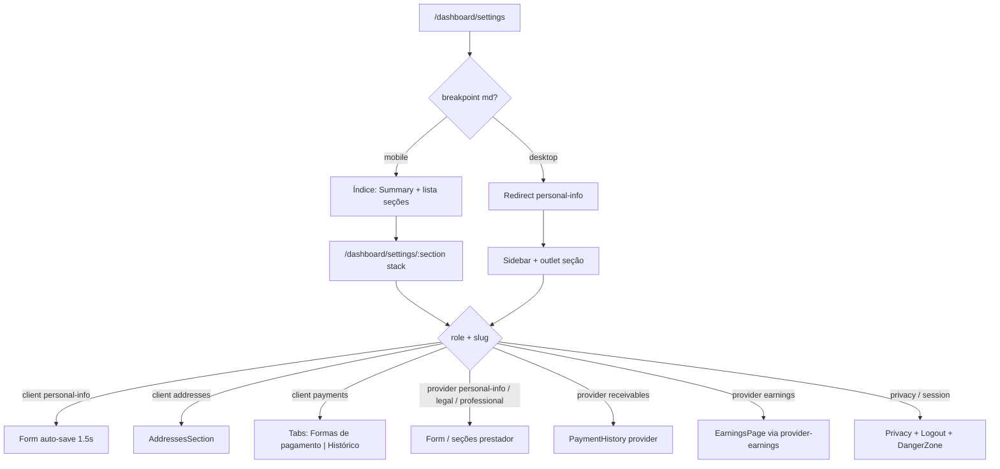

# Configurações (cliente e prestador)

Documentação alinhada a `src/features/settings/`, hub em `src/router.tsx` (`/dashboard/settings/*`) e APIs/hooks da feature. Endereços e histórico de pagamentos são **embutidos** — detalhe canônico nos módulos `addresses` e `payments` (links apenas). Ganhos: UI de `provider-earnings` hospedada no hub.

ADR de navegação: [`docs/adr/0002-account-settings-hub.md`](../../../../adr/0002-account-settings-hub.md).

---

## 1. Resumo executivo

Hub responsivo de configurações sob `/dashboard/settings` (slugs em inglês), não mais uma página única em scroll em `/dashboard/conta`. Cliente e prestador mantêm cadastro, foto, privacidade/LGPD e sessão em seções; o prestador gerencia ainda identidade legal, perfil profissional (público, ofertados, área, portfólio), recebimentos na captura e Ganhos (liquidação). **Fase 1:** só o shell de navegação; UIs de formulário/seção existentes reutilizadas; auto-save inalterado. Exclusão de conta e exportação LGPD hoje são fluxos manuais via e-mail ao DPO (`dpo@prestway.com`).

## 2. Objetivo de negócio

- Manter dados cadastrais confiáveis para contratação, matching geográfico e página pública do prestador.
- Oferecer ponto de saída (logout / conta) mesmo com KYC prestador incompleto.
- Centralizar preferências de privacidade e pedidos LGPD sem self-service destrutivo na API.
- Um hub de conta no menu do dashboard (sem Endereços / Ganhos como itens top-level).

## 3. Localização na plataforma

| Superfície | Rota | Guard / chrome |
|------------|------|----------------|
| Índice Configurações | `/dashboard/settings` | Dashboard autenticado; **mobile** tab-root (lista); **desktop** `Navigate` → `personal-info` |
| Seções | `/dashboard/settings/:section` | Mobile **stack** (voltar → `/dashboard/settings`); desktop sidebar + outlet |

**Seções (slugs):**

| Papel | Slugs |
|-------|-------|
| Cliente | `personal-info`, `addresses`, `payments`, `privacy`, `session` |
| Prestador | `personal-info`, `legal-identity`, `professional-profile`, `receivables`, `earnings`, `privacy`, `session` |

- **Layout:** `SettingsLayout` — desktop: sidebar `SettingsNavList` + `<Outlet />`; mobile: só outlet.
- **Índice mobile:** `SettingsIndexPage` — título “Configurações”, `AccountSummaryCard`, lista de seções.
- **Summary card:** mobile no índice; desktop só em `personal-info` (`ClientPersonalInfoPage` / `ProviderPersonalInfoPage`).
- **KYC:** prefixo allowlist `PROVIDER_KYC_ALLOWED_PATH_PREFIX = "/dashboard/settings"` — ver [gate-e-acesso-operacional](../../provider-kyc/features/gate-e-acesso-operacional.md).
- **Menu dashboard:** item **Configurações** → `/dashboard/settings` (`dashboardMenu.ts`). Removidos itens **Endereços** e **Ganhos**.
- **Rotas removidas (sem redirect):** `/dashboard/conta`, `/dashboard/earnings`, `/dashboard/addresses`.
- **Constante:** `ROUTE_SETTINGS`; helpers `settingsSectionPath` / `SETTINGS_SECTION` em `constants/routes.ts`.

## 4. Perfis envolvidos

| Perfil | Acesso | Não acessa |
|--------|--------|------------|
| `client` | Seções cliente; `SettingsRoleGate` nas seções client-only | legal-identity, professional-profile, receivables, earnings |
| `provider` | Seções prestador | addresses, payments (cartões/histórico cliente) |
| Visitante | Não | Guard do dashboard |
| `admin` | Sem superfície dedicada neste hub | — |

## 5. Fluxo funcional principal

### Cliente — feliz

1. Abre hub → mobile lista; desktop personal-info.
2. Edita nome/telefone/CPF em personal-info → após 1500 ms valida Zod e persiste `profiles` + `client_profiles_private`.
3. Endereços / pagamentos nas seções dedicadas; em Pagamentos, abas **Formas de pagamento** (cartões) e **Histórico**.
4. Privacidade, sessão (logout) ou zona de perigo (DPO).

### Prestador — feliz

1. Abre hub → mesma lógica mobile/desktop.
2. personal-info / legal-identity / professional-profile → debounce 2000 ms e mutações por grupos dirty onde aplicável.
3. Recebimentos (captura); Ganhos (liquidação bancária — feature externa hospedada).
4. Privacidade / sessão / DPO.

## 6. Fluxos alternativos e exceções

| Caso | Comportamento |
|------|---------------|
| Erro de carga do perfil | `AccountErrorState` — “Não foi possível carregar sua conta” + retry |
| Auto-save parcial (cliente/prestador) | Toast “Não foi possível salvar todas as alterações…” |
| Schema inválido (cliente) | Seta erro no primeiro campo; **sem** toast de inválido |
| Schema inválido (prestador) | Erro no campo + toast “Não foi possível salvar… campo inválido.” |
| Catch genérico auto-save | Toast “Não foi possível atualizar seus dados…” |
| Sucesso prestador | Toast “Dados atualizados com sucesso.” |
| Sem `VITE_MAIN_SITE_URL` | Texto “Política de privacidade em breve.” |
| Copiar link falha | Toasts distintos no card vs seção pública |
| Foto inválida no seletor | Validação retorna e **encerra sem toast** (`AccountSummaryCard`) |
| Exclusão | Dialog informa mailto DPO — **não** chama delete API |
| Papel errado na seção | `SettingsRoleGate` redireciona / bloqueia conforme implementação |

## 7. Regras de negócio (numeradas)

1. Auto-save cliente só com `formState.isDirty`; debounce **1500 ms**.
2. Auto-save prestador debounce **2000 ms**; limpa erros dos campos alterados antes de revalidar.
3. Grupos prestador: `full_name`/`phone` → `profiles`; bloco privado → `provider_profiles_private`; bloco público → `provider_profiles_public`.
4. `service_area_neighborhood_ids` só enviado no update público quando o campo está dirty (evita delete+insert desnecessário).
5. PJ: schema exige CNPJ e razão social preenchidos (`entity_type === "pj"`).
6. Portfólio criado/atualizado pela página força `visibility: "public"`.
7. Imagem de perfil: máx. **2 MB**; tipos JPEG/PNG/WebP/HEIC/HEIF.
8. Imagem de portfólio: máx. **5 MB**; mesmos tipos; input pode acumular múltiplos arquivos; sem teto explícito de quantidade por item no front.
9. DPO: `dpo@prestway.com`; prazo informado na UI: **15 dias úteis**.
10. E-mail do usuário não é editável no formulário.
11. Slug: em `updateProviderPublicProfile`, se `display_name` atualiza e slug atual é null ou igual a `providerId`, gera slug único; após slug “real”, alterações de nome não mudam o slug (código analisado).
12. Prestador: `useUpdateAccountProfile({ silent: true })` — toasts de profile base silenciados no fluxo de grupos.
13. Cliente — seção payments: header “Pagamentos”; abas **Formas de pagamento** (`SavedCardsList` com `tokenizeContext="profile"` e `phone` do perfil) e **Histórico** (`PaymentHistorySection role="client"`). Listas Prestway sem card/título aninhado (título só no header da página).
14. Prestador — receivables: header “Recebimentos” + `PaymentHistorySection role="provider"` (sem abas). Contratos/views no módulo payments.
15. Logout: confirmação em `AlertDialog` → `signOut()` (`useAuth`) — seção session.
16. Fase 1: shell de navegação; sem redesign row-by-row dos formulários.

## 8. Campos e dados

### 8.1 Cliente — `accountFormSchema`

| Campo | Label | Obrigatório | Validação | Persistência |
|-------|-------|-------------|-----------|--------------|
| `full_name` | Nome completo | Sim | `min(1)` + `validateFullName` | `profiles.full_name` |
| `phone` | Telefone / WhatsApp | Não | Vazio OK; senão `validateBrazilPhone` | `profiles.phone` |
| `cpf` | CPF | Não | Vazio OK; senão `validateCPF` | `client_profiles_private.cpf` |
| E-mail | E-mail | — | Disabled | Auth (`user.email`) |

### 8.2 Prestador — `providerAccountFormSchema`

| Campo | UI | Obrigatório | Validação | Persistência |
|-------|-----|-------------|-----------|--------------|
| `full_name` | Nome completo | Sim | Igual cliente | `profiles` |
| `phone` | Contato (card separado) | Não | Telefone BR | `profiles` |
| `entity_type` | PF / PJ | Sim | enum | privado |
| `cpf` | CPF (PF) | Se preenchido válido | CPF | privado |
| `cnpj`, `razao_social` | PJ | Refine PJ | CNPJ + não vazios | privado |
| `nome_fantasia`, representantes, `commercial_contact` | Legal | Não | CPF rep. se preenchido; contact max 120 | privado |
| `display_name`, `bio` | Perfil público | Não | max 120 / 2000 | público |
| `profile_visibility` | Visibilidade | Sim | `public` \| `restricted` | público |
| `service_area_neighborhood_ids` | Área | Não | UUIDs | `provider_service_area_neighborhoods` |
| `service_area_city` | Apoio UI | Não | — | derivado |

## 9. Validações de front-end

- Zod: `types/accountForm.validation.ts`, `types/providerAccountForm.validation.ts` (reexports em `schemas/` também existem).
- Máscaras: `maskPhone`, `maskCPF`, CNPJ via validadores compartilhados.
- Upload: `validateProfileImageFile` / `validatePortfolioImageFile`.
- Portfólio: título obrigatório (trim) no dialog da seção (evidência em `PortfolioManagementSection` / hooks).

## 10. Validações de back-end

- UPSERTs/tabelas privados com RLS por usuário (migrations `20260318100000_*` tipicamente — evidência parcial: paths de API; regras SQL finas no módulo Supabase).
- Storage buckets privados com signed URLs (expiry 3600 s nas constantes).
- **Evidência parcial:** constraints exatas de unique slug / RLS não reauditadas neste ciclo além do comportamento do client `resolveUniqueSlug`.

## 11. Status, estados e transições

| Estado UI | Quando |
|-----------|--------|
| Loading skeleton | `profileLoading` / sem perfil inicial / layout loading |
| Error state | `profileError && !profile` |
| Salvando… | Mutação em andamento (`Loader2`) |
| Idle auto-save | Texto “As alterações são salvas automaticamente.” |
| Dialogs | Exportar dados, excluir conta (orientação), logout |

Não há FSM de domínio próprio além de `entity_type` PF/PJ e `profile_visibility`.

## 12. Persistência

| Destino | Conteúdo |
|---------|----------|
| Supabase tables | Ver README §7 / seção 8 |
| Storage | `profile-images`, `provider-portfolio-images` |
| Cliente | React Hook Form + TanStack Query caches dos hooks |
| Sem Preferences/draft local de conta | Evidência: sem keys de Preferences nesta feature |

## 13. Integrações

| Destino | Como |
|---------|------|
| `auth` | Perfil base, update, signOut |
| `addresses` | `/dashboard/settings/addresses` — [gestão de endereços](../../addresses/features/gestao-de-enderecos.md) |
| `payments` | Cartões + histórico — [histórico e reembolso](../../payments/features/historico-e-reembolso.md); erros de cartão em [checkout](../../payments/features/checkout-e-cobranca.md) |
| `provider-earnings` | Hospedado em `/dashboard/settings/earnings` (`ProviderEarningsSectionPage` → `EarningsPage`); `ROUTE_PROVIDER_EARNINGS` |
| `provider-profile` | Link `/perfil/{slug}` |
| Site jurídico | `PRIVACY_POLICY_URL` = `{VITE_MAIN_SITE_URL}/juridico/politica-de-privacidade` |

## 14. Listagens, buscas, filtros, paginação

- **Ofertados:** busca em `platform_services` — até 20 resultados com query / 10 sem query (`OfferedServicesSection`).
- **Portfólio:** lista do prestador + reorder DnD (`@dnd-kit`); sem paginação server-side evidenciada no hook de conta.
- **Histórico de pagamentos:** listagem/paginação no módulo `payments` (não duplicar aqui).
- **Ganhos:** listagem/filtros no módulo `provider-earnings`.
- **Endereços:** CRUD no módulo `addresses`.

## 15. Ações disponíveis

| Ação | Quem | Pré-condição | Resultado |
|------|------|--------------|-----------|
| Navegar seções | Ambos | Autenticado | Hub / stack / sidebar |
| Auto-save campos | Ambos | Dirty + Zod OK | Persistência |
| Upload / remover foto | Ambos | Arquivo válido / path existe | Storage + profile path |
| CRUD endereços | Cliente | Seção addresses | Feature addresses |
| Cartões salvos | Cliente | Seção payments → aba Formas de pagamento | Feature payments |
| Ver histórico captura | Cliente / Prestador | payments → aba Histórico / receivables | `PaymentHistorySection` |
| Ver Ganhos | Prestador | Seção earnings | `EarningsPage` |
| Add/remove serviços | Prestador | professional-profile | `setOfferedServices` |
| Copiar / abrir perfil | Prestador | slug | Clipboard / nova URL |
| CRUD portfólio | Prestador | Título | Items + imagens |
| Falar DPO / Exportar | Ambos | privacy | mailto / dialog |
| Excluir conta (UI) | Ambos | session / danger | Orientação DPO |
| Sair | Ambos | session | `signOut` |

## 16. Dependências

- Internas: hooks/api listados na seção 19.
- Externas de feature: `auth`, `addresses`, `payments`, `provider-earnings` (host), `request-quote` (estilo), UI shadcn.
- Downstream: matching/área usa bairros; público usa slug.

## 17. Regras implícitas

- Hidratação do form: `hydratedProfileIdRef` evita reset contínuo após primeiro load do `profile.id` (fluxos de formulário reutilizados).
- Prestador: telefone fora de `DadosPessoaisSection` (card Contato dedicado) em personal-info.
- Cliente não vê `PaymentHistorySection` com role provider e vice-versa.
- Zona de perigo copy fala em remoção irreversível, mas ação real é pedido por e-mail.
- Toasts de sucesso de foto: “Foto atualizada com sucesso.” / “Foto removida.” (`useProfilePhotoMutation`).
- Produção usa apenas `SettingsLayout` + páginas em `components/sections/*` (hub por seção).

## 18. Riscos

- Usuário pode interpretar “Excluir minha conta” como delete imediato.
- Validação de foto silenciosa na UI.
- Dados sensíveis (CPF/CNPJ) na mesma superfície do auto-save.
- Dependência de env para política de privacidade.
- Deep links legados para `/dashboard/conta` (ex.: enqueue de lembrete KYC na migration) **não** redirecionam — rota removida.

## 19. Evidências

- Shell: `SettingsLayout.tsx`, `SettingsIndexPage.tsx`, `SettingsNavList.tsx`, `SettingsSectionHeader.tsx`, `SettingsRoleGate.tsx`
- Seções: `components/sections/PersonalInfoPage.tsx`, `ClientPersonalInfoPage.tsx`, `ProviderPersonalInfoPage.tsx`, `ClientAddressesPage.tsx`, `ClientPaymentsPage.tsx`, `ProviderLegalIdentityPage.tsx`, `ProviderProfessionalProfilePage.tsx`, `ProviderReceivablesPage.tsx`, `ProviderEarningsSectionPage.tsx`, `AccountPrivacyPage.tsx`, `AccountSessionPage.tsx`
- Blocos reutilizados: `DadosPessoaisSection`, `ContatoIdentidadeSection`, `EntityTypeSection`, `LegalIdentitySection`, `OfferedServicesSection`, `PublicProfileSettingsSection`, `ServiceAreaField`, `PortfolioManagementSection`, `PrivacySection`, `DangerZoneSection`, `LogoutSection`, `AccountSummaryCard`, `AccountErrorState`
- APIs: `api/clientProfilePrivate.api.ts`, `providerPrivateProfile.api.ts`, `providerPublicProfile.api.ts`, `offeredServices.api.ts`, `portfolio.api.ts`, `profileImageStorage.api.ts`, `portfolioImageStorage.api.ts`, `providerProfile.api.ts`
- Hooks: `useAccountProfile`, `useClientPrivateProfile`, `useUpdateAccountProfile`, `useProviderProfile`, `useUpdateProviderProfile`, `useProviderSettingsForm`, `useOfferedServices`, `usePortfolioItems`, `useProfilePhotoMutation`, `useProfileImageUrl`
- Validação: `types/accountForm.validation.ts`, `types/providerAccountForm.validation.ts`
- Constantes: `constants.ts`, `constants/routes.ts`, `constants/settingsNav.ts`
- Router: `src/router.tsx` path `settings` + children
- Menu / chrome: `dashboardMenu.ts`, `mobileNavigation.config.ts`

## 20. Pendências

| Item | Status |
|------|--------|
| Limite de imagens por item de portfólio | Não encontrado no front |
| Toast de erro de validação de foto | Ausente no seletor |
| Detalhe RLS/migrations | Evidência parcial — aprofundar em auditoria backend se necessário |
| Atualizar deep_link SQL de lembretes KYC de `/dashboard/conta` → `/dashboard/settings` | Gap comprovado (rota antiga removida, sem redirect) |

---

## Anexo A — Composição por seção (fase 1)

### Cliente

| Seção | Conteúdo principal |
|-------|-------------------|
| Índice (mobile) | Summary + nav list |
| personal-info | Header; Summary (só desktop); Dados pessoais (nome, e-mail, CPF) + Contato (telefone) + auto-save |
| addresses | `AddressesSection` |
| payments | Header “Pagamentos”; Tabs **Formas de pagamento** (`SavedCardsList`) e **Histórico** (`PaymentHistorySection role="client"`) |
| privacy | `PrivacySection` |
| session | `LogoutSection` + `DangerZoneSection` |

### Prestador

| Seção | Conteúdo principal |
|-------|-------------------|
| Índice (mobile) | Summary (+ link/copiar perfil) + nav list |
| personal-info | Header; Summary (só desktop); dados + contato |
| legal-identity | Entity type + identidade legal |
| professional-profile | Ofertados + perfil público/área + portfólio |
| receivables | `PaymentHistorySection role="provider"` |
| earnings | `SettingsSectionHeader` + `EarningsPage` (header interno oculto no host) |
| privacy | `PrivacySection` |
| session | `LogoutSection` + `DangerZoneSection` |

## Anexo B — Mensagens (toasts / diálogos)

| Mensagem | Origem |
|----------|--------|
| Não foi possível salvar todas as alterações. Tente novamente. | Auto-save parcial |
| Não foi possível atualizar seus dados. Tente novamente. | Catch |
| Não foi possível salvar os campos automaticamente porque há um campo inválido. | Prestador Zod |
| Dados atualizados com sucesso. | Prestador OK |
| Foto atualizada com sucesso. / Foto removida. | Foto |
| Link copiado. / Não foi possível copiar. | Card prestador |
| Link copiado para a área de transferência. / Não foi possível copiar o link. | Seção pública |
| Não foi possível atualizar. / o perfil. | Hooks update provider |
| Textos DPO / 15 dias úteis | Privacy + DangerZone |
| Confirmação logout | `LogoutSection` |

## Anexo C — Checklist QA

- [ ] Mobile: `/dashboard/settings` lista seções + summary; seções abrem em stack com voltar ao índice
- [ ] Desktop: `/dashboard/settings` → personal-info; sidebar; summary só em personal-info
- [ ] Cliente e prestador veem conjuntos de seções distintos
- [ ] Auto-save 1,5 s / 2 s; inválido bloqueia persistência
- [ ] E-mail disabled; CPF/CNPJ máscaras
- [ ] Endereços / pagamentos só cliente; receivables / earnings só prestador
- [ ] Cliente payments: abas Formas de pagamento / Histórico sob header Pagamentos
- [ ] Ganhos em `/dashboard/settings/earnings` (não top-level)
- [ ] Menu sem Endereços / Ganhos; Configurações → `/dashboard/settings`
- [ ] `/dashboard/conta`, `/dashboard/earnings`, `/dashboard/addresses` 404 (sem redirect)
- [ ] Prestador sem KYC ACTIVE ainda acessa `/dashboard/settings*`

## 21. Atualização de auditoria (2026-08-12)

- Hub settings `/dashboard/settings/*` (fase 1 shell); ADR 0002.
- Menu e rotas top-level Endereços/Ganhos/conta removidos.
- Allowlist KYC `/dashboard/settings`.
- Regras de formulário/auto-save revalidadas como inalteradas na fase 1.
- Superfície monolítica removida: `SettingsPage` / `SettingsClientPage` / `SettingsProviderPage` / `DeleteAccountDialog` — produção só `SettingsLayout` + `SettingsIndexPage` + `components/sections/*`; exclusão permanece mailto DPO em `DangerZoneSection`.
- **UI Pagamentos (cliente):** `ClientPaymentsPage` com Tabs Formas de pagamento / Histórico; listas Prestway (skeleton, empty dashed); CRUD/rotas inalterados.
